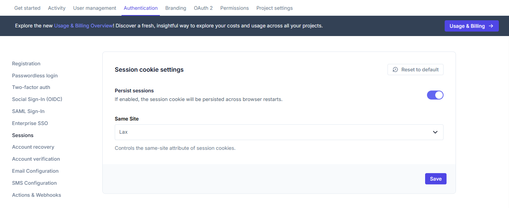

# Session management

```mdx-code-block
import Tabs from "@theme/Tabs"
import TabItem from "@theme/TabItem"
import CodeBlock from "@theme/CodeBlock"
import { FrameworkCodeTabs, ImplementationSteps } from '@site/src/components/GuidesComponents'
import jsCheckSession from '!!raw-loader!./_common/code-examples/js/session/check-session.js'
import reactCheckSession from '!!raw-loader!./_common/code-examples/react/session/check-session.tsx'
import goCheckSession from '!!raw-loader!./_common/code-examples/go/session/check-session.go'
```

After a user has logged in, Ory creates a session cookie that your application can use to verify the user's authentication status.
This guide shows how to work with sessions in your application.

## Checking session status

You'll need to verify if a user is authenticated before allowing access to protected resources. Here's how to implement session
verification:

<ImplementationSteps
  steps={[
    {
      title: "Verify the session",
      description: "Check if the user has a valid session cookie",
    },
    {
      title: "Access identity information",
      description: "Retrieve user details from the session",
    },
    {
      title: "Handle unauthenticated users",
      description: "Redirect to login if no valid session exists",
    },
  ]}
/>

```mdx-code-block
<FrameworkCodeTabs>
<TabItem value="javascript">
```

### Session verification with express.js

```javascript
// Using the Ory SDK instance from the sign-in guide

// Middleware to verify sessions
const requireAuth = async (req, res, next) => {
  try {
    const { data: session } = await ory.toSession({
      cookie: req.header("cookie"),
    })

    // Store session in request for use in route handlers
    req.session = session
    next()
  } catch (error) {
    // No valid session, redirect to Ory login UI
    res.redirect(`${basePath}/ui/login`)
  }
}
```

```mdx-code-block
</TabItem>
<TabItem value="react">
```

### Session verification in React

```tsx
// Using the Ory SDK instance from the sign-in guide

// Component to verify session
function ProtectedComponent() {
  const [session, setSession] = useState<Session | null>(null)
  const [loading, setLoading] = useState(true)

  useEffect(() => {
    // Check if the user is authenticated
    const checkSession = async () => {
      try {
        const session = await ory.toSession()
        setSession(session)
        setLoading(false)
      } catch (error) {
        // No valid session, redirect to Ory login UI
        window.location.href = `${basePath}/ui/login`
      }
    }

    checkSession()
  }, [])

  if (loading) {
    return <div>Loading...</div>
  }

  return (
    <div>
      <h1>Welcome, {session?.identity.traits.email}</h1>
      <pre>{JSON.stringify(session, null, 2)}</pre>
    </div>
  )
}
```

```mdx-code-block
</TabItem>
<TabItem value="nextjs">
```

### Session verification in Next.js

```tsx
// Using the Ory SDK instance from the sign-in guide

function Dashboard() {
  const [session, setSession] = useState<Session | null>(null)
  const [loading, setLoading] = useState(true)

  useEffect(() => {
    // Check if the user is authenticated
    const checkSession = async () => {
      try {
        const session = await ory.toSession()
        setSession(session)
        setLoading(false)
      } catch (error) {
        // No valid session, redirect to Ory login UI
        window.location.href = `${basePath}/ui/login`
      }
    }

    checkSession()
  }, [])

  if (loading) {
    return <div>Loading...</div>
  }

  return (
    <main>
      <h1>Dashboard</h1>
      <p>Welcome, {session?.identity.traits.email}</p>
      <pre>{JSON.stringify(session, null, 2)}</pre>
    </main>
  )
}
```

```mdx-code-block
</TabItem>
<TabItem value="go">
```

### Session verification in Go

```go
// Using the App struct from the sign-in guide

// Session middleware to check authentication status
func (app *App) sessionMiddleware(next http.HandlerFunc) http.HandlerFunc {
	return func(writer http.ResponseWriter, request *http.Request) {
		// Pass cookies to Ory's ToSession endpoint
		cookies := request.Header.Get("Cookie")

		// Verify session with Ory
		session, _, err := app.ory.FrontendApi.ToSession(request.Context()).
			Cookie(cookies).Execute()

		if err != nil || (err == nil && !*session.Active) {
			// No active session, redirect to Ory login UI
			http.Redirect(writer, request, app.tunnelUrl+"/ui/login",
					http.StatusSeeOther)
			return
		}

		// Add session to context for the handler
		ctx := withSession(request.Context(), session)
		next.ServeHTTP(writer, request.WithContext(ctx))
	}
}

// Helper functions to store/retrieve session from context
func withSession(ctx context.Context, v *ory.Session) context.Context {
	return context.WithValue(ctx, "req.session", v)
}

func getSession(ctx context.Context) (*ory.Session, error) {
	session, ok := ctx.Value("req.session").(*ory.Session)
	if !ok || session == nil {
		return nil, errors.New("session not found in context")
	}
	return session, nil
}
```

```mdx-code-block
</TabItem>
<TabItem value="curl">
```

### Session verification with cURL

```shell
# Check if the user is authenticated
curl -X GET \
  'https://$PROJECT_SLUG.projects.oryapis.com/sessions/whoami' \
  -H 'Accept: application/json' \
  -H 'Cookie: ory_session_YOUR_PROJECT=YOUR_SESSION_COOKIE' \
  --verbose

# If the user is authenticated, the response will include session details:
# {
#   "id": "session_id",
#   "active": true,
#   "expires_at": "2023-01-01T00:00:00Z",
#   "authenticated_at": "2022-01-01T00:00:00Z",
#   "issued_at": "2022-01-01T00:00:00Z",
#   "identity": {
#     "id": "identity_id",
#     "traits": {
#       "email": "user@example.com"
#     }
#   }
# }
```

```mdx-code-block
</TabItem>
</FrameworkCodeTabs>
```

### Protecting routes

Common patterns for protecting routes in your application:

```mdx-code-block
<FrameworkCodeTabs>
<TabItem value="javascript">
```

```javascript
// Using the requireAuth middleware defined above

// Apply the middleware to routes that need protection
app.get("/dashboard", requireAuth, (req, res) => {
  // Access user data from the session
  const user = req.session.identity
  res.render("dashboard", { user })
})

app.get("/settings", requireAuth, (req, res) => {
  res.render("settings", { user: req.session.identity })
})
```

```mdx-code-block
</TabItem>
<TabItem value="react">
```

```tsx
// Create a protected route wrapper component
function ProtectedRoute({ children }) {
  const [isAuthenticated, setIsAuthenticated] = useState(false)
  const [loading, setLoading] = useState(true)

  useEffect(() => {
    ory
      .toSession()
      .then(() => {
        setIsAuthenticated(true)
        setLoading(false)
      })
      .catch(() => {
        setIsAuthenticated(false)
        setLoading(false)
        // Redirect to Ory login UI
        window.location.href = `${basePath}/ui/login`
      })
  }, [])

  if (loading) {
    return <div>Loading...</div>
  }

  return isAuthenticated ? children : null
}
```

```mdx-code-block
</TabItem>
<TabItem value="nextjs">
```

```tsx
// middleware.ts file at the project root
import { NextResponse } from "next/server"
import type { NextRequest } from "next/server"

export async function middleware(request: NextRequest) {
  const url = new URL(request.url)
  const basePath = process.env.NEXT_PUBLIC_ORY_SDK_URL || "http://localhost:4000"

  // List of protected paths
  const protectedPaths = ["/dashboard", "/settings", "/profile"]
  const isProtectedPath = protectedPaths.some((path) => url.pathname === path || url.pathname.startsWith(`${path}/`))

  if (isProtectedPath) {
    // Check for the session cookie
    const cookie = request.cookies.get("ory_session_YOUR_PROJECT")

    if (!cookie) {
      // Redirect to Ory login UI with return URL
      return NextResponse.redirect(`${basePath}/ui/login?return_to=${encodeURIComponent(url.pathname)}`)
    }
  }

  return NextResponse.next()
}

// Configure which paths the middleware runs on
export const config = {
  matcher: ["/dashboard/:path*", "/settings/:path*", "/profile/:path*"],
}
```

```mdx-code-block
</TabItem>
<TabItem value="go">
```

```go
// Using the App struct and middleware from above

func main() {
  // Assuming app is already initialized as in the sign-in guide

  // Create router
  mux := http.NewServeMux()

  // Routes that use the session middleware
  mux.Handle("/dashboard", app.sessionMiddleware(app.dashboardHandler))
  mux.Handle("/profile", app.sessionMiddleware(app.profileHandler))

  // Start server
  http.ListenAndServe(":3000", mux)
}

// Example protected route handler
func (app *App) dashboardHandler(w http.ResponseWriter, r *http.Request) {
  // Get session from context (set by middleware)
  session, err := getSession(r.Context())
  if err != nil {
    http.Error(w, err.Error(), http.StatusInternalServerError)
    return
  }

  // Use session data
  fmt.Fprintf(w, "Welcome, %s!", session.Identity.Traits["email"])
}
```

```mdx-code-block
</TabItem>
</FrameworkCodeTabs>
```

## Configuring session settings in Ory Console

You can configure various session-related settings through the Ory Console. To access these settings:

1. Log in to your [Ory Console](https://console.ory.sh/)
2. Select your workspace and project
3. Navigate to the **Authentication** tab
4. Click on **Sessions** in the sidebar

### Session lifespan

**Session lifespan** defines how long a user will remain authenticated after they sign in.


By default, sessions expire after 24 hours (72h0m0s). You can adjust this value based on your security requirements:

- Shorter lifespans (e.g., 1-4 hours) provide higher security but require users to log in more frequently
- Longer lifespans (e.g., 30 days) improve user experience but may increase security risks

### Privileged sessions

**Privileged sessions** allow users to change sensitive settings (like passwords, adding a second factor, or changing email) in
their profile. This setting controls how long a session is considered privileged after a user signs in or completes a secondary
authentication challenge.


Privileged sessions typically have a shorter lifespan than regular sessions. By default, a session is considered privileged for 15
minutes after login. When a user attempts to perform a sensitive action after this period, they'll be prompted to re-authenticate.

### Session cookie settings

These settings control how session cookies are handled in the browser.



- **Persist sessions**: If enabled, the session cookie will be persisted across browser restarts
- **Same Site**: Controls the same-site attribute of session cookies, which affects how cookies are sent in cross-site requests

## Session properties

Ory sessions have several important time properties:

| Property           | Description                         |
| ------------------ | ----------------------------------- |
| `issued_at`        | When the session was created        |
| `authenticated_at` | When the user was authenticated     |
| `expires_at`       | When the session will expire        |
| `active`           | Whether the session is still active |

When checking sessions in your application code, you can use these properties to implement additional security measures, such as
forcing re-authentication for sensitive operations if the session is old.

## Next steps

Now that you've learned how to manage user sessions, you can:

1. [Implement Multi-factor Authentication](/docs/kratos/mfa/01_overview.mdx)
2. [Add Password Reset Flows](/docs/kratos/manage-identities/30_account-recovery.mdx)
3. [Set Up Email Verification](/docs/kratos/self-hosted/05_account-activation-email-verification.mdx)
4. [Explore OpenID Connect Integration](/docs/guides/oauth2-openid-connect.mdx)
