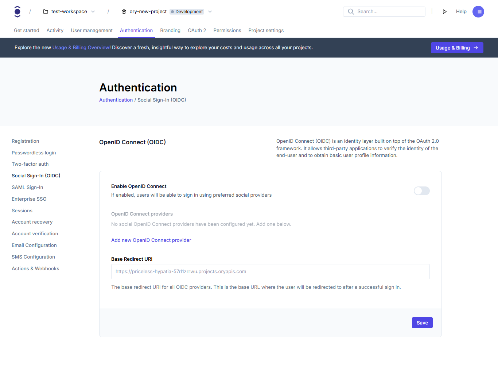
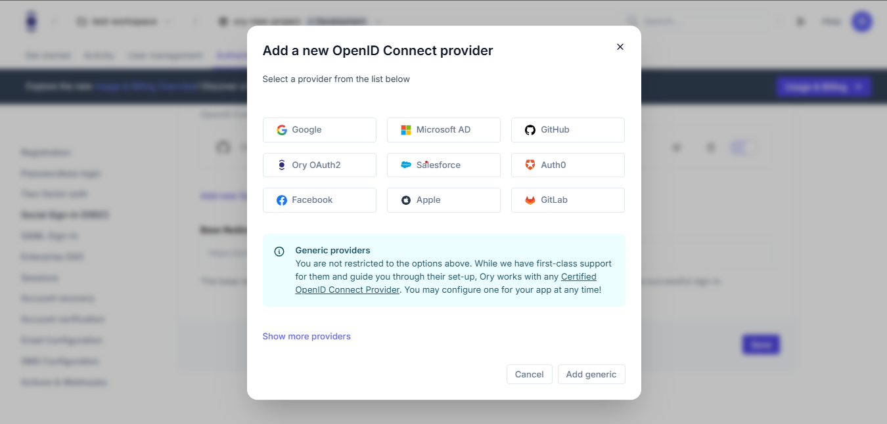
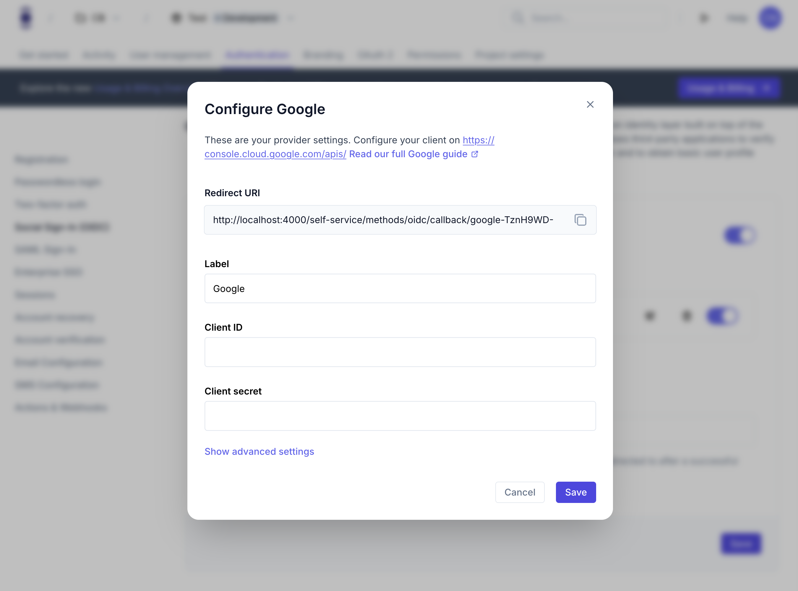
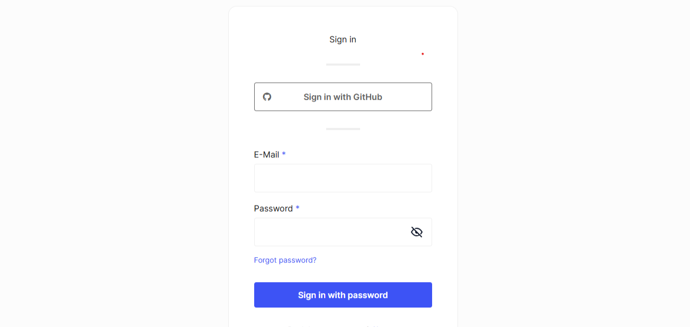

```mdx-code-block
import Tabs from "@theme/Tabs"
import TabItem from "@theme/TabItem"
import CodeBlock from "@theme/CodeBlock"
import { FrameworkCodeTabs, ImplementationSteps } from '@site/src/components/GuidesComponents'
```

Social sign-in allows users to log in to your application using their existing accounts from providers like Google, GitHub, or
Microsoft. This guide shows how to enable and configure social sign-in for your Ory project.

```mdx-code-block
<Tabs
  defaultValue="console"
  values={[
    {label: 'Ory Console', value: 'console'},
    {label: 'Ory CLI', value: 'cli'},
  ]}>
<TabItem value="console">
```

#### Set the base redirect URI

1. Log in to your [Ory Console](https://console.ory.com/)
2. Select your workspace and project
3. Navigate to the **Authentication** tab
4. Click on **Social Sign-In (OIDC)** in the sidebar
5. Enable the **Enable OpenID Connect** toggle
6. Enter the URL of your application that should handle post-authentication redirects

```mdx-code-block
import BrowserWindow from "@site/src/theme/BrowserWindow"

<BrowserWindow url="https://console.ory.com/projects/<id>">

</BrowserWindow>
```

#### Add a social provider

After enabling OpenID Connect, add a provider:

1. Click the "Add new OpenID Connect provider" button
2. Select a provider from the list:

```mdx-code-block

<BrowserWindow url="https://console.ory.com/projects/<id>/social-signin">
    
</BrowserWindow>
```

Ory offers pre-configured options for popular providers. Check our provider list [here](/docs/kratos/social-signin/overview).

#### Configure your provider

For pre-configured providers, you'll typically need to enter:

- Client ID (obtained from the provider's developer console)
- Client Secret (obtained from the provider's developer console)

```mdx-code-block
<BrowserWindow url="https://console.ory.com/projects/<id>/social-signin">

</BrowserWindow>
```

The configuration includes:

- Client ID
- Client Secret

```mdx-code-block
</TabItem>
<TabItem value="cli">
```

To enable and configure social sign-in using the CLI:

1. First, download your Ory Identities configuration:

```shell
# List all available workspaces
ory list workspaces

# List all available projects
ory list projects --workspace <workspace-id>

# Get the configuration
ory get identity-config --project <project-id> --workspace <workspace-id> --format yaml > identity-config.yaml
```

2. Edit the identity-config.yaml file to enable OIDC:

```yaml
methods:
  oidc:
    config:
      base_redirect_uri: http://localhost:4000
      providers:
        - client_id: "YOUR_CLIENT_ID"
          client_secret: "YOUR_CLIENT_SECRET"
          label: Google
          provider: google
          scope:
            - user:email
    enabled: true
```

3. Add the provider configuration to the providers array. Here are examples for common providers:

4. Apply the changes to your Ory project:

```shell
    ory update identity-config --project <project-id> --workspace <workspace-id> --file identity-config.yaml
```

```mdx-code-block
    </TabItem>
    </Tabs>
```

## What users will see

After configuring social sign-in, your users will experience:

```mdx-code-block
<BrowserWindow url="https://<base-url>/ui/login?flow=">

</BrowserWindow>
```

### User flow

1. A login page that displays buttons for each configured social provider
2. When they click a provider button, they'll be redirected to that provider's authentication page
3. After authenticating with the provider, they'll be sent back to your application
4. If it's their first time using social sign-in, a new account will be created automatically
5. For returning users, they'll be logged into their existing account
