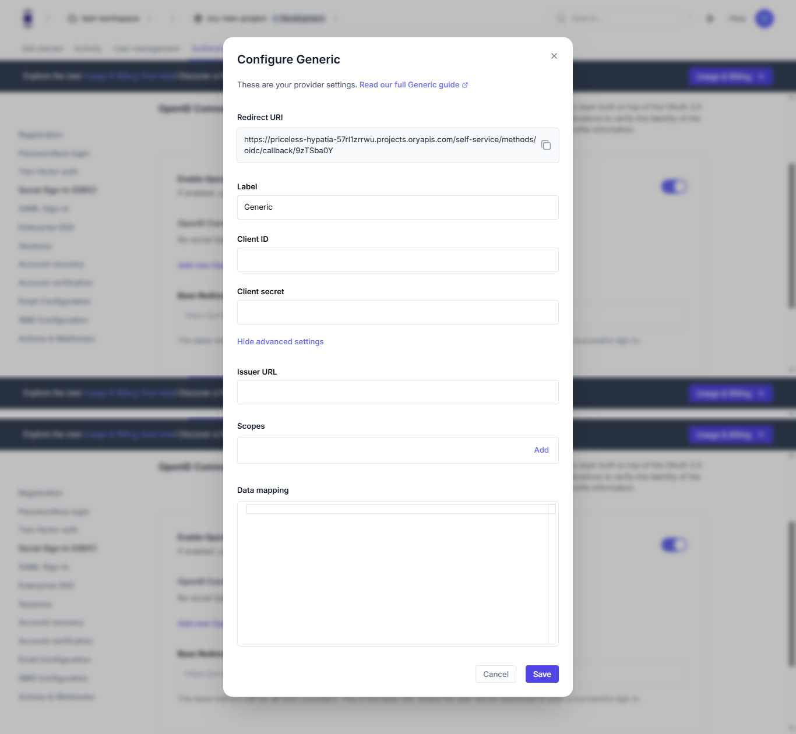

# Social sign-in

```mdx-code-block
import Tabs from "@theme/Tabs"
import TabItem from "@theme/TabItem"
import CodeBlock from "@theme/CodeBlock"
import { FrameworkCodeTabs, ImplementationSteps } from '@site/src/components/GuidesComponents'
```

Social sign-in allows users to log in to your application using their existing accounts from providers like Google, GitHub, or
Microsoft. This guide shows how to enable and configure social sign-in for your Ory project.

## Enabling Social Sign-In

To enable social sign-in:

1. Log in to your [Ory Console](https://console.ory.sh/)
2. Select your workspace and project
3. Navigate to the **Authentication** tab
4. Click on **Social Sign-In (OIDC)** in the sidebar
5. Enable the "Enable OpenID Connect" toggle


## Adding a Social Provider

After enabling OpenID Connect, add a provider:

1. Click the "Add new OpenID Connect provider" button
2. Select a provider from the list:


Ory offers pre-configured options for popular providers:

- Google
- Microsoft AD
- GitHub
- Ory OAuth2
- Salesforce
- Auth0
- Facebook
- Apple
- GitLab

## Configuring Your Provider

For pre-configured providers, you'll typically need to enter:

- Client ID (obtained from the provider's developer console)
- Client Secret (obtained from the provider's developer console)

For generic providers, you'll need to fill in more details:



The configuration includes:

- Redirect URI (automatically generated by Ory)
- Label (how the provider will appear to users)
- Client ID
- Client Secret
- Issuer URL
- Scopes (e.g., `openid email profile`)
- Data mapping (optional)

## Setting the Base Redirect URI

Configure the Base Redirect URI where users will be redirected after successful authentication:

1. In the Social Sign-In (OIDC) settings, locate the "Base Redirect URI" field
2. Enter the URL of your application that should handle post-authentication redirects
3. This URL will be used for all OIDC providers

## What users will see

After configuring social sign-in, your users will experience: 

1. A login page that displays buttons for each configured social provider
2. When they click a provider button, they'll be redirected to that provider's authentication page
3. After authenticating with the provider, they'll be sent back to your application
4. If it's their first time using social sign-in, a new account will be created automatically
5. For returning users, they'll be logged into their existing account

## Next steps

After configuring social sign-in:

1. [Manage user sessions](/docs/identities/get-started/session-management.mdx) for authenticated users
2. [Set up Multi-factor Authentication](/docs/identities/get-started/mfa.mdx) for additional security
3. [Add logout functionality](/docs/identities/get-started/sign-out.mdx) to your application
