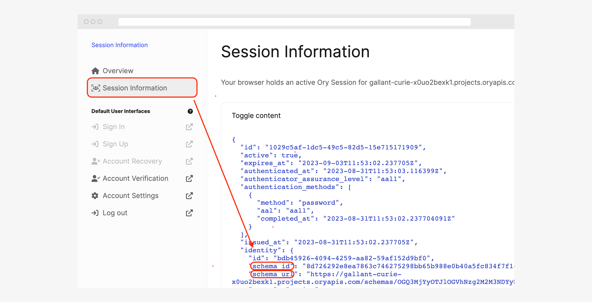

```mdx-code-block
import Tabs from '@theme/Tabs'
import TabItem from '@theme/TabItem'
```

This document explains how to create, update, and manage identity schemas in Ory Network.

## Use an existing preset

Ory Network provides basic preset schemas that are ready to use out of the box. If you are just getting started with Ory Network,
use one of the presets to make your life easier.

1. Go to <ConsoleLink route="project.identitySchema" />.
2. From the **Active schema** drop down, select the schema you want to use.
3. Click the **Change active schema** button to apply the schema to your project.

:::caution

Be aware that changing the active schema will affect all new identities created in the project. Existing identities might not be
able to sign in, for example if you change from an email based schema, to a username based schema.

:::

## Create custom schema

If the presets do not fit your needs, you can create a custom schema. Follow these steps to create a custom schema:

<Tabs>
<TabItem value="console" label="Ory Console" default>

1. Go to <ConsoleLink route="project.identitySchema" />.
2. From the **Select template** drop down, select the schema you want to use as a template.
3. Click the **Duplicate to make changes** button.
4. Give your schema a name.
5. Customize the schema to your needs. Read more about the
   [customization options](/kratos/manage-identities/15_customize-identity-schema.mdx).
6. Click the **Save** button to save.
7. Confirm the changes by clicking the **Confirm** button in the confirmation dialog.

To make this schema the active schema for your project, select the newly created schema from the **Active schema** dropdown and
click the **Change active schema** button.

</TabItem>
<TabItem value="cli" label="Ory CLI">

```shell
# Encode your schema to Base64 and export it to a variable.
schema=$(cat {path-to-json-with-identity-schema} | base64)

# Update your project's configuration.
ory patch identity-config {your-project-id} \
  --replace '/identity/default_schema_id="{unique-schema-id}"' \
  --replace '/identity/schemas=[{"id":"{unique-schema-id}","url":"base64://'$schema'"}]'
```

</TabItem>
</Tabs>

## Update identity schemas

Identity schemas are immutable to prevent inconsistencies in the data. This means, that you cannot update an existing schema.
However, you can use the existing schema as a template to create a new schema. Simply follow the steps in
[Create custom schema](#create-custom-schema) and select the current schema as a template.

It's recommended to manage identity schemas in version control. Learn more about
[managing Ory Network configuration in git](../../guides/gitops).

## Update identities to use a new schema

Updating the identity schema of a project can result in inconsistencies between the new schema and the identities created with the
old schema. Follow these steps to patch identities after updating the identity schema. If you are self-hosting Ory, you can follow
the same steps by using the API or Ory Kratos CLI.

The following steps are for updating one identity. If you have more identities that should be patched to the new schema, repeat
the steps 4 to 7 or check out the example code for bulk updating identities below.

1. Retrieve the Project ID.

   ```bash
   ory list workspaces
   ory list projects --workspace <workspace-id>

   export ORY_PROJECT_ID=$PROJECT_ID
   ```

2. Create a new identity with the updated schema - through the registration interface or [Ory Console](https://console.ory.sh/)
   and copy the `schema_id` of the identity you just created.

   

3. Get all identities of the project using the following command:

   ```bash
   ory list identities --format json-pretty
   ```

4. Find the identity to be updated and note down their `id`.

5. To update the identity, you need to use the [Admin API](../../reference/api#tag/identity/operation/updateIdentity). The API
   requires the Ory Network [Project slug](https://console.ory.sh/projects/current/settings),
   [API Key](https://console.ory.sh/projects/current/developers), and identity ID. Set them as environment variables:

   ```bash
   export ORY_API_KEY=$ORY_API_KEY
   export ORY_SLUG=$ORY_SLUG
   export IDENTITY_ID=$IDENTITY_ID
   ```

   Assess the required updates in traits. You need to add, remove, or update existing traits to match the new identity schema. You
   also need to change the `schema_id` to the new schema. For instance, adding a new trait and removing an old trait:

````mdx-code-block

<Tabs>
<TabItem value="updateidentitypatch" label="cURL and patchIdentity" default>

Using the [patchIdentity API](../../reference/api#tag/identity/operation/patchIdentity), you can change the
identity schema and traits directly.

Using patchIdentity is the recommended way to update identities.

```bash
curl --location --request PATCH "https://$ORY_SLUG.projects.oryapis.com/admin/identities/$IDENTITY_ID" \
--header "Authorization: Bearer $ORY_API_KEY" \
--header "Content-Type: application/json" \
--data-raw '[
{
    "op": "replace",
    "path": "/schema_id",
    "value": "{new-schema-id}"
},
{
    "op": "remove",
    "path": "/traits/foo"
},
{
    "op": "add",
    "path": "/traits/bar",
    "value": "barfoo"
}
]'
```

This should return the modified identity as the response.

</TabItem>

<TabItem value="updateidentitygo" label="Ory SDK">


:::note

This example uses the [Ory Go SDK](https://github.com/ory/client-go). If you wish to use a different programming language for identity schema migration, you can apply the same logic using the [Ory SDK for your programming language](../../sdk). Ory can also provide
example code in your preferred language. Please contact `support@ory.com`.

:::


```go
package main

import (
	"context"
	"fmt"

	client "github.com/ory/client-go"
)

const (
	YOUR_ORY_API_KEY        = "$YOUR_ORY_API_KEY"
	YOUR_ORY_PROJECT_SLUG   = "$PROJECT_SLUG"
	OLD_SCHEMA_ID           = "$OLD_SCHEMA_ID" // The schema ID of the identity to be updated, it is recommended to set this explicitly to avoid updating an identity with a different schema.
	UPDATE_TO_NEW_SCHEMA_ID = "$NEW_SCHEMA_ID"
	IDENTITY_ID_TO_UPDATE   = "$IDENTITY_ID"
)

func main() {
	if err := migrateSchema(UPDATE_TO_NEW_SCHEMA_ID, IDENTITY_ID_TO_UPDATE); err != nil {
		panic(err)
	}
}

func migrateSchema(toSchema, identityID string) error {
	// Initialize the client configuration
	cfg := client.NewConfiguration()
	cfg.Servers = client.ServerConfigurations{
		{
			URL: fmt.Sprintf("https://%s.projects.oryapis.com", YOUR_ORY_PROJECT_SLUG),
		},
	}

	// Create an instance of the API client
	ory := client.NewAPIClient(cfg)

	// Set the access token
	ctx := context.Background()
	ctx = context.WithValue(ctx, client.ContextAccessToken, YOUR_ORY_API_KEY)

	// Check if the new schema exists
	_, _, err := ory.IdentityApi.GetIdentitySchema(ctx, toSchema).Execute()
	if err != nil {
		return err
	}

	// Check if the identity exists
	identity, _, err := ory.IdentityApi.GetIdentity(ctx, identityID).Execute()
	if err != nil {
		return err
	}
	if identity.SchemaId == toSchema {
		fmt.Println("already migrated, no update required")
		return nil
	}

	// Check if the identity's schema ID matches the old schema ID
	if identity.SchemaId != OLD_SCHEMA_ID {
		return fmt.Errorf("identity's schema ID does not match the old schema ID")
	}

	// Prepare the JSON patch for the update
	jsonPatch := []client.JsonPatch{
		{Op: "replace", Path: "/schema_id", Value: toSchema},
	}

	// Apply the JSON patch to update the identity
	_, _, err = ory.IdentityApi.PatchIdentity(ctx, identityID).JsonPatch(jsonPatch).Execute()
	if err != nil {
		return err
	}

	// Verify that the schema was updated
	updatedIdentity, _, err := ory.IdentityApi.GetIdentity(ctx, identityID).Execute()
	if err != nil {
		return err
	}

	if updatedIdentity.SchemaId != toSchema {
		return fmt.Errorf("schema wasn't updated")
	}

	fmt.Println("Identity schema updated 🎉")

	return nil
}
```

</TabItem>


<TabItem value="updateidentitycurlput" label="cURL and updateIdentity">

Update the identity using the [updateIdentity API](../../reference/api#tag/identity/operation/updateIdentity):

1. Save the existing identity

    ```bash
    export IDENTITY_ID=$IDENTITY_ID
    ory get identity "$IDENTITY_ID" --project "$PROJECT_ID" --format json-pretty > identity-"$IDENTITY_ID".json
    ```

1. Update the saved JSON to match the new identity schema

    ```diff
    -"schema_id" : "$OLD_SCHEMA_ID",
    +"schema_id" : "$NEW_SCHEMA_ID",
    "traits": {
    -"foo": "foobar"
    +"bar": barfoo
    }
    ```

1. Update the identity using PUT

    ```bash
    curl -d "@identity-$IDENTITY_ID.json" -X PUT https://$ORY_SLUG.projects.oryapis.com/admin/identities/$IDENTITY_ID \
    -H "Authorization: Bearer $ORY_API_KEY" \
    -H'Content-Type: application/json'
    ```

:::info

The [updateIdentity API](../../reference/api#tag/identity/operation/updateIdentity) overwrites the existing identity with the one provided in the request body. Omit any fields that shouldn't be changed, including the `credentials` field.

:::

This should return the modified identity as the response.

</TabItem>
</Tabs>
````

Now, you have migrated a single identity to a new identity schema. If you have more identities to be patched to the new schema,
repeat the above process for each of them.
