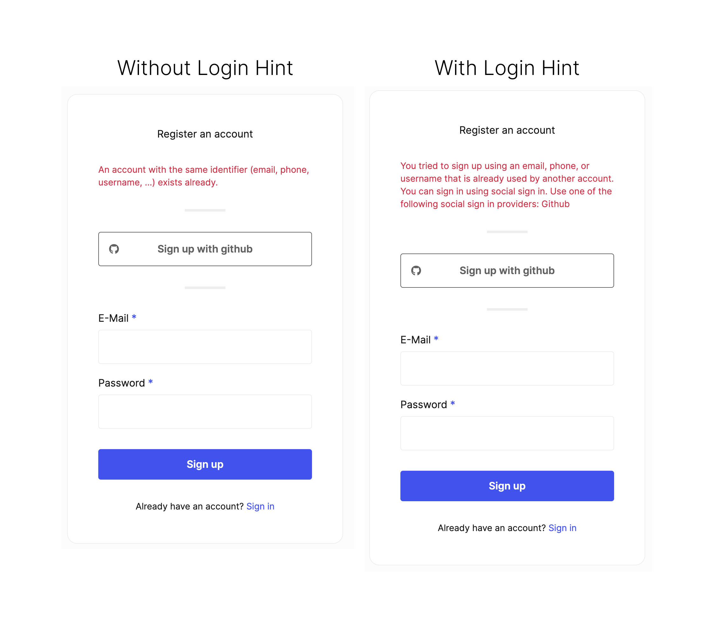

:::info

Login hints are enabled by default for newly created Ory Network Projects.

:::

When users attempt to sign up with an identifier (username, email address etc.) which has previously been registered, they will be
presented an error explaining that an identity is already created for that identifier.

If you have a number of different sign-in methods configured (say username and password plus one or more social sign-in
providers), its common for users users to not remember with which provider they initially signed up. This can lead to errors when
attempting to log in with the wrong method.

To address this, Ory Identities provides "login hints." Login hints provide a message what authentication method is available for
the users identifier when they choose a method for which an identity already exists.

To enable login hints edit your Ory Identities configuration directly or use the following CLI command:

```bash
ory list projects # to get the project id

ory patch project ${project_id} \
  --replace '/services/identity/config/selfservice/flows/registration/login_hints=true'
```



:::info

This behavior improves the sign-in experience for your users, but comes at the cost of exposing information about which sign-in
mehods a particular account identifier has associated with it.

Disable this feature if account enumeration attacks are a risk factor in your threat model.

:::
