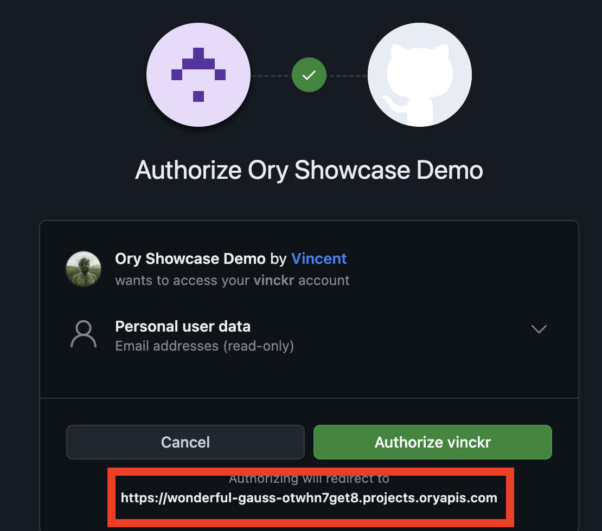

Some Social Sign-in Providers such as Google or GitHub show the Redirect URL as part of the sign-in process. By default, Ory
Network uses a redirect URL that points to the Ory Network domain:



:::caution

Changing the `base_redirect_uri` will break previously existing and functional social sign-in connections.

:::

To change the redirect URL to your custom domain, you need to update the `base_redirect_uri`:

```shell
## List all available projects
ory list projects

## Remove the configuration entry
ory patch identity-config <project-id> \
  --add '/selfservice/methods/oidc/config/base_redirect_uri="https://ory.example.org"'
```

After changing the base redirect URI you need to update the redirect URL of social sign-in providers you want to use. This is done
in the configuration of the social sign-in provider. To update an existing social sign in provider, follow these steps:

1. Open the Ory Console and navigate to the social sign-in configuration screen.
1. Choose the provider you want to fix and click on the configuration button.
1. Copy the **Redirect URI** from the form.
1. Replace the Ory Network URL `{project-slug}.projects.oryapis.com` with your custom hostname, such as `ory.example.org`.
1. Update the Redirect URI - also called Authorization callback URL - in the social sign-in provider configuration.

:::info

Make sure the Redirect URI matches the hostname you configured in the Ory Network configuration. For example when your custom
hostname is `https://ory.example.org`, the Redirect URI needs to be `https://ory.example.org`, not `https://www.ory.example.org`
or `https://ory.example.org/`.

:::
