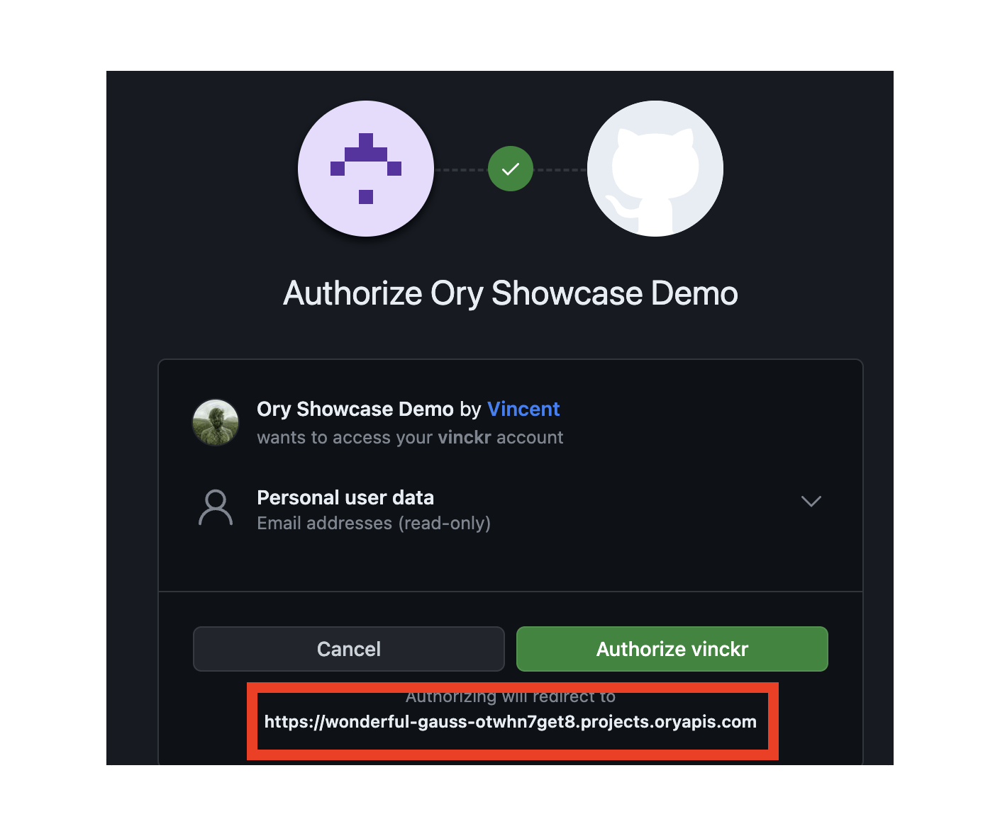

Some Social Sign-in Providers such as Google or GitHub show the Redirect URL as part of the sign-in process:



By default, Ory Cloud uses a redirect URL that points to the Ory Cloud domain.

:::caution

Changing the `base_redirect_uri` will break previously existing and functional social sign-in connections.

To fix a broken connection, choose the provider you want to fix from the Ory Console social sign-in configuration screen and copy
the updated redirect URL which now points to your custom hostname. Use the value you copied to update the redirect URL
configuration of the social sign-in provider.

:::

This makes it easy to get started with Social Sign-in. To adjust the redirect URL to your custom domain, you need to update the
`base_redirect_uri`:

```shell
## List all available projects
ory list projects

## Remove the configuration entry
ory patch identity-config <project-id> \
  --add '/selfservice/methods/oidc/config/base_redirect_uri="https://ory.example.org"'
```
