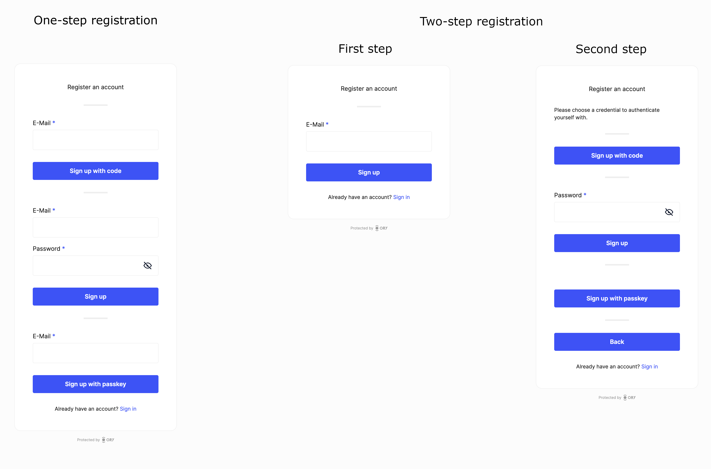

With a one-step registration, when you enable multiple authentication strategies (for example password, code via email, and
passkey), the identity traits will be repeated for each authentication strategy.

Compare this to a two-step registration: Now, the user is prompted for the identity traits in the first step, and asked to choose
a credential method for authentication next. This results in a more stream-lined user experience.

:::info

Identity traits are data associated with an identity that can be modified by the user. The traits are configured through the
identity schema.

[Learn more about identity traits](../../kratos/manage-identities/managing-users-identities-metadata#traits)

:::



To disable the legacy one-step registration, go to https://console.ory.sh/projects/current/authentication and switch off "Enable
legacy one-step registration" or use the Ory CLI:

```bash
ory list projects # to get the project id

ory patch project ${project_id} \
  --replace '/services/identity/config/selfservice/flows/registration/enable_legacy_one_step=false'
```
