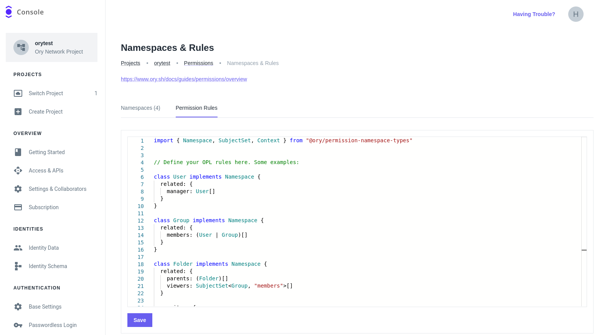

```mdx-code-block
import CodeFromRemote from "@theme/CodeFromRemote"
import BrowserWindow from "@site/src/theme/BrowserWindow"
const file = (path) => `https://github.com/ory/keto/blob/master/contrib/rewrites-example/${path}`
```

This guide explains how to configure namespaces and relationship rules using the
[Ory Permission Language](../reference/ory-permission-language) (OPL). You can then run fine-grained checks against Ory
Permissions, which are answered based on a combination of OPL and the concrete high-level relationships stored.

The example describes a file store. Individual files are organized in a folder hierarchy, and can be accessed by individual users
or groups of users. Using the Ory Permission Language you can specify that if a user has access to a folder, the user also has
access to all files in that folder.

## Ory Network setup

The fastest way to get started with Ory Permissions is using [Ory Console](https://console.ory.sh/). You can register for an Ory
Network account for free.

In the Ory Console, select **Namespaces & Rules** from the navigation bar and switch to the **Permission Rules** tab.

```mdx-code-block
<BrowserWindow url="https://console.ory.sh/projects/3afd6339-b999-4649-a2f6-740736775f80/permissions/configuration">



</BrowserWindow>
```

Into the editor, paste the following content:

```mdx-code-block
<CodeFromRemote src={file("namespaces.keto.ts")} title="namespaces.keto.ts" />
```

:::info

The editor offers autocompletion for the Ory Permission Language.

:::

### Connecting to the Ory Network via CLI

Next, you need to connect to the Ory Network using the Keto CLI. First, [install Keto](../install.mdx). To authenticate, navigate
to `Access & APIs` in the Ory Console and create a Personal Access Token. This, together with the subdomain from the SDK
configuration URL, need do be exported in a shell:

```sh
export KETO_READ_REMOTE=<your project slug>.projects.oryapis.com:443
export KETO_WRITE_REMOTE=<your project slug>.projects.oryapis.com:443
export KETO_BEARER_TOKEN="<your access token>"
```

Now, you can continue the guide by using the Keto CLI in the interaction with the Ory Network. Just keep in mind to issue the
commands in the same shell where you exported the environment variables.

## Creating the tuples

Now that Ory Keto is running, create relation tuples using the Keto CLI.

The following relation tuples showcase the namespace configuration. In short, it sets up a "developer" group with two members, and
a folder hierarchy. Through the rules in the Ory Permission Language, every member of the "developer" group can access the files
in the hierarchy.

You can create additional fine-grained permission rules for certain objects, similar to the "private" file.

```mdx-code-block
<CodeFromRemote src={file("relation-tuples/tuples.json")} title="tuples.json" />
```

To load the file into Ory Keto, run this command:

```sh
$ keto relation-tuple create tuples.json

NAMESPACE       OBJECT                  RELATION NAME   SUBJECT
Group           developer               members         patrik
Group           developer               members         User:Patrik
Group           developer               members         User:Henning
Folder          keto/                   viewers         Group:developer#members
File            keto/README.md          parents         Folder:keto/
Folder          keto/src/               parents         Folder:keto/
File            keto/src/main.go        parents         Folder:keto/src/
File            private                 owners          User:Henning
```

## Checking for permissions

Now, let's check some permissions! Some queries to try:

### Transitive permissions for objects in the hierarchy

Patrik can view `keto/src/main.go`. This file is in the `keto/src` folder, which is in `keto`. The `keto` directory has the
"developer" group as its "viewers". Patrik is a member of the "developer" group.

```
$ keto check User:Patrik view File keto/src/main.go
Allowed
```

### No transitivity for objects outside the hierarchy

Patrik cannot view the private file, since that file is not part of any folder hierarchy Patrik has access to.

```
$ keto check User:Patrik view File private
Denied
```

### Fine-grained permissions for any object

Henning can both edit and view the private file, since he is an "owner" of it.

```
$ keto check User:Henning view File private
Allowed

$ keto check User:Henning edit File private
Allowed
```

## (Optional) Local Setup and Configuration

If you do not want to use Ory Permissions you need to [install Ory Keto](../install.mdx) locally. Next, create a `keto.yaml` file
with this basic content:

```mdx-code-block
<CodeFromRemote src={file("keto.yaml")} title="keto.yaml" />
```

In the `namespaces` key, you see the line `config: file://./namespaces.keto.ts`. This needs to point to your namespace
configuration in the Ory Permission Language.

:::info

Namespace configurations without the Ory Permission Language are still supported by either specifying the namespaces directly or a
"naked" URI, e.g. `namespaces: file://.namespaces.yaml`.

:::

Next, create a file with the same namespace configuration as above.

:::tip

If you are using a text editor with TypeScript support, you can get extra help when using the Ory Permission Language. Make sure
to run `npm i @ory/keto-namespaces-types` and add a `tsconfig.json` file with the content:

```mdx-code-block
<CodeFromRemote src={file("tsconfig.json")} title="tsconfig.json" />
```

:::

### Starting Ory Keto

After you created both configuration files (`keto.yaml` and `namespaces.keto.ts`), run this command to start Ory Keto:

```sh
$ keto serve --config ./path/to/keto.yaml
```

## Further reading

To learn more about the Ory Permission Language, read the [specification](../reference/ory-permission-language) document.
