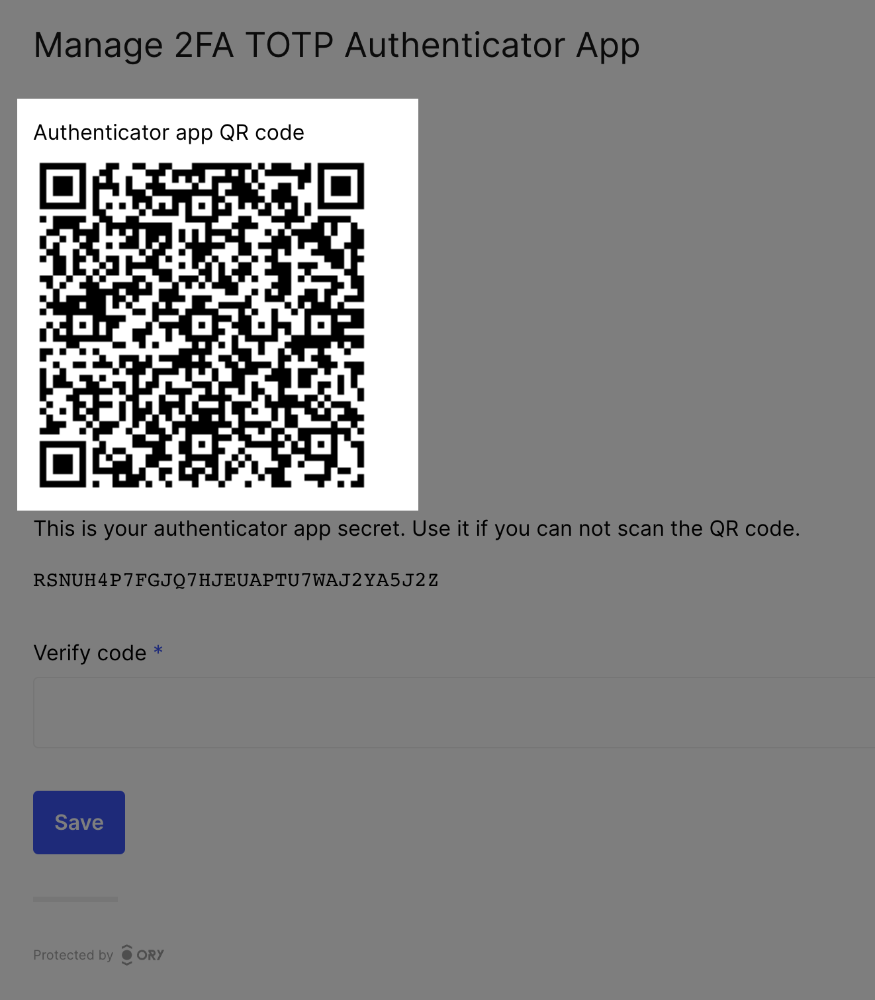
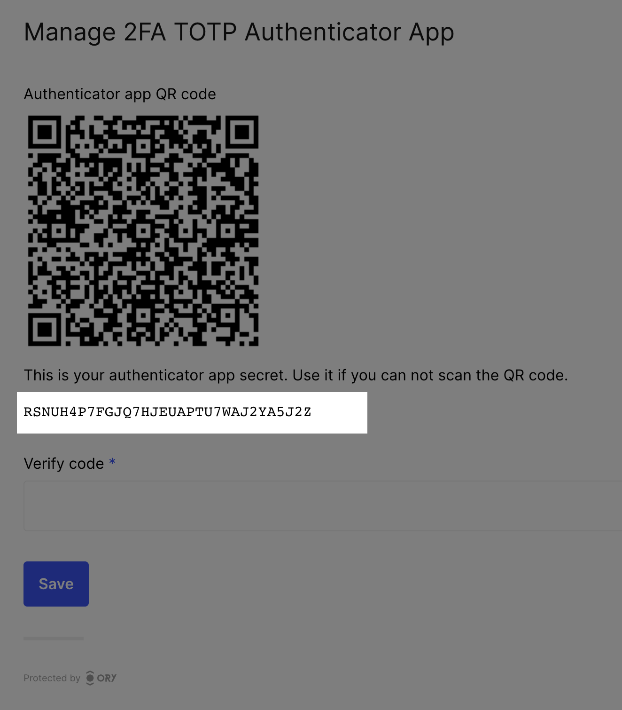

```mdx-code-block
import CodeFromRemote from "@site/src/theme/CodeFromRemote"
import Tabs from "@theme/Tabs"
import TabItem from "@theme/TabItem"
```

## UI payloads

To make UI customization easy, Ory Identities prepares all the necessary data for forms that need to be shown during e.g. login,
registration:

```json5
{
  id: "9b527900-2199-4221-9252-7971b3362282",
  type: "browser",
  expires_at: "2021-04-28T13:55:36.046466067Z",
  issued_at: "2021-04-28T12:55:36.046466067Z",
  ui: {
    action: "https://playground.projects.oryapis.com/self-service/settings?flow=9b527900-2199-4221-9252-7971b3362282",
    method: "POST",
    nodes: [
      {
        type: "input",
        group: "default",
        attributes: {
          node_type: "input",
          name: "csrf_token",
          type: "hidden",
          value: "U3r/lgEfT8rA1Lg0Eeo06oGO8mX6T4TKoe/z7rbInhvYeacbRg0IW9zrqnpU1wmQJXKiekNzdLnypx5naHXoPg==",
          required: true,
          disabled: false,
        },
        messages: null,
        meta: {},
      },
      {
        type: "input",
        group: "profile",
        attributes: {
          node_type: "input",
          name: "traits.email",
          type: "email",
          value: "foo@ory.sh",
          disabled: false,
        },
        messages: null,
        meta: {
          label: {
            id: 1070002,
            text: "E-Mail",
            type: "info",
          },
        },
      },
      // ...
    ],
  },
}
```

The above example would be rendered in HTML like this:

```html
<form
  method="POST"
  action="https://playground.projects.oryapis.com/self-service/settings?flow=9b527900-2199-4221-9252-7971b3362282"
>
  <!-- this is the first node -->
  <input
    type="hidden"
    name="csrf_token"
    value="U3r/lgEfT8rA1Lg0Eeo06oGO8mX6T4TKoe/z7rbInhvYeacbRg0IW9zrqnpU1wmQJXKiekNzdLnypx5naHXoPg=="
    required
  />

  <!-- this is the second node -->
  <input type="email" name="traits.email" value="foo@ory.sh" />
  <label for="traits.email">E-Mail</label>
</form>
```

As you can see, the JSON can be mapped almost 1:1 to HTML! This method makes it easy for you to implement complex forms without
having to deal with state management, form validation, and more!

## UI node groups

Nodes are grouped (using the `group` key) based on the source that generated the node. Sources are the different methods such as
"password" ("Sign in/up with ID & password"), "oidc" (Social Sign In), "link" (Password reset and email verification), "profile"
("Update your profile") and the "default" group which typically contains the CSRF token.

You can use the node group to filter out items, re-arrange them, render them differently - up to you!

## UI node types

UI Nodes can have several types!

### UI script nodes

The `script` node type is primarily used to load required scripts for WebAuthn!

```json
{
  "type": "script",
  "group": "webauthn",
  "attributes": {
    "src": "http://localhost:4455/.well-known/ory/webauthn.js",
    "async": true,
    "referrerpolicy": "no-referrer",
    "crossorigin": "anonymous",
    "integrity": "sha512-E3ctShTQEYTkfWrjztRCbP77lN7L0jJC2IOd6j8vqUKslvqhX/Ho3QxlQJIeTI78krzAWUQlDXd9JQ0PZlKhzQ==",
    "type": "text/javascript",
    "id": "webauthn_script",
    "node_type": "script"
  },
  "messages": [],
  "meta": {}
}
```

Rendering it is straight forward if you are on the server-side:

<CodeFromRemote
  lang="pug"
  title="https://github.com/ory/kratos-selfservice-ui-node/blob/master/views/partials/ui_node_script.hbs"
  src="https://raw.githubusercontent.com/ory/kratos-selfservice-ui-node/master/views/partials/ui_node_script.hbs"
/>

For single-page apps, you might need a different set up to load the script asynchronously. In React.js you might want to do
something like the following:

<CodeFromRemote
  lang="tsx"
  title="https://github.com/ory/kratos-react-nextjs-ui/blob/master/pkg/ui/NodeScript.tsx"
  src="https://raw.githubusercontent.com/ory/kratos-react-nextjs-ui/master/pkg/ui/NodeScript.tsx"
/>

### UI Anchor Nodes

Nodes of type `a` are currently not used in Ory Identities, but we have them around in case they are needed at a later stage!

<CodeFromRemote
  lang="pug"
  title="https://github.com/ory/kratos-selfservice-ui-node/blob/master/views/partials/ui_node_anchor.hbs"
  src="https://raw.githubusercontent.com/ory/kratos-selfservice-ui-node/master/views/partials/ui_node_anchor.hbs"
/>

### UI image nodes

Nodes of type `img` are used as QR codes, for example.

```json
{
  "type": "img",
  "group": "totp",
  "attributes": {
    "src": "data:image/png;base64,iVBORw0KGgoAAAANSUhEUgAAAQAAAAEAEAAAAAApiSv5AAAHP0lEQVR4nOyd0Y4kOwoFt1fz/7989+1mSWORUJzMXikinkbdZZuuOUIIDP7zzz//ETD//W0D5HdRAHAUABwFAOfP9c+fn8SG86DyOvdae/pZd5faqvlp8+9lvku94mTphs/T9ABwFAAcBQBHAcD5c/rhJpDr/vY6Y5OL7AaLm9CvG4LVFtS7ZALNmvMZegA4CgCOAoCjAOAcg8CLTdhTh36bzF3mc7XN9YrTb7t/0fxbq9n8H+kB8CgAOAoAjgKAcxMEPkc3k7Up0J5Cunlwt7G0tqpe+85tTT0AHAUARwHAUQBwXgkC56Xa7m8zNwY3Ocsu3V3ebtTRA8BRAHAUABwFAOcmCEyHJPMWjE0hd57XOxV3N+Xb7t87zzte7P6P9ABwFAAcBQBHAcA5BoGZ3NeczI3BTbPI5oxMk0rXvtT/kR4AjgKAowDgKAA4P8+VH7t337q7vNtFXPPczcKTLU+WiPUAcBQAHAUARwHA+elmt7psZuRtLEj33M7L1Zlz5xbMd/lEDwBHAcBRAHAUAJxjJnDTqjG/15dp7qhPm1uQDrcyBeT63G/O0APAUQBwFAAcBQBnlQl8LtxKj2/OjH7OFIu79p3ID8fWA8BRAHAUABwFAOejMeS5GXnz4u6mKaI7SmYTwqaDynQHcv8WoR4AjgKAowDgKAA4N+XgE8/lyDI7n9i9qjFlU0rOlNP7ZXc9ABwFAEcBwFEAcL4YFr3JkT3X8Zq5bZhua6nPSAfC3zTW6AHgKAA4CgCOAoDzRWPIcZtwvi4zDqZLpnGla8tzbTLflKb1AHAUABwFAEcBwLmZE7jJbmUeXnsuKMqMdO7ud9q5u0umH9tysBxQAHAUABwFAOfmxZA6mHhjxmDXvnmQ2n0xJEN6xmDqPRE9ABwFAEcBwFEAcD6CwOe6W7u71D/LjG+eMw9wNw/S1Z/rfuP9tXoAOAoAjgKAowDgHDOB8/HDm1l/tQVd+2oyc/g2Idhpl9qCeud6rSNipIkCgKMA4CgAODfl4C7pAS2bu4iZQG5OZrLgvNv4tLaPHgCOAoCjAOAoADjHF0MuMm0Z87U1mUzlab+TVfPTTrvMz+2ysV4PgEcBwFEAcBQAnJty8MV8Wt5pbbcFI93NO1+bKbxudskUve0OlhIFAEcBwFEAcG5GxHx8cDHm5WIToG12/q3ZgZt8Ytrm0+f0AHgUABwFAEcBwPmiO3gTvs07gTOvfpx2rndJ3/DrWnBi/j2bCZQmCgCOAoCjAOB8BIGbHNRm5l66ASLdMbzJ4XUD60yo+004qAeAowDgKAA4CgDOTSYw81pGN9fXHUhdk7E5c5uvXjsnM1jnEz0AHAUARwHAUQBwbt4OvsjcVZufMQ/pMvfrTjtfbM6Yj4jp8k0mVQ8ARwHAUQBwFACc44iYTGDzxhy+2oKa+ZiXzBCYOZvO53oXPQAeBQBHAcBRAHBWmcBNGLV5Y+S5oOi5qX+ZppKab3bRA8BRAHAUABwFAOcmE/jxwfCrH0djVn2uPQs2f2VNuo/5nZdP9ABwFAAcBQBHAcA5Dou+2OTr6v265dvN7cB5AJkpB/9+R3PfFj0AHAUARwHAUQBw2sOiP5aMA8P6c/WKE5ky9Kbl5PTbzbmb72+XWdQDwFEAcBQAHAUA5yYT2OW5YnG6l7Ye6TIf/ZIJQ08ruufu0APAUQBwFAAcBQDnGASmi6eb+2ubcmt3aHO9y/zc/DS/vy1I3RPUA8BRAHAUABwFAOcYBGYm43VXZF7BqJmXg9O39DZl6K4F89/qAfAoADgKAI4CgNN+MSRTHq3XdtmEkvNbepuwcf5Xzr/TTTldD4BHAcBRAHAUAJzjiJiLTHk03SixybmlS9jPjZy5eG6Mjx4AjwKAowDgKAA4H5nATXm0DlO6+bDNjcHuYJhNeXk+xzCTd+yeVn/ujB4AjgKAowDgKAA47e7geeNFOk9Yr+jud7Jl3lCRHj6dzif2C+Z6ADgKAI4CgKMA4LSfjbvYlIg3Jef/z1mE3Z3TkwA3VhkEyr8oADgKAI4CgHPTGHLxXO/rfG1NZr/fCj7nBeldj7EeAI4CgKMA4CgAOMc7gXPemP+Xvv9XW5UJ/bo8Z/MdegA4CgCOAoCjAOC0M4Fd5u0g9S6bECczn7AOOd8YTdO1+YTlYClRAHAUABwFAKc9LLpmHrA8V/qtrTpZ0D2jXpsenX0ik3f8RA8ARwHAUQBwFACcm+7gN0KSzMsYXea7zHNz9c82K7r0V+gB4CgAOAoAjgKA0x4Rk2F+u20TKGWKyrWlXeal5E22sY8eAI4CgKMA4CgAOK8EgZmhzZvZfJnpe+mw7I0XTe7QA8BRAHAUABwFAOcmCHyjY3j+Xkf6gbY3epu7n8vn+v5ea2OI/IsCgKMA4CgAOMcgMH37LvN42uaOXIb5gOZ5SDd/IaX+nM/GSYkCgKMA4CgAOMcXQ4SDHgCOAoCjAOAoADgKAM7/AgAA//9RrYZOnxsHAQAAAABJRU5ErkJggg==",
    "id": "totp_qr",
    "width": 256,
    "height": 256,
    "node_type": "img"
  },
  "messages": [],
  "meta": {
    "label": {
      "id": 1050005,
      "text": "Authenticator app QR code",
      "type": "info"
    }
  }
}
```

```mdx-code-block
import BrowserWindow from "@site/src/theme/BrowserWindow"

<BrowserWindow url="https://playground.projects.oryapis.com/ui">



</BrowserWindow>
```

Here is an example of implementing an `img` node in handlebars:

<CodeFromRemote
  lang="pug"
  title="https://github.com/ory/kratos-selfservice-ui-node/blob/master/views/partials/ui_node_image.hbs"
  src="https://raw.githubusercontent.com/ory/kratos-selfservice-ui-node/master/views/partials/ui_node_image.hbs"
/>

Here is an example of implementing an `img` node in React.js:

<CodeFromRemote
  lang="tsx"
  title="https://github.com/ory/kratos-react-nextjs-ui/blob/master/pkg/ui/NodeImage.tsx"
  src="https://raw.githubusercontent.com/ory/kratos-react-nextjs-ui/master/pkg/ui/NodeImage.tsx"
/>

### UI text nodes

Nodes of type `text` are commonly used to display secrets (e.g. lookup secrets).

```mdx-code-block
<BrowserWindow url="https://playground.projects.oryapis.com/ui">


</BrowserWindow>
```

```mdx-code-block
<BrowserWindow url="https://playground.projects.oryapis.com/ui">



</BrowserWindow>
```

Their JSON usually contains a bit of contextual information.

<Tabs
  defaultValue="totp"
  values={[
    {label: 'TOTP Example', value: 'totp'},
    {label: 'Lookup Secret Example', value: 'lookup'},
  ]}>
  <TabItem value="totp">

```json
{
  "type": "text",
  "group": "totp",
  "attributes": {
    "text": {
      "id": 1050006,
      "text": "GLAS5YHAJ6V5LT3N7AU2R4AWU6SYOCHS",
      "type": "info",
      "context": {
        "secret": "GLAS5YHAJ6V5LT3N7AU2R4AWU6SYOCHS"
      }
    },
    "id": "totp_secret_key",
    "node_type": "text"
  },
  "messages": [],
  "meta": {
    "label": {
      "id": 1050006,
      "text": "This is your authenticator app secret. Use it if you can not scan the QR code.",
      "type": "info"
    }
  }
}
```

  </TabItem>
  <TabItem value="lookup">

```json
{
  "type": "text",
  "group": "lookup_secret",
  "attributes": {
    "text": {
      "id": 1050015,
      "text": "8qhkibka, 4m4m0l81, xh7ji7xk, cgi8xfwa, uim1dztu, 1jsjkk2i, 3nw4o5fr, lg77u7rr, hhwmz3rx, kx1cx840, thc7xl8t, osgqai15",
      "type": "info",
      "context": {
        "secrets": [
          {
            "id": 1050009,
            "text": "8qhkibka",
            "type": "info",
            "context": {
              "secret": "8qhkibka"
            }
          },
          {
            "id": 1050009,
            "text": "4m4m0l81",
            "type": "info",
            "context": {
              "secret": "4m4m0l81"
            }
          },
          {
            "id": 1050009,
            "text": "xh7ji7xk",
            "type": "info",
            "context": {
              "secret": "xh7ji7xk"
            }
          },
          {
            "id": 1050009,
            "text": "cgi8xfwa",
            "type": "info",
            "context": {
              "secret": "cgi8xfwa"
            }
          },
          {
            "id": 1050009,
            "text": "uim1dztu",
            "type": "info",
            "context": {
              "secret": "uim1dztu"
            }
          },
          {
            "id": 1050009,
            "text": "1jsjkk2i",
            "type": "info",
            "context": {
              "secret": "1jsjkk2i"
            }
          },
          {
            "id": 1050009,
            "text": "3nw4o5fr",
            "type": "info",
            "context": {
              "secret": "3nw4o5fr"
            }
          },
          {
            "id": 1050009,
            "text": "lg77u7rr",
            "type": "info",
            "context": {
              "secret": "lg77u7rr"
            }
          },
          {
            "id": 1050009,
            "text": "hhwmz3rx",
            "type": "info",
            "context": {
              "secret": "hhwmz3rx"
            }
          },
          {
            "id": 1050009,
            "text": "kx1cx840",
            "type": "info",
            "context": {
              "secret": "kx1cx840"
            }
          },
          {
            "id": 1050009,
            "text": "thc7xl8t",
            "type": "info",
            "context": {
              "secret": "thc7xl8t"
            }
          },
          {
            "id": 1050009,
            "text": "osgqai15",
            "type": "info",
            "context": {
              "secret": "osgqai15"
            }
          }
        ]
      }
    },
    "id": "lookup_secret_codes",
    "node_type": "text"
  },
  "messages": [],
  "meta": {
    "label": {
      "id": 1050010,
      "text": "These are your back up recovery codes. Please keep them in a safe place!",
      "type": "info"
    }
  }
}
```

  </TabItem>
</Tabs>

Rendering the text component is usually a bit more complex, as you most likely want a bit of custom formatting. By the way, you
can find an overview of all message IDs used here in the conditionals at the end of this page! In handlebars, this could look as
follows:

<CodeFromRemote
  lang="pug"
  title="https://github.com/ory/kratos-selfservice-ui-node/blob/master/views/partials/ui_node_text.hbs"
  src="https://raw.githubusercontent.com/ory/kratos-selfservice-ui-node/master/views/partials/ui_node_text.hbs"
/>

In React.js, you will most likely find similar if statements on the message IDs.

<CodeFromRemote
  lang="tsx"
  title="https://github.com/ory/kratos-react-nextjs-ui/blob/master/pkg/ui/NodeText.tsx"
  src="https://raw.githubusercontent.com/ory/kratos-react-nextjs-ui/master/pkg/ui/NodeText.tsx"
/>

### UI input nodes

The most common node type is the `input` type. In general, it represents an HTML `<input>` field:

```json
{
  "type": "input",
  "group": "default",
  "attributes": {
    "name": "csrf_token",
    "type": "hidden",
    "node_type": "input",
    "value": "U3r/lgEfT8rA1Lg0Eeo06oGO8mX6T4TKoe/z7rbInhvYeacbRg0IW9zrqnpU1wmQJXKiekNzdLnypx5naHXoPg==",
    "required": true,
    "disabled": false
  },
  "messages": null,
  "meta": {}
}
```

An `input` node itself has a type as well. These types are taken from HTML:

- `text`
- `password`
- `number`
- `checkbox`
- `hidden`
- `email`
- `submit`
- `button`
- `datetime-local`
- `date`
- `url`

#### Checkbox input node

Checkboxes are primarily used when an Identity Schema field is of `"type": "boolean"`. The following Identity Schema

```json5
{
  $schema: "http://json-schema.org/draft-07/schema#",
  type: "object",
  properties: {
    traits: {
      type: "object",
      properties: {
        // ...
        tos: {
          title: "Accept Terms of Service",
          type: "boolean",
        },
        // ...
      },
      // ...
    },
  },
}
```

would result in such a checkbox node:

```json
{
  "type": "input",
  "group": "profile",
  "attributes": {
    "name": "traits.tos",
    "type": "checkbox",
    "disabled": false,
    "node_type": "input"
  },
  "messages": [],
  "meta": {
    "label": {
      "id": 1070002,
      "text": "Accept Terms of Service",
      "type": "info"
    }
  }
}
```

When using plain HTML and not a single page app, the best option you have is to use two input fields - one hidden and one a
checkbox - with `false` and `true` respectively. Make sure that the checkbox input field is second as it needs to override the
hidden field, if set.

<CodeFromRemote
  lang="pug"
  title="https://github.com/ory/kratos-selfservice-ui-node/blob/v1.0.0/views/partials/ui_node_input_checkbox.hbs"
  src="https://raw.githubusercontent.com/ory/kratos-selfservice-ui-node/v1.0.0/views/partials/ui_node_input_checkbox.hbs"
/>

In single page apps, such as React.js, this trickery is not needed as you have full control over the form's state:

<CodeFromRemote
  lang="tsx"
  title="https://github.com/ory/kratos-react-nextjs-ui/blob/master/pkg/ui/NodeInputCheckbox.tsx"
  src="https://raw.githubusercontent.com/ory/kratos-react-nextjs-ui/master/pkg/ui/NodeInputCheckbox.tsx"
/>

#### Button input node

Buttons are primarily used to trigger something, which is why it is important to have the `onclick` attribute handled. If
`onclick` exists, you will also find a `script` node:

```json
[
  {
    "type": "input",
    "group": "webauthn",
    "attributes": {
      "name": "webauthn_register_trigger",
      "type": "button",
      "value": "",
      "disabled": false,
      "onclick": "window.__oryWebAuthnRegistration({\"publicKey\":{\"challenge\":\"SOaWrZE4unW3cC57ED52HRnHwd22Fcg8DNf0zf9Jgr0=\",\"rp\":{\"name\":\"Ory\",\"id\":\"localhost\"},\"user\":{\"name\":\"placeholder\",\"icon\":\"https://via.placeholder.com/128\",\"displayName\":\"placeholder\",\"id\":\"q7MFvGN9TzqDTIgEIvkjZw==\"},\"pubKeyCredParams\":[{\"type\":\"public-key\",\"alg\":-7},{\"type\":\"public-key\",\"alg\":-35},{\"type\":\"public-key\",\"alg\":-36},{\"type\":\"public-key\",\"alg\":-257},{\"type\":\"public-key\",\"alg\":-258},{\"type\":\"public-key\",\"alg\":-259},{\"type\":\"public-key\",\"alg\":-37},{\"type\":\"public-key\",\"alg\":-38},{\"type\":\"public-key\",\"alg\":-39},{\"type\":\"public-key\",\"alg\":-8}],\"authenticatorSelection\":{\"requireResidentKey\":false,\"userVerification\":\"preferred\"},\"timeout\":60000}})",
      "node_type": "input"
    },
    "messages": [],
    "meta": {
      "label": {
        "id": 1050012,
        "text": "Add security key",
        "type": "info"
      }
    }
  },
  {
    "type": "script",
    "group": "webauthn",
    "attributes": {
      "src": "http://localhost:4455/.well-known/ory/webauthn.js",
      "async": true,
      "referrerpolicy": "no-referrer",
      "crossorigin": "anonymous",
      "integrity": "sha512-E3ctShTQEYTkfWrjztRCbP77lN7L0jJC2IOd6j8vqUKslvqhX/Ho3QxlQJIeTI78krzAWUQlDXd9JQ0PZlKhzQ==",
      "type": "text/javascript",
      "id": "webauthn_script",
      "node_type": "script"
    },
    "messages": [],
    "meta": {}
  }
]
```

For example, when an end-user triggers a WebAuthn flow, the button would trigger the required JavaScript to get it working!

<CodeFromRemote
  lang="pug"
  title="https://github.com/ory/kratos-selfservice-ui-node/blob/master/views/partials/ui_node_input_checkbox.hbs"
  src="https://raw.githubusercontent.com/ory/kratos-selfservice-ui-node/master/views/partials/ui_node_input_checkbox.hbs"
/>

In a single page application, we need a bit of trickery as we are executing JavaScript from a JSON source in JavaScript - which
essentially means we need to execute `eval`. Fortunately, this is only needed in this special case. If you do not use WebAuthn,
you will not need `eval` at all!

<CodeFromRemote
  lang="tsx"
  title="https://github.com/ory/kratos-react-nextjs-ui/blob/master/pkg/ui/NodeInputButton.tsx"
  src="https://raw.githubusercontent.com/ory/kratos-react-nextjs-ui/master/pkg/ui/NodeInputButton.tsx"
/>

#### Submit input node

Submit buttons trigger the form submission. In pure HTML, this is just a simple submit button:

<CodeFromRemote
  lang="pug"
  title="https://github.com/ory/kratos-selfservice-ui-node/blob/master/views/partials/ui_node_input_button.hbs"
  src="https://raw.githubusercontent.com/ory/kratos-selfservice-ui-node/master/views/partials/ui_node_input_button.hbs"
/>

If you have control over the form's payload, like in React.js, you need to ensure that the name of the form (e.g. `method`) is
only submitted once with the correct value (e.g. `password`). Because in some cases Ory Identities might generate multiple submit
buttons with the same `name` attribute.

```json5
[
  {
    type: "input",
    group: "profile",
    attributes: {
      name: "method",
      type: "submit",
      value: "profile",
      disabled: false,
      node_type: "input",
    },
    messages: [],
    meta: {
      label: {
        id: 1070003,
        text: "Save",
        type: "info",
      },
    },
  },
  // ...
  {
    type: "input",
    group: "password",
    attributes: {
      name: "method",
      type: "submit",
      value: "password",
      disabled: false,
      node_type: "input",
    },
    messages: [],
    meta: {
      label: {
        id: 1070003,
        text: "Save",
        type: "info",
      },
    },
  },
]
```

You need to ensure that the correct value for the `name` is submitted, or the user might end up updating their password instead of
their email address!

<CodeFromRemote
  lang="tsx"
  title="https://github.com/ory/kratos-react-nextjs-ui/blob/master/pkg/ui/NodeInputSubmit.tsx"
  src="https://raw.githubusercontent.com/ory/kratos-react-nextjs-ui/master/pkg/ui/NodeInputSubmit.tsx"
/>

#### Hidden input node

Hidden input fields such as the `csrf_token`

```json5
{
  type: "input",
  group: "default",
  attributes: {
    name: "csrf_token",
    type: "hidden",
    value: "By8X7TPnn/NMtXeDpK6sbshISK3t1WnezAtlMnFA6ZPsxxNmRsG8ks7WpsHMQtTLbxtqKJOiu4aArJok6/GOSw==",
    required: true,
    disabled: false,
    node_type: "input",
  },
  messages: [],
  meta: {},
}
```

are easy to implement in both pure HTML

<CodeFromRemote
  lang="pug"
  title="https://github.com/ory/kratos-selfservice-ui-node/blob/master/views/partials/ui_node_input_hidden.hbs"
  src="https://raw.githubusercontent.com/ory/kratos-selfservice-ui-node/master/views/partials/ui_node_input_hidden.hbs"
/>

and single page apps like React.js

<CodeFromRemote
  lang="tsx"
  title="https://github.com/ory/kratos-react-nextjs-ui/blob/master/pkg/ui/NodeInputHidden.tsx"
  src="https://raw.githubusercontent.com/ory/kratos-react-nextjs-ui/master/pkg/ui/NodeInputHidden.tsx"
/>

#### Default input node rendering

You do not need to have one view for every node type. Instead, you can "fall back" to a default implementation. The most important
node types (`hidden`, `submit`, `button`, `checkbox`) we already covered!

Here are some examples for you to get a feeling for possible payloads!

<Tabs
  defaultValue="email"
  values={[
    {label: 'Email', value: 'email'},
    {label: 'URL', value: 'url'},
    {label: 'Number', value: 'number'},
    {label: 'Text', value: 'text'},
  ]}>
<TabItem value="email">

```json
{
  "type": "input",
  "group": "profile",
  "attributes": {
    "name": "traits.email",
    "type": "email",
    "value": "foo@ory.sh",
    "disabled": false
  },
  "messages": null,
  "meta": {
    "label": {
      "id": 1070002,
      "text": "E-Mail",
      "type": "info"
    }
  }
}
```

</TabItem>
<TabItem value="url">

```json
{
  "type": "input",
  "group": "profile",
  "attributes": {
    "name": "traits.website",
    "type": "url",
    "value": "https://www.ory.sh/",
    "required": true,
    "disabled": false,
    "node_type": "input"
  },
  "messages": [],
  "meta": {
    "label": {
      "id": 1070002,
      "text": "Your website",
      "type": "info"
    }
  }
}
```

</TabItem>
<TabItem value="number">

```json
{
  "type": "input",
  "group": "profile",
  "attributes": {
    "name": "traits.age",
    "type": "number",
    "disabled": false,
    "node_type": "input"
  },
  "messages": [],
  "meta": {
    "label": {
      "id": 1070002,
      "text": "Age",
      "type": "info"
    }
  }
}
```

</TabItem>
<TabItem value="text">

```json
{
  "type": "input",
  "group": "profile",
  "attributes": {
    "name": "traits.name",
    "type": "text",
    "disabled": false,
    "node_type": "input"
  },
  "messages": [],
  "meta": {
    "label": {
      "id": 1070002,
      "text": "Name",
      "type": "info"
    }
  }
}
```

</TabItem>
</Tabs>

You should render these components using a generic node input render logic like the one below:

<CodeFromRemote
  lang="pug"
  title="https://github.com/ory/kratos-selfservice-ui-node/blob/master/views/partials/ui_node_input_default.hbs"
  src="https://raw.githubusercontent.com/ory/kratos-selfservice-ui-node/master/views/partials/ui_node_input_default.hbs"
/>

## Node order and labels

For all traits, the labels and orders are taken from the Identity Schema. An Identity Schema such as

```json
{
  "$id": "https://schemas.ory.sh/presets/kratos/quickstart/email-password/identity.schema.json",
  "$schema": "http://json-schema.org/draft-07/schema#",
  "title": "Person",
  "type": "object",
  "properties": {
    "traits": {
      "type": "object",
      "properties": {
        "email": {
          "type": "string",
          "format": "email",
          "title": "E-Mail",
          "minLength": 3,
          "ory.sh/kratos": {
            "credentials": {
              "password": {
                "identifier": true
              }
            }
          }
        },
        "website": {
          "title": "Website",
          "type": "string",
          "format": "uri",
          "minLength": 10
        },
        "consent": {
          "title": "Consent",
          "const": true
        },
        "newsletter": {
          "title": "Newsletter",
          "type": "boolean"
        }
      },
      "required": ["email", "website"],
      "additionalProperties": false
    }
  }
}
```

will generate the following fields - take note that the order of the JSON Schema affects the order of the nodes:

```json
[
  {
    "type": "input",
    "group": "profile",
    "attributes": {
      "name": "traits.email",
      "type": "email",
      "value": "foo@ory.sh",
      "disabled": false
    },
    "messages": null,
    "meta": {
      "label": {
        "id": 1070002,
        "text": "E-Mail",
        "type": "info"
      }
    }
  },
  {
    "type": "input",
    "group": "profile",
    "attributes": {
      "name": "traits.name.first",
      "type": "text",
      "value": "Foo",
      "disabled": false
    },
    "messages": null,
    "meta": {
      "label": {
        "id": 1070002,
        "text": "First Name",
        "type": "info"
      }
    }
  },
  {
    "type": "input",
    "group": "profile",
    "attributes": {
      "name": "traits.name.last",
      "type": "text",
      "value": "Bar",
      "disabled": false
    },
    "messages": null,
    "meta": {
      "label": {
        "id": 1070002,
        "text": "Last Name",
        "type": "info"
      }
    }
  },
  {
    "type": "input",
    "group": "profile",
    "attributes": {
      "name": "method",
      "type": "submit",
      "value": "profile",
      "disabled": false
    },
    "messages": null,
    "meta": {
      "label": {
        "id": 1070003,
        "text": "Save",
        "type": "info"
      }
    }
  }
]
```

Generally, submit buttons are the last node in a group. If you wish to have more flexibility with regards to order or labeling the
best option is to implement this in your UI using map, filter, and other JSON transformation functions.

## Titles, Labels & Validation Messages

Ory Identities helps users understand what is happening by providing messages that explain what went wrong or what needs to be
done. Examples are "The provided credentials are invalid", "Missing property email" and similar.

Typically login, registration, settings, ... flows include such messages on different levels:

1. At the root level, indicating that the message affects the whole request (e.g. request expired)
2. At the method (password, oidc, profile) level, indicating that the message affects a specific method / form.
3. At the field level, indicating that the message affects a form field (e.g. validation errors).

Each message has a layout of:

```json5
{
  id: 1234,
  // This ID will not change and can be used to translate the message or use your own message content.
  text: "Some default text",
  // A default text in english that you can display if you do not want to customize the message.
  context: {},
  // A JSON object which may contain additional fields such as `expires_at`. This is helpful if you want to craft your own messages.
}
```

The message ID is a 7-digit number (`xyyzzzz`) where

- `x` is the message type which is either `1` for an info message (e.g. `1020000`), `4` (e.g. `4020000`) for an input validation
  error message, and `5` (e.g. `5020000`) for a generic error message.
- `yy` is the module or flow this error references and can be:
- `01` for login messages (e.g. `1010000`)
- `02` for logout messages (e.g. `1020000`)
- `03` for multi-factor authentication messages (e.g. `1030000`)
- `04` for registration messages (e.g. `1040000`)
- `05` for settings messages (e.g. `1050000`)
- `06` for account recovery messages (e.g. `1060000`)
- `07` for email/phone verification messages (e.g. `1070000`)
- `zzzz` is the message ID and typically starts at `0001`. For example, message ID `4070001` (`4` for input validation error, `07`
  for verification, `0001` for the concrete message) is:
  `The verification code has expired or was otherwise invalid. Please request another code.`.

## UI Error Codes

When building a single page app, or a native app, Ory Identities will respond with errors in some cases. You can find an exemplary
error handling logic in our React.js reference implementation:

<CodeFromRemote
  lang="tsx"
  title="https://github.com/ory/kratos-react-nextjs-ui/blob/master/pkg/errors.tsx"
  src="https://raw.githubusercontent.com/ory/kratos-react-nextjs-ui/master/pkg/errors.tsx"
/>

## UI message codes

UI Messages are always presented as the following JSON

```json5
{
  id: 1234, // A unique, fixed number
  text: "...",
  type: "...", // Usually "error" or "info"
  context: {
    // Additional, contextual information
  },
}
```

for the values of these fields, please check the list below.

### Machine Readable Format

```mdx-code-block
<CodeFromRemote
  lang="json"
  title="https://github.com/ory/docs/blob/master/docs/kratos/concepts/messages.json"
  src="https://raw.githubusercontent.com/ory/docs/master/docs/kratos/concepts/messages.json"
/>
```

### Human Readable Format

:::note

The section below is auto-generated. Changing it has no effect as any changes will be overwritten!

:::

<!-- START MESSAGE TABLE -->

###### Sign in (1010001)

```json
{
  "id": 1010001,
  "text": "Sign in",
  "type": "info"
}
```

###### Sign in with {provider} (1010002)

```json
{
  "id": 1010002,
  "text": "Sign in with {provider}",
  "type": "info",
  "context": {
    "provider": "{provider}"
  }
}
```

###### Please confirm this action by verifying that it is you. (1010003)

```json
{
  "id": 1010003,
  "text": "Please confirm this action by verifying that it is you.",
  "type": "info"
}
```

###### Please complete the second authentication challenge. (1010004)

```json
{
  "id": 1010004,
  "text": "Please complete the second authentication challenge.",
  "type": "info"
}
```

###### Verify (1010005)

```json
{
  "id": 1010005,
  "text": "Verify",
  "type": "info"
}
```

###### Authentication code (1010006)

```json
{
  "id": 1010006,
  "text": "Authentication code",
  "type": "info"
}
```

###### Backup recovery code (1010007)

```json
{
  "id": 1010007,
  "text": "Backup recovery code",
  "type": "info"
}
```

###### Use security key (1010008)

```json
{
  "id": 1010008,
  "text": "Use security key",
  "type": "info"
}
```

###### Use Authenticator (1010009)

```json
{
  "id": 1010009,
  "text": "Use Authenticator",
  "type": "info"
}
```

###### Use backup recovery code (1010010)

```json
{
  "id": 1010010,
  "text": "Use backup recovery code",
  "type": "info"
}
```

###### Continue with security key (1010011)

```json
{
  "id": 1010011,
  "text": "Continue with security key",
  "type": "info"
}
```

###### Prepare your WebAuthn device (e.g. security key, biometrics scanner, ...) and press continue. (1010012)

```json
{
  "id": 1010012,
  "text": "Prepare your WebAuthn device (e.g. security key, biometrics scanner, ...) and press continue.",
  "type": "info"
}
```

###### Continue (1010013)

```json
{
  "id": 1010013,
  "text": "Continue",
  "type": "info"
}
```

###### An email containing a code has been sent to the email address you provided. If you have not received an email, check the spelling of the address and retry the login. (1010014)

```json
{
  "id": 1010014,
  "text": "An email containing a code has been sent to the email address you provided. If you have not received an email, check the spelling of the address and retry the login.",
  "type": "info"
}
```

###### Sign in with code (1010015)

```json
{
  "id": 1010015,
  "text": "Sign in with code",
  "type": "info"
}
```

###### Signing in will link your account to "{duplicteIdentifier}" at provider "{provider}". If you do not wish to link that account, please start a new login flow. (1010016)

```json
{
  "id": 1010016,
  "text": "Signing in will link your account to \"{duplicteIdentifier}\" at provider \"{provider}\". If you do not wish to link that account, please start a new login flow.",
  "type": "info",
  "context": {
    "duplicateIdentifier": "{duplicteIdentifier}",
    "newLoginUrl": "{newLoginUrl}",
    "provider": "{provider}"
  }
}
```

###### Sign in and link (1010017)

```json
{
  "id": 1010017,
  "text": "Sign in and link",
  "type": "info"
}
```

###### Sign in with {provider} and link credential (1010018)

```json
{
  "id": 1010018,
  "text": "Sign in with {provider} and link credential",
  "type": "info",
  "context": {
    "provider": "{provider}"
  }
}
```

###### Continue with code (1010019)

```json
{
  "id": 1010019,
  "text": "Continue with code",
  "type": "info"
}
```

###### We will send a code to {maskedIdentifier}. To verify that this is your address please enter it here. (1010020)

```json
{
  "id": 1010020,
  "text": "We will send a code to {maskedIdentifier}. To verify that this is your address please enter it here.",
  "type": "info",
  "context": {
    "masked_to": "{maskedIdentifier}"
  }
}
```

###### Sign up (1040001)

```json
{
  "id": 1040001,
  "text": "Sign up",
  "type": "info"
}
```

###### Sign up with {provider} (1040002)

```json
{
  "id": 1040002,
  "text": "Sign up with {provider}",
  "type": "info",
  "context": {
    "provider": "{provider}"
  }
}
```

###### Continue (1040003)

```json
{
  "id": 1040003,
  "text": "Continue",
  "type": "info"
}
```

###### Sign up with security key (1040004)

```json
{
  "id": 1040004,
  "text": "Sign up with security key",
  "type": "info"
}
```

###### An email containing a code has been sent to the email address you provided. If you have not received an email, check the spelling of the address and retry the registration. (1040005)

```json
{
  "id": 1040005,
  "text": "An email containing a code has been sent to the email address you provided. If you have not received an email, check the spelling of the address and retry the registration.",
  "type": "info"
}
```

###### Sign up with code (1040006)

```json
{
  "id": 1040006,
  "text": "Sign up with code",
  "type": "info"
}
```

###### Your changes have been saved! (1050001)

```json
{
  "id": 1050001,
  "text": "Your changes have been saved!",
  "type": "success"
}
```

###### Link {provider} (1050002)

```json
{
  "id": 1050002,
  "text": "Link {provider}",
  "type": "info",
  "context": {
    "provider": "{provider}"
  }
}
```

###### Unlink {provider} (1050003)

```json
{
  "id": 1050003,
  "text": "Unlink {provider}",
  "type": "info",
  "context": {
    "provider": "{provider}"
  }
}
```

###### Unlink TOTP Authenticator App (1050004)

```json
{
  "id": 1050004,
  "text": "Unlink TOTP Authenticator App",
  "type": "info"
}
```

###### Authenticator app QR code (1050005)

```json
{
  "id": 1050005,
  "text": "Authenticator app QR code",
  "type": "info"
}
```

###### {secret} (1050006)

```json
{
  "id": 1050006,
  "text": "{secret}",
  "type": "info",
  "context": {
    "secret": "{secret}"
  }
}
```

###### Reveal backup recovery codes (1050007)

```json
{
  "id": 1050007,
  "text": "Reveal backup recovery codes",
  "type": "info"
}
```

###### Generate new backup recovery codes (1050008)

```json
{
  "id": 1050008,
  "text": "Generate new backup recovery codes",
  "type": "info"
}
```

###### {secret} (1050009)

```json
{
  "id": 1050009,
  "text": "{secret}",
  "type": "info",
  "context": {
    "secret": "{secret}"
  }
}
```

###### These are your back up recovery codes. Please keep them in a safe place! (1050010)

```json
{
  "id": 1050010,
  "text": "These are your back up recovery codes. Please keep them in a safe place!",
  "type": "info"
}
```

###### Confirm backup recovery codes (1050011)

```json
{
  "id": 1050011,
  "text": "Confirm backup recovery codes",
  "type": "info"
}
```

###### Add security key (1050012)

```json
{
  "id": 1050012,
  "text": "Add security key",
  "type": "info"
}
```

###### Name of the security key (1050013)

```json
{
  "id": 1050013,
  "text": "Name of the security key",
  "type": "info"
}
```

###### Secret was used at 2020-01-01 00:59:59 +0000 UTC (1050014)

```json
{
  "id": 1050014,
  "text": "Secret was used at 2020-01-01 00:59:59 +0000 UTC",
  "type": "info",
  "context": {
    "used_at": "2020-01-01T00:59:59Z",
    "used_at_unix": 1577840399
  }
}
```

###### {secrets_list} (1050015)

```json
{
  "id": 1050015,
  "text": "{secrets_list}",
  "type": "info",
  "context": {
    "secrets": [
      {
        "id": 1050009,
        "text": "{secret}",
        "type": "info",
        "context": {
          "secret": "{secret}"
        }
      },
      {
        "id": 1050014,
        "text": "Secret was used at 2020-01-01 00:59:59 +0000 UTC",
        "type": "info",
        "context": {
          "used_at": "2020-01-01T00:59:59Z",
          "used_at_unix": 1577840399
        }
      }
    ]
  }
}
```

###### Disable this method (1050016)

```json
{
  "id": 1050016,
  "text": "Disable this method",
  "type": "info"
}
```

###### This is your authenticator app secret. Use it if you can not scan the QR code. (1050017)

```json
{
  "id": 1050017,
  "text": "This is your authenticator app secret. Use it if you can not scan the QR code.",
  "type": "info"
}
```

###### Remove security key "{display_name}" (1050018)

```json
{
  "id": 1050018,
  "text": "Remove security key \"{display_name}\"",
  "type": "info",
  "context": {
    "added_at": "2020-01-01T00:59:59Z",
    "added_at_unix": 1577840399,
    "display_name": "{display_name}"
  }
}
```

###### You successfully recovered your account. Please change your password or set up an alternative login method (e.g. social sign in) within the next 1.00 minutes. (1060001)

```json
{
  "id": 1060001,
  "text": "You successfully recovered your account. Please change your password or set up an alternative login method (e.g. social sign in) within the next 1.00 minutes.",
  "type": "success",
  "context": {
    "privilegedSessionExpiresAt": "2020-01-01T01:01:00Z",
    "privileged_session_expires_at": "2020-01-01T01:01:00Z",
    "privileged_session_expires_at_unix": 1577840460
  }
}
```

###### An email containing a recovery link has been sent to the email address you provided. If you have not received an email, check the spelling of the address and make sure to use the address you registered with. (1060002)

```json
{
  "id": 1060002,
  "text": "An email containing a recovery link has been sent to the email address you provided. If you have not received an email, check the spelling of the address and make sure to use the address you registered with.",
  "type": "info"
}
```

###### An email containing a recovery code has been sent to the email address you provided. If you have not received an email, check the spelling of the address and make sure to use the address you registered with. (1060003)

```json
{
  "id": 1060003,
  "text": "An email containing a recovery code has been sent to the email address you provided. If you have not received an email, check the spelling of the address and make sure to use the address you registered with.",
  "type": "info"
}
```

###### Password (1070001)

```json
{
  "id": 1070001,
  "text": "Password",
  "type": "info"
}
```

###### {title} (1070002)

```json
{
  "id": 1070002,
  "text": "{title}",
  "type": "info",
  "context": {
    "title": "{title}"
  }
}
```

###### Save (1070003)

```json
{
  "id": 1070003,
  "text": "Save",
  "type": "info"
}
```

###### ID (1070004)

```json
{
  "id": 1070004,
  "text": "ID",
  "type": "info"
}
```

###### Submit (1070005)

```json
{
  "id": 1070005,
  "text": "Submit",
  "type": "info"
}
```

###### Verify code (1070006)

```json
{
  "id": 1070006,
  "text": "Verify code",
  "type": "info"
}
```

###### Email (1070007)

```json
{
  "id": 1070007,
  "text": "Email",
  "type": "info"
}
```

###### Resend code (1070008)

```json
{
  "id": 1070008,
  "text": "Resend code",
  "type": "info"
}
```

###### Continue (1070009)

```json
{
  "id": 1070009,
  "text": "Continue",
  "type": "info"
}
```

###### Recovery code (1070010)

```json
{
  "id": 1070010,
  "text": "Recovery code",
  "type": "info"
}
```

###### Verification code (1070011)

```json
{
  "id": 1070011,
  "text": "Verification code",
  "type": "info"
}
```

###### Registration code (1070012)

```json
{
  "id": 1070012,
  "text": "Registration code",
  "type": "info"
}
```

###### Login code (1070013)

```json
{
  "id": 1070013,
  "text": "Login code",
  "type": "info"
}
```

###### Login and link credential (1070014)

```json
{
  "id": 1070014,
  "text": "Login and link credential",
  "type": "info"
}
```

###### An email containing a verification link has been sent to the email address you provided. If you have not received an email, check the spelling of the address and make sure to use the address you registered with. (1080001)

```json
{
  "id": 1080001,
  "text": "An email containing a verification link has been sent to the email address you provided. If you have not received an email, check the spelling of the address and make sure to use the address you registered with.",
  "type": "info"
}
```

###### You successfully verified your email address. (1080002)

```json
{
  "id": 1080002,
  "text": "You successfully verified your email address.",
  "type": "success"
}
```

###### An email containing a verification code has been sent to the email address you provided. If you have not received an email, check the spelling of the address and make sure to use the address you registered with. (1080003)

```json
{
  "id": 1080003,
  "text": "An email containing a verification code has been sent to the email address you provided. If you have not received an email, check the spelling of the address and make sure to use the address you registered with.",
  "type": "info"
}
```

###### {reason} (4000001)

```json
{
  "id": 4000001,
  "text": "{reason}",
  "type": "error",
  "context": {
    "reason": "{reason}"
  }
}
```

###### Property {property} is missing. (4000002)

```json
{
  "id": 4000002,
  "text": "Property {property} is missing.",
  "type": "error",
  "context": {
    "property": "{property}"
  }
}
```

###### length must be >= 5, but got 3 (4000003)

```json
{
  "id": 4000003,
  "text": "length must be \u003e= 5, but got 3",
  "type": "error",
  "context": {
    "actual_length": 3,
    "min_length": 5
  }
}
```

###### does not match pattern "{pattern}" (4000004)

```json
{
  "id": 4000004,
  "text": "does not match pattern \"{pattern}\"",
  "type": "error",
  "context": {
    "pattern": "{pattern}"
  }
}
```

###### The password can not be used because {reason}. (4000005)

```json
{
  "id": 4000005,
  "text": "The password can not be used because {reason}.",
  "type": "error",
  "context": {
    "reason": "{reason}"
  }
}
```

###### The provided credentials are invalid, check for spelling mistakes in your password or username, email address, or phone number. (4000006)

```json
{
  "id": 4000006,
  "text": "The provided credentials are invalid, check for spelling mistakes in your password or username, email address, or phone number.",
  "type": "error"
}
```

###### An account with the same identifier (email, phone, username, ...) exists already. (4000007)

```json
{
  "id": 4000007,
  "text": "An account with the same identifier (email, phone, username, ...) exists already.",
  "type": "error"
}
```

###### The provided authentication code is invalid, please try again. (4000008)

```json
{
  "id": 4000008,
  "text": "The provided authentication code is invalid, please try again.",
  "type": "error"
}
```

###### Could not find any login identifiers. Did you forget to set them? This could also be caused by a server misconfiguration. (4000009)

```json
{
  "id": 4000009,
  "text": "Could not find any login identifiers. Did you forget to set them? This could also be caused by a server misconfiguration.",
  "type": "error"
}
```

###### Account not active yet. Did you forget to verify your email address? (4000010)

```json
{
  "id": 4000010,
  "text": "Account not active yet. Did you forget to verify your email address?",
  "type": "error"
}
```

###### You have no TOTP device set up. (4000011)

```json
{
  "id": 4000011,
  "text": "You have no TOTP device set up.",
  "type": "error"
}
```

###### This backup recovery code has already been used. (4000012)

```json
{
  "id": 4000012,
  "text": "This backup recovery code has already been used.",
  "type": "error"
}
```

###### You have no WebAuthn device set up. (4000013)

```json
{
  "id": 4000013,
  "text": "You have no WebAuthn device set up.",
  "type": "error"
}
```

###### You have no backup recovery codes set up. (4000014)

```json
{
  "id": 4000014,
  "text": "You have no backup recovery codes set up.",
  "type": "error"
}
```

###### This account does not exist or has no security key set up. (4000015)

```json
{
  "id": 4000015,
  "text": "This account does not exist or has no security key set up.",
  "type": "error"
}
```

###### The backup recovery code is not valid. (4000016)

```json
{
  "id": 4000016,
  "text": "The backup recovery code is not valid.",
  "type": "error"
}
```

###### length must be <= 5, but got 6 (4000017)

```json
{
  "id": 4000017,
  "text": "length must be \u003c= 5, but got 6",
  "type": "error",
  "context": {
    "actual_length": 6,
    "max_length": 5
  }
}
```

###### must be >= 5 but found 3 (4000018)

```json
{
  "id": 4000018,
  "text": "must be \u003e= 5 but found 3",
  "type": "error",
  "context": {
    "actual": 3,
    "minimum": 5
  }
}
```

###### must be > 5 but found 5 (4000019)

```json
{
  "id": 4000019,
  "text": "must be \u003e 5 but found 5",
  "type": "error",
  "context": {
    "actual": 5,
    "minimum": 5
  }
}
```

###### must be <= 5 but found 6 (4000020)

```json
{
  "id": 4000020,
  "text": "must be \u003c= 5 but found 6",
  "type": "error",
  "context": {
    "actual": 6,
    "maximum": 5
  }
}
```

###### must be < 5 but found 5 (4000021)

```json
{
  "id": 4000021,
  "text": "must be \u003c 5 but found 5",
  "type": "error",
  "context": {
    "actual": 5,
    "maximum": 5
  }
}
```

###### 3 not multipleOf 7 (4000022)

```json
{
  "id": 4000022,
  "text": "3 not multipleOf 7",
  "type": "error",
  "context": {
    "actual": 3,
    "base": 7
  }
}
```

###### maximum 3 items allowed, but found 4 items (4000023)

```json
{
  "id": 4000023,
  "text": "maximum 3 items allowed, but found 4 items",
  "type": "error",
  "context": {
    "actual_items": 4,
    "max_items": 3
  }
}
```

###### minimum 3 items allowed, but found 2 items (4000024)

```json
{
  "id": 4000024,
  "text": "minimum 3 items allowed, but found 2 items",
  "type": "error",
  "context": {
    "actual_items": 2,
    "min_items": 3
  }
}
```

###### items at index 0 and 2 are equal (4000025)

```json
{
  "id": 4000025,
  "text": "items at index 0 and 2 are equal",
  "type": "error",
  "context": {
    "index_a": 0,
    "index_b": 2
  }
}
```

###### expected {allowed_types_list}, but got {actual_type} (4000026)

```json
{
  "id": 4000026,
  "text": "expected {allowed_types_list}, but got {actual_type}",
  "type": "error",
  "context": {
    "actual_type": "{actual_type}",
    "allowed_types": ["{allowed_types_list}"]
  }
}
```

###### An account with the same identifier (email, phone, username, ...) exists already. Please sign in to your existing account to link your social profile. (4000027)

```json
{
  "id": 4000027,
  "text": "An account with the same identifier (email, phone, username, ...) exists already. Please sign in to your existing account to link your social profile.",
  "type": "error"
}
```

###### You tried signing in with {credential_identifier_hint} which is already in use by another account. You can sign in using {available_credential_types_list}. You can sign in using one of the following social sign in providers: {Available_oidc_providers_list}. (4000028)

```json
{
  "id": 4000028,
  "text": "You tried signing in with {credential_identifier_hint} which is already in use by another account. You can sign in using {available_credential_types_list}. You can sign in using one of the following social sign in providers: {Available_oidc_providers_list}.",
  "type": "error",
  "context": {
    "available_credential_types": ["{available_credential_types_list}"],
    "available_oidc_providers": ["{available_oidc_providers_list}"],
    "credential_identifier_hint": "{credential_identifier_hint}"
  }
}
```

###### must be equal to constant {expected} (4000029)

```json
{
  "id": 4000029,
  "text": "must be equal to constant {expected}",
  "type": "error",
  "context": {
    "expected": "{expected}"
  }
}
```

###### const failed (4000030)

```json
{
  "id": 4000030,
  "text": "const failed",
  "type": "error"
}
```

###### The password can not be used because it is too similar to the identifier. (4000031)

```json
{
  "id": 4000031,
  "text": "The password can not be used because it is too similar to the identifier.",
  "type": "error"
}
```

###### The password must be at least 6 characters long, but got 5. (4000032)

```json
{
  "id": 4000032,
  "text": "The password must be at least 6 characters long, but got 5.",
  "type": "error",
  "context": {
    "actual_length": 5,
    "min_length": 6
  }
}
```

###### The password must be at most 72 characters long, but got 80. (4000033)

```json
{
  "id": 4000033,
  "text": "The password must be at most 72 characters long, but got 80.",
  "type": "error",
  "context": {
    "actual_length": 80,
    "max_length": 72
  }
}
```

###### The password has been found in data breaches and must no longer be used. (4000034)

```json
{
  "id": 4000034,
  "text": "The password has been found in data breaches and must no longer be used.",
  "type": "error",
  "context": {
    "breaches": 101
  }
}
```

###### This account does not exist or has not setup sign in with code. (4000035)

```json
{
  "id": 4000035,
  "text": "This account does not exist or has not setup sign in with code.",
  "type": "error"
}
```

###### The provided traits do not match the traits previously associated with this flow. (4000036)

```json
{
  "id": 4000036,
  "text": "The provided traits do not match the traits previously associated with this flow.",
  "type": "error"
}
```

###### The login flow expired 1.00 minutes ago, please try again. (4010001)

```json
{
  "id": 4010001,
  "text": "The login flow expired 1.00 minutes ago, please try again.",
  "type": "error",
  "context": {
    "expired_at": "2020-01-01T00:59:59Z",
    "expired_at_unix": 1577840399
  }
}
```

###### Could not find a strategy to log you in with. Did you fill out the form correctly? (4010002)

```json
{
  "id": 4010002,
  "text": "Could not find a strategy to log you in with. Did you fill out the form correctly?",
  "type": "error"
}
```

###### Could not find a strategy to sign you up with. Did you fill out the form correctly? (4010003)

```json
{
  "id": 4010003,
  "text": "Could not find a strategy to sign you up with. Did you fill out the form correctly?",
  "type": "error"
}
```

###### Could not find a strategy to update your settings. Did you fill out the form correctly? (4010004)

```json
{
  "id": 4010004,
  "text": "Could not find a strategy to update your settings. Did you fill out the form correctly?",
  "type": "error"
}
```

###### Could not find a strategy to recover your account with. Did you fill out the form correctly? (4010005)

```json
{
  "id": 4010005,
  "text": "Could not find a strategy to recover your account with. Did you fill out the form correctly?",
  "type": "error"
}
```

###### Could not find a strategy to verify your account with. Did you fill out the form correctly? (4010006)

```json
{
  "id": 4010006,
  "text": "Could not find a strategy to verify your account with. Did you fill out the form correctly?",
  "type": "error"
}
```

###### The request was already completed successfully and can not be retried. (4010007)

```json
{
  "id": 4010007,
  "text": "The request was already completed successfully and can not be retried.",
  "type": "error"
}
```

###### The login code is invalid or has already been used. Please try again. (4010008)

```json
{
  "id": 4010008,
  "text": "The login code is invalid or has already been used. Please try again.",
  "type": "error"
}
```

###### Linked credentials do not match. (4010009)

```json
{
  "id": 4010009,
  "text": "Linked credentials do not match.",
  "type": "error"
}
```

###### The address you entered does not match any known addresses in the current account. (4010010)

```json
{
  "id": 4010010,
  "text": "The address you entered does not match any known addresses in the current account.",
  "type": "error"
}
```

###### The registration flow expired 1.00 minutes ago, please try again. (4040001)

```json
{
  "id": 4040001,
  "text": "The registration flow expired 1.00 minutes ago, please try again.",
  "type": "error",
  "context": {
    "expired_at": "2020-01-01T00:59:59Z",
    "expired_at_unix": 1577840399
  }
}
```

###### The request was already completed successfully and can not be retried. (4040002)

```json
{
  "id": 4040002,
  "text": "The request was already completed successfully and can not be retried.",
  "type": "error"
}
```

###### The registration code is invalid or has already been used. Please try again. (4040003)

```json
{
  "id": 4040003,
  "text": "The registration code is invalid or has already been used. Please try again.",
  "type": "error"
}
```

###### The settings flow expired 1.00 minutes ago, please try again. (4050001)

```json
{
  "id": 4050001,
  "text": "The settings flow expired 1.00 minutes ago, please try again.",
  "type": "error",
  "context": {
    "expired_at": "2020-01-01T00:59:59Z",
    "expired_at_unix": 1577840399
  }
}
```

###### The request was already completed successfully and can not be retried. (4060001)

```json
{
  "id": 4060001,
  "text": "The request was already completed successfully and can not be retried.",
  "type": "error"
}
```

###### The recovery flow reached a failure state and must be retried. (4060002)

```json
{
  "id": 4060002,
  "text": "The recovery flow reached a failure state and must be retried.",
  "type": "error"
}
```

###### The recovery token is invalid or has already been used. Please retry the flow. (4060004)

```json
{
  "id": 4060004,
  "text": "The recovery token is invalid or has already been used. Please retry the flow.",
  "type": "error"
}
```

###### The recovery flow expired 1.00 minutes ago, please try again. (4060005)

```json
{
  "id": 4060005,
  "text": "The recovery flow expired 1.00 minutes ago, please try again.",
  "type": "error",
  "context": {
    "expired_at": "2020-01-01T00:59:59Z",
    "expired_at_unix": 1577840399
  }
}
```

###### The recovery code is invalid or has already been used. Please try again. (4060006)

```json
{
  "id": 4060006,
  "text": "The recovery code is invalid or has already been used. Please try again.",
  "type": "error"
}
```

###### The verification token is invalid or has already been used. Please retry the flow. (4070001)

```json
{
  "id": 4070001,
  "text": "The verification token is invalid or has already been used. Please retry the flow.",
  "type": "error"
}
```

###### The request was already completed successfully and can not be retried. (4070002)

```json
{
  "id": 4070002,
  "text": "The request was already completed successfully and can not be retried.",
  "type": "error"
}
```

###### The verification flow reached a failure state and must be retried. (4070003)

```json
{
  "id": 4070003,
  "text": "The verification flow reached a failure state and must be retried.",
  "type": "error"
}
```

###### The verification flow expired 1.00 minutes ago, please try again. (4070005)

```json
{
  "id": 4070005,
  "text": "The verification flow expired 1.00 minutes ago, please try again.",
  "type": "error",
  "context": {
    "expired_at": "2020-01-01T00:59:59Z",
    "expired_at_unix": 1577840399
  }
}
```

###### The verification code is invalid or has already been used. Please try again. (4070006)

```json
{
  "id": 4070006,
  "text": "The verification code is invalid or has already been used. Please try again.",
  "type": "error"
}
```

###### {reason} (5000001)

```json
{
  "id": 5000001,
  "text": "{reason}",
  "type": "error",
  "context": {
    "reason": "{reason}"
  }
}
```

<!-- END MESSAGE TABLE -->
