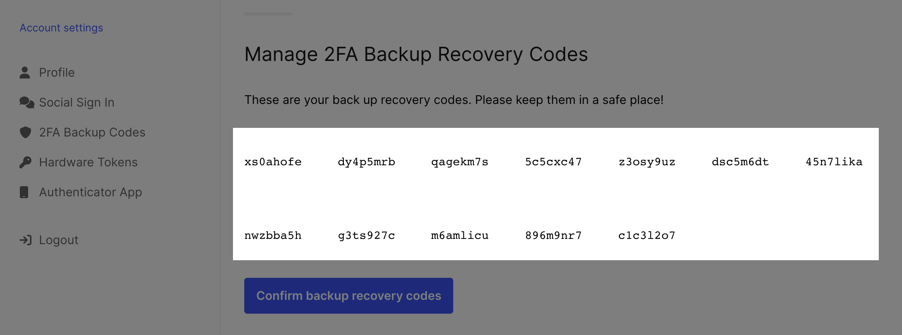

```mdx-code-block
import CodeFromRemote from "@site/src/theme/CodeFromRemote"
import Tabs from "@theme/Tabs"
import TabItem from "@theme/TabItem"
```

## UI payloads

To make UI customization easy, Ory Identities prepares all the necessary data for forms that need to be shown during e.g. login,
registration:

```json5
{
  id: "9b527900-2199-4221-9252-7971b3362282",
  type: "browser",
  expires_at: "2021-04-28T13:55:36.046466067Z",
  issued_at: "2021-04-28T12:55:36.046466067Z",
  ui: {
    action: "https://playground.projects.oryapis.com/self-service/settings?flow=9b527900-2199-4221-9252-7971b3362282",
    method: "POST",
    nodes: [
      {
        type: "input",
        group: "default",
        attributes: {
          node_type: "input",
          name: "csrf_token",
          type: "hidden",
          value: "U3r/lgEfT8rA1Lg0Eeo06oGO8mX6T4TKoe/z7rbInhvYeacbRg0IW9zrqnpU1wmQJXKiekNzdLnypx5naHXoPg==",
          required: true,
          disabled: false,
        },
        messages: null,
        meta: {},
      },
      {
        type: "input",
        group: "profile",
        attributes: {
          node_type: "input",
          name: "traits.email",
          type: "email",
          value: "foo@ory.com",
          disabled: false,
        },
        messages: null,
        meta: {
          label: {
            id: 1070002,
            text: "E-Mail",
            type: "info",
          },
        },
      },
      // ...
    ],
  },
}
```

The above example would be rendered in HTML like this:

```html
<form
  method="POST"
  action="https://playground.projects.oryapis.com/self-service/settings?flow=9b527900-2199-4221-9252-7971b3362282"
>
  <!-- this is the first node -->
  <input
    type="hidden"
    name="csrf_token"
    value="U3r/lgEfT8rA1Lg0Eeo06oGO8mX6T4TKoe/z7rbInhvYeacbRg0IW9zrqnpU1wmQJXKiekNzdLnypx5naHXoPg=="
    required
  />

  <!-- this is the second node -->
  <input type="email" name="traits.email" value="foo@ory.com" />
  <label for="traits.email">E-Mail</label>
</form>
```

As you can see, the JSON can be mapped almost 1:1 to HTML! This method makes it easy for you to implement complex forms without
having to deal with state management, form validation, and more!

## UI node groups

Nodes are grouped (using the `group` key) based on the source that generated the node. Sources are the different methods such as
"password" ("Sign in/up with ID & password"), "oidc" (Social Sign In), "link" (Password reset and email verification), "profile"
("Update your profile") and the "default" group which typically contains the CSRF token.

You can use the node group to filter out items, re-arrange them, render them differently - up to you!

## UI node types

UI Nodes can have several types!

### UI script nodes

The `script` node type is primarily used to load required scripts for WebAuthn!

```json
{
  "type": "script",
  "group": "webauthn",
  "attributes": {
    "src": "http://localhost:4455/.well-known/ory/webauthn.js",
    "async": true,
    "referrerpolicy": "no-referrer",
    "crossorigin": "anonymous",
    "integrity": "sha512-E3ctShTQEYTkfWrjztRCbP77lN7L0jJC2IOd6j8vqUKslvqhX/Ho3QxlQJIeTI78krzAWUQlDXd9JQ0PZlKhzQ==",
    "type": "text/javascript",
    "id": "webauthn_script",
    "node_type": "script"
  },
  "messages": [],
  "meta": {}
}
```

For single-page apps, you might need a different set up to load the script asynchronously. In React.js you might want to do
something like the following:

<CodeFromRemote
  lang="tsx"
  title="https://github.com/ory/kratos-react-nextjs-ui/blob/master/pkg/ui/NodeScript.tsx"
  src="https://raw.githubusercontent.com/ory/kratos-react-nextjs-ui/master/pkg/ui/NodeScript.tsx"
/>

### UI image nodes

Nodes of type `img` are used as QR codes, for example.

```json
{
  "type": "img",
  "group": "totp",
  "attributes": {
    "src": "data:image/png;base64,iVBORw0KGgoAAAANSUhEUgAAAQAAAAEAEAAAAAApiSv5AAAHP0lEQVR4nOyd0Y4kOwoFt1fz/7989+1mSWORUJzMXikinkbdZZuuOUIIDP7zzz//ETD//W0D5HdRAHAUABwFAOfP9c+fn8SG86DyOvdae/pZd5faqvlp8+9lvku94mTphs/T9ABwFAAcBQBHAcD5c/rhJpDr/vY6Y5OL7AaLm9CvG4LVFtS7ZALNmvMZegA4CgCOAoCjAOAcg8CLTdhTh36bzF3mc7XN9YrTb7t/0fxbq9n8H+kB8CgAOAoAjgKAcxMEPkc3k7Up0J5Cunlwt7G0tqpe+85tTT0AHAUARwHAUQBwXgkC56Xa7m8zNwY3Ocsu3V3ebtTRA8BRAHAUABwFAOcmCEyHJPMWjE0hd57XOxV3N+Xb7t87zzte7P6P9ABwFAAcBQBHAcA5BoGZ3NeczI3BTbPI5oxMk0rXvtT/kR4AjgKAowDgKAA4P8+VH7t337q7vNtFXPPczcKTLU+WiPUAcBQAHAUARwHA+elmt7psZuRtLEj33M7L1Zlz5xbMd/lEDwBHAcBRAHAUAJxjJnDTqjG/15dp7qhPm1uQDrcyBeT63G/O0APAUQBwFAAcBQBnlQl8LtxKj2/OjH7OFIu79p3ID8fWA8BRAHAUABwFAOejMeS5GXnz4u6mKaI7SmYTwqaDynQHcv8WoR4AjgKAowDgKAA4N+XgE8/lyDI7n9i9qjFlU0rOlNP7ZXc9ABwFAEcBwFEAcL4YFr3JkT3X8Zq5bZhua6nPSAfC3zTW6AHgKAA4CgCOAoDzRWPIcZtwvi4zDqZLpnGla8tzbTLflKb1AHAUABwFAEcBwLmZE7jJbmUeXnsuKMqMdO7ud9q5u0umH9tysBxQAHAUABwFAOfmxZA6mHhjxmDXvnmQ2n0xJEN6xmDqPRE9ABwFAEcBwFEAcD6CwOe6W7u71D/LjG+eMw9wNw/S1Z/rfuP9tXoAOAoAjgKAowDgHDOB8/HDm1l/tQVd+2oyc/g2Idhpl9qCeud6rSNipIkCgKMA4CgAODfl4C7pAS2bu4iZQG5OZrLgvNv4tLaPHgCOAoCjAOAoADjHF0MuMm0Z87U1mUzlab+TVfPTTrvMz+2ysV4PgEcBwFEAcBQAnJty8MV8Wt5pbbcFI93NO1+bKbxudskUve0OlhIFAEcBwFEAcG5GxHx8cDHm5WIToG12/q3ZgZt8Ytrm0+f0AHgUABwFAEcBwPmiO3gTvs07gTOvfpx2rndJ3/DrWnBi/j2bCZQmCgCOAoCjAOB8BIGbHNRm5l66ASLdMbzJ4XUD60yo+004qAeAowDgKAA4CgDOTSYw81pGN9fXHUhdk7E5c5uvXjsnM1jnEz0AHAUARwHAUQBwbt4OvsjcVZufMQ/pMvfrTjtfbM6Yj4jp8k0mVQ8ARwHAUQBwFACc44iYTGDzxhy+2oKa+ZiXzBCYOZvO53oXPQAeBQBHAcBRAHBWmcBNGLV5Y+S5oOi5qX+ZppKab3bRA8BRAHAUABwFAOcmE/jxwfCrH0djVn2uPQs2f2VNuo/5nZdP9ABwFAAcBQBHAcA5Dou+2OTr6v265dvN7cB5AJkpB/9+R3PfFj0AHAUARwHAUQBw2sOiP5aMA8P6c/WKE5ky9Kbl5PTbzbmb72+XWdQDwFEAcBQAHAUA5yYT2OW5YnG6l7Ye6TIf/ZIJQ08ruufu0APAUQBwFAAcBQDnGASmi6eb+2ubcmt3aHO9y/zc/DS/vy1I3RPUA8BRAHAUABwFAOcYBGYm43VXZF7BqJmXg9O39DZl6K4F89/qAfAoADgKAI4CgNN+MSRTHq3XdtmEkvNbepuwcf5Xzr/TTTldD4BHAcBRAHAUAJzjiJiLTHk03SixybmlS9jPjZy5eG6Mjx4AjwKAowDgKAA4H5nATXm0DlO6+bDNjcHuYJhNeXk+xzCTd+yeVn/ujB4AjgKAowDgKAA47e7geeNFOk9Yr+jud7Jl3lCRHj6dzif2C+Z6ADgKAI4CgKMA4LSfjbvYlIg3Jef/z1mE3Z3TkwA3VhkEyr8oADgKAI4CgHPTGHLxXO/rfG1NZr/fCj7nBeldj7EeAI4CgKMA4CgAOMc7gXPemP+Xvv9XW5UJ/bo8Z/MdegA4CgCOAoCjAOC0M4Fd5u0g9S6bECczn7AOOd8YTdO1+YTlYClRAHAUABwFAKc9LLpmHrA8V/qtrTpZ0D2jXpsenX0ik3f8RA8ARwHAUQBwFACcm+7gN0KSzMsYXea7zHNz9c82K7r0V+gB4CgAOAoAjgKA0x4Rk2F+u20TKGWKyrWlXeal5E22sY8eAI4CgKMA4CgAOK8EgZmhzZvZfJnpe+mw7I0XTe7QA8BRAHAUABwFAOcmCHyjY3j+Xkf6gbY3epu7n8vn+v5ea2OI/IsCgKMA4CgAOMcgMH37LvN42uaOXIb5gOZ5SDd/IaX+nM/GSYkCgKMA4CgAOMcXQ4SDHgCOAoCjAOAoADgKAM7/AgAA//9RrYZOnxsHAQAAAABJRU5ErkJggg==",
    "id": "totp_qr",
    "width": 256,
    "height": 256,
    "node_type": "img"
  },
  "messages": [],
  "meta": {
    "label": {
      "id": 1050005,
      "text": "Authenticator app QR code",
      "type": "info"
    }
  }
}
```

```mdx-code-block
import BrowserWindow from "@site/src/theme/BrowserWindow"

<BrowserWindow url="https://playground.projects.oryapis.com/ui">


</BrowserWindow>
```

Here is an example of implementing an `img` node in React.js:

<CodeFromRemote
  lang="tsx"
  title="https://github.com/ory/kratos-react-nextjs-ui/blob/master/pkg/ui/NodeImage.tsx"
  src="https://raw.githubusercontent.com/ory/kratos-react-nextjs-ui/master/pkg/ui/NodeImage.tsx"
/>

### UI text nodes

Nodes of type `text` are commonly used to display secrets (e.g. lookup secrets).

```mdx-code-block
<BrowserWindow url="https://playground.projects.oryapis.com/ui">



</BrowserWindow>
```

```mdx-code-block
<BrowserWindow url="https://playground.projects.oryapis.com/ui">


</BrowserWindow>
```

Their JSON usually contains a bit of contextual information.

<Tabs
  defaultValue="totp"
  values={[
    {label: 'TOTP Example', value: 'totp'},
    {label: 'Lookup Secret Example', value: 'lookup'},
  ]}>
  <TabItem value="totp">

```json
{
  "type": "text",
  "group": "totp",
  "attributes": {
    "text": {
      "id": 1050006,
      "text": "GLAS5YHAJ6V5LT3N7AU2R4AWU6SYOCHS",
      "type": "info",
      "context": {
        "secret": "GLAS5YHAJ6V5LT3N7AU2R4AWU6SYOCHS"
      }
    },
    "id": "totp_secret_key",
    "node_type": "text"
  },
  "messages": [],
  "meta": {
    "label": {
      "id": 1050006,
      "text": "This is your authenticator app secret. Use it if you can not scan the QR code.",
      "type": "info"
    }
  }
}
```

  </TabItem>
  <TabItem value="lookup">

```json
{
  "type": "text",
  "group": "lookup_secret",
  "attributes": {
    "text": {
      "id": 1050015,
      "text": "8qhkibka, 4m4m0l81, xh7ji7xk, cgi8xfwa, uim1dztu, 1jsjkk2i, 3nw4o5fr, lg77u7rr, hhwmz3rx, kx1cx840, thc7xl8t, osgqai15",
      "type": "info",
      "context": {
        "secrets": [
          {
            "id": 1050009,
            "text": "8qhkibka",
            "type": "info",
            "context": {
              "secret": "8qhkibka"
            }
          },
          {
            "id": 1050009,
            "text": "4m4m0l81",
            "type": "info",
            "context": {
              "secret": "4m4m0l81"
            }
          },
          {
            "id": 1050009,
            "text": "xh7ji7xk",
            "type": "info",
            "context": {
              "secret": "xh7ji7xk"
            }
          },
          {
            "id": 1050009,
            "text": "cgi8xfwa",
            "type": "info",
            "context": {
              "secret": "cgi8xfwa"
            }
          },
          {
            "id": 1050009,
            "text": "uim1dztu",
            "type": "info",
            "context": {
              "secret": "uim1dztu"
            }
          },
          {
            "id": 1050009,
            "text": "1jsjkk2i",
            "type": "info",
            "context": {
              "secret": "1jsjkk2i"
            }
          },
          {
            "id": 1050009,
            "text": "3nw4o5fr",
            "type": "info",
            "context": {
              "secret": "3nw4o5fr"
            }
          },
          {
            "id": 1050009,
            "text": "lg77u7rr",
            "type": "info",
            "context": {
              "secret": "lg77u7rr"
            }
          },
          {
            "id": 1050009,
            "text": "hhwmz3rx",
            "type": "info",
            "context": {
              "secret": "hhwmz3rx"
            }
          },
          {
            "id": 1050009,
            "text": "kx1cx840",
            "type": "info",
            "context": {
              "secret": "kx1cx840"
            }
          },
          {
            "id": 1050009,
            "text": "thc7xl8t",
            "type": "info",
            "context": {
              "secret": "thc7xl8t"
            }
          },
          {
            "id": 1050009,
            "text": "osgqai15",
            "type": "info",
            "context": {
              "secret": "osgqai15"
            }
          }
        ]
      }
    },
    "id": "lookup_secret_codes",
    "node_type": "text"
  },
  "messages": [],
  "meta": {
    "label": {
      "id": 1050010,
      "text": "These are your back up recovery codes. Please keep them in a safe place!",
      "type": "info"
    }
  }
}
```

  </TabItem>
</Tabs>

Rendering the text component is usually a bit more complex, as you most likely want a bit of custom formatting. By the way, you
can find an overview of all message IDs used here in the conditionals at the end of this page!

In React.js, you will most likely find similar if statements on the message IDs.

<CodeFromRemote
  lang="tsx"
  title="https://github.com/ory/kratos-react-nextjs-ui/blob/master/pkg/ui/NodeText.tsx"
  src="https://raw.githubusercontent.com/ory/kratos-react-nextjs-ui/master/pkg/ui/NodeText.tsx"
/>

### UI input nodes

The most common node type is the `input` type. In general, it represents an HTML `<input>` field:

```json
{
  "type": "input",
  "group": "default",
  "attributes": {
    "name": "csrf_token",
    "type": "hidden",
    "node_type": "input",
    "value": "U3r/lgEfT8rA1Lg0Eeo06oGO8mX6T4TKoe/z7rbInhvYeacbRg0IW9zrqnpU1wmQJXKiekNzdLnypx5naHXoPg==",
    "required": true,
    "disabled": false
  },
  "messages": null,
  "meta": {}
}
```

An `input` node itself has a type as well. These types are taken from HTML:

- `text`
- `password`
- `number`
- `checkbox`
- `hidden`
- `email`
- `submit`
- `button`
- `datetime-local`
- `date`
- `url`

#### Checkbox input node

Checkboxes are primarily used when an Identity Schema field is of `"type": "boolean"`. The following Identity Schema

```json5
{
  $schema: "http://json-schema.org/draft-07/schema#",
  type: "object",
  properties: {
    traits: {
      type: "object",
      properties: {
        // ...
        tos: {
          title: "Accept Terms of Service",
          type: "boolean",
        },
        // ...
      },
      // ...
    },
  },
}
```

would result in such a checkbox node:

```json
{
  "type": "input",
  "group": "profile",
  "attributes": {
    "name": "traits.tos",
    "type": "checkbox",
    "disabled": false,
    "node_type": "input"
  },
  "messages": [],
  "meta": {
    "label": {
      "id": 1070002,
      "text": "Accept Terms of Service",
      "type": "info"
    }
  }
}
```

When using plain HTML and not a single page app, the best option you have is to use two input fields - one hidden and one a
checkbox - with `false` and `true` respectively. Make sure that the checkbox input field is second as it needs to override the
hidden field, if set.

<CodeFromRemote
  lang="pug"
  title="https://github.com/ory/kratos-selfservice-ui-node/blob/v1.0.0/views/partials/ui_node_input_checkbox.hbs"
  src="https://raw.githubusercontent.com/ory/kratos-selfservice-ui-node/v1.0.0/views/partials/ui_node_input_checkbox.hbs"
/>

In single page apps, such as React.js, this trickery is not needed as you have full control over the form's state:

<CodeFromRemote
  lang="tsx"
  title="https://github.com/ory/kratos-react-nextjs-ui/blob/master/pkg/ui/NodeInputCheckbox.tsx"
  src="https://raw.githubusercontent.com/ory/kratos-react-nextjs-ui/master/pkg/ui/NodeInputCheckbox.tsx"
/>

#### Button input node

Buttons are primarily used to trigger something, which is why it is important to have the `onclick` attribute handled. If
`onclick` exists, you will also find a `script` node:

```json
[
  {
    "type": "input",
    "group": "webauthn",
    "attributes": {
      "name": "webauthn_register_trigger",
      "type": "button",
      "value": "",
      "disabled": false,
      "onclick": "window.__oryWebAuthnRegistration({\"publicKey\":{\"challenge\":\"SOaWrZE4unW3cC57ED52HRnHwd22Fcg8DNf0zf9Jgr0=\",\"rp\":{\"name\":\"Ory\",\"id\":\"localhost\"},\"user\":{\"name\":\"placeholder\",\"icon\":\"https://via.placeholder.com/128\",\"displayName\":\"placeholder\",\"id\":\"q7MFvGN9TzqDTIgEIvkjZw==\"},\"pubKeyCredParams\":[{\"type\":\"public-key\",\"alg\":-7},{\"type\":\"public-key\",\"alg\":-35},{\"type\":\"public-key\",\"alg\":-36},{\"type\":\"public-key\",\"alg\":-257},{\"type\":\"public-key\",\"alg\":-258},{\"type\":\"public-key\",\"alg\":-259},{\"type\":\"public-key\",\"alg\":-37},{\"type\":\"public-key\",\"alg\":-38},{\"type\":\"public-key\",\"alg\":-39},{\"type\":\"public-key\",\"alg\":-8}],\"authenticatorSelection\":{\"requireResidentKey\":false,\"userVerification\":\"preferred\"},\"timeout\":60000}})",
      "node_type": "input"
    },
    "messages": [],
    "meta": {
      "label": {
        "id": 1050012,
        "text": "Add security key",
        "type": "info"
      }
    }
  },
  {
    "type": "script",
    "group": "webauthn",
    "attributes": {
      "src": "http://localhost:4455/.well-known/ory/webauthn.js",
      "async": true,
      "referrerpolicy": "no-referrer",
      "crossorigin": "anonymous",
      "integrity": "sha512-E3ctShTQEYTkfWrjztRCbP77lN7L0jJC2IOd6j8vqUKslvqhX/Ho3QxlQJIeTI78krzAWUQlDXd9JQ0PZlKhzQ==",
      "type": "text/javascript",
      "id": "webauthn_script",
      "node_type": "script"
    },
    "messages": [],
    "meta": {}
  }
]
```

In a single page application, we need a bit of trickery as we are executing JavaScript from a JSON source in JavaScript - which
essentially means we need to execute `eval`. Fortunately, this is only needed in this special case. If you do not use WebAuthn,
you will not need `eval` at all!

<CodeFromRemote
  lang="tsx"
  title="https://github.com/ory/kratos-react-nextjs-ui/blob/master/pkg/ui/NodeInputButton.tsx"
  src="https://raw.githubusercontent.com/ory/kratos-react-nextjs-ui/master/pkg/ui/NodeInputButton.tsx"
/>

#### Submit input node

Submit buttons trigger the form submission. If you have control over the form's payload, like in React.js, you need to ensure that
the name of the form (e.g. `method`) is only submitted once with the correct value (e.g. `password`). Because in some cases Ory
Identities might generate multiple submit buttons with the same `name` attribute.

```json5
[
  {
    type: "input",
    group: "profile",
    attributes: {
      name: "method",
      type: "submit",
      value: "profile",
      disabled: false,
      node_type: "input",
    },
    messages: [],
    meta: {
      label: {
        id: 1070003,
        text: "Save",
        type: "info",
      },
    },
  },
  // ...
  {
    type: "input",
    group: "password",
    attributes: {
      name: "method",
      type: "submit",
      value: "password",
      disabled: false,
      node_type: "input",
    },
    messages: [],
    meta: {
      label: {
        id: 1070003,
        text: "Save",
        type: "info",
      },
    },
  },
]
```

You need to ensure that the correct value for the `name` is submitted, or the user might end up updating their password instead of
their email address!

<CodeFromRemote
  lang="tsx"
  title="https://github.com/ory/kratos-react-nextjs-ui/blob/master/pkg/ui/NodeInputSubmit.tsx"
  src="https://raw.githubusercontent.com/ory/kratos-react-nextjs-ui/master/pkg/ui/NodeInputSubmit.tsx"
/>

#### Hidden input node

Hidden input fields such as the `csrf_token`

```json5
{
  type: "input",
  group: "default",
  attributes: {
    name: "csrf_token",
    type: "hidden",
    value: "By8X7TPnn/NMtXeDpK6sbshISK3t1WnezAtlMnFA6ZPsxxNmRsG8ks7WpsHMQtTLbxtqKJOiu4aArJok6/GOSw==",
    required: true,
    disabled: false,
    node_type: "input",
  },
  messages: [],
  meta: {},
}
```

For example in a single page apps like React.js

<CodeFromRemote
  lang="tsx"
  title="https://github.com/ory/kratos-react-nextjs-ui/blob/master/pkg/ui/NodeInputHidden.tsx"
  src="https://raw.githubusercontent.com/ory/kratos-react-nextjs-ui/master/pkg/ui/NodeInputHidden.tsx"
/>

#### Default input node rendering

You do not need to have one view for every node type. Instead, you can "fall back" to a default implementation. The most important
node types (`hidden`, `submit`, `button`, `checkbox`) we already covered!

Here are some examples for you to get a feeling for possible payloads!

<Tabs
  defaultValue="email"
  values={[
    {label: 'Email', value: 'email'},
    {label: 'URL', value: 'url'},
    {label: 'Number', value: 'number'},
    {label: 'Text', value: 'text'},
  ]}>
<TabItem value="email">

```json
{
  "type": "input",
  "group": "profile",
  "attributes": {
    "name": "traits.email",
    "type": "email",
    "value": "foo@ory.com",
    "disabled": false
  },
  "messages": null,
  "meta": {
    "label": {
      "id": 1070002,
      "text": "E-Mail",
      "type": "info"
    }
  }
}
```

</TabItem>
<TabItem value="url">

```json
{
  "type": "input",
  "group": "profile",
  "attributes": {
    "name": "traits.website",
    "type": "url",
    "value": "https://www.ory.com/",
    "required": true,
    "disabled": false,
    "node_type": "input"
  },
  "messages": [],
  "meta": {
    "label": {
      "id": 1070002,
      "text": "Your website",
      "type": "info"
    }
  }
}
```

</TabItem>
<TabItem value="number">

```json
{
  "type": "input",
  "group": "profile",
  "attributes": {
    "name": "traits.age",
    "type": "number",
    "disabled": false,
    "node_type": "input"
  },
  "messages": [],
  "meta": {
    "label": {
      "id": 1070002,
      "text": "Age",
      "type": "info"
    }
  }
}
```

</TabItem>
<TabItem value="text">

```json
{
  "type": "input",
  "group": "profile",
  "attributes": {
    "name": "traits.name",
    "type": "text",
    "disabled": false,
    "node_type": "input"
  },
  "messages": [],
  "meta": {
    "label": {
      "id": 1070002,
      "text": "Name",
      "type": "info"
    }
  }
}
```

</TabItem>
</Tabs>

## Node order and labels

For all traits, the labels and orders are taken from the Identity Schema. An Identity Schema such as

```json
{
  "$id": "https://schemas.ory.com/presets/kratos/quickstart/email-password/identity.schema.json",
  "$schema": "http://json-schema.org/draft-07/schema#",
  "title": "Person",
  "type": "object",
  "properties": {
    "traits": {
      "type": "object",
      "properties": {
        "email": {
          "type": "string",
          "format": "email",
          "title": "E-Mail",
          "minLength": 3,
          "ory.com/kratos": {
            "credentials": {
              "password": {
                "identifier": true
              }
            }
          }
        },
        "website": {
          "title": "Website",
          "type": "string",
          "format": "uri",
          "minLength": 10
        },
        "consent": {
          "title": "Consent",
          "const": true
        },
        "newsletter": {
          "title": "Newsletter",
          "type": "boolean"
        }
      },
      "required": ["email", "website"],
      "additionalProperties": false
    }
  }
}
```

will generate the following fields - take note that the order of the JSON Schema affects the order of the nodes:

```json
[
  {
    "type": "input",
    "group": "profile",
    "attributes": {
      "name": "traits.email",
      "type": "email",
      "value": "foo@ory.com",
      "disabled": false
    },
    "messages": null,
    "meta": {
      "label": {
        "id": 1070002,
        "text": "E-Mail",
        "type": "info"
      }
    }
  },
  {
    "type": "input",
    "group": "profile",
    "attributes": {
      "name": "traits.name.first",
      "type": "text",
      "value": "Foo",
      "disabled": false
    },
    "messages": null,
    "meta": {
      "label": {
        "id": 1070002,
        "text": "First Name",
        "type": "info"
      }
    }
  },
  {
    "type": "input",
    "group": "profile",
    "attributes": {
      "name": "traits.name.last",
      "type": "text",
      "value": "Bar",
      "disabled": false
    },
    "messages": null,
    "meta": {
      "label": {
        "id": 1070002,
        "text": "Last Name",
        "type": "info"
      }
    }
  },
  {
    "type": "input",
    "group": "profile",
    "attributes": {
      "name": "method",
      "type": "submit",
      "value": "profile",
      "disabled": false
    },
    "messages": null,
    "meta": {
      "label": {
        "id": 1070003,
        "text": "Save",
        "type": "info"
      }
    }
  }
]
```

Generally, submit buttons are the last node in a group. If you wish to have more flexibility with regards to order or labeling the
best option is to implement this in your UI using map, filter, and other JSON transformation functions.

## Titles, Labels & Validation Messages

Ory Identities helps users understand what is happening by providing messages that explain what went wrong or what needs to be
done. Examples are "The provided credentials are invalid", "Missing property email" and similar.

Typically login, registration, settings, ... flows include such messages on different levels:

1. At the root level, indicating that the message affects the whole request (e.g. request expired)
2. At the method (password, oidc, profile) level, indicating that the message affects a specific method / form.
3. At the field level, indicating that the message affects a form field (e.g. validation errors).

Each message has a layout of:

```json5
{
  id: 1234,
  // This ID will not change and can be used to translate the message or use your own message content.
  text: "Some default text",
  // A default text in english that you can display if you do not want to customize the message.
  context: {},
  // A JSON object which may contain additional fields such as `expires_at`. This is helpful if you want to craft your own messages.
}
```

The message ID is a 7-digit number (`xyyzzzz`) where

- `x` is the message type which is either `1` for an info message (e.g. `1020000`), `4` (e.g. `4020000`) for an input validation
  error message, and `5` (e.g. `5020000`) for a generic error message.
- `yy` is the module or flow this error references and can be:
- `01` for login messages (e.g. `1010000`)
- `02` for logout messages (e.g. `1020000`)
- `03` for multi-factor authentication messages (e.g. `1030000`)
- `04` for registration messages (e.g. `1040000`)
- `05` for settings messages (e.g. `1050000`)
- `06` for account recovery messages (e.g. `1060000`)
- `07` for email/phone verification messages (e.g. `1070000`)
- `zzzz` is the message ID and typically starts at `0001`. For example, message ID `4070001` (`4` for input validation error, `07`
  for verification, `0001` for the concrete message) is:
  `The verification code has expired or was otherwise invalid. Please request another code.`.

## UI Error Codes

When building a single page app, or a native app, Ory Identities will respond with errors in some cases. You can find an exemplary
error handling logic in our React.js reference implementation:

<CodeFromRemote
  lang="tsx"
  title="https://github.com/ory/kratos-react-nextjs-ui/blob/master/pkg/errors.tsx"
  src="https://raw.githubusercontent.com/ory/kratos-react-nextjs-ui/master/pkg/errors.tsx"
/>

## UI message codes

UI Messages are always presented as the following JSON

```json5
{
  id: 1234, // A unique, fixed number
  text: "...",
  type: "...", // Usually "error" or "info"
  context: {
    // Additional, contextual information
  },
}
```

for the values of these fields, please check the list below.

### Machine Readable Format

```mdx-code-block
<CodeFromRemote
  lang="json"
  title="https://github.com/ory/docs/blob/master/docs/kratos/concepts/messages.json"
  src="https://raw.githubusercontent.com/ory/docs/master/docs/kratos/concepts/messages.json"
/>
```

### Human Readable Format

:::note

The section below is auto-generated. Changing it has no effect as any changes will be overwritten!

:::

```mdx-code-block
import HumanReadableMessages from './ui-messages.md';

<HumanReadableMessages />
```
