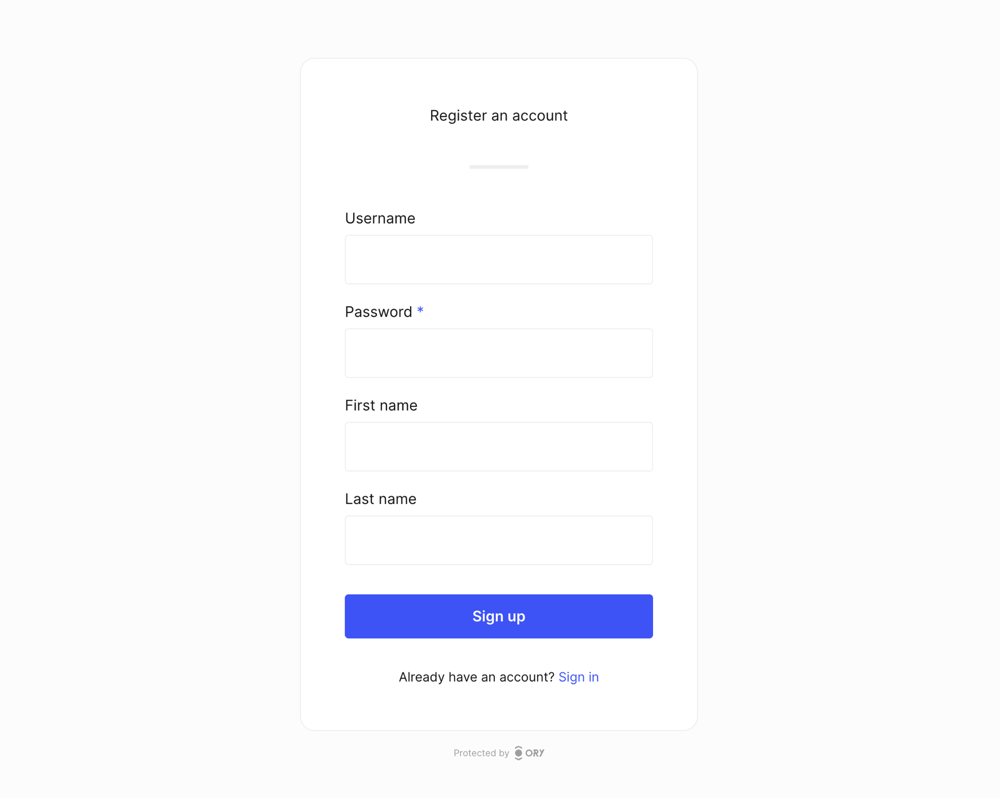
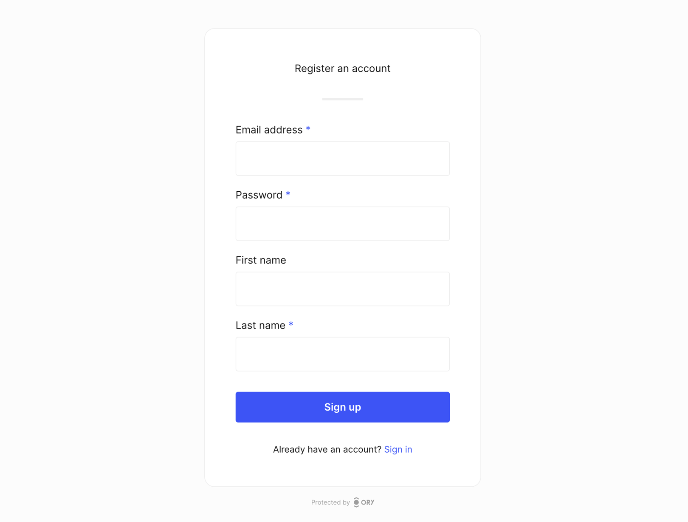
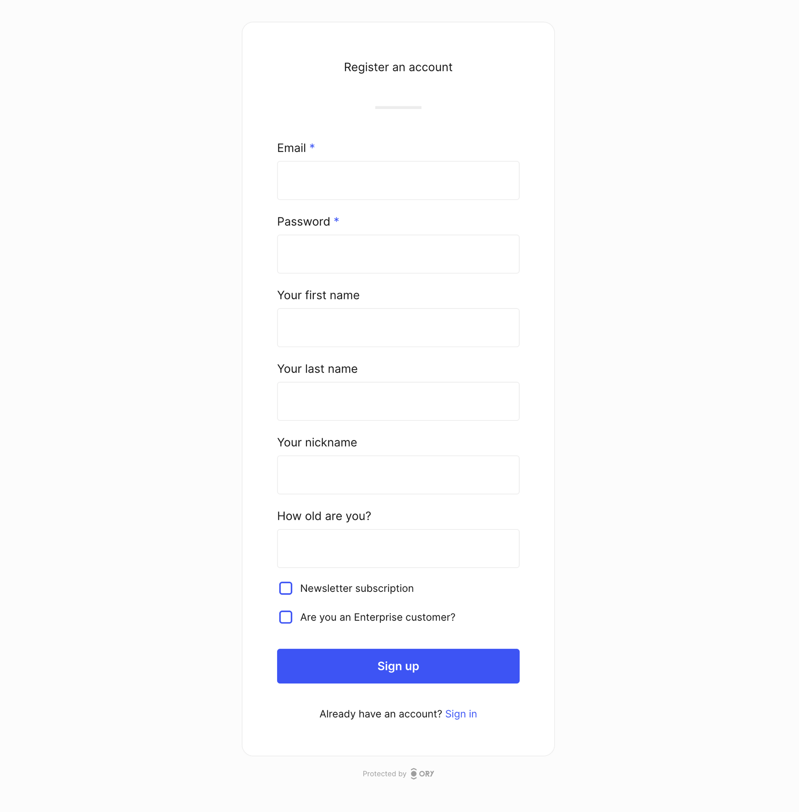

# Customize identity schemas

```mdx-code-block
import Tabs from '@theme/Tabs';
import TabItem from '@theme/TabItem'
```

This document explains how to customize your identity model with a custom identity schema. A custom identity schema allows you to
add custom fields to your identities such as birthday or job title.

It is important to note that throughout this document we use specific `draft-07` features of JSON Schema as shown by the `$schema`
property at the start of every document.

```json5
{
  $schema: "http://json-schema.org/draft-07/schema#",
}
```

Use the [JSON Schema Validator](https://www.jsonschemavalidator.net) to check your identity schema. If you're not familiar with
JSON Schemas, study the [official examples](https://json-schema.org/learn/miscellaneous-examples.html) to get familiar with the
structure.

## Writing your first custom identity schema

This is the minimum viable identity schema:

```json
{
  "$schema": "http://json-schema.org/draft-07/schema#",
  "type": "object",
  "properties": {
    "traits": {
      "type": "object"
    }
  }
}
```

Traits translate into fields presented in the user-facing UI. In the minimum viable identity schema, there are no traits which
means that the UI doesn't present any fields. Let's change that by adding three fields:

- first name
- last name
- username

````mdx-code-block
<Tabs>
<TabItem value="schema" label="Identity schema" default>

```json {7-25}
{
  "$schema": "http://json-schema.org/draft-07/schema#",
  "type": "object",
  "properties": {
    "traits": {
      "type": "object",
      "properties": {
        "username": {
          "title": "Username",
          "type": "string"
        },
        "name": {
          "type": "object",
          "properties": {
            "first": {
              "title": "First name",
              "type": "string"
            },
            "last": {
              "title": "Last name",
              "type": "string"
            }
          }
        }
      }
    }
  }
}
```

</TabItem>
<TabItem value="UI" label="Generated UI">



</TabItem>
</Tabs>
````

To log in, the user needs to provide their ID and password. The identity schema does not yet state which field is the ID used for
login. Let's change that by adding the following schema extension:

```json {11-17}
{
  "$schema": "http://json-schema.org/draft-07/schema#",
  "type": "object",
  "properties": {
    "traits": {
      "type": "object",
      "properties": {
        "username": {
          "title": "Username",
          "type": "string",
          "ory.sh/kratos": {
            "credentials": {
              "password": {
                "identifier": true
              }
            }
          }
        },
        "name": {
          "type": "object",
          "properties": {
            "first": {
              "title": "First name",
              "type": "string"
            },
            "last": {
              "title": "Last name",
              "type": "string"
            }
          }
        }
      }
    }
  }
}
```

Ory supports all JSON Schema types (`string`, `number`, `integer`, `boolean`, `object`). Use `string` for text fields, `boolean`
for checkbox fields, and `integer` or `number` for integral or floating-point numbers. If you want to know more about these types,
read the the [JSON Schema documentation](https://json-schema.org/understanding-json-schema/reference/type.html).

:::info

Avoid complex identity schemas and use the identity schema for basic profile information. The more complex the schema, the more
difficult it is to introduce changes in the future. Complex schemas make it difficult to generate user interfaces automatically.

:::

## Custom user interface labels

The `title` property defines the description of the field rendered in the UI. This schema has a field which asks users to provide
their GitHub handle, which is clear thanks to the field description defined in the `title` property.

````mdx-code-block
<Tabs>
<TabItem value="schema" label="Identity schema" default>

```json {29}
{
  "$id": "https://schemas.ory.sh/presets/kratos/identity.basic.schema.json",
  "title": "Person",
  "type": "object",
  "properties": {
    "traits": {
      "type": "object",
      "properties": {
        "email": {
          "type": "string",
          "format": "email",
          "title": "Email",
          "ory.sh/kratos": {
            "credentials": {
              "password": {
                "identifier": true
              }
            },
            "recovery": {
              "via": "email"
            },
            "verification": {
              "via": "email"
            }
          }
        },
        "name": {
          "type": "string",
          "title": "What's your GitHub handle?"
        }
      }
    }
  },
  "required": [
    "email"
  ],
  "additionalProperties": false
}
```

</TabItem>
<TabItem value="UI" label="Generated UI">


</TabItem>
</Tabs>
````

## Identity schema extensions

Because the system doesn't know which fields have system-relevant meaning, you have to specify that in the schema. For example:

- This email address should be used for recovering a lost password.
- This identifier (username or email) should be used for logging in with a password.
- This is the phone number used for SMS 2FA.

The vocabulary extension can be used within a property. Let's take a look at the email identity schema preset. It uses all
available identity schema extensions:

```json
{
  "$id": "https://schemas.ory.sh/presets/kratos/identity.email.schema.json",
  "title": "Person",
  "type": "object",
  "properties": {
    "traits": {
      "type": "object",
      "properties": {
        "email": {
          "type": "string",
          "format": "email",
          "title": "E-Mail",
# highlight-start
          "ory.sh/kratos": {
            "credentials": {
              "password": {
                "identifier": true
              },
              "webauthn": {
                "identifier": true
              },
              "totp": {
                "account_name": true
              },
              "code": {
                "identifier": true,
                "via": "email"
              },
              "passkey": {
                "display_name": true
              }
            },
            "recovery": {
              "via": "email"
            },
            "verification": {
              "via": "email"
            }
          },
# highlight-end
          "maxLength": 320
        },
        "phone": {
          "type": "string",
          "format": "tel",
          "title": "Phone number",
          "ory.sh/kratos": {
            "credentials": {
              "password": {
                "identifier": true
              },
              "code": {
                "identifier": true,
                "via": "sms"
              }
            },
            "recovery": {
              "via": "sms"
            },
            "verification": {
              "via": "sms"
            }
          },
          "maxLength": 320
        }
      },
      "required": ["email"],
      "additionalProperties": false
    }
  }
}
```

### Multiple identifiers

It is possible to have multiple identifiers. For example, you could have a username and an email address that the user can use to
sign in:

```json {9-45}
{
  "$id": "https://schemas.ory.sh/presets/kratos/identity.email.schema.json",
  "title": "Person",
  "type": "object",
  "properties": {
    "traits": {
      "type": "object",
      "properties": {
        "username": {
          "type": "string",
          "minLength": 6,
          "title": "Username",
          "ory.sh/kratos": {
            "credentials": {
              "password": {
                "identifier": true
              }
            }
          }
        },
        "email": {
          "type": "string",
          "format": "email",
          "title": "E-Mail",
          "ory.sh/kratos": {
            "credentials": {
              "password": {
                "identifier": true
              },
              "webauthn": {
                "identifier": true
              },
              "totp": {
                "account_name": true
              },
              "code": {
                "identifier": true,
                "via": "email"
              },
              "passkey": {
                "display_name": true
              }
            },
            "recovery": {
              "via": "email"
            },
            "verification": {
              "via": "email"
            }
          },
          "maxLength": 320
        }
      },
      "required": ["email"],
      "additionalProperties": false
    }
  }
}
```

You can also specify an array of elements:

```json
{
  "$id": "https://schemas.ory.sh/presets/kratos/identity.email.schema.json",
  "title": "Person",
  "type": "object",
  "properties": {
    "traits": {
      "type": "object",
      "properties": {
        "emails": {
          "type": "array",
          "items": [
            {
              "type": "string",
              "format": "email",
              "title": "E-Mail",
              "ory.sh/kratos": {
                "credentials": {
                  "password": {
                    "identifier": true
                  },
                  "webauthn": {
                    "identifier": true
                  },
                  "totp": {
                    "account_name": true
                  },
                  "passkey": {
                    "display_name": true
                  },
                  "code": {
                    "identifier": true,
                    "via": "email"
                  }
                },
                "recovery": {
                  "via": "email"
                },
                "verification": {
                  "via": "email"
                }
              },
              "maxLength": 320
            }
          ]
        }
      },
      "required": ["email"],
      "additionalProperties": false
    }
  }
}
```

### Password login identifier

You can configure Ory Identities to use specific fields as the identity's identifier. In this example, the `password` is set as
the identifier:

```json
{
  "ory.sh/kratos": {
    "credentials": {
      "password": {
        "identifier": true
      }
    }
  }
}
```

#### Email

Let's assume the identity's traits are

```yaml
traits:
  # These are just examples
  email: office@ory.com
  name:
    first: Aeneas
    last: Rekkas
  favorite_animal: Dog
  accepted_tos: true
```

and we are using a JSON Schema that uses the `email` field as the identifier for the password flow:

```json
{
  "$id": "http://mydomain.com/schemas/v2/customer.schema.json",
  "$schema": "http://json-schema.org/draft-07/schema#",
  "title": "A customer (v2)",
  "type": "object",
  "properties": {
    "traits": {
      "type": "object",
      "properties": {
        "email": {
          "title": "E-Mail",
          "type": "string",
          "format": "email",

          // This tells Ory Identities that the field should be used as the "username" for the username and password flow.
          "ory.sh/kratos": {
            "credentials": {
              "password": {
                "identifier": true
              }
            }
          }
        },
        "name": {
          "type": "object",
          "properties": {
            "first": {
              "title": "First Name",
              "type": "string"
            },
            "last": {
              "title": "Last Name",
              "type": "string"
            }
          }
        },
        "favorite_animal": {
          "title": "Favourite Animal",
          "type": "string"
        },
        "accepted_tos": {
          "title": "Terms of Service",
          "type": "boolean"
        }
      },
      "required": ["email"],
      "additionalProperties": false
    }
  }
}
```

In this example, Ory understands that `traits.email='office@ory.com'` is the identifier for this identity. The system must get
`office@ory.com` and a password to sign in an user.

[Username and Password Credentials](../../kratos/concepts/credentials/username-email-password) contains more information and
examples about credentials usage.

Note that the `format` field of the identity schema will perform validation of the given trait. In this example, the email address
is validated using the [JSON Schema](https://json-schema.org/understanding-json-schema/reference/string.html#email-addresses) rule
set.

#### Phone number

Let's extend the identity schema from the previous chapter with a phone number:

```json
{
  "$id": "http://mydomain.com/schemas/v2/customer.schema.json",
  "$schema": "http://json-schema.org/draft-07/schema#",
  "title": "A customer (v2)",
  "type": "object",
  "properties": {
    "traits": {
      "type": "object",
      "properties": {
        "email": {
          "title": "E-Mail",
          "type": "string",
          "format": "email",

          // This tells Ory Identities that the field should be used as the "username" for the Username and Password Flow.
          "ory.sh/kratos": {
            "credentials": {
              "password": {
                "identifier": true
              }
            }
          }
        },
        "phone": {
          "title": "Phone",
          "type": "string",
          "format": "tel",

          // The phone number is marked as an identifier. This allows the user to log in with both email and phone number.
          "ory.sh/kratos": {
            "credentials": {
              "password": {
                "identifier": true
              }
            }
          }
        },
        "name": {
          "type": "object",
          "properties": {
            "first": {
              "title": "First Name",
              "type": "string"
            },
            "last": {
              "title": "Last Name",
              "type": "string"
            }
          }
        },
        "favorite_animal": {
          "title": "Favourite Animal",
          "type": "string"
        },
        "accepted_tos": {
          "title": "Terms of Service",
          "type": "boolean"
        }
      },
      "required": ["email"],
      "additionalProperties": false
    }
  }
}
```

By using the `"format": "tel"` field we enable validation of phone numbers using the Golang
[port](https://github.com/nyaruka/phonenumbers) of Google's [libphonenumber](https://github.com/google/libphonenumber).

Using the following identity schema extension we specify that the field is used as the "ID" when signing in using a password:

```json
{
  "ory.sh/kratos": {
    "credentials": {
      "password": {
        "identifier": true
      }
    }
  }
}
```

### Passkey display name

Using the following identity schema extension we specify that the field is used as the display name for PassKeys:

```json
{
  "ory.sh/kratos": {
    "credentials": {
      "passkey": {
        "display_name": true
      }
    }
  }
}
```

### Passwordless one-time code login identifier

Using the following identity schema extension we specify that the field is used as the "ID" when using passwordless one-time code
login:

````mdx-code-block
<Tabs>
<TabItem value="email" label="Email">

```json
{
  "ory.sh/kratos": {
    "credentials": {
      "code": {
        "identifier": true,
        "via": "email",
      }
    }
  }
}
```

</TabItem>
<TabItem value="sms" label="SMS">

```json
{
  "ory.sh/kratos": {
    "credentials": {
      "code": {
        "identifier": true,
        "via": "sms",
      }
    }
  }
}
```

</TabItem>
</Tabs>
````

### Google Authenticator (TOTP) display name

The following identity schema extension specifies that this field should be displayed in the Authenticator App as the account
name:

```json
{
  "ory.sh/kratos": {
    "credentials": {
      "totp": {
        "account_name": true
      }
    }
  }
}
```

### Passwordless WebAuthn login identifier

:::note

Please use the PassKey method instead. This is documented for legacy reasons.

:::

Using the following identity schema extension we specify that the field is used as the "ID" when using passwordless WebAuthn
login:

```json
{
  "ory.sh/kratos": {
    "credentials": {
      "webauthn": {
        "identifier": true
      }
    }
  }
}
```

### Verification address

Specifies that the field is verifiable by sending an email with a verification code or link.

````mdx-code-block
<Tabs>
<TabItem value="email" label="Email">

```json
{
  "ory.sh/kratos": {
    "recovery": {
      "via": "email"
    }
  }
}
```

</TabItem>
<TabItem value="sms" label="SMS">

```json
{
  "ory.sh/kratos": {
    "recovery": {
      "via": "sms"
    }
  }
}
```

</TabItem>
</Tabs>
````

### Recovery address

Specifies that the field can be used to send an account recovery code or link.

````mdx-code-block
<Tabs>
<TabItem value="email" label="Email">

```json
{
  "ory.sh/kratos": {
    "recovery": {
      "via": "email"
    }
  }
}
```

</TabItem>
<TabItem value="sms" label="SMS">

```json
{
  "ory.sh/kratos": {
    "recovery": {
      "via": "sms"
    }
  }
}
```

</TabItem>
</Tabs>
````

## Mandatory fields for registration

Use `required` to define which identity schema fields users must fill in during registration. When users try to register without
filling in the mandatory fields, Ory Account Experience shows a message that tells users they must provide the mandatory
information to proceed. Additionally, required fields are marked with an asterisk for easy visual identification.

The sample identity schema has two mandatory fields: email address and last name.

:::note

For nested objects such as `name`, add the `required` property inside of the object.

:::

````mdx-code-block
<Tabs>
<TabItem value="schema" label="Identity schema" default>

```json
{
  "$id": "https://schemas.ory.sh/presets/kratos/identity.basic.schema.json",
  "title": "Person",
  "type": "object",
  "properties": {
    "traits": {
      "type": "object",
      "properties": {
        "email": {
          "type": "string",
          "format": "email",
          "title": "Email address",
          "ory.sh/kratos": {
            "credentials": {
              "password": {
                "identifier": true
              },
              "webauthn": {
                "identifier": true
              },
              "totp": {
                "account_name": true
              },
              "code": {
                "identifier": true,
                "via": "email"
              },
              "passkey": {
                "display_name": true
              }
            },
            "recovery": {
              "via": "email"
            },
            "verification": {
              "via": "email"
            }
          },
          "maxLength": 320
        },
        "name": {
          "type": "object",
          # highlight-start
          "required": [
            "last"
          ],
          # highlight-end
          "properties": {
            "first": {
              "type": "string",
              "title": "First name",
              "maxLength": 256
            },
            "last": {
              "type": "string",
              "title": "Last name",
              "maxLength": 256
            }
          }
        }
      },
      # highlight-start
      "required": [
        "email"
      ],
      # highlight-end
      "additionalProperties": false
    }
  }
}
```

</TabItem>
<TabItem value="UI" label="Generated UI">



</TabItem>
</Tabs>
````

### More advanced validation

Json schemas are a powerful tool to even do conditional validation.

For example, when a user opts in to receiving security updates it is required to have their phone number as well.

You can read more about using the `definitions` and `dependencies` keywords in the JSON schema
[structuring a complex schema](https://json-schema.org/understanding-json-schema/structuring.html?highlight=definitions) and
[conditional subschemas](https://json-schema.org/understanding-json-schema/reference/conditionals.html#applying-subschemas-conditionally).

Below is an example of how to do this:

```json5
{
  "$id": "https://schemas.ory.sh/presets/kratos/identity.email.schema.json",
  "title": "Person",
  "type": "object",
  # highlight-start
  "definitions": {
    "phone": {
      "type": "string",
      "format": "tel",
      "title": "Phone Number"
    },
    "optIn": {
      "type": "boolean",
      "title": "Get security related notifications"
    }
  },
  # highlight-end
  "properties": {
    "traits": {
      "type": "object",
      "properties": {
        "username": {
          "type": "string",
          "title": "Username",
          "minLength": 6,
          "maxLength": 32,
          "ory.sh/kratos": {
            "credentials": {
              "password": {
                "identifier": true
              },
              "webauthn": {
                "identifier": true
              },
              "totp": {
                "account_name": true
              },
              "passkey": {
                "display_name": true
              }
            }
          }
        },
        "email": {
          "type": "string",
          "format": "email",
          "title": "E-Mail",
          "ory.sh/kratos": {
            "credentials": {
              "password": {
                "identifier": true
              },
              "webauthn": {
                "identifier": true
              },
              "totp": {
                "account_name": true
              },
              "code": {
                "identifier": true,
                "via": "email"
              },
              "passkey": {
                "display_name": true
              }
            },
            "recovery": {
              "via": "email"
            },
            "verification": {
              "via": "email"
            }
          },
          "maxLength": 320
        },
        # highlight-start
        "phone": {
          "$ref": "#/definitions/phone"
        },
        "optIn": {
          "$ref": "#/definitions/optIn"
        }
        # highlight-end
      },
      "required": [
        "email",
        "username",
      ],
      "additionalProperties": false,
      # highlight-start
      "dependencies": {
        "optIn": {
          "properties": {
            "phone": {
              "$ref": "#/definitions/phone"
            }
          },
          "required": [
            "phone"
          ]
        },
        "phone": {
          "properties": {
            "optIn": {
              "$ref": "#/definitions/optIn"
            }
          },
          "required": [
            "optIn"
          ]
        }
      }
      # highlight-end
    }
  }
}
```

## Choosing between username, email, and phone number

Before you start, you need to decide what data you want to collect from your users and why. It's hard to change this decision
afterwards, so make sure you've taken everything into account.

When logging in, the user will use a login identifier and a password to sign up and in. The identifier can be:

- a username - "john.doe" or "johndoe123" or "oryuser"
- an email address - `john.doe@gmail.com`
- a phone number - `+49-1234-4321-1234-4321`

All of these approaches have up- and downsides.

Using the email address as the login identifier is easy to remember, doesn't require additional fields (because the email address
is already being collected), and is usually unique. It's usually unique because sometimes companies use a "shared" email account
(for example office@acme.org) to access services. In that case, multiple real identities are using the same email identifier to
log in.

The email address however represents a unique identifier and personally identifiable information (PII). An attacker could for
example check if the email address `john.doe@gmail.com` is registered at for example an adult website and use that information for
blackmail.

The same considerations apply to using a phone number as the primary registration & login identifier.

Using a free text username reduces the privacy risk because it's much harder to make a connection between the username and a real
world identity. It's still possible in cases where users choose a username such as "john.doe.from.newyork.1970", but finding the
right username identifier is still difficult and there is plausible deniability because anyone could use that username.

A free text username however requires capturing additional fields (for example an email address for password resets / account
recovery) and is hard to remember. It's often very difficult to find unique usernames as people tend to use a combination of their
names and initials such as `john.doe` which has a high chance of collision. Therefore, one ends up with usernames such as
`john.doe1234432`.

It's important to understand that Ory Identities lowercases all `password` identifiers and therefore email addresses. Characters
`+` or `.` which have special meaning for some email providers such as Gmail aren't normalized:

- `userNAME` is equal to `username`
- `foo@BaR.com` is equal to `foo@bar.com`
- `foo+baz@bar.com` is NOT equal to `foo@bar.com`
- `foo.baz@bar.com` is NOT equal to `foobaz@bar.com`

You need to decide which route you want to take.

## Examples

Let's take a look at some examples!

### Email as the primary identifier

To use the email address as the login identifier, define the following identity schema:

```json
{
  "$id": "https://example.com/registration.schema.json",
  "$schema": "http://json-schema.org/draft-07/schema#",
  "title": "Person",
  "type": "object",
  "properties": {
    "traits": {
      "type": "object",
      "properties": {
        "email": {
          "type": "string",
          "format": "email",
          "title": "E-Mail",
          "ory.sh/kratos": {
            "credentials": {
              "password": {
                "identifier": true
              },
              "webauthn": {
                "identifier": true
              },
              "totp": {
                "account_name": true
              },
              "code": {
                "identifier": true,
                "via": "email"
              },
              "passkey": {
                "display_name": true
              }
            },
            "recovery": {
              "via": "email"
            },
            "verification": {
              "via": "email"
            }
          },
          "maxLength": 320
        }
      }
    }
  }
}
```

### Multiple emails and password

You can allow users to sign up with multiple email addresses and use any of them to log in:

```json
{
  "$id": "https://example.com/registration.schema.json",
  "$schema": "http://json-schema.org/draft-07/schema#",
  "title": "Person",
  "type": "object",
  "properties": {
    "traits": {
      "type": "object",
      "properties": {
        "emails": {
          "type": "array",
          "items": {
            "type": "string",
            "format": "email",
            "ory.sh/kratos": {
              "credentials": {
                "password": {
                  "identifier": true
                },
                "webauthn": {
                  "identifier": true
                },
                "totp": {
                  "account_name": true
                },
                "code": {
                  "identifier": true,
                  "via": "email"
                },
                "passkey": {
                  "display_name": true
                }
              },
              "recovery": {
                "via": "email"
              },
              "verification": {
                "via": "email"
              }
            }
          }
        }
      }
    }
  }
}
```

### Username and password

To use a username as the login identifier, define the following identity schema:

```json
{
  "$id": "https://example.com/registration.schema.json",
  "$schema": "http://json-schema.org/draft-07/schema#",
  "title": "Person",
  "type": "object",
  "properties": {
    "traits": {
      "type": "object",
      "properties": {
        "username": {
          "type": "string",
          "ory.sh/kratos": {
             "credentials": {
               "password": {
                 "identifier": true
               },
               "webauthn": {
                 "identifier": true
               },
               "totp": {
                 "account_name": true
               },
                "passkey": {
                  "display_name": true
                }
              }
            }
          }
        }
      }
    }
  }
}
```

### Username and email and password

You may also mix usernames and passwords:

```json
{
  "$id": "https://example.com/registration.schema.json",
  "$schema": "http://json-schema.org/draft-07/schema#",
  "title": "Person",
  "type": "object",
  "properties": {
    "traits": {
      "type": "object",
      "properties": {
        "email": {
          "type": "string",
          "format": "email",
          "ory.sh/kratos": {
            "credentials": {
              "password": {
                "identifier": true
              },
              "webauthn": {
                "identifier": true
              },
              "totp": {
                "account_name": true
              },
              "code": {
                "identifier": true,
                "via": "email"
              },
              "passkey": {
                "display_name": true
              }
            },
            "recovery": {
              "via": "email"
            },
            "verification": {
              "via": "email"
            }
          }
        },
        "username": {
          "type": "string",
          "ory.sh/kratos": {
            "credentials": {
              "password": {
                "identifier": true
              },
              "webauthn": {
                "identifier": true
              },
              "totp": {
                "account_name": true
              },
              "code": {
                "identifier": true,
                "via": "email"
              },
              "passkey": {
                "display_name": true
              }
            }
          }
        }
      }
    }
  }
}
```

### Phone number and password

```json
{
  "$id": "https://example.com/registration.schema.json",
  "$schema": "http://json-schema.org/draft-07/schema#",
  "title": "Person",
  "type": "object",
  "properties": {
    "traits": {
      "type": "object",
      "properties": {
        "phone": {
          "type": "string",
          "format": "tel",
          "ory.sh/kratos": {
            "credentials": {
              "password": {
                "identifier": true
              },
              "webauthn": {
                "identifier": true
              },
              "totp": {
                "account_name": true
              },
               "code": {
                 "identifier": true,
                 "via": "sms"
               },
               "passkey": {
                 "display_name": true
               }
             },
             "recovery": {
              "via": "sms"
            },
            "verification": {
              "via": "sms"
            }
            }
          }
        }
      }
    }
  }
}
```

### Advanced schema

The following identity schema includes first name, last name, a nickname, and numerical fields for the users' age. There are also
two checkboxes for specifying the newsletter subscription and enterprise customer status.

:::note

This identity schema is just an example. It contains too many fields to be used in production.

:::

````mdx-code-block
<Tabs>
<TabItem value="schema" label="Identity schema" default>

```json
{
  "$id": "https://schemas.ory.sh/presets/kratos/identity.basic.schema.json",
  "title": "Person",
  "type": "object",
  "properties": {
    "traits": {
      "type": "object",
      "properties": {
        "email": {
          "type": "string",
          "format": "email",
          "title": "Email",
          "ory.sh/kratos": {
            "credentials": {
              "password": {
                "identifier": true
              },
              "webauthn": {
                "identifier": true
              },
              "totp": {
                "account_name": true
              },
              "code": {
                "identifier": true,
                "via": "email"
              },
              "passkey": {
                "display_name": true
              }
            },
            "recovery": {
              "via": "email"
            },
            "verification": {
              "via": "email"
            }
          }
        },
        "name": {
          "type": "object",
          "properties": {
            "first": {
              "type": "string",
              "title": "Your first name"
            },
            "last": {
              "type": "string",
              "title": "Your last name"
            },
            "nickname": {
              "type": "string",
              "title": "Your nickname"
            }
          }
        },
        "age": {
          "type": "integer",
          "title": "How old are you?"
        },
        "newsletter": {
          "type": "boolean",
          "title": "Newsletter subscription"
        },
        "enterprise": {
          "type": "boolean",
          "title": "Are you an Enterprise customer?"
        }
      },
      "required": [
        "email"
      ],
      "additionalProperties": false
    }
  }
}
```

</TabItem>
<TabItem value="UI" label="Generated UI">



</TabItem>
</Tabs>
````

## Additional properties

Keep your identities clean by denying
[`additionalProperties`](https://json-schema.org/understanding-json-schema/reference/object.html#additional-properties):

```json5
{
  properties: {
    traits: {
      type: "object",
      properties: {
        // ...
      },
      additionalProperties: false,
    },
  },
}
```
