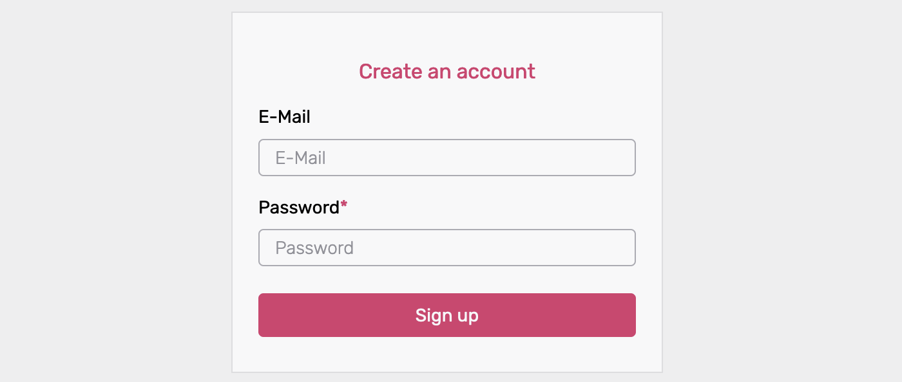

# Customize Identity Schema

Ory supports custom Identity Schemas. The Identity Schema is a JSON Schema that describes the traits that make up an identity.

##

:::note

https://www.jsonschemavalidator.net

:::

```
{
  $id: "http://mydomain.com/schemas/v2/customer.schema.json",
  $schema: "http://json-schema.org/draft-07/schema#",
  title: "A customer (v2)",
  type: "object",
  properties: {
    traits: {
      type: "object",
      properties: {
        email: {
          title: "E-Mail",
          type: "string",
          format: "email",

          // This tells Ory Identities that the field should be used as the "username" for the username+password flow.
          // It's an extension to the regular JSON Schema vocabulary.
          "ory.sh/kratos": {
            credentials: {
              password: {
                identifier: true,
              },
            },
          },
        },
      },
    },
  },
}
```

## Identity schema vocabulary extensions

Because the system doesn't know that a particular field has a system-relevant meaning, you have to specify that in the schema. For
example:

- This email address should be used for recovering a lost password.
- This identifier (username or email) should be used for logging in with a password.
- This is the phone number used for SMS 2FA.

A vocabulary extension can be used within a property:

```json5
{
  $id: "http://mydomain.com/schemas/v2/customer.schema.json",
  $schema: "http://json-schema.org/draft-07/schema#",
  title: "A customer (v2)",
  type: "object",
  properties: {
    traits: {
      type: "object",
      properties: {
        email: {
          title: "E-Mail",
          type: "string",
          format: "email",

          // This tells Ory Identities that the field should be used as the "username" for the username+password flow.
          // It's an extension to the regular JSON Schema vocabulary.
          "ory.sh/kratos": {
            credentials: {
              password: {
                identifier: true,
              },
            },
          },
        },
      },
    },
  },
}
```

### Identifier for username and password flows

You can configure Ory Identities (Ory Kratos) to use specific fields as the identity's identifier. In this example, the `password`
is set as the identifier:

```json
{
  "ory.sh/kratos": {
    "credentials": {
      "password": {
        "identifier": true
      }
    }
  }
}
```

#### Email

Looking at the traits from above

```yaml
traits:
  # These are just examples
  email: office@ory.sh
  name:
    first: Aeneas
    last: Rekkas
  favorite_animal: Dog
  accepted_tos: true
```

and using a JSON Schema that uses the `email` field as the identifier for the password flow:

```json5
{
  $id: "http://mydomain.com/schemas/v2/customer.schema.json",
  $schema: "http://json-schema.org/draft-07/schema#",
  title: "A customer (v2)",
  type: "object",
  properties: {
    traits: {
      type: "object",
      properties: {
        email: {
          title: "E-Mail",
          type: "string",
          format: "email",

          // This tells Ory Identities that the field should be used as the "username" for the username and password flow.
          "ory.sh/kratos": {
            credentials: {
              password: {
                identifier: true,
              },
            },
          },
        },
        name: {
          type: "object",
          properties: {
            first: {
              type: "string",
            },
            last: {
              type: "string",
            },
          },
        },
        favorite_animal: {
          type: "string",
        },
        accepted_tos: {
          type: "string",
        },
      },
      required: ["email"],
      additionalProperties: false,
    },
  },
}
```

In this example, Ory understands that `traits.email='office@ory.sh'` is the identifier for this identity. The system must get
`office@ory.sh` and a password to sign in an user.

[Username and Password Credentials](../../kratos/concepts/credentials/username-email-password) contains more information and
examples about credentials usage.

Note that the `format` field of the identity schema will perform validation of the given trait. In this example, the email address
is validated using the [JSONSchema](https://json-schema.org/understanding-json-schema/reference/string.html#email-addresses) rule
set.

#### Phone number

Let's extend the identity schema from the previous chapter with a phone number:

```json5
{
  $id: "http://mydomain.com/schemas/v2/customer.schema.json",
  $schema: "http://json-schema.org/draft-07/schema#",
  title: "A customer (v2)",
  type: "object",
  properties: {
    traits: {
      type: "object",
      properties: {
        email: {
          title: "E-Mail",
          type: "string",
          format: "email",

          // This tells Ory Identities that the field should be used as the "username" for the Username and Password Flow.
          "ory.sh/kratos": {
            credentials: {
              password: {
                identifier: true,
              },
            },
          },
        },
        phone: {
          title: "Phone",
          type: "string",
          format: "tel",

          // The phone number is marked as an identifier. This allows the user to log in with both email and phone number.
          "ory.sh/kratos": {
            credentials: {
              password: {
                identifier: true,
              },
            },
          },
        },
        name: {
          type: "object",
          properties: {
            first: {
              type: "string",
            },
            last: {
              type: "string",
            },
          },
        },
        favorite_animal: {
          type: "string",
        },
        accepted_tos: {
          type: "string",
        },
      },
      required: ["email"],
      additionalProperties: false,
    },
  },
}
```

By using the `"format": "tel"` field we enable validation of phone numbers using the Golang
[port](https://github.com/nyaruka/phonenumbers) of Google's [libphonenumber](https://github.com/google/libphonenumber).

## Examples

### Choosing between username, email, and phone Number

Before you start, you need to decide what data you want to collect from your users and why! It's hard to change this decision
afterwards, so make sure you've taken everything into account!

When logging in, the user will use a login identifier and a password to sign up and in. The identifier can be

- a username - "john.doe" or "johndoe123" or "oryuser",
- an email address - `john.doe@gmail.com`,
- a phone number - `+49-1234-4321-1234-4321`.

All of these approaches have up- and downsides.

Using the email address as the login identifier is easy to remember, doesn't require additional fields (because the email address
is already being collected), and is usually unique. It's usually unique because sometimes companies use a "shared" email account
(for example office@acme.org) to access services. In that case, multiple real identities are using the same email identifier to
log in.

The email address however represents a unique identifier and personally identifiable information (PII). An attacker could for
example check if the email address `john.doe@gmail.com` is registered at for example an adult website and use that information for
blackmail (see [Account Enumeration Attacks](../concepts/security.mdx#account-enumeration-attacks)).

The same considerations apply to using a phone number as the primary registration & login identifier.

Using a free text username reduces the privacy risk because it's much harder to make a connection between the username and a real
world identity. It's still possible in cases where users choose a username such as "john.doe.from.newyork.1970", but finding the
right username identifier is still difficult and there is plausible deniability because anyone could use that username.

A free text username however requires capturing additional fields (for example an email address for password resets / account
recovery) and is hard to remember. It's often very difficult to find unique usernames as people tend to use a combination of their
names and initials such as `john.doe` which has a high chance of collision. Therefore, one ends up with usernames such as
`john.doe1234432`.

It's important to understand that Ory Identities lowercases all `password` identifiers and therefore E-Mail addresses. Characters
`+` or `.` which have special meaning for some E-Mail Providers such as Gmail aren't normalized:

- `userNAME` is equal to `username`
- `foo@BaR.com` is equal to `foo@bar.com`
- `foo+baz@bar.com` is NOT equal to `foo@bar.com`
- `foo.baz@bar.com` is NOT equal to `foobaz@bar.com`

You need to decide which route you want to take.

### Pick the right identity schema

When processing an identity and its traits, the method will use [JSON Schema](../reference/json-schema-json-paths.md) to extract
one or more identifiers.

#### Use Case: Email and Password

To use the email address as the login identifier, define the following Identity JSON Schema:

```json
{
  "$id": "https://example.com/registration.schema.json",
  "$schema": "http://json-schema.org/draft-07/schema#",
  "title": "Person",
  "type": "object",
  "properties": {
    "traits": {
      "type": "object",
      "properties": {
        "email": {
          "type": "string",
          "format": "email",
          "ory.sh/kratos": {
            "credentials": {
              "password": {
                "identifier": true
              }
            }
          }
        }
      }
    }
  }
}
```

#### Use case: multiple emails and password

You can allow users to sign up with multiple E-Mail Addresses and use any of those for log in:

```json
{
  "$id": "https://example.com/registration.schema.json",
  "$schema": "http://json-schema.org/draft-07/schema#",
  "title": "Person",
  "type": "object",
  "properties": {
    "traits": {
      "type": "object",
      "properties": {
        "emails": {
          "type": "array",
          "items": {
            "type": "string",
            "format": "email",
            "ory.sh/kratos": {
              "credentials": {
                "password": {
                  "identifier": true
                }
              }
            }
          }
        }
      }
    }
  }
}
```

#### Use case: username and password

To use a username as the login identifier, define the following Identity JSON Schema:

```json
{
  "$id": "https://example.com/registration.schema.json",
  "$schema": "http://json-schema.org/draft-07/schema#",
  "title": "Person",
  "type": "object",
  "properties": {
    "traits": {
      "type": "object",
      "properties": {
        "username": {
          "type": "string",
          "ory.sh/kratos": {
            "credentials": {
              "password": {
                "identifier": true
              }
            }
          }
        }
      }
    }
  }
}
```

#### Use Case: username and email and password

You may also mix usernames and passwords:

```json
{
  "$id": "https://example.com/registration.schema.json",
  "$schema": "http://json-schema.org/draft-07/schema#",
  "title": "Person",
  "type": "object",
  "properties": {
    "traits": {
      "type": "object",
      "properties": {
        "email": {
          "type": "string",
          "format": "email",
          "ory.sh/kratos": {
            "credentials": {
              "password": {
                "identifier": true
              }
            }
          }
        },
        "username": {
          "type": "string",
          "ory.sh/kratos": {
            "credentials": {
              "password": {
                "identifier": true
              }
            }
          }
        }
      }
    }
  }
}
```

#### Use case: phone number and password

```json
{
  "$id": "https://example.com/registration.schema.json",
  "$schema": "http://json-schema.org/draft-07/schema#",
  "title": "Person",
  "type": "object",
  "properties": {
    "traits": {
      "type": "object",
      "properties": {
        "phone": {
          "type": "string",
          "format": "tel",
          "ory.sh/kratos": {
            "credentials": {
              "password": {
                "identifier": true
              }
            }
          }
        }
      }
    }
  }
}
```

## Create custom Identity Schema

Follow these steps to create a custom Identity Schema in The Ory Network:

1. Open the [Ory Console](https://console.ory.sh/) and sign in.
2. Select **Customize → Identity Schema** from the left navigation bar.
3. Using the dropdown menu, select one of the preset schemas or the empty template as the starting point for your custom schema.
4. Check the **Customize Identity Schema** box to enable editing of the schema.
5. Adjust the schema to your needs - adjust or remove traits.
6. Define the name of the custom schema in the **Identity Model Schema** text box.
7. Click the **Update** button to save.

## Customize fields

The traits of an Identity Schema are specified under

```json
"traits": {
  "type": "object",
    "properties": {
```

Each trait translates into a field on the user-facing frontend. For example, the "email and password" preset defines two traits -
email and password:

```json
    "traits": {
      "type": "object",
      "properties": {
        "email": {
          "type": "string",
          "format": "email",
          "title": "E-Mail",
          "ory.sh/kratos": {
            "credentials": {
              "password": {
                "identifier": true
              }
            },
            "recovery": {
              "via": "email"
            },
            "verification": {
              "via": "email"
            }
          }
        }
      },
      "required": [
        "email"
      ],
      "additionalProperties": false
    }
```

This Identity Schema translates into the following sign-up screen:


The part highlighted below defines the identity's `email` for the email+password flow in The Ory Network. It also includes a
method for [`recovery`](https://www.ory.sh/kratos/docs/self-service/flows/account-recovery#recovery-link-method) as well as
[`verification`](https://www.ory.sh/kratos/docs/self-service/flows/verify-email-account-activation/#verification-link-method).
Only the `email` method is available (recovery/verification via a link sent in an email).

```diff
    "traits": {
      "type": "object",
      "properties": {
+       "email": {
+         "type": "string",
+         "format": "email",
+         "title": "E-Mail",
+         "ory.sh/kratos": {
+           "credentials": {
+             "password": {
+               "identifier": true
+             }
+           },
            "recovery": {
              "via": "email"
            },
            "verification": {
              "via": "email"
            }
          }
        }
      },
      "required": [
        "username"
      ],
      "additionalProperties": false
    }
```

To add traits to the Identity Schema, add them inside the `traits "properties"`

```diff
"traits": {
  "type": "object",
    "properties": {
+      "customtrait": {
+        "type": "string",
+        "title": "Your Custom Trait Title"
+        }
       }
    }
```

for example the GitHub Handle as `string` :

```json
"traits": {
  "type": "object",
    "properties": {
      "handle": {
        "type": "string",
        "title": "Your GitHub Handle"
        }
      }
    }
```

or a checkbox as `boolean`:

```json
"traits": {
  "type": "object",
    "properties": {
      "newsletter": {
        "type": "boolean",
        "title": "Newsletter subscription"
        }
      }
    }
```

Possible values for the `type` are `string`, `number`, `integer`, `boolean`.

Use `string` for text fields, `boolean` for checkboxes fields, `integer` or `number` for integral or floating-point numbers. If
you want to know more about these types, please refer to the
[json-schema documentation](https://json-schema.org/understanding-json-schema/reference/type.html).

The `title` of each field is what the user as description or sample input. After adding the above examples the sign-up screen
would look like so:


### Change existing Identity Schemas

While it's not possible to directly edit existing Identity Schemas, you can make revisions.

For example, an Identity Schema named "Customer Type 1" exists and you would like to make changes to it:

- Select the "Customer Type 1" Identity Schema and press `Customize Identity Schema`.
- Make the necessary changes.
- Enter a new name, for example "Customer Type 2".
- Press the `Enter` key or `Update` to save it.

### Add identity metadata

It is possible to add metadata to an identity, either as a protected field that can only be read by the admin or as a public field
that can be read by the user as well.
[Visit the Manage Identity Metadata documentation](https://www.ory.sh/docs/guides/manage-identities/managing-users-identities-metadata)
for details on how to add metadata to identities.

### Additional properties

The [`additionalProperties`](https://json-schema.org/understanding-json-schema/reference/object.html#additional-properties)
keyword is used to control the handling of properties whose names aren't listed in the properties keyword. This has no effect and
should be set to false.

```json
      "additionalProperties": false
```

## Reference Identity Schema

The following Identity Schema includes first/last and nickname, as well as number fields for the users' age. There are also two
true/false fields for specifying the newsletter subscription and enterprise status.

Please note that this is just a reference Identity Schema, for practical uses it contains probably too many traits.

```json
{
  "$id": "https://schemas.ory.sh/presets/kratos/identity.basic.schema.json",
  "title": "Person",
  "type": "object",
  "properties": {
    "traits": {
      "type": "object",
      "properties": {
        "email": {
          "type": "string",
          "format": "email",
          "title": "E-Mail",
          "ory.sh/kratos": {
            "credentials": {
              "password": {
                "identifier": true
              }
            },
            "recovery": {
              "via": "email"
            },
            "verification": {
              "via": "email"
            }
          }
        },
        "name": {
          "type": "object",
          "properties": {
            "first": {
              "type": "string",
              "title": "Your First name"
            },
            "last": {
              "type": "string",
              "title": "Your Last name"
            },
            "nickname": {
              "type": "string",
              "title": "Your Nickname"
            }
          }
        },
        "age": {
          "type": "integer",
          "title": "How old are you?"
        },
        "newsletter": {
          "type": "boolean",
          "title": "Newsletter subscription"
        },
        "enterprise": {
          "type": "boolean",
          "title": "Are you an Enterprise customer?"
        }
      },
      "required": ["email"],
      "additionalProperties": false
    }
  }
}
```

This is what the above Identity Schema would look like on the sign-up screen:


