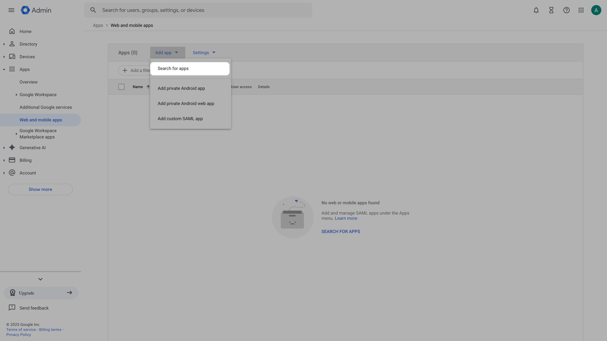
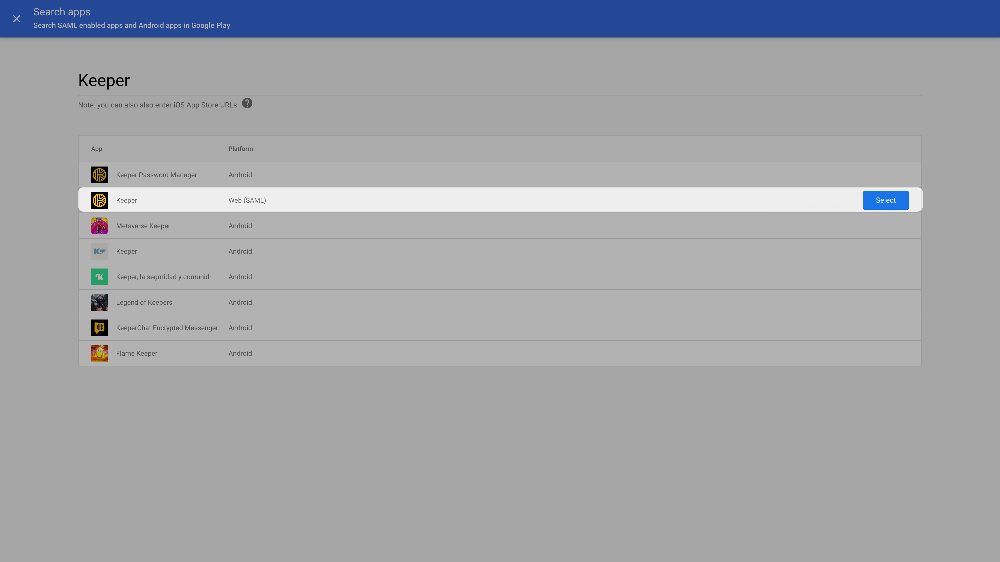
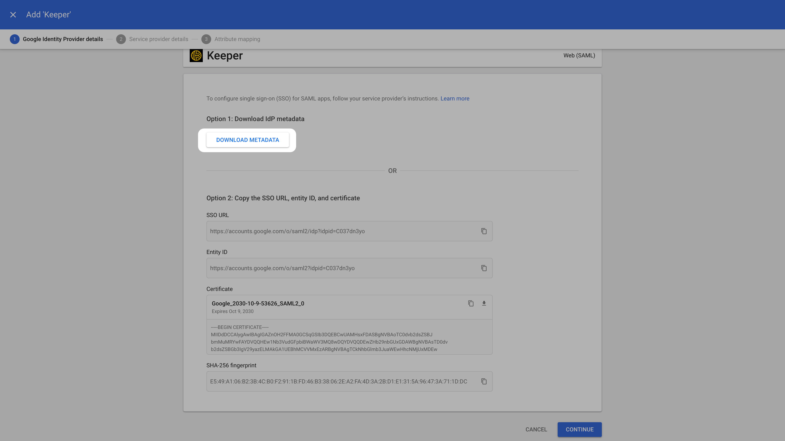
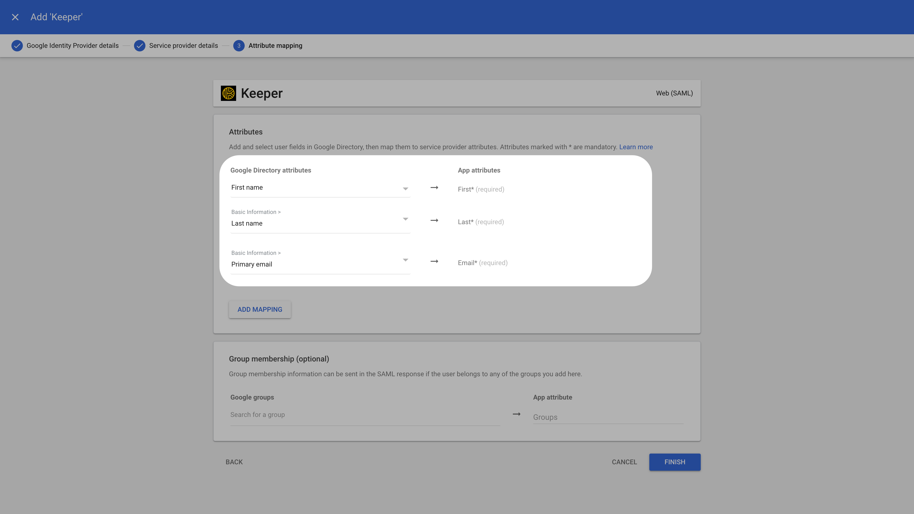

# Google Workspace SCIM

This page guides you through setting up SCIM provisioning from Google Workspace to Ory Network. Also refer to the Google Workspace
[automated user provisioning documentation](https://support.google.com/a/topic/6400789?hl=en&ref_topic=7556794&sjid=1261578791225148038-NC)
for more information.

### Create Keeper SAML app in Google workspace

Login to the [Google Workspace Admin Console](https://admin.google.com/).

Navigate to **Apps > Web and mobile apps**. Click on **Add App** and **Search for Apps**.

For **Enter app name**, enter **Keeper**. Select **Keeper Web (SAML)** from the search results.

In the **Google Identity Provider details** window, for **Option 1: Download IdP metadata**, click **Download Metadata**. The
metadata file can be used to add a SAML connection. Click **Continue**.

On the Service provider details page, set the values for **ACS URL** and **Entity ID** from Ory Network. To ensure that the entire
SAML authentication response is signed, check the Signed response box. The **Name ID** should be **EMAIL**. Click **Continue**.

In the **Attribute mapping** tab click the **Select field** menu to choose a field name for Google Directory attributes. Click
**Finish**.

### Configure User Access
