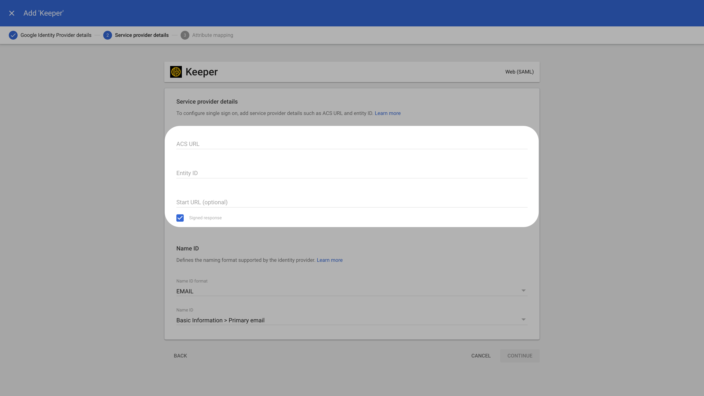

# Google Workspace SCIM

This page guides you through setting up SCIM provisioning from Google Workspace to Ory Network. Also refer to the Google Workspace
[automated user provisioning documentation](https://support.google.com/a/topic/6400789?hl=en&ref_topic=7556794&sjid=1261578791225148038-NC)
for more information.

### Create Keeper SAML app in Google workspace

Login to the [Google Workspace Admin Console](https://admin.google.com/).

Navigate to **Apps > Web and mobile apps**. Click on **Add App** and **Search for Apps**.

For **Enter app name**, enter **Keeper**. Select **Keeper Web (SAML)** from the search results.

In the **Google Identity Provider details** window, for **Option 1: Download IdP metadata**, click **Download Metadata**. The
metadata file can be used to add a SAML connection. Click **Continue**.

On the Service provider details page, set the values for **ACS URL** and **Entity ID** from Ory Network. To ensure that the entire
SAML authentication response is signed, check the Signed response box. The **Name ID** should be **EMAIL**. Click **Continue**.

In the **Attribute mapping** tab click the **Select field** menu to choose a field name for Google Directory attributes. Click
**Finish**.

### Configure User Access

In the created SAML app, under the **User access** section click on **OFF for everyone**.

Select **ON for everyone** to activate SSO.

You have successfully configured the Google App as a SAML Identity Provider (IdP). Using the downloaded metadata, you can now add
an SSO connection in Ory Network.

### Set up provisioning

Under the provisioning section of the created app click on **Configure autoprovisioning**.

For the **Access token** enter the SCIM token you created in the Ory Network.

For the **Endpoint URL** enter the SCIM server URL from your Ory Network SCIM server.

In attribute mapping screen ensure the right attributes are mapped for the app. Complete the remaining steps by setting the
provisioning scope to particular groups (if required) and setting the deprovisioning settings.

Finally click **Finish**. Toggle the **Autoprovisioning** to **Active** to complete the setup.

### Troubleshooting

When the provisioning fails, the error will be logged. In Ory Network, navigate to Activity > Logs & Events and look for SCIM
provisioning error events.

### Limitations

There is no support for group memberships with Google SCIM.
