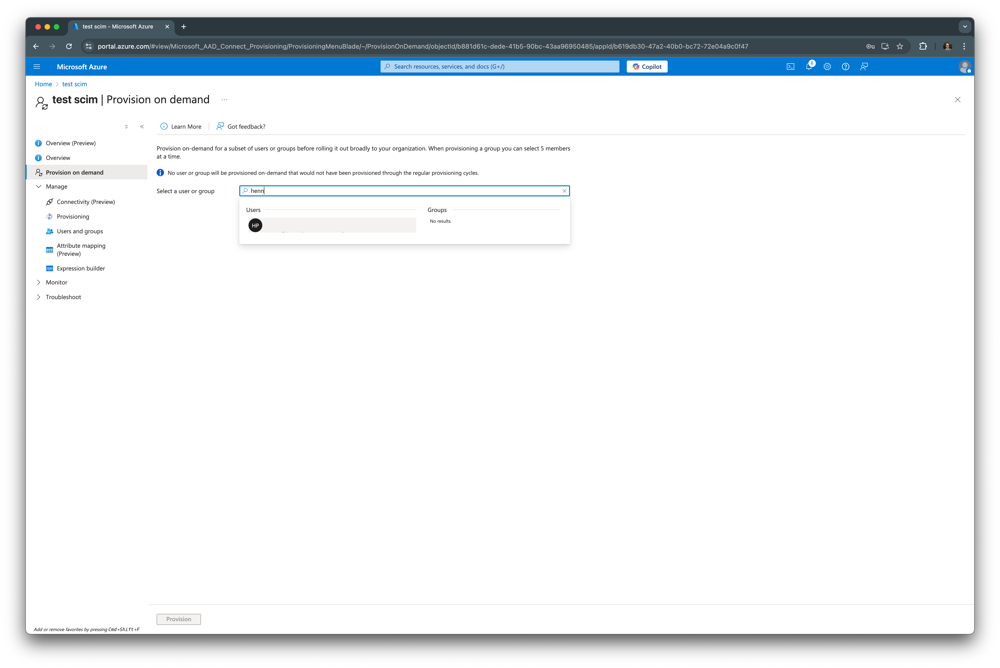

# Set up SCIM provisioning from Microsoft Entra

This page guides you through setting up SCIM provisioning from Microsoft Entra to Ory Network.

## Create a SCIM App in MS Entra

From the Azure admin dashboard, navigate to **Microsoft Entra ID** > **Enterprise applications** and create a new application by
clicking on **Create your own application**.

In the app screen, select **Provisioning**.

Next, select **Create configuration**.

## Set up provisioning

In the provision configuration screen, enter the SCIM server URL from your Ory Network SCIM server, and for the **API token**,
excluding the `Bearer` prefix, enter the SCIM token you created in the Ory Network.

For example, if in Ory Network you've set the token to `Bearer secret`, enter `secret` in the **API token** field.

Click on **Test Connection** to verify the connection. If successful, you should see a success message.

## Configure assignments

Next, provision users through SCIM by clicking on **Provision on demand**, and enter a user name into the search box. Click on the
user to start the provisioning process. If successful, you should see a success message.

## Verify provisioning

After completing the assignment, navigate to the Ory Network SCIM server and verify that the users have been provisioned.

## Troubleshooting

When the provisioning fails, the error will be logged. In Ory Network, navigate to **Activity** > **Logs & Events** and look for
`SCIM provisioning error` events.
