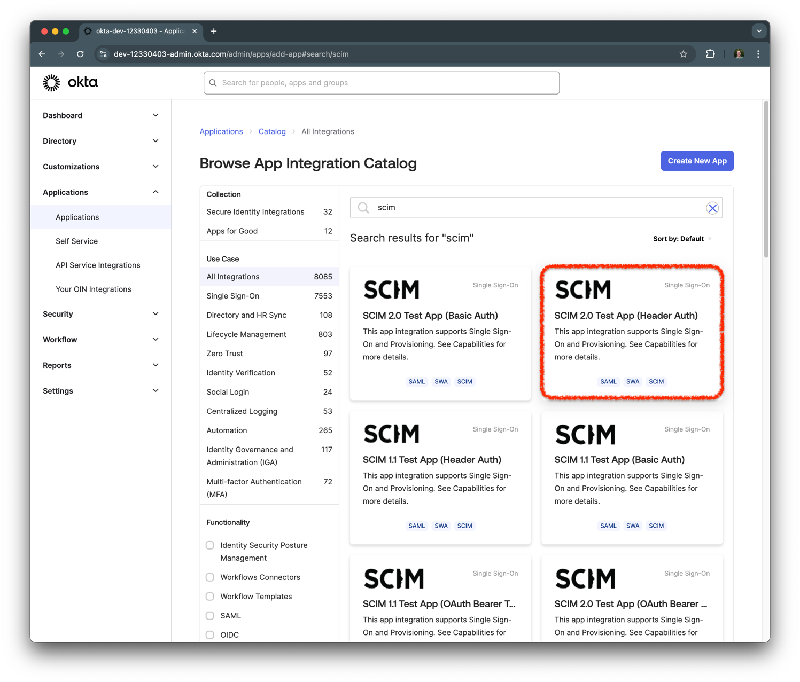
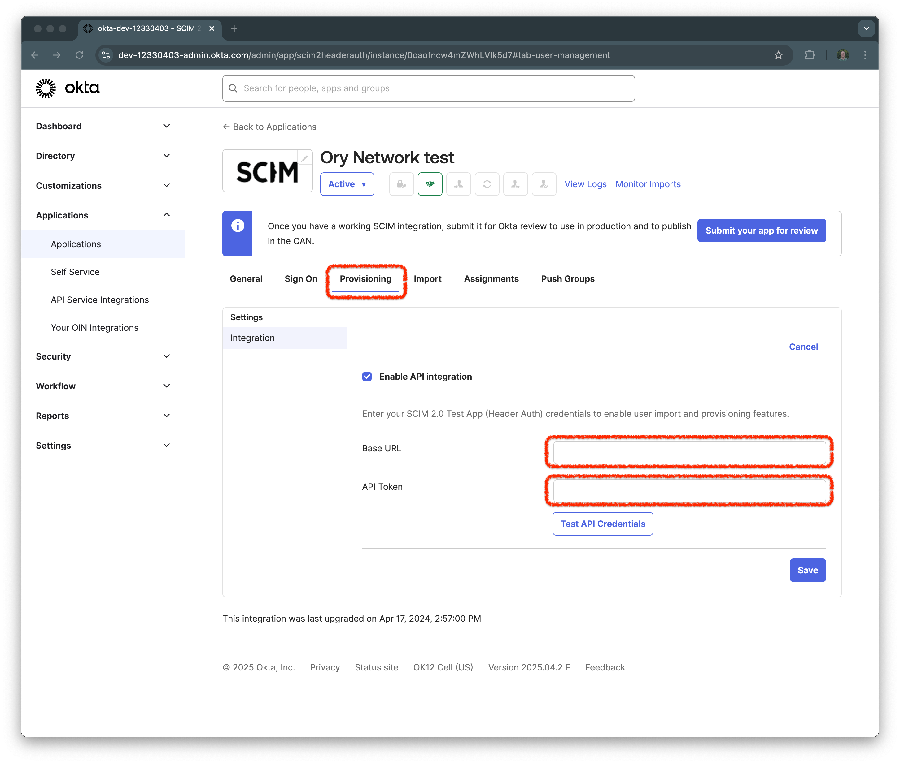
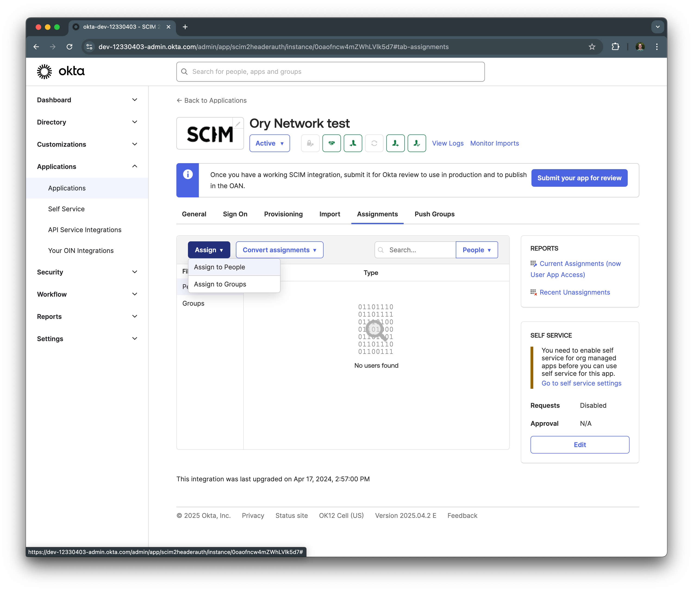
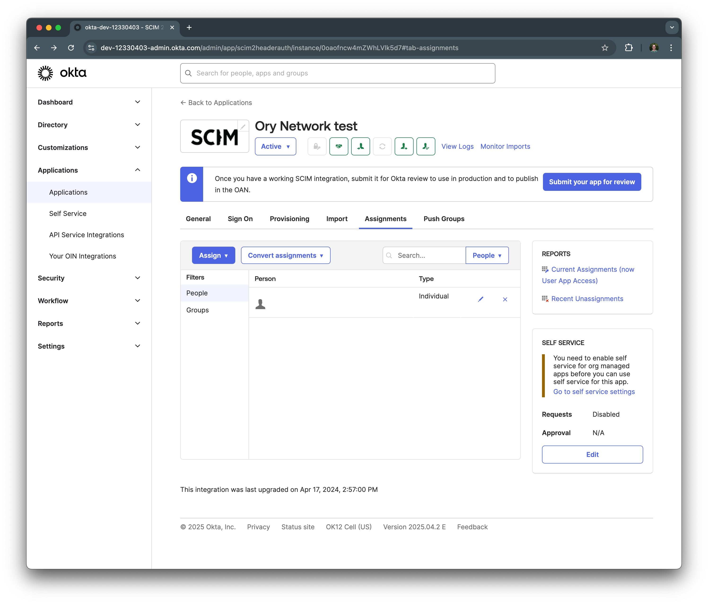
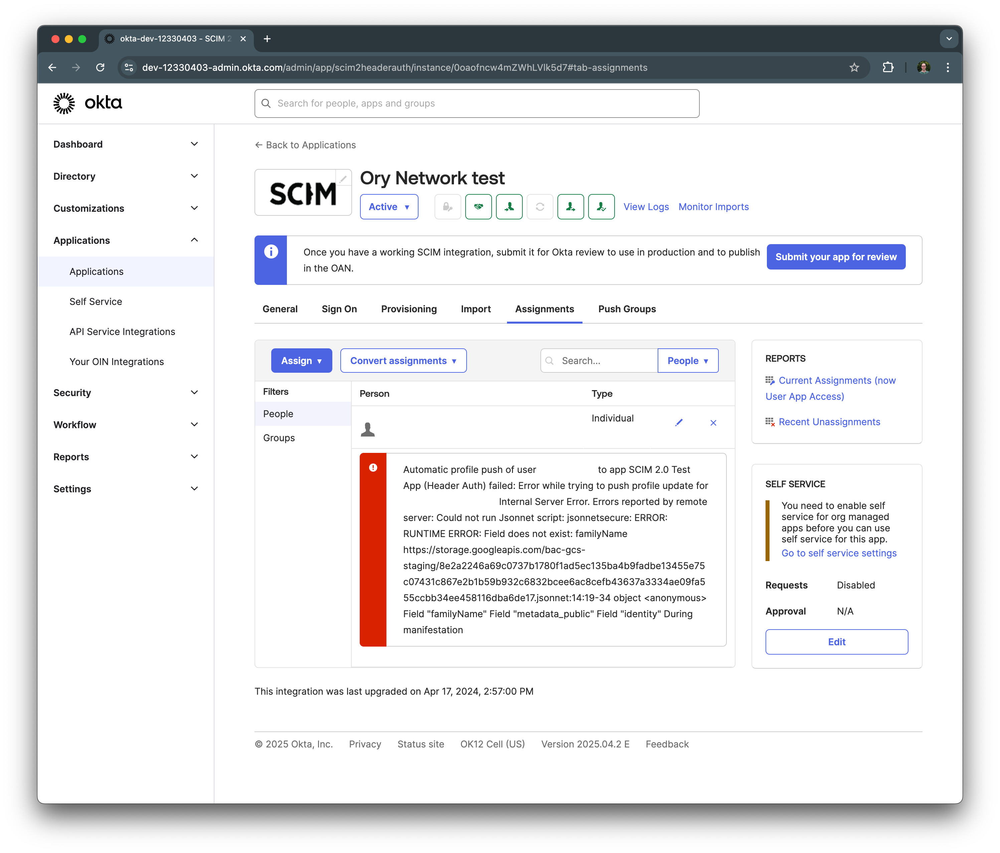

# Set up SCIM provisioning from Okta

This page guides you through setting up SCIM provisioning from Okta to Ory Network. Also refer to the
[Okta SCIM documentation](https://help.okta.com/en-us/content/topics/apps/apps_app_integration_wizard_scim.htm) for more
information.

## Create a SCIM App in Okta

From the Okta admin dashboard, navigate to **Applications** > **Add Application** and search for **SCIM 2.0 Test App (Header
Auth)**.

Click on the tile to open the app details page, then click **Add Integration** to add the app to your Okta organization.

Choose a name for the app and click **Next**.

Complete the wizard by clicking on **Done**.

## Set up provisioning

Next, navigate to the **Provisioning** tab and click on **Enable API Integration**. For the **Base URL**, enter the SCIM server
URL from your Ory Network SCIM server, and for th **API token**, enter the SCIM token you created in the Ory Network.

Click **Test API Credentials** to verify the connection. If successful, you should see a success message.

Click on **Edit** in the **Provisioning** tab and check the boxes for **Create Users**, **Update User Attributes**, and
**Deactivate Users**. Click **Save** to save the changes.

## Configure assignments

To assign users to the app, navigate to the **Assignments** tab and click on **Assign**. You can assign users or groups to the
app. Click **Assign to People** to assign individual users or **Assign to Groups** to assign groups.

## Verify provisioning

After completing the assignment, navigate to the Ory Network SCIM server and verify that the users have been provisioned.

## Troubleshooting

When the provisioning fails, both in Ory Network and Okta you will see an error message. In Ory Network, navigate to
**Activity** > **Logs & Events** and look for `SCIM provisioning error` events.

In Okta, navigate to the **Assignments** tab and click on the red exclamation mark next to the user. This will show you the error
response from Ory Network.

