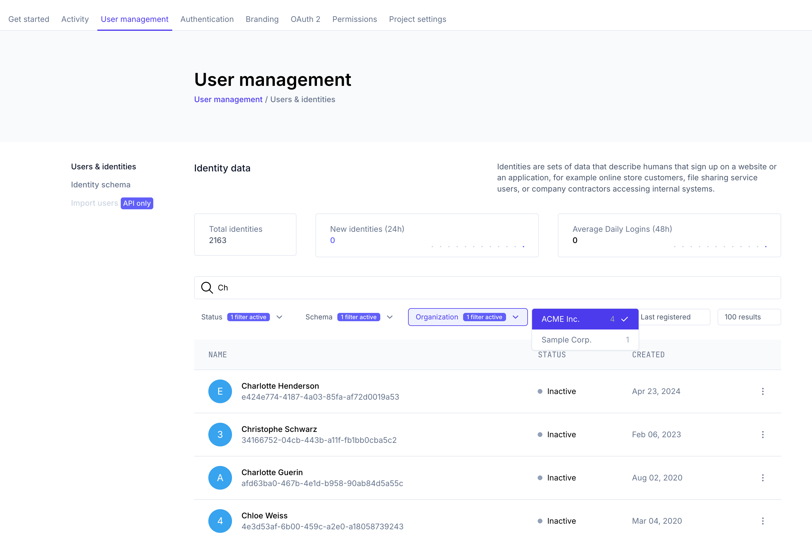

Search for identities by navigating to <ConsoleLink route="project.identities.list" />.

Use the search bar to find identities by email, username, first/last name, or any other custom traits you have defined. Admin and
public metadata is also searchable. Use the State (`Active`/`Inactive`), Identity Schema, and Organization filters to narrow down
your search results.

Identity search supports a maximum result set size of 250 identities. If your search query matches more than 250 identities, only
the first 250 results will be shown, along with a message about how many identities match your search query in total.

