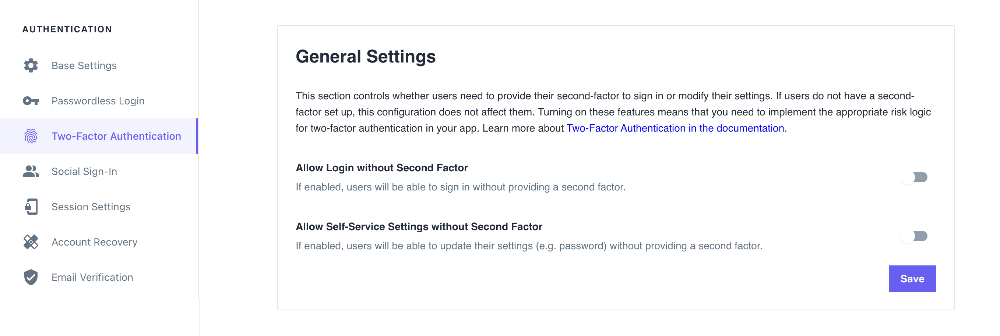

You can enforce multi-factor authentication in one of two models:

- **Strict**, where secured operations always require the highest Authenticator Assurance Level (AAL).
- **Lax**, where the secured operations require only the `aal1` Authenticator Assurance Level (AAL).

You can set the required authentication model for these operations/endpoints:

- User sign-in (getting an Ory Session) / `/sessions/whoami` endpoint
- Self-service user settings

## Configuration

Follow these steps to enforce multi-factor authentication:

### Ory Cloud Console

In Ory Cloud projects, the default multi-factor authentication enforcement model is Strict.

To change it to Lax and allow users to sign in or access user settings without authenticating with the second factor, go to the
**Ory Cloud Console → Two-Factor Authentication** and use the switches in the **General Settings** section.



### Ory CLI

Follow these steps to adjust the settings in Ory Cloud using the Ory CLI:

1. Get the Identity Service configuration from your project and save it to a file:

   ```shell
   ## List all available projects
   ory list projects

   ## Get config
   ory get identity-config <project-id> --format yaml > identity-config.yaml
   ```

2. Adjust the values of the indicated keys to the desired values:

   ```yaml title="identity-config.yaml"
   # ...
   selfservice:
     flows:
       settings:
         required_aal: aal1
   # ...
   session:
     whoami:
       required_aal: aal1
   # ...
   ```

   :::tip

   Use `aal1` for the Lax model and `highest_available` for the Strict model.

   :::

3. Update the Ory Cloud Identity Service configuration using the file you worked with:

   ```shell
   ory update identity-config <project-id> --file identity-config.yaml
   ```

### Self-hosted instances

When working with self-hosted instances of the Ory Identity Service (Kratos), change the enforcement model by adjusting these keys
in the configuration file:

```yaml title="kratos.config.yml"
# ...
selfservice:
  flows:
    settings:
      required_aal: aal1
# ...
session:
  whoami:
    required_aal: highest_available
# ...
```
