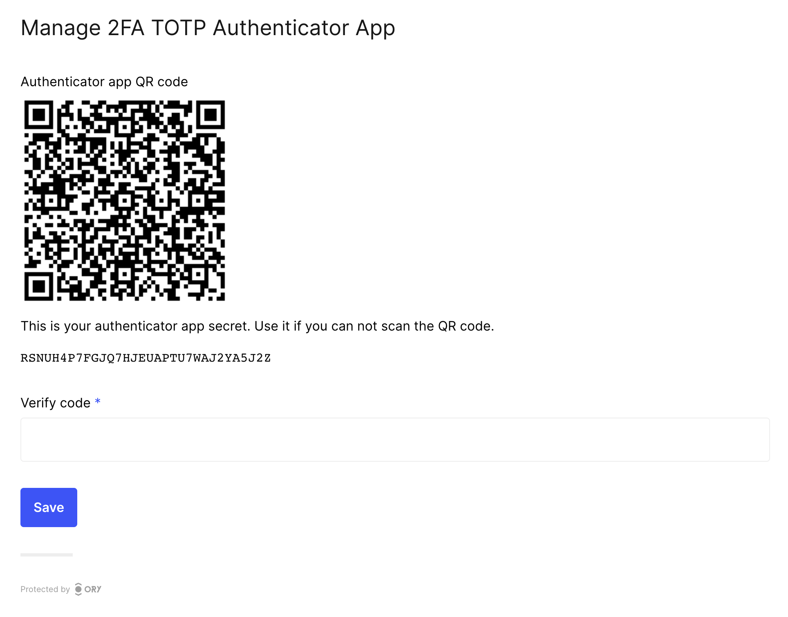
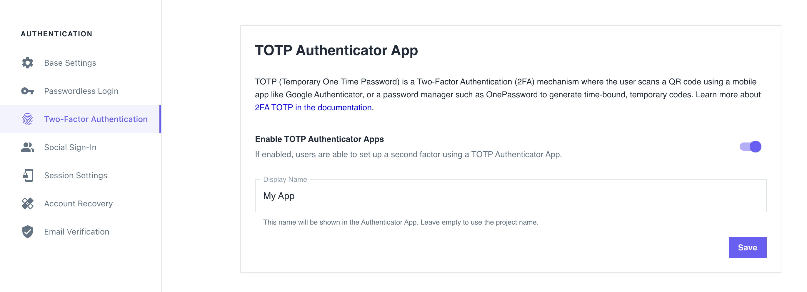

You can enable Time-Based One-Time Password (TOTP) authentication in the Ory Identity Service (Kratos) to allow users to perform
2FA with TOTP apps such as Google Authenticator, LastPass, or [FreeOTP](https://freeotp.github.io/).

When enabled, users can pair a TOTP app with their account:

:::note

The example screenshot is captured using the Ory Managed UI.

:::



When attempting to perform actions secured with 2FA, users get a TOTP code with the application identifier:


:::info

In this example, the user identifier (email - `alice@example.com`) is used. To learn how to enable this behavior, read
[this section](#distinguishing-identities-requesting-totp).

:::

## Configuration

Follow these steps to enable Time-Based One-Time Password (TOTP) as the second authentication factor:

### Ory Cloud Console

1. Sign in to the **Ory Cloud Console** and go to **Two-Factor Authentication**.
2. In the **TOTP Authenticator App** section, use the switch to enable TOTP.
3. Define the name of the requesting party in the **Display Name**. The users sees this name in the TOTP application when getting
   a one-time password.
4. Click **Save** to finish.



### Ory CLI

1. Get the Identity Service configuration from your project and save it to a file:

   ```shell
   ## List all available projects
   ory list projects

   ## Get config
   ory get identity-config <project-id> --format yaml > identity-config.yaml
   ```

2. Find `totp` in `selfservice/methods`, set `enabled` to `true`, and define the `issuer`:

   ```yaml title="identity-config.yaml"
   selfservice:
     methods:
       totp:
         // highlight-start
         config:
           # The "issuer" is the name in the TOTP application users see when getting a one-time password.
           issuer: ExampleIssuer.com
         enabled: true
         // highlight-end
   ```

3. Update the Ory Cloud Identity Service configuration using the file you worked with:

   ```shell
   ory update identity-config <project-id> --file identity-config.yaml
   ```

### Self-hosted instances

When working with self-hosted instances of the Ory Identity Service (Kratos), add the `totp` method to `selfservice/methods` in
the configuration file:

```yaml title="kratos.config.yml"
selfservice:
  methods:
    totp:
      config:
        # The "issuer" is the name in the TOTP application users see when getting a one-time password.
        issuer: ExampleIssuerForSelfHosted.com
      enabled: true
```

### Distinguishing Identities requesting TOTP

To help users distinguish which identity requests for the TOTP code, add a `totp` object to the trait which represents the TOTP
account name.

In this example, the user's email address is the identifier:

:::note

This configuration is the default for all Ory Cloud projects.

:::

```json title="sample identity schema"
{
  "$schema": "http://json-schema.org/draft-07/schema#",
  "type": "object",
  "properties": {
    "traits": {
      "type": "object",
      "properties": {
        "email": {
          "type": "string",
          "format": "email",
          "title": "Your E-Mail",
          "minLength": 3,
          "ory.sh/kratos": {
            "credentials": {
              // ...
              // highlight-start
              "totp": {
                "account_name": true
              }
              // highlight-end
            }
            // ...
          }
        }
        // ...
      }
      // ...
    }
  }
}
```

## Writing E2E tests

When writing end-to-end (E2E) tests for TOTP implementation in your app,
[you can reference the Cypress tests used in Ory Identity Service (Kratos)](https://github.com/ory/kratos/blob/fc2cecfbeab811aa1a851f953b6bc2a4c119c412/test/e2e/cypress/integration/profiles/mfa/totp.spec.ts).

## Identity credentials

When the user enables TOTP, Ory adds the following entries to the `credentials` object of the associated Identity:

```yaml
credentials:
  password:
    id: totp
    identifiers:
      - 802471b9-06f5-49d4-a88d-5e7d6bcfed22
    config:
      # This is the TOTP URL which contains the pre-shared key and some additional meta-information.
      totp_url: otpauth://totp/Example:alice@example.org?secret=JBSWY3DPEHPK3PXP&issuer=Example
```
