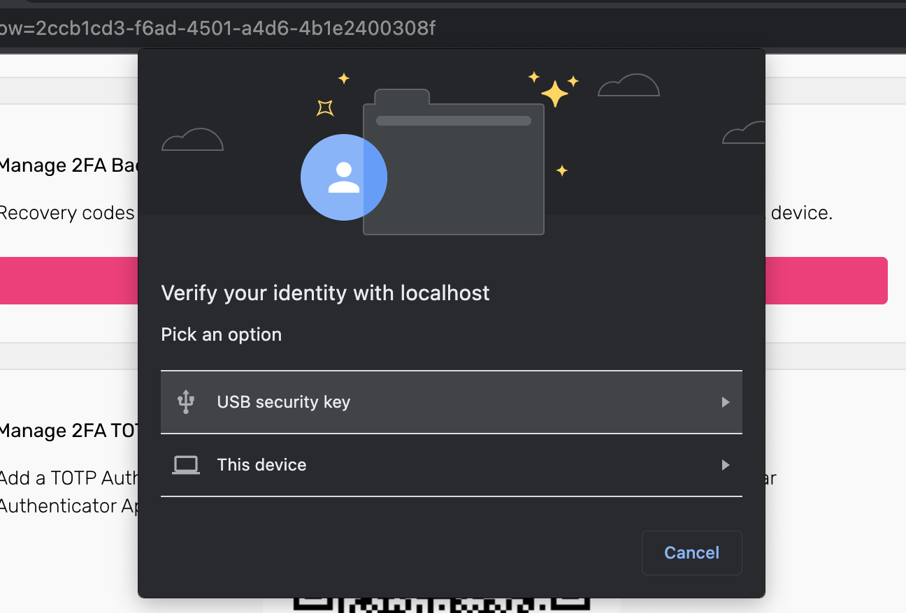

# WebAuthn and FIDO2 (YubiKey)

```mdx-code-block
import Tabs from '@theme/Tabs';
import TabItem from '@theme/TabItem';
```

WebAuthn uses the [Web Authentication API](https://developer.mozilla.org/en-US/docs/Web/API/Web_Authentication_API) of the
browser, which allows servers to register and authenticate users using public-key cryptography.

There are two main categories of authenticators you can use with WebAuthn:

- **On-device authenticators**: platform-based biometric authentication protocols, such as TouchID, FaceID, Windows Hello, or
  Android Biometric Authentication
- **External authenticators**: NFC devices, USB keys, or Bluetooth Low Energy (BLE) devices, for example a
  [YubiKey](https://www.yubico.com/why-yubico/how-the-yubikey-works/).

When accessing resources protected with the second-factor requirement, the browser presents the user with a prompt asking to
confirm their identity with their configured authentication method, for example, by touching the fingerprint reader.

You can enable WebAuthn in the Ory Identities (Kratos) to allow users to perform 2FA with physical devices such as USB keys or
OS-level biometric authentication protocols, such as TouchID.

When users trigger the WebAuthn process, the web browser displays a prompt:

```mdx-code-block
import BrowserWindow from "@site/src/theme/BrowserWindow"

<BrowserWindow url="https://console.ory.com/">



</BrowserWindow>
```

The look of the prompt depends on the web browser. The screenshot shows a Google Chrome prompt.

## Limitations

- WebAuthn is a browser-only standard. It doesn't work with native mobile apps.
- WebAuthn is limited to one domain and does not work in a local environment when using CNAME / Ory Tunnel. WebAuthn uses an
  `https://origin` URL as part of the client-server challenge/response mechanism. This mechanism allows a single URL as the
  origin. To learn more, read this [WebAuthn discussion and on GitHub](https://github.com/w3c/webauthn/issues/1372).
- Implementing WebAuthn in your own UI can be challenging. Check out the
  [reference implementations](../bring-your-own-ui/20_configure-ory-to-use-your-ui.mdx#reference-implementations-and-examples) to
  see how you can approach implementation for different app types (web app, SPA).

## Configuration

Follow these steps to enable WebAuthn as the second authentication factor:

### Ory Console

```mdx-code-block
<Tabs groupId="console-or-cli">
  <TabItem value="oc" label="Ory Console" default>
```

1. Go to <ConsoleLink route="project.mfa" />.
2. In the **WebAuthn** section, use the switch to enable WebAuthn.
3. Define the hostname of your login page. You must set this to your top-level domain.

:::note

If you are using the Ory Account Experience, skip the 4. step

:::

4. Define the origin of your login page. Set it to the exact URL of the page that prompts the user to use WebAuthn. The relevant
   items are:

   - scheme (`http` or `https`)
   - host (`auth.example.com`)
   - port (`4455`)

5. Click **Save** to finish.

```mdx-code-block
<BrowserWindow url="https://console.ory.com/">


</BrowserWindow>
```

```mdx-code-block
</TabItem>
<TabItem value="cli" label="Ory CLI" default>
```

1. Get the Ory Identities configuration from your project and save it to a file:

   ```shell
   ## List all available workspaces
   ory list workspaces

   ## List all available projects
   ory list projects --workspace <workspace-id>

   ## Get config
   ory get identity-config --project <project-id> --workspace <workspace-id> --format yaml > identity-config.yaml
   ```

2. Find `webauthn` in `selfservice/methods`, set `enabled` to `true`, and define the `id` (hostname) and `origin` of the login
   page users interact with:

   ```yaml title="identity-config.yaml"
   webauthn:
     config:
       passwordless: false
       rp:
         display_name: MY_PROJECT_NAME
         # highlight-start
         id: loginpage.com
         # Set 'id' to the top-level domain.
         origin: https://loginpage.auth.com:4455
         # Set 'origin' to to the exact URL of the page that prompts user to use WebAuthn. You must include the scheme, host, and port.
     enabled: true
     # highlight-end
   ```

   :::info

   The `display_name` is always set to the name of your project.

   :::

3. Update the Ory Identities configuration using the file you worked with:

   ```shell
   ory update identity-config --project <project-id> --workspace <workspace-id> --file identity-config.yaml
   ```

```mdx-code-block
  </TabItem>
</Tabs>
```

### Distinguish identities requesting WebAuthn

To help users distinguish which identity requests for WebAuthn authentication, add a `webauthn` object to the trait which
represents the WebAuthn account name. This trait's value will show up in the WebAuthn prompt of the browser.

In this example, the user's email address is the identifier:

:::note

This configuration is the default for the Ory Network.

:::

```json title="sample identity schema"
{
  "$schema": "http://json-schema.org/draft-07/schema#",
  "type": "object",
  "properties": {
    "traits": {
      "type": "object",
      "properties": {
        "email": {
          "type": "string",
          "format": "email",
          "title": "Your E-Mail",
          "minLength": 3,
          "ory.com/kratos": {
            "credentials": {
              // ...
              // highlight-start
              "webauthn": {
                "identifier": true
              }
              // highlight-end
            }
            // ...
          }
        }
        // ...
      }
      // ...
    }
  }
}
```

## Writing E2E tests

When writing end-to-end (E2E) tests for WebAuthn implementation in your app, you can reference the
[Cypress E2E tests used in Ory Identities (Kratos)](https://github.com/ory/kratos/blob/fc2cecfbeab811aa1a851f953b6bc2a4c119c412/test/e2e/cypress/integration/profiles/mfa/webauthn.spec.ts).

:::tip

To learn more about the approach used in Cypress, read
[this](https://github.com/cypress-io/cypress/issues/6991#issuecomment-612888645) GitHub issue.

:::

## Identity credentials

When the user enables WebAuthn, Ory adds the following entries to the `credentials` object of the associated identity:

```yaml
credentials:
  password:
    id: webauthn
    identifiers:
      - alice@example.org
    config:
      credentials:
        - display_name: my-key
          added_at: "2022-03-06T09:45:18Z"
          # If 'true', WebAuthn is used for paswordless flows.
          is_passwordless: false
          # WebAuth2-specific values.
          id: P/psShpG+SOCxBqslynuxMors6oexs7RS09bSA/F9EI=
          public_key: pQECAyYgASFYIJ0RRsaHJ2IQ6Eh11BPpHkdOl2DkICXg3rJVxSHQAsklIlgga0Tt2PqLlg/baAl20Y64JCllE71jDG+XzHfN6FT/S9I=
          attestation_type: none
          authenticator:
            aaguid: AAAAAAAAAAAAAAAAAAAAAA==
            sign_count: 1
            clone_warning: false
      # The user handle will be used in the exchange with the FIDO2 device
      # to ensure that the user handle from the key and from Ory match.
      user_handle: NDVP4/1nTj2CTFaItp/zXg==
```
