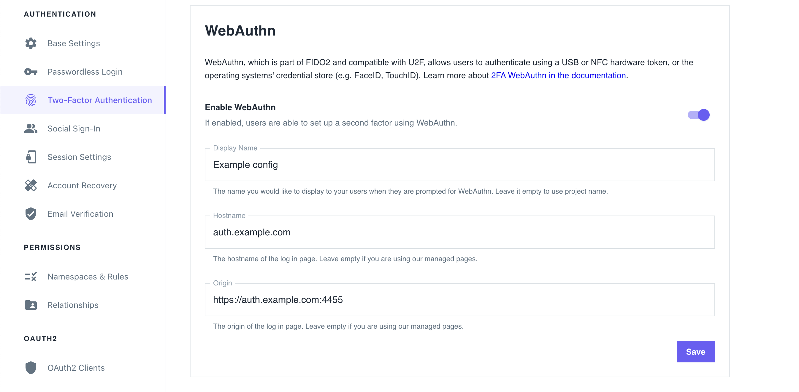

You can enable WebAuthn in the Ory Identity Service (Kratos) to allow users to perform 2FA with with physical devices such as USB
keys or OS-level biometric authentication protocols, such as TouchID.

When users trigger the WebAuthn process, the web browser displays a prompt:


:::note

The look of the prompt depends on the web browser. The screenshot shows a Google Chrome prompt.

:::

## Limitations

- WebAuthn is a browser-only standard. It doesn't work with native mobile apps.
- WebAuthn is limited to one domain and does not work in a local environment when using CNAME / Ory Proxy. WebAuthN uses an
  `https://origin` URL as part of the client-server challenge/response mechanism. This mechanism allows a single URL as the
  origin. To learn more, read this [WebAuthn discussion and on GitHub](https://github.com/w3c/webauthn/issues/1372).
- Depending on the framework you use, implementing WebAuthn in your own UI can be challenging. Check out the
  [reference implementations](../../kratos/guides/custom-ui) to see how you can approach implementation for different app types
  (web app, SPA).

## Configuration

Follow these steps to enable WebAuthn as the second authentication factor:

### Ory Cloud Console

1. Sign in to the **Ory Cloud Console** and go to **Two-Factor Authentication**.
2. In the **WebAuthn** section, use the switch to enable WebAuthn.
3. Define the hostname of your login page. You must set this to your top-level domain.
4. Define the origin of your login page. Set it to the exact URL of the page that prompts the user to use WebAuthn. The relevant
   items are:

- scheme (http/https)
- host (`auth.example.com`)
- port (`4455`)

:::note

If you are using the Ory Managed UI, leave these fields blank.

:::

4. Click **Save** to finish.



### Ory CLI

1. Get the Identity Service configuration from your project and save it to a file:

   ```shell
   ## List all available projects
   ory list projects

   ## Get config
   ory get identity-config <project-id> --format yaml > identity-config.yaml
   ```

2. Find `webauthn` in `selfservice/methods`, set `enabled` to `true`, and define the `id` (hostname) and `origin` of the login
   page users interact with:

   ```yaml title="identity-config.yaml"
   webauthn:
       config:
         passwordless: false
         rp:
           display_name: MY_PROJECT_NAME
           // highlight-start
           id: loginpage.com
           # Set 'id' to the top-level domain.
           origin: https://loginpage.auth.com:4455
           # Set 'origin' to to the exact URL of the page that prompts user to use WebAuthn. You must include the scheme, host, and port.
       enabled: true
       // highlight-end
   ```

   :::info

   The `display_name` is always set to the name of your project.

   :::

3. Update the Ory Cloud Identity Service configuration using the file you worked with:

   ```shell
   ory update identity-config <project-id> --file identity-config.yaml
   ```

### Self-hosted instances

When working with self-hosted instances of the Ory Identity Service (Kratos), add the `webauthn` method to `selfservice/methods`
in the configuration file:

```yaml title="kratos.config.yml"
selfservice:
  methods:
    webauthn:
      config:
        passwordless: false
        rp:
          display_name: SAMPLE_NAME
          # Set 'id' to the top-level domain.
          id: loginpage.com
          # Set 'origin' to the exact URL of the page that prompts the user to use WebAuthn. You must include the scheme, host, and port.
          origin: https://loginpage.auth.com:4455
      enabled: true
```

### Distinguish identities requesting WebAuthn

To help users distinguish which identity requests for WebAuthn authentication, add a `webauthn` object to the trait which
represents the WebAuthn account name.

In this example, the user's email address is the identifier:

:::note

This configuration is the default for all Ory Cloud projects.

:::

```json title="sample identity schema"
{
  "$schema": "http://json-schema.org/draft-07/schema#",
  "type": "object",
  "properties": {
    "traits": {
      "type": "object",
      "properties": {
        "email": {
          "type": "string",
          "format": "email",
          "title": "Your E-Mail",
          "minLength": 3,
          "ory.sh/kratos": {
            "credentials": {
              // ...
              // highlight-start
              "webauthn": {
                "identifier": true
              }
              // highlight-end
            }
            // ...
          }
        }
        // ...
      }
      // ...
    }
  }
}
```

## Writing E2E tests

When writing end-to-end (E2E) tests for WebAuthn implementation in your app,
[you can reference the Cypress tests used in Ory Identity Service (Kratos)](https://github.com/ory/kratos/blob/fc2cecfbeab811aa1a851f953b6bc2a4c119c412/test/e2e/cypress/integration/profiles/mfa/webauthn.spec.ts).

:::tip

To learn more about the approach used in Cypress, read
[this](https://github.com/cypress-io/cypress/issues/6991#issuecomment-612888645) GitHub issue.

:::

## Identity credentials

When the user enables WebAuthn, Ory adds the following entries to the `credentials` object of the associated Identity:

```yaml
credentials:
  password:
    id: webauthn
    identifiers:
      - alice@example.org
    config:
      credentials:
        - display_name: my-key
          added_at: "2022-03-06T09:45:18Z"
          # If 'true', WebAuthn is used for paswordless flows.
          is_passwordless: false
          # WebAuth2-specific values.
          id: P/psShpG+SOCxBqslynuxMors6oexs7RS09bSA/F9EI=
          public_key: pQECAyYgASFYIJ0RRsaHJ2IQ6Eh11BPpHkdOl2DkICXg3rJVxSHQAsklIlgga0Tt2PqLlg/baAl20Y64JCllE71jDG+XzHfN6FT/S9I=
          attestation_type: none
          authenticator:
            aaguid: AAAAAAAAAAAAAAAAAAAAAA==
            sign_count: 1
            clone_warning: false
      # The user handle will be used in the exchange with the FIDO2 device
      # to ensure that the user handle from the key and from Ory match.
      user_handle: NDVP4/1nTj2CTFaItp/zXg==
```
