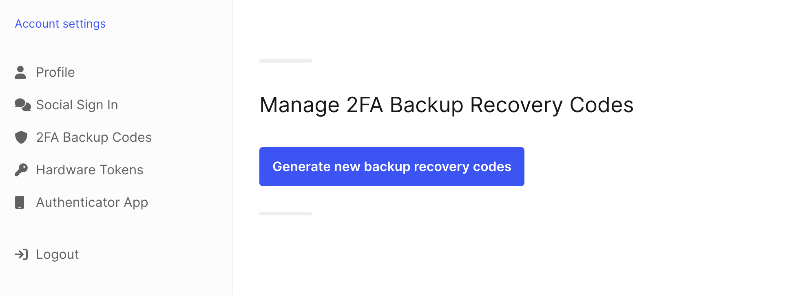
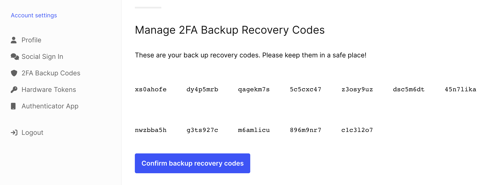
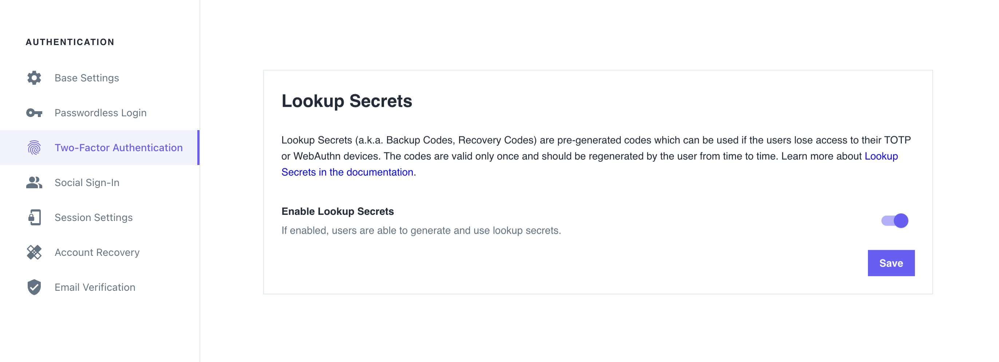

```mdx-code-block
import Tabs from '@theme/Tabs';
import TabItem from '@theme/TabItem';
import BrowserWindow from "@site/src/theme/BrowserWindow"
```

Lookup Secrets, also known as Backup Codes or Recovery Codes, are a 2FA fail-safe mechanism, rather than a standalone two-factor
authentication method. They can be used to complete the second factor when users lose access to their selected 2FA method.

If you enable Lookup Secrets, users can download a server-generated set of one-time codes. The user should store these codes in a
secure place and use them when they cannot use their selected 2FA method.

Each code is valid for single use only. The codes don't expire after a set amount of time. When the user generates a new set of
codes, previously generated codes become invalid.

:::tip

To ensure maximum security, these codes should be periodically re-generated by the user.

:::

If you enable Lookup Secrets, users can get a list of codes that they must store securely for future use. This is how it looks in
the UI:

:::note

The screenshots are captured using the Ory Account Experience.

:::

```mdx-code-block
<BrowserWindow url="https://playground.projects.oryapis.com/ui">



</BrowserWindow>
```

```mdx-code-block
<BrowserWindow url="https://playground.projects.oryapis.com/ui">



</BrowserWindow>
```

After the server generates the codes, the user must confirm that they received them. To confirm, the user must have a privileged
Session. If the privileged session expired, the user is prompted to authenticate.

:::danger

The codes are valid only when the user confirms they received the codes. It is the user's responsibility to generate new secretes
before they use all the available secrets.

:::

## Configuration

```mdx-code-block
<Tabs groupId="console-or-cli">
  <TabItem value="oc" label="Ory Console" default>
```

1. Go to <ConsoleLink route="project.mfa" />.
2. In the **Lookup Secrets** section, use the switch to enable WebAuthn.
3. Click **Save** to finish.

```mdx-code-block
<BrowserWindow url="https://console.ory.com">



</BrowserWindow>
```

```mdx-code-block
</TabItem>
<TabItem value="cli" label="Ory CLI" default>
```

1. Get the Ory Identities configuration from your project and save it to a file:

   ```shell
   ## List all available workspaces
   ory list workspaces

   ## List all available projects
   ory list projects --workspace <workspace-id>

   ## Get config
   ory get identity-config --project <project-id> --workspace <workspace-id> --format yaml > identity-config.yaml
   ```

2. Find `lookup_secret` in `selfservice/methods` and set `enabled` to `true`:

   ```yaml title="identity-config.yaml"
   lookup_secret:
     enabled: true
   ```

3. Update the Ory Identities configuration using the file you worked with:

   ```shell
   ory update identity-config --project <project-id> --workspace <workspace-id> --file identity-config.yaml
   ```

```mdx-code-block
  </TabItem>
</Tabs>
```

## Identity credentials

When the user generates and/or uses Lookup Secrets, Ory adds the following entries to the `credentials` object of the associated
identity:

```yaml
credentials:
  password:
    id: lookup_secret
    identifiers:
      # This is the identity's ID
      - 802471b9-06f5-49d4-a88d-5e7d6bcfed22
    config:
      # highlight-start
      recovery_codes:
        - code: 3zg9abc
        - code: 1bc6bea
          used_at: 2021-10-14T07:38:51Z
      # highlight-end
```
