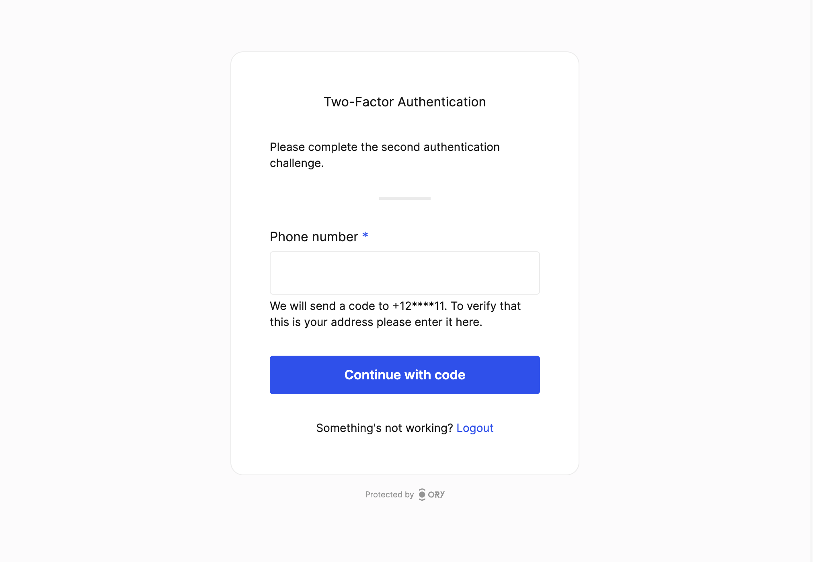

```mdx-code-block
import Tabs from '@theme/Tabs';
import TabItem from '@theme/TabItem';
import BrowserWindow from "@site/src/theme/BrowserWindow"
```

SMS and email can be used to deliver one-time codes to users. Ory will deliver a 6-digit code to an SMS / email gateway of your
choice, such as Twilio, Amazon SNS, SMTP, or your own application. These codes are valid for a short amount of time, usually 15
minutes or less. Once the user completes the challenge, by entering the code, the AAL of the session is upgraded to AAL2.

If MFA via code to sms / email is enabled, this method can not be used for passwordless login.

```mdx-code-block
<BrowserWindow url="https://playground.projects.oryapis.com/ui/login?aal=aal2&via=phone">



</BrowserWindow>
```

## Configuration

To enable MFA via SMS, you need to configure an SMS channel in the Ory configuration:

```mdx-code-block
<Tabs groupId="console-or-cli">
<TabItem value="console" label="Ory Console" default>
```

1. Go to <ConsoleLink route="project.mfa" />.
2. Toggle **Enable one-time code multi factor authentication**.
3. Click **Save**.

```mdx-code-block
  </TabItem>
<TabItem value="cli" label="Ory CLI" default>
```

1. Get the Ory Identities configuration from your project and save it to a file:

   ```shell
   ## List all available workspaces
   ory list workspaces

   ## List all available projects
   ory list projects --workspace <workspace-id>

   ## Get config
   ory get identity-config --project <project-id> --workspace <workspace-id> --format yaml > identity-config.yaml
   ```

2. Find `code` in `selfservice.methods` and set `mfa_enabled` to `true`:

   ```yaml title="identity-config.yaml"
   code:
     mfa_enabled: true
   ```

3. Update the Ory Identities configuration using the file you worked with:

   ```shell
   ory update identity-config --project <project-id> --workspace <workspace-id> --file identity-config.yaml
   ```

```mdx-code-block
  </TabItem>
</Tabs>
```

4. Ensure your Identity Schema correctly marks one of the traits as the identifier for `code` method.

   ```json title="identity.schema.json" {25-28,45-48}
   {
     "$id": "https://schemas.ory.com/presets/kratos/identity.email.schema.json",
     "$schema": "http://json-schema.org/draft-07/schema#",
     "title": "Person",
     "type": "object",
     "properties": {
       "traits": {
         "type": "object",
         "properties": {
           "email": {
             "type": "string",
             "format": "email",
             "title": "E-Mail",
             "ory.com/kratos": {
               "credentials": {
                 "password": {
                   "identifier": true
                 },
                 "webauthn": {
                   "identifier": true
                 },
                 "totp": {
                   "account_name": true
                 },
                 "code": {
                   "identifier": true,
                   "via": "email"
                 }
               },
               "recovery": {
                 "via": "email"
               },
               "verification": {
                 "via": "email"
               }
             },
             "maxLength": 320
           },
           "phone": {
             "type": "string",
             "format": "tel",
             "title": "Phone Number",
             "ory.com/kratos": {
               "credentials": {
                 "code": {
                   "identifier": true,
                   "via": "sms"
                 }
               }
             },
             "maxLength": 320
           }
         },
         "required": ["email"],
         "additionalProperties": false
       }
     }
   }
   ```

5. To configure the SMS or email gateway, please head over to [Sending emails](../emails-sms/01_sending-emails-smtp.mdx) &
   [SMS](../emails-sms/10_sending-sms.mdx)

## Integration

To be able to send codes via SMS, you need to provide a custom SMS sender. Ory simply sends the code, the phone number and other
metadata to a webhook of your choice. Please read the [SMS documentation](../emails-sms/10_sending-sms.mdx).

To start a new MFA flow, for an already existing session, create a new login flow with the `aal` parameter set to `aal2`:

```
https://$PROJECT_SLUG.projects.oryapis.com/self-service/login/browser?aal=aal2
```

or

```
https://ory.your-custom-domain.com/self-service/login/browser?aal=aal2
```
