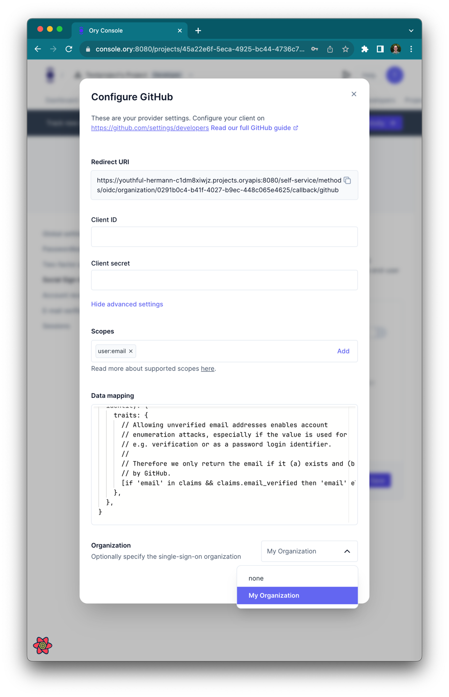

```mdx-code-block
import Mermaid from "@site/src/theme/Mermaid"
```

## Introduction

Organizations are a way to group users together within one project. An organization always belongs to one Ory project. Within a
project, an identity can belong to an organization or remain without an organization. Organizations contain multiple OIDC SSO
connections. All members of an organizations must use one of the organization's OIDC SSO connections to log in.

An organization can have multiple domains. Registrations for email addresses with a domain that belongs to an organization must go
through one of the organization's OIDC SSO connections.

```mdx-code-block
<Mermaid
  chart={`
graph LR
    Project -->|has many| Organization
    Organization -->|has many| Users
    Organization -->|has many| Domain
    Organization -->|has many| Connection
    Users -.->|authenticate| Connection
    Project -.->|Identity pool| Users
    Connection -.- Google
    Connection -.- Okta
    Connection -.- Keycloak
`}
/>
```

## Managing organizations

Organizations can be created, updated, and deleted via the HTTP REST API. The following examples shows how to manage
organizations. Before you can manage organizations, you need to copy the `ory_session_ory` cookie from your browser.

### Create an organization

```shell
# project_id = your project ID
# ory_session_cookie = the value of the ory_session_ory cookie

curl -X POST --location "https://api.console.ory.sh/projects/${project_id}/organizations" \
    -H "Content-Type: application/json" \
    -H "Cookie: ory_session_ory=${ory_session_cookie}" \
    -d "{
          \"domains\": [
            \"my.example.com\"
          ],
          \"label\": \"My Organization\"
        }"

# Returns:
#   {
#     "id": "87a01675-55f4-4b4f-b702-788546536cd0",
#     "project_id": "45a22e6f-5eca-4925-bc44-4736c775e892",
#     "label": "My Organization",
#     "domains": [
#       "my.example.com"
#     ]
#   }
```

### List the project's organizations

```shell
# project_id = your project ID
# ory_session_cookie = the value of the ory_session_ory cookie

curl -X GET --location "https://api.console.ory.sh/projects/${project_id}/organizations" \
    -H "Content-Type: application/json" \
    -H "Cookie: ory_session_ory=${ory_session_cookie}"

# Returns:
#   {
#     "organizations": [
#       {
#         "id": "696778f4-8975-45ad-8809-5433dc0f576e",
#         "project_id": "45a22e6f-5eca-4925-bc44-4736c775e892",
#         "label": "My Organization",
#         "domains": [
#           "my.example.com"
#         ]
#       }
#     ]
#   }
```

### Delete an organization

```shell
# organization_id = your organization ID (from a previous GET request)
# project_id = your project ID
# ory_session_cookie = the value of the ory_session_ory cookie

curl -X DELETE --location "https://api.console.ory.sh/projects/${project_id}/organizations/${organization_id}" \
    -H "Content-Type: application/json" \
    -H "Cookie: ory_session_ory=${ory_session_cookie}"

# Returns an empty response on success
```

## Creating SSO connections for an organization

After creating an organization, continue by adding one or more SSO OIDC connections. In the Ory Console, navigate to
[Authentication > Social Sign-In & SSO (OIDC)](https://console.ory.sh/projects/current/social-signin). From there, add a new
OpenID Connect provider. Under "show advanced settings", configure the organization to use for this connection.



Next, go to your registration page. Entering an email that ends with the organization's domain (`@my.example.com` in the example
above) shows a "Sign in with SSO" button instead of the passowrd field. Clicking it will take you to sign in with the SSO
connection. Also note that the SSO connection is not visible for email addresses that are not managed by the organization.
