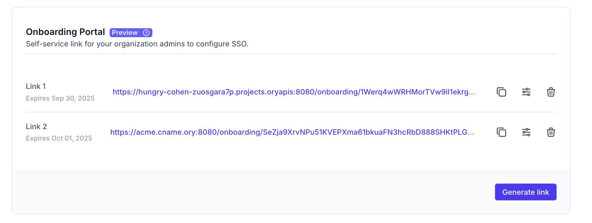

# B2B Single Sign-On & SAML

```mdx-code-block
import Help from '@site/docs/_common/need-help.mdx'

<Help/>
```

```mdx-code-block
import webm from './_static/organizations-ory-network.webm'
import VideoEmbed from '@site/src/components/VideoEmbed'

<VideoEmbed webm={webm} />
```

```mdx-code-block
import Mermaid from "@site/src/theme/Mermaid"
```

Organizations are a way to group users within one project. An organization always belongs to one Ory project. Within a project, an
identity can belong to an organization or remain without an organization. Organizations contain multiple OIDC SSO connections. All
members of an organization must use one of the organization's OIDC SSO connections to log in.

An organization can have multiple domains. Registrations for email addresses with a domain that belongs to an organization must go
through one of the organization's OIDC SSO connections.

Some identity providers do not validate email domain ownership. This can lead to situations where Enterprise SSO with
Organizations is configured for a specified domain such as `@example.com`, but due to this lack of this email domain ownership
validation by the identity provider, a users with other email domains such as `@gmail.com` can still authenticate successfully via
the identity provider.

This will end up with the user being part of the configured organization in your Ory project, even if the domain does not match
any of the configured domains.

```mdx-code-block
<Mermaid
  chart={`
graph LR
    Project -->|has many| Organization
    Organization -->|has many| Users
    Organization -->|has many| Domain
    Organization -->|has many| Connection
    Users -.->|authenticate| Connection
    Project -.->|Identity pool| Users
    Connection -.- Google
    Connection -.- Okta
    Connection -.- Keycloak
`}
/>
```

Organizations require identifier-first authentication and two-step registration when using Account Experience 2.x or Ory Elements
1.x.

## Manage organizations

```mdx-code-block
<Tabs groupId="console-or-api">
<TabItem value="console" label="Ory Console">
```

To create, update, or delete organizations via the Ory Console, go to

<ConsoleLink route="project.authentication.organizations" />.

```mdx-code-block
</TabItem>

<TabItem value="api" label="API">
```

Organizations can also be managed using the Ory API. To authenticate your requests, create a
[workspace API key](/concepts/personal-access-token#authorizing-ory-network-workspace-admin-apis).

All examples below use [curl](https://curl.se/) to make HTTP requests. You can use any HTTP client to make these requests.

Before copy & pasting the following examples, export your `PROJECT_ID` and `WORKSPACE_API_KEY`:

```shell
export PROJECT_ID="..."
export WORKSPACE_API_KEY="ory_wak_..."
```

#### List organizations

```shell
curl -X GET --location "https://api.console.ory.sh/projects/$PROJECT_ID/organizations" \
     -H "Authorization: Bearer $WORKSPACE_API_KEY"
```

#### Create an organization

```shell
curl -X POST --location "https://api.console.ory.sh/projects/$PROJECT_ID/organizations" \
     -H "Authorization: Bearer $WORKSPACE_API_KEY" \
     -H "Content-Type: application/json" \
     -d '{
           "label":  "Hello demo",
           "domains": ["test.example.com"]
         }'
```

#### Get an organization

```shell
curl -X GET --location "https://api.console.ory.sh/projects/$PROJECT_ID/organizations/$ORGANIZATION_ID" \
     -H "Authorization: Bearer $WORKSPACE_API_KEY"
```

#### Delete an organization

```shell
curl -X DELETE --location "https://api.console.ory.sh/projects/$PROJECT_ID/organizations/$ORGANIZATION_ID" \
     -H "Authorization: Bearer $WORKSPACE_API_KEY"
```

```mdx-code-block
</TabItem>
</Tabs>
```

## Create SSO connections for an organization

After creating an organization, continue by adding one or more SSO OIDC connections.

```mdx-code-block
<Tabs groupId="console-or-api">
<TabItem value="console" label="Ory Console">
```

Go to <ConsoleLink route="project.authentication.organizations" /> and continue by configuring the selected organization.

```mdx-code-block
</TabItem>

<TabItem value="api" label="API">
```

The SSO connections are part of the project configuration. To authenticate, use the same workspace API key as for managing
organizations. The examples use [curl](https://curl.se/) to make HTTP requests and [jq](https://jqlang.github.io/jq/) to parse
JSON response.

#### Create an SSO connection

```shell
curl -X PATCH --location "https://api.console.ory.sh/projects/$PROJECT_ID" \
     -H "Authorization: Bearer $WORKSPACE_API_KEY" \
     -H "Content-Type: application/json" \
     -d '[
           {
             "op": "add",
             "path": "/services/identity/config/selfservice/methods/oidc/config/providers/-",
             "value": {
               "client_id": "...",
               "client_secret": "...",
               "id": "ory-GPx1yPH4",
               "issuer_url": "https://example.org",
               "label": "My OIDC provider",
               "mapper_url": "base64://ZnVuY3Rpb24oY3R4KSBjdHg=",
               "organization_id": "6bb1c7d1-3b3e-4995-9e09-35649dc45a2b",
               "provider": "generic",
               "pkce": "auto", # or "force", "never", see note on redirect URL below
               "scope": ["openid", "offline_access", "email"]
             }
           }
         ]' \
   | jq ".project.services.identity.config.selfservice.methods.oidc.config.providers"
```

Some notes on the fields of the JSON payload:

- `client_id` and `client_secret` are the credentials of the OIDC provider.
- `id` is a unique identifier for the connection, and part of the redirect URL, and can be a random string. This is `$PROJECT_ID`
  below.
- `organization_id` is the ID of the organization to which the connection belongs, and part of the redirect URL. This is
  `$ORGANIZATION_ID` below.
- `mapper_url` is the URL to a JSONnet file that maps the OIDC provider's claims to Ory's identity schema. You can use the
  `base64` scheme to embed the JSONnet file directly in the JSON payload.
- `pkce` determines whether Ory Identities will use PKCE during the OIDC flow. See the note below and the
  [PKCE documentation](../social-signin/oidc-pkce.mdx) for details.

:::tip

The redirect URL to be set in the external OIDC provider's configuration is
`https://$PROJECT_SLUG.projects.oryapis.com/self-service/methods/oidc/organization/$ORGANIZATION_ID/callback/$PROVIDER_ID`.

If you set `pkce: force`, you must whitelist a different redirect URL with the OIDC provider:
`https://$PROJECT_SLUG.projects.oryapis.com/self-service/methods/oidc/callback`.

See the [PKCE documentation](../social-signin/oidc-pkce.mdx) for details.

:::

#### List SSO connections

```shell
curl -X GET --location "https://api.console.ory.sh/projects/$PROJECT_ID" \
     -H "Authorization: Bearer $WORKSPACE_API_KEY" \
   | jq ".services.identity.config.selfservice.methods.oidc.config.providers"
```

Result:

```json
[
  {
    "client_id": "...",
    "client_secret": "...",
    "id": "ory-GPx1yPH4",
    "issuer_url": "https://example.org",
    "label": "My OIDC provider",
    "mapper_url": "https://storage.googleapis.com/bac-gcs-production/94292215dbabe405bebff988b5356663fcf5cba35b10fc6ca2cfea7bc7049e906e01d271a3daeb844203efdfbf2cff356274daa63d5afc2a379bbe93b8b40e63.jsonnet",
    "organization_id": "6bb1c7d1-3b3e-4995-9e09-35649dc45a2b",
    "provider": "generic",
    "scope": ["openid", "offline_access", "email"]
  }
]
```

#### Delete an SSO connection

To delete an organization, you need to specify the index of the connection in the `path` field. The index is the position of the
SSO connection in the list of connections.

```shell
curl -X PATCH --location "https://api.console.ory.sh/projects/$PROJECT_ID" \
     -H "Authorization: Bearer $WORKSPACE_API_KEY" \
     -H "Content-Type: application/json" \
     -d '[
           {
             "op": "remove",
             "path": "/services/identity/config/selfservice/methods/oidc/config/providers/0"
           }
         ]' \
   | jq ".project.services.identity.config.selfservice.methods.oidc.config.providers"
```

Note that the `organization_id` field contains the organization ID to which the connection belongs.

### See it live

After having set up everything, go to your registration page. Entering an email that ends with the organization's domain, such as
`@my.example.com` from the example above, shows a **Sign in with SSO** button instead of the password field. Clicking it will take
you to sign in with the SSO connection. The SSO connection is not visible for email addresses that are not managed by the
organization.

```mdx-code-block
</TabItem>
</Tabs>
```

## Pre-provisioning identities in an organization

After creating an organization, you can pre-provision identities in it. This is useful when you need to create related data in
your system but need the identity to be created in Ory Network first, before the user logs in for the first time.

To achieve this, set the `organization_id` property to the ID of the created organization in the identity, either when creating
the identity, or by updating the identity's data using the Ory APIs.

## SAML

SAML (Security Assertion Markup Language) is an XML-based open standard used for exchanging authentication and authorization data
between parties. The SAML integration in Ory Network uses the B2B Organization feature.

### SAML via Ory Network

This guide will walk you through the steps required to set up SAML Single Sign-On (SSO) with Ory Network.

#### Prerequisites

Before proceeding, ensure you are on a plan that supports SAML SSO. SAML is available exclusively on select Enterprise plans.
[Contact us](https://www.ory.sh/contact/) if you need SAML support.

```mdx-code-block
<Tabs groupId="console-or-api">
<TabItem value="console" label="Ory Console">
```

1. Go to <ConsoleLink route="project.authentication.organizations" /> to create an organization.
2. Select "Add a new Enterprise SAML SSO connection" and follow the instructions to configure the SAML connection. Fill out the
   following form fields:

- **Label**: A descriptive name for the SAML connection. This will be displayed to users.
- **Data mapping**: A mapping from the SAML attributes to Ory's identity schema.
- **Raw IDP metadata XML**: The XML metadata file from your SAML Identity Provider (IdP).

3. Navigate to your login screen to test the SAML connection.

```mdx-code-block
</TabItem>
<TabItem value="api" label="API">
```

#### Create an organization

```shell
curl -X POST --location "https://api.console.ory.sh/projects/$PROJECT_ID/organizations" \
     -H "Authorization: Bearer $WORKSPACE_API_KEY" \
     -H "Content-Type: application/json" \
     -d '{
           "label":  "SAML organzation",
           "domains": ["example.com"]
         }'
```

#### Enable SAML authentication

```shell
curl -X PATCH --location "https://api.console.ory.sh/projects/$PROJECT_ID" \
     -H "Authorization: Bearer $WORKSPACE_API_KEY" \
     -H "Content-Type: application/json" \
     -d '[
           {
             "op": "replace",
             "path": "/services/identity/config/selfservice/methods/saml/enabled",
             "value": true
           }
         ]' \
   | jq ".project.services.identity.config.selfservice.methods.saml"
```

#### Create a SAML connection

```shell
curl -X PATCH --location "https://api.console.ory.sh/projects/$PROJECT_ID" \
     -H "Authorization: Bearer $WORKSPACE_API_KEY" \
     -H "Content-Type: application/json" \
     -d '[
           {
             "op": "add",
             "path": "/services/identity/config/selfservice/methods/saml/config/providers/-",
             "value": {
               "id": "some-provider-id",
               "label": "My SAML provider",
               "mapper_url": "base64://...",
               "raw_idp_metadata_xml": "base64://...",
               "organization_id": "$ORGANIZATION_ID"
             }
           }
         ]' \
   | jq ".project.services.identity.config.selfservice.methods.saml"
```

- **label**: A descriptive name for the SAML connection. This will be displayed to users.
- **mapper_url**: A mapping from the SAML attributes to Ory's identity schema.
- **raw_idp_metadata_xml**: The XML metadata file from your SAML Identity Provider (IdP).

```mdx-code-block
</TabItem>
</Tabs>
```

The SAML application callback URL to set at our SAML Identity Provider is: `https://api.console.ory.sh/saml/api/oauth/saml`

#### Data mapping

You can configure the mapping of SAML attributes to Ory's identity schema using Jsonnet. All custom SAML attributes defined at the
Identity Provider (IdP) will be available in the `raw_claims` object within `claims`. These attributes can then be mapped to the
Ory identity schema.

:::warning

Ensure that the appropriate identity schema is created before mapping attributes. The email attribute is natively available in
`claims.email`, everything else is nested under `claims.raw_claims`.

:::

#### Example SAML data mapping

Mapping `firstName` and `lastName` from the SAML Identity Provider to the Ory identity schema (traits).

```jsonnet
local claims = std.extVar('claims');

{
  identity: {
    traits: {
      email: claims.email,
      [if std.objectHas(claims, "raw_claims") && std.objectHas(claims.raw_claims, "firstName") then "firstName" else null]: claims.raw_claims.firstName,
      [if std.objectHas(claims, "raw_claims") && std.objectHas(claims.raw_claims, "lastName") then "lastName" else null]: claims.raw_claims.lastName,
    },
  },
}
```

## Onboarding portal

:::note

Before proceeding, ensure you are on a plan that supports onboarding portal. It is available exclusively on select enterprise
plans. The portal requires that you enable Account Experience 2.0. Please contact us [Ory Support](mailto:support@ory.sh) if you
have any questions or feedback.

:::

Onboarding portal is a powerful tool designed to simplify complex identity and access management tasks for businesses and their
partners.

### Streamline organization onboarding

The onboarding portal addresses the often-burdensome process of setting up and managing identity connections with external
organizations. Traditionally, integrating with a customer's or partner's identity provider (IdP) for single sign-on (SSO) or
synchronizing user directories involves manual, error-prone configurations. This often requires deep technical expertise in
protocols such as SAML.

Onboarding portal aims to:

- Simplify complex integrations: By providing a self-service or guided onboarding experience, they abstract away the underlying
  technical complexities of SAML. This means IT administrators on the client side don't need to be SAML experts to connect their
  organization's identity system.
- Reduce onboarding time: Instead of lengthy back-and-forth communication and manual configuration, an onboarding portal link
  allows an external administrator to configure the connection directly through a user-friendly interface. This drastically
  reduces the time and effort required to establish new B2B integrations.
- Enhance security and control: Onboarding portal links are designed to be shareable without exposing sensitive information. The
  administrator receiving the link can configure their side of the connection securely, maintaining control over their IdP
  settings while establishing a trusted connection with your application.
- Enable Self-Service for Organizations: For SaaS providers, this means empowering your customers to self-onboard and manage their
  own SSO connections, freeing up your engineering and support teams. Support Scalability for B2B Models: As your application
  grows and serves more enterprise clients, manually managing each integration becomes unsustainable. These features provide a
  scalable solution for onboarding and managing a large number of organizational customers.
- Validate SSO Connections instantly: The onboarding portal includes the ability to immediately test the configured SSO
  connection. This allows IT administrators to verify that the integration works as expected before deploying it to their users,
  reducing troubleshooting time and ensuring a smooth rollout.

These features are relevant for:

- SaaS (Software-as-a-Service) providers: SaaS companies offer services to other businesses (B2B) or to businesses that then serve
  their own customers (B2B2C). This is crucial for enabling enterprise clients to use their existing corporate identity systems
  (for example, Microsoft Entra ID, Okta, Google Workspace) for seamless access to the SaaS application.
- Enterprise IT administrators: These individuals in your customer organizations are responsible for managing their internal
  identity providers and user directories. They use the onboarding portal to configure the connection to your application.
- Developers and architects building multi-tenant applications: These individuals implement robust and scalable identity
  management for applications that serve multiple organizations. Each organization has its own authentication and user
  provisioning requirements.

Current limitations:

- The onboarding portal currently supports all well known providers. You can also connect all SAML/OIDC-compliant providers using
  the Generic SAML/OIDC IdP option. If you don't find your provider listed, please [contact us](https://www.ory.sh/contact/).

### Manage onboarding portal links

```mdx-code-block
<Tabs groupId="console-or-api">
<TabItem value="console" label="Ory Console">
```

#### Create a link

Go to <ConsoleLink route="project.authentication.organizations" /> and continue by configuring the selected organization.

In the **Edit Organization** page, under the **Onboarding Portal** section, click **Generate link** to create a link. You can then
share this link with the organization admins.

```mdx-code-block
import BrowserWindow from "@site/src/theme/BrowserWindow"

<BrowserWindow url="https://console.ory.sh/projects/<id>/authentication/organizations/<id>/edit">
    
</BrowserWindow>
```

```mdx-code-block
</TabItem>
<TabItem value="api" label="API">
```

Onboarding portal links can also be managed using the Ory API. To authenticate your requests, create a
[workspace API key](/concepts/personal-access-token#authorizing-ory-network-workspace-admin-apis). All examples below use curl to
make HTTP requests. You can use any HTTP client to make these requests. Before copy & pasting the following examples, export your
PROJECT_ID,ORGANIZATION_ID and WORKSPACE_API_KEY:

#### Create an onboarding portal link

```shell
curl -X POST --location "https://api.console.ory.sh/projects/$PROJECT_ID/organizations/$ORGANIZATION_ID/onboarding-portal-links" \
     -H "Authorization: Bearer $WORKSPACE_API_KEY" \
     -H "Content-Type: application/json" \
     -d '{
           "expires_at": "2025-06-01T00:00:00Z",
           "enable_sso": true
         }'
```

Result:

```json
{
  "id": "d36ad207-e1a8-4eac-bc1b-c25e223cc15b",
  "value": "Fhca7DvuRLjQpDslMpYHMfsqSoy7vbI92PAxNlziZDidGBiW",
  "project_id": "836b03f7-fdce-466a-9407-8595a0f615ce",
  "organization_id": "517cc5e7-1ab6-4dcf-ba02-00fad003af92",
  "enable_sso": true,
  "created_at": "2025-06-02T05:23:45.299988Z",
  "expires_at": "2025-06-03T05:23:45Z"
}
```

The response contains a `value` token that you can use to construct the onboarding portal link as follows:

`https://your-slug.projects.oryapis.com/onboarding/<value>`

#### Delete an onboarding portal link

```shell
curl -X DELETE --location "https://api.console.ory.sh/projects/$PROJECT_ID/organizations/$ORGANIZATION_ID/onboarding-portal-links/$ONBOARDING_PORTAL_LINK_ID" \
     -H "Authorization: Bearer $WORKSPACE_API_KEY"
```

#### List onboarding portal links

```shell
curl -X GET --location "https://api.console.ory.sh/projects/$PROJECT_ID/organizations/$ORGANIZATION_ID/onboarding-portal-links" \
     -H "Authorization: Bearer $WORKSPACE_API_KEY"
```

Result:

```json
{
  "links": [
    {
      "id": "d6458578-dbeb-45ee-95e7-3b98168ff313",
      "value": "eHSoZlTTffFP76ns0DOqBI8CT2daCXqRqO3MSVFi7eEbaRIu",
      "project_id": "836b03f7-fdce-466a-9407-8595a0f615ce",
      "organization_id": "517cc5e7-1ab6-4dcf-ba02-00fad003af92",
      "enable_sso": true,
      "created_at": "2025-06-02T05:44:24.883665Z",
      "expires_at": "2025-06-03T05:44:24Z"
    }
  ]
}
```

```mdx-code-block
</TabItem>
</Tabs>
```

#### Expiry

The link generated from the Ory Network Console expires in 7 days. The API allows you to set an expiration value with a minimum
expiry of 1 day. Once the link expires, it no longer works. You can also delete the link and generate a new one.

#### Handover and using the portal

Once you generate the link, share it with the organization's administrator. They can access this link multiple times until its
expiration to manage (add, edit, or delete) the organization's SSO connections.

```mdx-code-block

<BrowserWindow url="https://<your-slug>.projects.oryapis.com/onboarding/<unique-token>">
    
</BrowserWindow>
```
