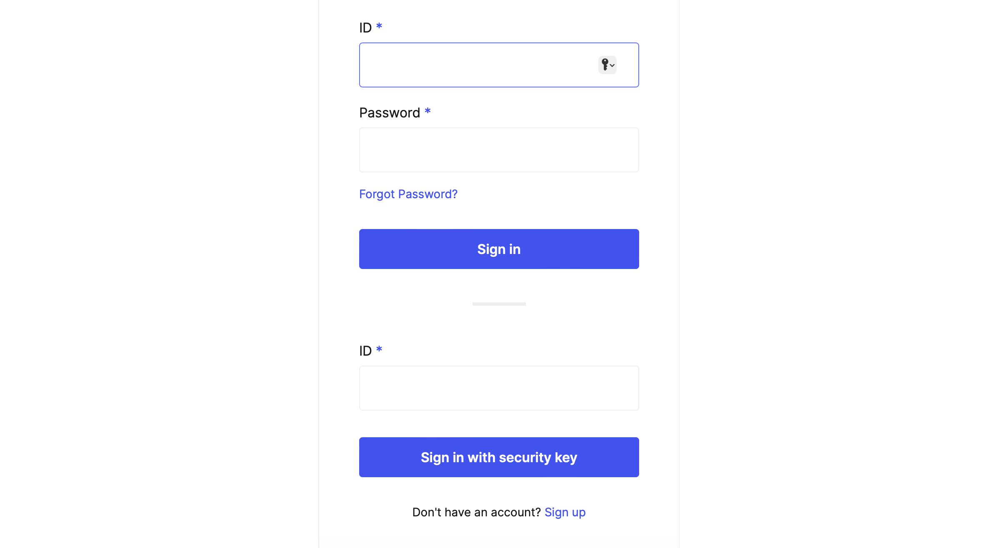
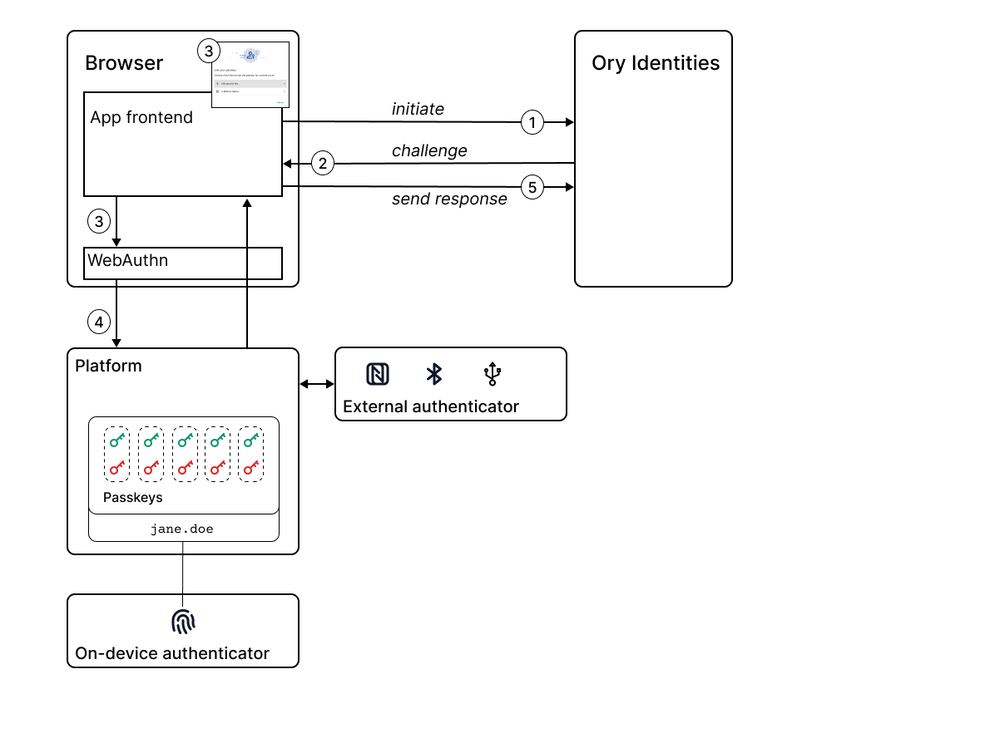

Read this document if:

- You want to learn more about passwordless authentication before deciding whether to use it in your application or starting to
  code.
- You've heard about passwordless authentication as a potential solution to protect your system against phishing attacks and would
  like to learn more about how Ory supports this solution.
- You'd like to avoid using a traditional password-based solution since phishing attacks have been a threat for your users in the
  past.

Passwordless authentication is intended to replace traditional password-based authentication, enabling users to verify their
identity using authenticators bound to the device they are using such as biometrics or hardware tokens. Passkeys and passwordless
authentication via WebAuthn is a technology based on the specifications published by the
[FIDO Alliance](https://fidoalliance.org/), sponsored by software companies with an interest in security technology and standards.

## How does Ory support passwordless authentication?

Ory's self-service flows support passwordless authentication for browser-based apps by integrating with the
[W3C Web Authentication (WebAuthn) API](https://developer.mozilla.org/en-US/docs/Web/API/Web_Authentication_API) for browsers.
After enabling it in Ory, the Ory Account Experience automatically presents passwordless as an option in the registration and
login flows. When developing your own authentication UI for a browser-based app, the steps for integrating your application with
the passwordless registration and login flows are described
[in the documentation](../bring-your-own-ui/custom-ui-advanced-integration).

There are two different classes of authenticators that can be used with passwordless:

- **On-device authenticator:** an authenticator available directly on the device you are using, for example fingerprint or facial
  recognition on a mobile phone.
- **External authenticator:** an authenticator provided by an external device, such as a Yubikey or a NFC device.

The user experiences the passwordless login flow as follows.

```mdx-code-block
import Tabs from '@theme/Tabs';
import TabItem from '@theme/TabItem';

<Tabs>
<TabItem value="on-device" label="On-device authenticator" default>

1. Ory's self-service login flow presents an option to log in using passwordless (below the option for signing in with a password).
   
2. To sign in with passwordless, the user enters their ID and clicks the **Sign in with security key** button.
3. The Ory Account Experience displays the sign-in preparation dialog, which gives the user time to prepare the physical device for passwordless login. The user clicks **Continue** to proceed to the next step.
4. The platform verifies the user's identity using the chosen method.
5. Login completes automatically.

</TabItem>
<TabItem value="external" label="External authenticator">

1. Ory's self-service login flow presents an option to log in using passwordless.
2. To sign in with passwordless, the user enters their ID and clicks the **Sign in with security key** button.
3. The Ory Account Experience displays the sign-in preparation dialog, which gives the user time to prepare the physical device for passwordless login. The user clicks **Continue** to proceed to the next step.
4. The user chooses the external authenticator to use for sign-in (for example, a USB security key).
   
4. The platform verifies the user's identity using the chosen method.
   
5. Login completes automatically.

</TabItem>
</Tabs>
```

### Authenticator options for passwordless

Authenticators for passwordless are designed to be easy to use. For example, biometric authenticators are a popular option.

Here are some of the current authenticator options for passwordless:

- **On-device authenticators**
  - Fingerprint (Apple TouchID, Windows Hello)
  - Facial recognition (Apple FaceID, Windows Hello)
  - Iris scan (Windows Hello)
  - Voice recognition
  - Handwriting recognition
  - Device unlock
- **External authenticators**
  - USB key (YubiKey)
  - NFC devices
  - Bluetooth Low Energy (BLE) devices

### Resistance to phishing

The core idea of a phishing attack is to trick a user somehow into giving up their password to the attacker, typically by luring
the user to a fake website where they are persuaded to log in, enabling the attacker to steal the password from the login
credentials.

Passwordless authentication via WebAuthn is resistant to phishing attacks because it eliminates shared secrets during login,
verifies the domain, and prevents password reuse.

- No shared secrets during login: WebAuthn leverages Public Key Infrastructure (PKI) to establish a unique keypair for each web
  application where the public key is held by the web app and the private key is stored in a user-controlled device.

- Domain verification: The server domain is used by the client to request the authenticator to sign the login request, ensuring
  that the credential provided by the authenticator is only valid for the specific site visited.

- No password reuse: WebAuthn prevents the vulnerability of "same password everywhere" commonly exploited in phishing attacks and
  prevents impact on other web apps in case of a breach by using a unique public key for each app.

## How does passwordless work?

Passwordless authentication via WebAuthN achieves ease of use without compromising security too much by building on the following
insights:

- The device you are using such as a mobile phone or PC already has built-in capabilities for verifying your identity. There is no
  need to duplicate the procedure for identity verification when the device already has this capability.
- Symmetric key authentication is an existing and proven technology, which has better security characteristics than password-based
  authentication. The FIDO alliance set itself the goal of automating symmetric key technology, making it more user friendly.

Consider the following diagram, which illustrates the passwordless WebAuthN login flow.



The main steps in the passwordless login flow are, as follows:

1. In the frontend app, a user enters their ID and clicks the **Sign in with security key** button, which initiates the
   passwordless login flow on Ory Identities.
2. Ory Identities sends a cryptographic challenge consisting of unique, random data - also known as a _nonce_ - to the frontend
   app.
3. The frontend app requests verification of the user's identity by calling the WebAuthn API. WebAuthn automatically opens a
   dialog in the browser, asking the user to choose an authenticator.
4. WebAuthn delegates identity verification to the browser, passing the challenge and the choice of authenticator to the browser.
   The browser invokes the chosen authenticator to verify the user's identity.
   - **On-device authenticator:** If the user authenticates successfully, the platform selects the key pair that matches this app
     and uses the private key to sign the challenge.
   - **External authenticator:** Identity verification is delegated to the external device, which holds the private key that is
     used to sign the challenge.

5. The browser returns the cryptographic response - the signed challenge - to the frontend app, which forwards it on to Ory
   Identities. Ory Identities uses the public key from the user account to verify the cryptographic response. The public key gets
   stored in Ory Identities when the user signs up.

:::note

Neither the public key nor the private key are exposed to the app during this authentication flow. The only time the public key is
sent over the network is during the registration flow, at which point the server stores the public key in the database entry for
the user's account. The corresponding passkey (private key) never leaves the keychain on the user's device.

:::

## How passkeys and passwordless are related

Passkey-based authentication and passwordless authentication are often talked about together. But if you are new to passwordless,
it's not always clear how these concepts are related. At some level, passkeys are always involved in the passwordless
authentication process, in one of the following ways:

- **Implicit use of passkeys** - for example, when a user authenticates using fingerprint recognition or face recognition, the
  platform implicitly creates a symmetric key pair, but this detail is hidden from the user.
- **Explicit use of passkeys** - for example, when a user authenticates using a USB key, which has a private key embedded in the
  physical USB key.

## Logging in with a passkey across multiple devices

If you need to log in with a passkey across multiple devices, the following options are supported by passwordless:

- One-off authentication using an external device
- Secure transfer of the passkey to the new device
- Platform-specific passkey sharing between devices

### One-off authentication using an external device

Passkeys can be used to perform login across devices. WebAuthn defines a protocol for performing passkey authentication remotely
over a secured BLE connection.

For example, consider the case where the passkey for a particular application is stored in the Android OS on your mobile phone. If
you need to log into the application from a PC, you can use the passkey on your mobile phone to verify your identity. In this
case, you select a BLE (Bluetooth Low Energy) device as the external authenticator on the PC and, after pairing your phone with
the PC, you are prompted to verify your identity on the mobile phone. This authentication step is a one-off and the passkey is not
transferred to the PC.

Using this remote authentication protocol, you can use your mobile phone as an external authenticator for any device that supports
WebAuthn, without leaving any trace of your credentials on that device.

### Secure transfer of the passkey to a new device

On the other hand, if you want to transfer passkey credentials from your mobile phone to your PC, this is also supported by the
FIDO standard. Support for this feature is not available on all platforms, however, as it is a recent addition to the standard.

For example, consider the case where a passkey for a particular application is stored on your mobile phone, but you also want to
have this passkey available on your personal laptop, so that you don't need to take out your phone every time you log in from your
laptop. If your platform has support for this, you see an option to securely transfer the passkey to your laptop, while performing
remote authentication over BLE. If you choose to transfer the passkey, it will be stored permanently (and securely) on your
laptop's OS and in future you will be able to log in to the application directly from your laptop.

### Platform-specific passkey sharing between devices

If all of your devices belong to the same platform ecosystem such as Android, macOS, or Windows, you might find there is a
platform-specific mechanism available for sharing passkeys securely between devices. For example, the Apple iCloud Keychain is
capable of sharing passkeys for passwordless login across multiple Apple devices assuming these devices have access to the same
Apple iCloud account.
