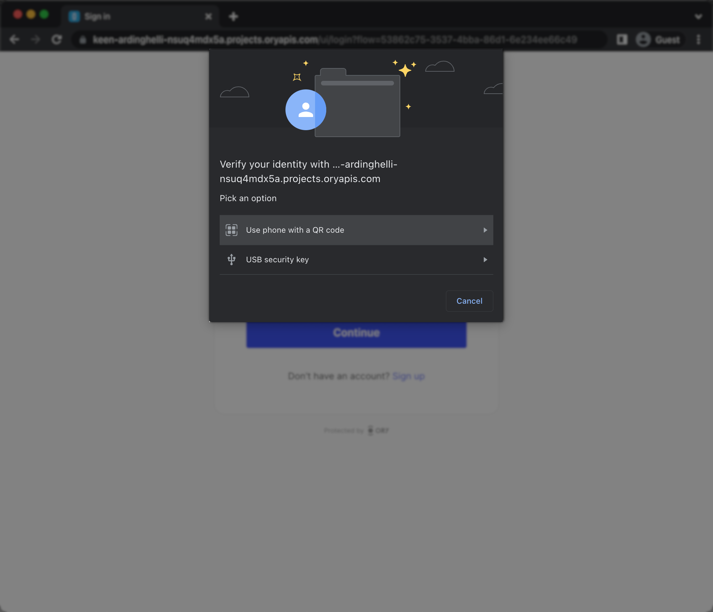

# WebAuthn

The [Web Authentication Browser API (WebAuthn)](https://w3c.github.io/webauthn/) is a specification written by
[W3C](https://www.w3.org/) and [FIDO](https://fidoalliance.org/). The WebAuthn API allows servers to register and authenticate
users using public key cryptography instead of passwords.

WebAuthn is commonly used with:

- USB, NFC or Bluetooth Low Energy devices, for example [YubiKey](https://www.yubico.com)
- Built-in OS biometric authentication platforms such as TouchID, FaceID, Windows Hello, Android Biometric Authentication

When the end-user triggers the WebAuthn process, the browser shows WebAuthn prompt. The prompt looks different depending on the
used browser. This is a Chrome example:

```mdx-code-block
import BrowserWindow from "@site/src/theme/BrowserWindow"

<BrowserWindow url="https://ory.yourapp.com/">



</BrowserWindow>
```

:::tip

Ory's WebAuthn implementation can be used for both multi-factor authentication and passwordless authentication. You need to
configure whether WebAuthn is used for passwordless, or for multi-factor authentication. Read more on
[Multi-factor with WebAuthn](../mfa/20_webauthn-fido-yubikey.mdx).

:::

## Configuration

By default, passwordless with WebAuthn is disabled. To start using WebAuthn, apply this configuration:

```mdx-code-block
import CodeBlock from '@theme/CodeBlock'
import Tabs from '@theme/Tabs';
import TabItem from '@theme/TabItem';

<Tabs>
  <TabItem value="cloud" label="Ory CLI">
    <CodeBlock language="shell">{`ory patch identity-config <your-project-id> \\
  --add '/selfservice/methods/webauthn/enabled=true' \\
  --add '/selfservice/methods/webauthn/config/passwordless=${props.passwordless || false}' \\
  --add '/selfservice/methods/webauthn/config/rp/display_name="My Display Name"'`}</CodeBlock>
  </TabItem>
  <TabItem value="macos" label="Full Config" default>
    <CodeBlock language="yaml" title="config.yml">{`selfservice:
  methods:
    webauthn:
      enabled: true
      config:
        # If set to true will use WebAuthn for passwordless flows intead of multi-factor authentication.
        passwordless: ${props.passwordless || false}
        rp:
          # This MUST be your root domain (not a subdomain)
          id: example.org
          # This MUST be the exact URL of the page which will prompt for WebAuthn!
          # Only the scheme (https / http), host (auth.example.org), and port (4455) are relevant. The
          # path is irrelevant
          origin: http://auth.example.org:4455
          # A display name which will be shown to the user on her/his device.
          display_name: Ory`}</CodeBlock>
  </TabItem>
</Tabs>
```

:::caution

Once `passwordless` is set to either `true` or `false`, avoid changing it. Doing so may lock some users out of their accounts.

:::

### (Custom) identity schema

All Ory identity schema presets are WebAuthn-ready.

If you want to use a custom identity schema, you must define which field of the identity schema is the primary identifier for
WebAuthn.

:::note

This is used for WebAuthn both in passwordless flows and multi-factor authentication.

:::

```json5 title="identity.schema.json" {16-18}
{
  $schema: "http://json-schema.org/draft-07/schema#",
  type: "object",
  properties: {
    traits: {
      type: "object",
      properties: {
        email: {
          type: "string",
          format: "email",
          title: "Your E-Mail",
          minLength: 3,
          "ory.sh/kratos": {
            credentials: {
              // ...
              webauthn: {
                identifier: true,
              },
            },
            // ...
          },
        },
        // ...
      },
      // ...
    },
  },
}
```

## Constraints

- WebAuthn is a browser standard. It does not work in native mobile apps.
- WebAuthn is limited to one domain and does not work in a local environment when using CNAME / Ory Proxy. WebAuthn uses the
  `https://origin` URL as part of the client<->server challenge/response mechanism. This mechanism allows for only one URL as the
  origin. Read more in the [WebAuthN guide](https://webauthn.guide/) and on [GitHub](https://github.com/w3c/webauthn/issues/1372).
- Implementing WebAuthn in your own UI can be challenging, depending on which framework to use. Check our reference
  implementations: [React Native](https://github.com/ory/kratos-selfservice-ui-react-native),
  [Node.js](https://github.com/ory/kratos-selfservice-ui-node), [React/SPA](https://github.com/ory/react-nextjs-example)
