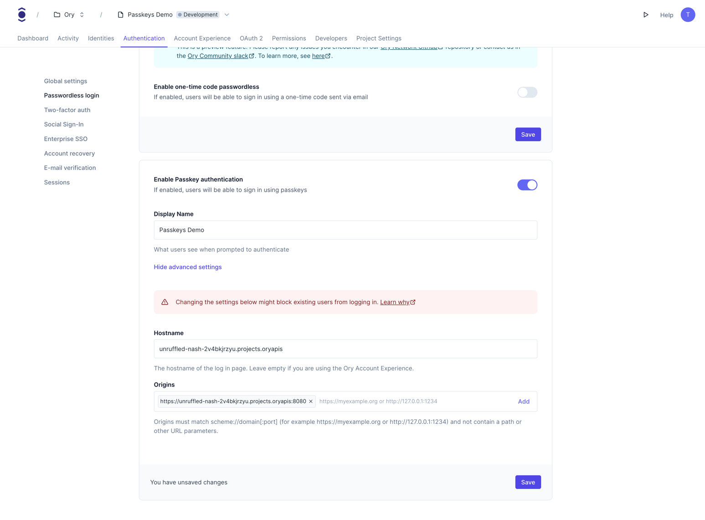
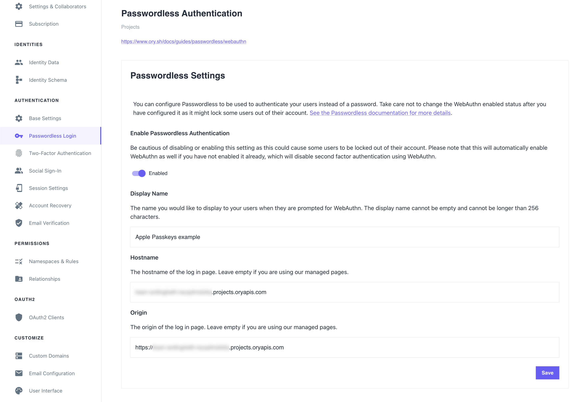
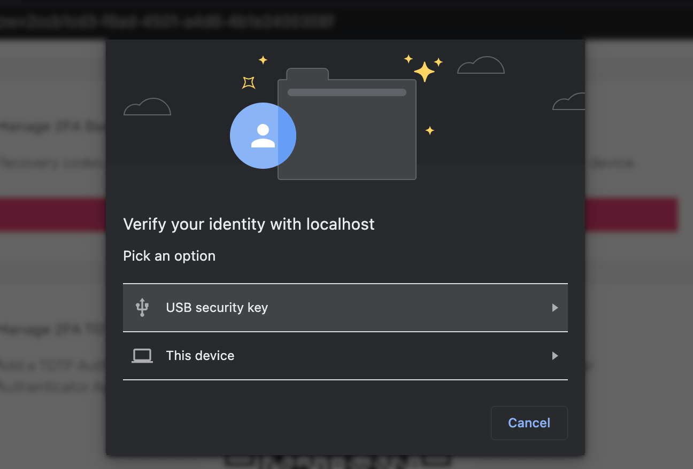

import CodeBlock from "@theme/CodeBlock"
import Tabs from "@theme/Tabs"
import TabItem from "@theme/TabItem"

# Passkeys & WebAuthN

The [Web Authentication Browser API (WebAuthn)](https://w3c.github.io/webauthn/) is a specification written by
[W3C](https://www.w3.org/) and [FIDO](https://fidoalliance.org/). The WebAuthn API allows servers to register and authenticate
users using public key cryptography instead of passwords.

Passkeys use the WebAuthn standard to generate and manage cryptographic key pairs for users.
[Passkeys](https://fidoalliance.org/passkeys/) are, as described by the [FIDO Alliance](https://fidoalliance.org/), "a password
replacement that provides faster, easier, and more secure sign-ins to websites and apps across a user's devices."

:::info

WebAuthn is the underlying technology that allows passwordless authentication using public key cryptography.  
Passkeys are a more user-friendly implementation of WebAuthn.

:::

## Passkeys

Passkeys are a method for registering and signing in users without passwords. Passkeys are an industry-accepted and adopted
standard, which means that all of your users will be able to use this feature, no matter the hardware they work with.

Notable adopters of passkeys include:

- Apple with [Apple Passkeys](https://support.apple.com/en-us/HT213305)
- [Google](https://developers.google.com/identity/passkeys/supported-environments)
- [Microsoft](https://www.microsoft.com/en-us/security/blog/2022/05/05/this-world-password-day-consider-ditching-passwords-altogether/)
- [Meta](https://www.threads.net/@wcathcart/post/Cyd27d7pex8)

While companies can add proprietary features to passkeys, such as iCloud synchronization in Apple Passkeys or Google Password
Manager synchronization for Android devices, all of them use the same FIDO standard. This means that enabling passkeys is a
simple, one-time operation in Ory.

:::tip

To learn more about passkeys and see sample flows for different platforms, watch this FIDO Alliance video:

<iframe width="560" height="315" src="https://www.youtube.com/embed/SWocv4BhCNg" frameBorder="0" allowFullScreen />

:::

## Choose passkey strategy

Ory Network implements a dedicated passkey strategy that improves the ergonomics over using the webauthn strategy for first-factor
login. Here is a comparison of the two approaches:

|                                                                                                                            | Webauthn passwordless login | Passkey strategy |
| -------------------------------------------------------------------------------------------------------------------------- | --------------------------- | ---------------- |
| **Discoverable credentials:** The browser automatically discovers which credentials the user has stored for the site.      | ❌                          | ✔︎              |
| **Conditional UI:** The browser attaches an autofill dropdown to the email field that allows the user to select a passkey. | ❌                          | ✔︎              |
| **Backwards compatibility:** Works for users that have a passkey configured with the WebAuthN strategy.                    | ✔︎                         | ❌               |

## Passkeys with the dedicated passkey strategy

### Configuration

By default, the passkey strategy is disabled. Go to <ConsoleLink route="project.passwordless" /> and toggle the switch for
**Enable Passkey authentication** to enable it.

```mdx-code-block
<BrowserWindow url="https://console.ory.com/projects/current/passwordless">



</BrowserWindow>
```

Alternatively, use the Ory CLI to enable the passkey strategy:

```mdx-code-block
<Tabs>
  <TabItem value="cli" label="Ory CLI">
    <CodeBlock language="shell">{`ory patch identity-config <your-project-id> \\
  --add '/selfservice/methods/passkey/enabled=true' \\
  --add '/selfservice/methods/passkey/config/rp/display_name="My Display Name"'
`}
    </CodeBlock>
  </TabItem>
  <TabItem value="network" label="Ory Network" default>
    <CodeBlock language="yaml" title="config.yml">{`selfservice:
  methods:
    passkey:
      enabled: true
      config:
        display_name: "My Display Name"`}</CodeBlock>
  </TabItem>
  <TabItem value="self-hosted" label="Self-hosted Ory Kratos" default>
    <CodeBlock language="yaml" title="config.yml">{`selfservice:
  methods:
    passkey:
      enabled: true
      config:
        rp:
          display_name: Your Application name
          # Set 'id' to the top-level domain.
          id: localhost
          # Set 'origin' to the exact URL of the page that prompts the user to use WebAuthn. You must include the scheme, host, and port.
          origins:
            - http://localhost:4455`}</CodeBlock>
  </TabItem>
</Tabs>
```

### Identity schema

If you want to use a custom identity schema, you must define which field of the identity schema is the display name for the
passkey. If you do not define the `passkey.display_name` field, the `webauthn.identifier` will be used as a fallback. If neither
is defined, the passkey strategy will not work.

```json5 title="identity.schema.json" {16-18}
{
  $schema: "http://json-schema.org/draft-07/schema#",
  type: "object",
  properties: {
    traits: {
      type: "object",
      properties: {
        email: {
          type: "string",
          format: "email",
          title: "Your E-Mail",
          minLength: 3,
          "ory.com/kratos": {
            credentials: {
              // ...
              passkey: {
                display_name: true,
              },
            },
            // ...
          },
        },
        // ...
      },
      // ...
    },
  },
}
```

## Passkeys with the WebAuthN strategy

### Configuration

To allow using passkeys, enable passwordless login. To do that in the Ory Network, go to

<ConsoleLink route="project.passwordless" /> and toggle the switch to enable the feature.

```mdx-code-block
import BrowserWindow from "@site/src/theme/BrowserWindow"

<BrowserWindow url="https://console.ory.com/">



</BrowserWindow>
```

### Example

This is a macOS Safari prompt the browser shows when users try to sign in using the passwordless method. The first option allows
to use a passkey associated with this account that's stored in the iCloud Keychain of the user that's signed in to iCloud on this
device.

The second option allows delegating user authentication to a camera-equipped device. Upon successful authentication, a matching
passkey found on the device will be used to sign in.

```mdx-code-block
<BrowserWindow url="https://playground.projects.oryapis.com/ui">


</BrowserWindow>
```

## WebAuthn

:::note

Please use the PassKey method instead. This is documented for legacy reasons.

:::

WebAuthn is commonly used with:

- USB, NFC or Bluetooth Low Energy devices, for example [YubiKey](https://www.yubico.com)
- Built-in OS biometric authentication platforms such as TouchID, FaceID, Windows Hello, Android Biometric Authentication

When the end-user triggers the WebAuthn process, the browser shows WebAuthn prompt. The prompt looks different depending on the
used browser. This is a Chrome example:

```mdx-code-block

<BrowserWindow url="https://ory.yourapp.com/">



</BrowserWindow>
```

:::tip

Ory's WebAuthn implementation can be used for both multi-factor authentication and passwordless authentication. You need to
configure whether WebAuthn is used for passwordless, or for multi-factor authentication. Read more on
[Multi-factor with WebAuthn](../mfa/20_webauthn-fido-yubikey.mdx).

:::

### Configuration

By default, passwordless with WebAuthn is disabled. To start using WebAuthn, apply this configuration:

```mdx-code-block
<Tabs>
  <TabItem value="console" label="Ory Console UI">
    Go to <ConsoleLink route="project.passwordless" /> to configure WebAuthn for passwordless authentication.
  </TabItem>
  <TabItem value="cloud" label="Ory CLI">
    <CodeBlock language="shell">{`ory patch identity-config <your-project-id> \\
  --add '/selfservice/methods/webauthn/enabled=true' \\
  --add '/selfservice/methods/webauthn/config/passwordless=${props.passwordless || false}' \\
  --add '/selfservice/methods/webauthn/config/rp/display_name="My Display Name"'`}</CodeBlock>
  </TabItem>
  <TabItem value="macos" label="Full Config" default>
    <CodeBlock language="yaml" title="config.yml">{`selfservice:
  methods:
    webauthn:
      enabled: true
      config:
        # If set to true will use WebAuthn for passwordless flows intead of multi-factor authentication.
        passwordless: ${props.passwordless || false}
        rp:
          # This MUST be your root domain (not a subdomain)
          id: example.org
          # This MUST be the exact URL of the page which will prompt for WebAuthn!
          # Only the scheme (https / http), host (auth.example.org), and port (4455) are relevant. The
          # path is irrelevant.
          origins:
            - http://auth.example.org:4455
            - https://auth2.example.org
          # A display name which will be shown to the user on her/his device.
          display_name: Ory`}</CodeBlock>
  </TabItem>
</Tabs>
```

#### Updating configuration

The provider ID or domain is an essential component of WebAuthn. It is used to identify the relying party (the website or service)
that the user is authenticating with. The provider ID or domain is provided by Ory during the registration process and is stored
along with the user's credential on the user's device.

If the provider ID or domain associated with a WebAuthn implementation is changed, it can break existing users' logins due to the
following reasons:

1. **Credential Association**: The provider ID or domain is part of the credential's metadata. When a user registers a credential
   with a specific provider ID or domain, the web browser associates that credential with that particular website. When the user
   tries to log in subsequently, the browser looks for credentials associated with the same provider ID or domain. If the provider
   ID or domain is changed, the browser won't find a match, and the user's login attempt will fail.

2. **Trust Relationship**: WebAuthn relies on a trust relationship between the browser, the user, and the website. Changing the
   provider ID or domain can disrupt this trust relationship. When a user registers a device and associates it with a specific
   provider ID or domain, they are implicitly trusting that website to handle their authentication securely. Changing the provider
   ID or domain could lead to confusion and erode trust in the authentication process, potentially making users hesitant to log
   in.

3. **Security Considerations**: WebAuthn employs cryptographic techniques to ensure the integrity and security of user
   authentication. The provider ID or domain is used as a key component in these cryptographic operations. Changing the provider
   ID or domain without proper coordination and cryptographic updates can compromise the security of the authentication system,
   potentially allowing unauthorized access or rendering existing credentials invalid.

To mitigate the impact on existing users, any changes to the provider ID or domain in a WebAuthn implementation should be
carefully planned and communicated to users in advance. Proper migration strategies, such as allowing users to re-register their
credentials or ensuring backward compatibility, should be implemented to minimize disruption and maintain a seamless
authentication experience.

#### (Custom) identity schema

All Ory identity schema presets are WebAuthn-ready.

If you want to use a custom identity schema, you must define which field of the identity schema is the primary identifier for
WebAuthn.

:::note

This is used for WebAuthn both in passwordless flows and multi-factor authentication.

:::

```json5 title="identity.schema.json" {16-18}
{
  $schema: "http://json-schema.org/draft-07/schema#",
  type: "object",
  properties: {
    traits: {
      type: "object",
      properties: {
        email: {
          type: "string",
          format: "email",
          title: "Your E-Mail",
          minLength: 3,
          "ory.com/kratos": {
            credentials: {
              // ...
              webauthn: {
                identifier: true,
              },
            },
            // ...
          },
        },
        // ...
      },
      // ...
    },
  },
}
```

### Constraints

- WebAuthn is a browser standard. It does not work in native mobile apps.
- WebAuthn is limited to one domain and does not work in a local environment when using CNAME / Ory Tunnel. WebAuthn uses the
  `https://origin` URL as part of the client{'<->'} server challenge/response mechanism. This mechanism allows for only one URL as
  the origin. Read more in the [WebAuthn guide](https://webauthn.guide/) and on
  [GitHub](https://github.com/w3c/webauthn/issues/1372).
- Implementing WebAuthn in your own UI can be challenging, depending on which framework to use. Check our reference
  implementations: [React Native](https://github.com/ory/kratos-selfservice-ui-react-native),
  [Node.js](https://github.com/ory/kratos-selfservice-ui-node), [React/SPA](https://github.com/ory/react-nextjs-example)
