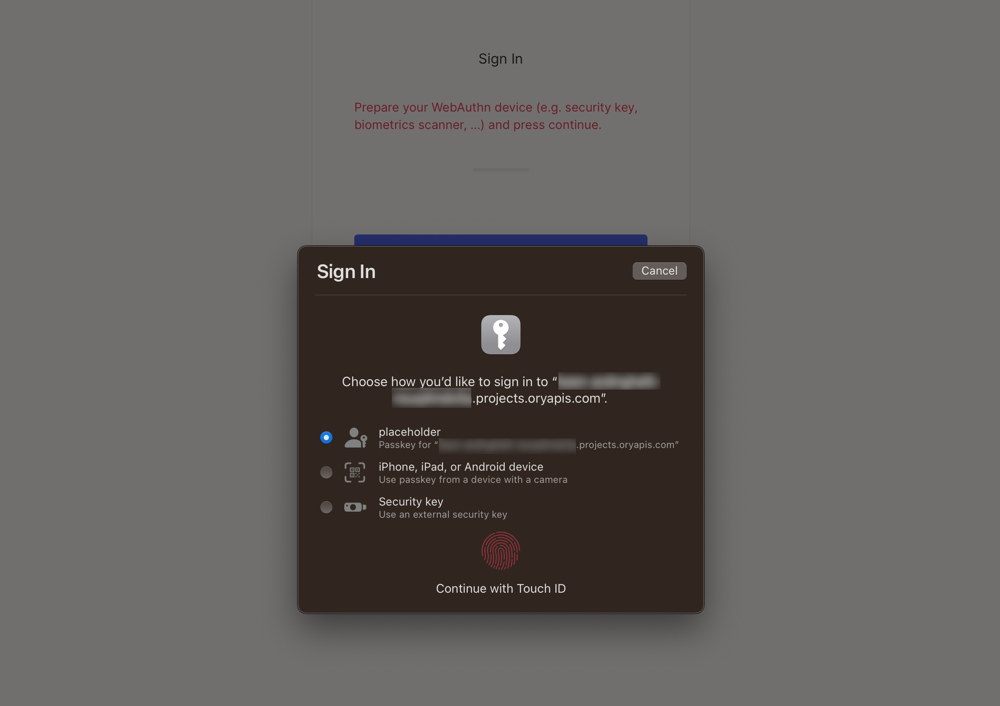

# Passkeys

[Passkeys](https://fidoalliance.org/passkeys/) are, as described by the [FIDO Alliance](https://fidoalliance.org/), "a password
replacement that provide faster, easier, and more secure sign-ins to websites and apps across a user's devices."

Using passkeys allows for passwordless user sign-up and sign-in, which creates a safer environment for your system's users who
don't have to rely on easily exploitable, legacy authentication methods such as passwords.

Passkeys are an industry-accepted and adopted standard, which means that all of your users will be able to use this feature, no
matter the hardware they work with. The notable adopters of passkeys include:

- Apple with [Apple Passkeys](https://support.apple.com/en-us/HT213305)
- [Google](https://developers.google.com/identity/passkeys/supported-environments)
- [Microsoft](https://www.microsoft.com/en-us/security/blog/2022/05/05/this-world-password-day-consider-ditching-passwords-altogether/)

While companies can add proprietary features to passkeys, such as iCloud synchronization in Apple Passkeys or Google Password
Manager synchronization for Android devices, all of them use the same FIDO standard. This means that enabling passkeys is a
simple, one-time operation in Ory.

:::tip

To learn more about passkeys and see sample flows for different platforms, watch this FIDO Alliance video:

<iframe width="560" height="315" src="https://www.youtube.com/embed/SWocv4BhCNg" frameBorder="0" allowFullScreen />

:::

## Configuration

To allow using passkeys, enable paswordless login. To do that in the Ory Network, go to [**Ory Console**](https://console.ory.sh/)
→ **Passwordless Login** and toggle the switch to enable the feature.

```mdx-code-block
import BrowserWindow from "@site/src/theme/BrowserWindow"

<BrowserWindow url="https://console.ory.sh/">


</BrowserWindow>
```

## Example

This is a macOS Safari prompt the browser shows when users try to sign in using the passwordless method. The first option allows
to use a passkey associated with this account that's stored in the iCloud Keyhain of the user that's signed in to iCloud on this
device.

The second option allows delegating user authentication to a camera-equipped device. Upon successful authentication, a matching
passkey found on the device will be used to sign in.

```mdx-code-block
<BrowserWindow url="https://playground.projects.oryapis.com/ui">



</BrowserWindow>
```
