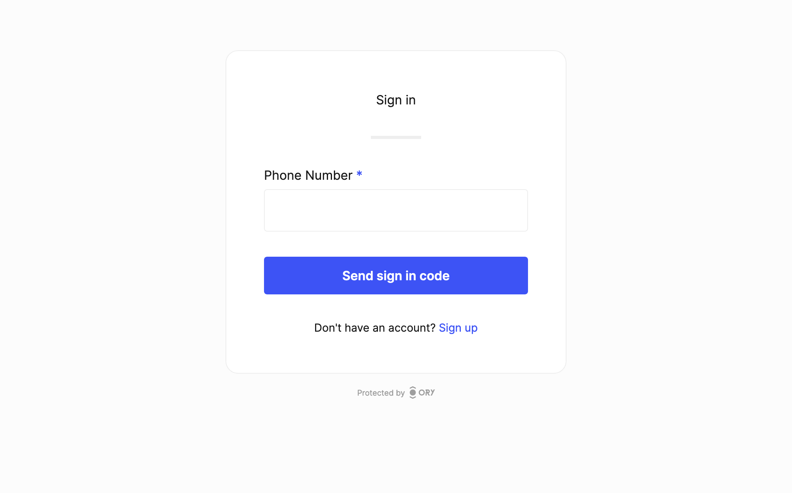

# Email and SMS one-time-code authentication

Ory Network allows users to authenticate through a one-time code sent via email and SMS. This is useful for use-cases where users
need to be onboarded through a minimal authentication process.

The one-time code method consists of a two-step process. The first step the user is required to enter their email address or phone
number. In the second step they are prompted to enter the one-time code sent to their email address or phone number.

Below are examples of the one-time code authentication method in action:

```mdx-code-block
import BrowserWindow from "@site/src/theme/BrowserWindow"
import CodeBlock from '@theme/CodeBlock'
import Tabs from '@theme/Tabs';
import TabItem from '@theme/TabItem';

<BrowserWindow url="https://ory.yourapp.com/">



</BrowserWindow>
```

## Enable email one-time-code (OTP)

1. To enable email one-time-code, enable the one-time code strategy for passwordless:

```mdx-code-block
<Tabs>
  <TabItem value="console" label="Ory Console UI">
    <p>Go to <ConsoleLink route="project.passwordless" /> to enable passwordless with one-time code.</p>
  </TabItem>
  <TabItem value="cloud" label="Ory CLI">
    <CodeBlock language="shell">{`ory patch identity-config <your-project-id> \\
  --add '/selfservice/methods/code/passwordless_enabled=true'`}</CodeBlock>
  </TabItem>
  <TabItem value="macos" label="Full Config" default>
    <CodeBlock language="yaml" title="config.yml">{`selfservice:
  methods:
    code:
      passwordless_enabled: true`}</CodeBlock>
  </TabItem>
</Tabs>
```

2. If you are using a custom identity schema and not a preset, check the [custom identity schema](#custom-identity-schema)
   section.
3. Open the login UI and test it out!
4. You need a good email delivery provider to ensure that one-time codes are delivered reliably. We recommend setting up your own
   [SMTP provider](../emails-sms/01_sending-emails-smtp.mdx) to ensure that you have full control over the email delivery process.

## Enable SMS one-time-code (OTP)

:::note

Before enabling SMS one-time-code, please be aware that SMS OTP (One-Time Password) is considered insecure due to several
vulnerabilities:

1. **SIM Swapping**: Attackers can hijack your phone number by convincing your mobile carrier to transfer your number to a new SIM
   card.
2. **SMS Interception**: SMS messages can be intercepted by attackers using various techniques, such as exploiting weaknesses in
   the SS7 protocol.
3. **Phishing**: Users can be tricked into revealing their OTPs through phishing attacks.

Due to these risks, it is recommended to use more secure methods like Passkeys.

:::

1. To enable sms one-time-code, enable the one-time code strategy for passwordless:

```mdx-code-block
<Tabs>
  <TabItem value="console" label="Ory Console UI">
    <p>Go to <ConsoleLink route="project.passwordless" /> to enable passwordless with one-time code.</p>
  </TabItem>
  <TabItem value="cloud" label="Ory CLI">
    <CodeBlock language="shell">{`ory patch identity-config <your-project-id> \\
  --add '/selfservice/methods/code/passwordless_enabled=true'`}</CodeBlock>
  </TabItem>
  <TabItem value="macos" label="Full Config" default>
    <CodeBlock language="yaml" title="config.yml">{`selfservice:
  methods:
    code:
      passwordless_enabled: true`}</CodeBlock>
  </TabItem>
</Tabs>
```

2. Select an identity schema that has a phone number. In our case we will use the `sms` preset:
   1. Go to <ConsoleLink route="project.identitySchema" />.
   2. Click the "active schema" drop down.
   3. Select the `sms` preset.
3. For this example we will create a mock SMS provider. You can find more information on how to configure SMS providers in
   [SMS delivery configuration](../emails-sms/10_sending-sms.mdx):
   1. Set up a fake webhook endpoint using a service like [webhook.site](https://webhook.site/).
   2. Copy the "unique URL" of the webhook (for example `https://webhook.site/859c1c...`).
   3. Use the Ory CLI to set up the SMS channel:
      ```bash
      ory patch identity-config --project ${project_id} \
        --add '/courier/channels=[{"id":"sms","request_config":{"method":"PUT","body":"base64://ZnVuY3Rpb24oY3R4KSB7DQpjdHg6IGN0eCwNCn0=","url":"https://webhook.site/#!/view/859c1c2c-c4d5-4058-aec4-53f37929c5c1"}}]'
      ```
4. Open the sign up page and sign up for an account.
5. After the UI shows you that a code has been sent, check out the webhook target which will now show in response to the SMS being
   sent.
6. If you are using a custom identity schema and not a preset, check the [custom identity schema](#custom-identity-schema)
   section.

## Template customization

Customize the login and registration email templates to match your brand. You can find more information on how to do this in
[Emails and SMS](../emails-sms/05_custom-email-templates.mdx).

## Custom identity schema

All Ory Identity Schema presets are one-time code ready.

If you want to use a custom [identity schema](../manage-identities/05_identity-schema.mdx), you must define which field of the
schema is the primary identifier for the one-time code strategy.

```json5 title="identity.schema.json"
{
  $schema: "http://json-schema.org/draft-07/schema#",
  type: "object",
  properties: {
    traits: {
      type: "object",
      properties: {
        email: {
          type: "string",
          format: "email",
          title: "Your email",
          minLength: 3,
          // highlight-start
          "ory.com/kratos": {
            credentials: {
              code: {
                identifier: true,
                via: "email",
              },
              // ...
            },
          },
          // highlight-end
        },
        // ...
        phone_number: {
          type: "string",
          format: "tel",
          title: "Your phone number",
          minLength: 3,
          // highlight-start
          "ory.com/kratos": {
            credentials: {
              code: {
                identifier: true,
                via: "sms",
              },
              // ...
            },
          },
          // highlight-end
        },
      },
    },
  },
}
```
