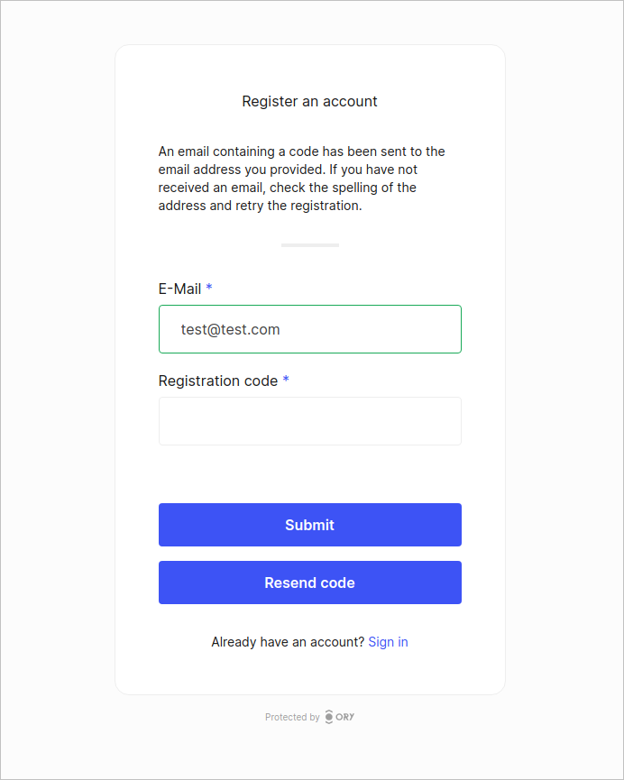

Ory Network allows users to authenticate through a one-time code sent via email. This is useful for use-cases where users need to
be onboarded through a minimal authentication process.

The one-time code method consists of a two-step process. The first step the user is required to enter their email address. In the
second step they are prompted to enter the one-time code sent to their email address.

There is a slight difference between the login and registration flows. In the login flow, only the user's email address is
required. In the registration flow, the user is required to enter their email address and other required traits set by the
[Identity Schema](../manage-identities/05_identity-schema.mdx).

Below are examples of the one-time code authentication method in action.

```mdx-code-block
import BrowserWindow from "@site/src/theme/BrowserWindow"

<BrowserWindow url="https://ory.yourapp.com/">


</BrowserWindow>
```

In the registration flow below we are only presented an input field for the email address, as we have not defined any other traits
in the [Identity Schema](../manage-identities/05_identity-schema.mdx).

```mdx-code-block
<BrowserWindow url="https://ory.yourapp.com/">



</BrowserWindow>
```

## Configuration

:::info

This feature is in preview. Please report any issues to support@ory.sh or contact us in the
[Ory Community](https://slack.ory.sh/).

:::

By default the one-time code strategy is disabled. To start using the one-time code strategy, apply this configuration:

```mdx-code-block
import CodeBlock from '@theme/CodeBlock'
import Tabs from '@theme/Tabs';
import TabItem from '@theme/TabItem';

<Tabs>
  <TabItem value="console" label="Ory Console UI">
```

You can enable passwordless with one-time code in the Ory Network Console UI in the
[Authentication -> Passwordless login](https://console.ory.sh/projects/current/passwordless) menu.

```mdx-code-block
  </TabItem>
  <TabItem value="cloud" label="Ory CLI">
    <CodeBlock language="shell">{`ory patch identity-config <your-project-id> \\
  --add '/selfservice/methods/code/passwordless_enabled=true'`}</CodeBlock>
  </TabItem>
  <TabItem value="macos" label="Full Config" default>
    <CodeBlock language="yaml" title="config.yml">{`selfservice:
  methods:
    code:
      passwordless_enabled: true`}</CodeBlock>
  </TabItem>
</Tabs>
```

## Custom identity schema

All Ory Identity Schema presets are one-time code ready.

If you want to use a custom [Identity Schema](../manage-identities/05_identity-schema.mdx), you must define which field of the
schema is the primary identifier for the one-time code strategy.

```json5 title="identity.schema.json" {16-19}
{
  $schema: "http://json-schema.org/draft-07/schema#",
  type: "object",
  properties: {
    traits: {
      type: "object",
      properties: {
        email: {
          type: "string",
          format: "email",
          title: "Your E-Mail",
          minLength: 3,
          "ory.sh/kratos": {
            credentials: {
              // ...
              code: {
                identifier: true,
                via: "email",
              },
            },
            // ...
          },
        },
        // ...
      },
      // ...
    },
  },
}
```

## Considerations

When implementing the one-time code strategy, there are a few things to consider.

1. You need to choose an email address field as the primary identifier for the one-time code strategy in the
   [Identity Schema](../manage-identities/05_identity-schema.mdx).
2. You need a good email delivery provider to ensure that one-time codes are delivered reliably. We recommend setting up your own
   [SMTP provider](../emails-sms/01_sending-emails-smtp.mdx) to ensure that you have full control over the email delivery process.
3. Customize the login and registration email templates to match your brand. You can find more information on how to do this in
   [Emails and SMS](../emails-sms/05_custom-email-templates.mdx).
