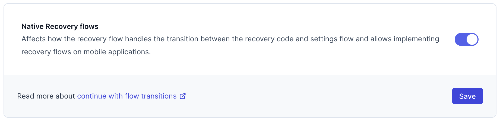

# Account recovery and password reset

```mdx-code-block
import Tabs from "@theme/Tabs"
import TabItem from "@theme/TabItem"
import RenderFlow from "@theme/Code/RenderFlow"
import CodeLinkComparison from "./_common/code-link-comparison.mdx"
```

Account recovery allows registered users to regain access to their account if they forget their password or lose access to the
second authentication factor required for multi-factor authentication (MFA).

To regain access to their account, the user must prove that they're the owner of the account. The verification of ownership is
performed using the [recovery address defined by the user](#account-recovery-address). When the account recovery flow is started,
the system sends a link or a one-time code to the recovery address defined by the user. The user must access the link or enter the
code they received to confirm their identity and ownership of the account.

When the user accesses the configured recovery method, they receive a
[privileged session](../../session-management/10_session-lifespan.mdx#privileged-sessions) and are taken to their account's
settings page where they must create a new password to regain access to their account.

:::info

The account recovery flow doesn't reset user's second authentication factor.

:::

## Supported recovery methods

Ory Identities (Ory Kratos) supports two recovery methods:

- Recovery by one-time codes (`code`)
- Recovery by magic links (`link`)

### Comparison

```mdx-code-block
<CodeLinkComparison />
```

## Configuration

```mdx-code-block
<Tabs groupId="console-or-cli" defaultValue="console">
<TabItem value="console" label="Ory Console">
```

To enable account recovery and adjust related options, go to <ConsoleLink route="project.recovery" />

```mdx-code-block
</TabItem>
<TabItem value="cli" label="Ory CLI">
```

1. Download the Ory Identities configuration from your project and save it to a file:

   ```shell
   ## List all available workspaces
   ory list workspaces

   ## List all available projects
   ory list projects --workspace <workspace-id>

   ## Get config
   ory get identity-config --project <project-id> --workspace <workspace-id> --format yaml > identity-config.yaml
   ```

2. Add the configuration for the verification flow:

   ```yaml title="identity-config.yaml"
   selfservice:
     methods:
       code: # Enables the "one-time code" method. Use 'link' to enable "magic link" method.
         enabled: true
         config:
           lifespan: 15m # Defines how long the code or link are valid for. Default: 1h.

     flows:
       recovery:
         enabled: true
         lifespan: 15m # Defines how much time the user has to complete the recovery flow in the UI. Default: 1h.
         use: code # Defines which method is used, one of 'code' or 'link'.
         notify_unknown_recipients: false # Defines if the system sends attempted recovery notifications to unregistered addresses.
   ```

3. Update the Ory Identities configuration using the file you worked with:

   ```shell
   ory update identity-config --project <project-id> --workspace <workspace-id> --file identity-config.yaml
   ```

```mdx-code-block
</TabItem>
</Tabs>
```

### Require multi-factor for account recovery

By default, the account recovery process gives users a privileged session without the need to provide the second authentication
factor. You can choose to require multi-factor authentication for account recovery.

:::note

This affect all users, not just those that recover their accounts. If you enable this setting, all users must provide their second
authentication to adjust profile settings.

:::

```mdx-code-block
<Tabs groupId="console-or-cli">
<TabItem value="console" label="Ory Console" default>
```

In the Ory Console go to <ConsoleLink route="project.mfa" />

```mdx-code-block
</TabItem>
<TabItem value="cli" label="Ory CLI">
```

1. Download the Ory Identities configuration from your project and save it to a file:

   ```shell
   ## List all available workspaces
   ory list workspaces

   ## List all available projects
   ory list projects --workspace <workspace-id>

   ## Get config
   ory get identity-config --project <project-id> --workspace <workspace-id> --format yaml > identity-config.yaml
   ```

2. Add the configuration for the verification flow:

   ```yaml title="identity-config.yaml"
   selfservice:
     flows:
       settings:
         required_aal: highest_available
   ```

3. Update the Ory Identities configuration using the file you worked with:

   ```shell
   ory update identity-config --project <project-id> --workspace <workspace-id> --file identity-config.yaml
   ```

```mdx-code-block
</TabItem>
</Tabs>
```

### Account recovery address

To start account recovery, Ory Identities must know which address to send the recovery message to. Usually this is the email
address the user provides when registering their account. Other fields inside the `traits` section are supported as well such a
phone number to receive the code via a SMS.

If there are multiple recovery addresses registered for the user and if the feature flag `choose_recovery_address` is
[enabled](../../../identities/get-started/account-recovery.mdx#enable-the-feature-flag-choose_recovery_address-unlocks-sending-a-recovery-code-via-sms),
entering any of them will present them a list of (masked) addresses to choose from (up to 10). Once they have picked one address,
and entered the address fully (to demonstrate that they indeed know the address and also to avoid information exfiltration), this
address is used. The address can be an email address, in which case an email is sent, or a phone number, in which case a SMS is
sent.

	A [SMS HTTP gateway](../../kratos/emails-sms/10_sending-sms.mdx) must be configured to deliver SMS messages.

:::info

Completing a recovery flow will also verify the identities address if the address is used for both recovery and verification and the identity is not yet verified when the recovery flow begins.

Read [this document](./verify-email-account-activation.mdx) to learn about the account verification flow.

:::

To specify a trait of the identity to be used for recovery, use the following identity schema:

```diff
 {
   "$id": "https://schemas.ory.sh/presets/kratos/quickstart/email-password/identity.schema.json",
   "$schema": "http://json-schema.org/draft-07/schema#",
   "title": "Person",
   "type": "object",
   "properties": {
     "traits": {
       "type": "object",
       "properties": {
         "email": {
           "type": "string",
           "format": "email",
           "ory.sh/kratos": {
             "credentials": {
               "password": {
                 "identifier": true
               }
             },
+            "recovery": {
+              "via": "email"
+            }
           }
         }
       }
       "additionalProperties": false
     }
   }
 }
```

Example to allow recovery via an email or an SMS:

```json
{
  "$id": "https://example.com/registration.schema.json",
  "$schema": "http://json-schema.org/draft-07/schema#",
  "title": "Person",
  "type": "object",
  "properties": {
    "traits": {
      "type": "object",
      "properties": {
        "email": {
          "title": "Email",
          "type": "string",
          "format": "email",
          "ory.sh/kratos": {
            "credentials": {
              "password": {
                "identifier": true
              },
              "code": {
                "identifier": true,
                "via": "email"
              }
            },
            "recovery": {
              "via": "email"
            }
          }
        },
        "telephoneNumber": {
          "type": "string",
          "format": "tel",
          "title": "Telephone Number",
          "minLength": 3,
          "ory.sh/kratos": {
            "credentials": {
              "password": {
                "identifier": true
              },
              "code": {
                "identifier": true,
                "via": "sms"
              }
            },
            "verification": {
              "via": "sms"
            },
            "recovery": {
              "via": "sms"
            }
          }
        }
      },
      "required": ["email"],
      "additionalProperties": false
    }
  }
}
```

### Attempted recovery notifications

When this option is on and users attempt to initiate recovery for unregistered addresses, the system sends an attempted recovery
notification to the email address that was used in the attempt. This prevents account enumeration attacks as explained in this
[blog post by Troy Hunt](https://www.troyhunt.com/website-enumeration-insanity-how-our-personal-data-is-leaked/). By default, this
feature is disabled in newly created Ory Network projects.

For cost reasons, the attempted recovery notification does not apply to SMS. An attempt to recover an account using an incorrect phone number will not trigger an SMS message.

Follow these steps to enable sending attempted recovery notification emails:

```mdx-code-block
<Tabs groupId="console-or-cli">
<TabItem value="console" label="Ory Console" default>
```

Go to <ConsoleLink route="project.recovery" /> and toggle **Notify unknown recipients** on.

```mdx-code-block
</TabItem>
<TabItem value="cli" label="Ory CLI">
```

1. Download the Ory Identities configuration from your project and save it to a file:

   ```shell
   ## List all available workspaces
   ory list workspaces

   ## List all available projects
   ory list projects --workspace <workspace-id>

   ## Get config
   ory get identity-config --project <project-id> --workspace <workspace-id> --format yaml > identity-config.yaml
   ```

2. Set `notify_unknown_recipients` to `true`:

   ```yaml title="identity-config.yaml"
   flows:
     recovery:
       enabled: true
       lifespan: 15m # Defines how much time the user has to complete the recovery flow in the UI. Default: 1h.
       use: code # Defines which method is used, one of 'code' or 'link'.
       notify_unknown_recipients: true # Defines if the system sends attempted recovery notifications to unregistered addresses.
   ```

3. Update the Ory Identities configuration using the file you worked with:

   ```shell
   ory update identity-config --project <project-id> --workspace <workspace-id> --file identity-config.yaml
   ```

```mdx-code-block
</TabItem>
</Tabs>
```

### Templates

Ory Identities comes with default templates for recovery flows.

You can replace the defaults and customize the messages to match the look and feel of your solution. Read the
[email templates documentation](../../emails-sms/05_custom-email-templates.mdx) and
[SMS templates documentation](../../emails-sms/10_sending-sms.mdx#templates) to learn more.

## Invalidate other sessions

In some scenarios it can be useful to revoke all active sessions of the user when they recover their account. This forces anyone
with access to the account to re-authenticate using the new password set up in the recovery process.

To trigger this behavior, use the `after_recovery` hook:

```mdx-code-block
<Tabs>
<TabItem value="cli" label="Ory CLI" default>
```

1. Get the Ory Identities configuration with Ory CLI:

   ```shell
   ## List all available workspaces
   ory list workspaces

   ## List all available projects
   ory list projects --workspace <workspace-id>

   ## Get config
   ory get identity-config --project <project-id> --workspace <workspace-id> --format yaml > identity-config.yaml
   ```

2. Add the hook configuration to the downloaded file.

   ```diff
   selfservice:
     flows:
       recovery:
         enabled: true
         ui_url: http://your.ui/recovery
   +      after:
   +        hooks:
   +        - hook: revoke_active_sessions
   ```

3. Update the Ory Identities configuration using the file you worked with:

   ```shell
   ory update identity-config --project <project-id> --workspace <workspace-id> --file identity-config.yaml
   ```

```mdx-code-block
</TabItem>
</Tabs>
```

:::tip

Learn how to [add and configure hooks for self-service user flows](../../hooks/01_configure-hooks.mdx).

:::

## Fallback recovery address

A user may need a fallback recovery address if they lose access to the address used for registration.

To enable this, define a secondary field, such as email_secondary, in the traits section of your [identity schema](../../manage-identities/05_identity-schema.mdx). This field will serve as the alternative address for account recovery.

This is an example of an identity schema with a secondary email address:

```json
{
  "$id": "https://example.com/ory.schema.json",
  "$schema": "http://json-schema.org/draft-07/schema#",
  "additionalProperties": false,
  "properties": {
    "traits": {
      "additionalProperties": false,
      "properties": {
        "email": {
          "format": "email",
          "ory.sh/kratos": {
            "credentials": {
              "password": {
                "identifier": true
              },
              "webauthn": {
                "identifier": true
              },
              "totp": {
                "account_name": true
              },
              "passkey": {
                "display_name": true
              },
              "code": {
                "identifier": true,
                "via": "email"
              }
            },
            "recovery": {
              "via": "email"
            },
            "verification": {
              "via": "email"
            }
          },
          "title": "Email address",
          "type": "string",
          "maxLength": 320
        },
        "email_secondary": {
          "format": "email",
          "ory.sh/kratos": {
            "recovery": {
              "via": "email"
            },
            "verification": {
              "via": "email"
            }
          },
          "title": "Email address secondary",
          "type": "string",
          "maxLength": 320
        }
      },
      "type": "object"
    }
  },
  "title": "Person",
  "type": "object"
}
```

In this schema, you define both `email` and `email_secondary` fields as recovery addresses. This means that Ory will send recovery
messages to both addresses when the recovery flow is initiated. The user should provide the `email_secondary` field during
registration or update it later in their account settings so it can be used in the recovery process.

This is different from the scenario where a user has multiple recovery addresses of different types, such as one email address and one phone number. In that case, the user is prompted to choose which address to use, and a recovery message is sent to only the one they select.
## Native recovery flows

Ory Identities supports recovery flows in native applications. This allows you to build a native application that allows the user
reset their password in the app without opening a browser. This flow is only available for the `code` method.

Since enabling this alters the behavior of the native recovery flow, you need to enable it in the Ory Console or using the Ory
CLI. The setting only affects the recovery flow for API clients. The other self-service flows and browser recovery flows are not
affected.

This setting is enabled by default for new projects.

```mdx-code-block
<Tabs groupId="console-or-cli">
<TabItem value="console" label="Ory Console" default>
```

Go to <ConsoleLink route="project.settings.advanced" />



```mdx-code-block
</TabItem>
<TabItem value="cli" label="Ory CLI">
```

1. Download the Ory Identities configuration from your project and save it to a file:

   ```shell
   ## List all available workspaces
   ory list workspaces

   ## List all available projects
   ory list projects --workspace <workspace-id>

   ## Get config
   ory get identity-config --project <project-id> --workspace <workspace-id> --format yaml > identity-config.yaml
   ```

2. Add the configuration for the verification flow:

   ```yaml title="identity-config.yaml"
   feature_flags:
     use_continue_with_transitions: true
   ```

3. Update the Ory Identities configuration using the file you worked with:

   ```shell
   ory update identity-config --project <project-id> --workspace <workspace-id> --file identity-config.yaml
   ```

```mdx-code-block
</TabItem>
</Tabs>
```

## Code examples

The user interface for the account recovery is a page in your solution that should render the actual form elements for the user.

In contrast to other identity systems, Ory Identities doesn't render this HTML directly. Instead, you implement the HTML code in
your solution, which gives you complete flexibility and customizability in your user interface flows and designs. This part of
your application then directly interfaces with Ory Identities through the API.

The API responds with a JSON document describing the form elements to render and actions the form should take upon submission,
cancellation, etc. The following shows examples for different languages and frameworks.

<RenderFlow flow="recovery" />
