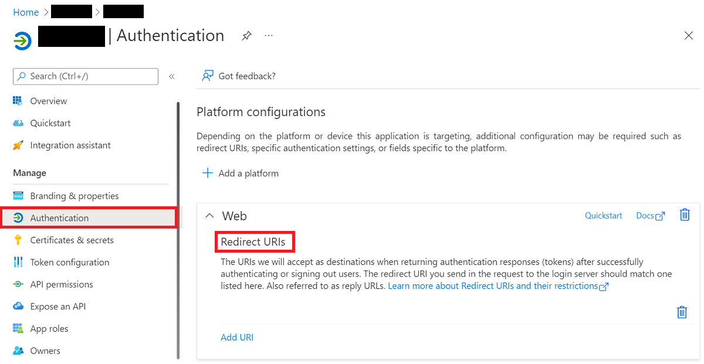

# Microsoft

:::note

To add Microsoft as a social sign-in provider, you need an Azure account with an active subscription. Follow
[this link](https://azure.microsoft.com/free/) to create a free account.

:::

````mdx-code-block
import Tabs from '@theme/Tabs';
import TabItem from '@theme/TabItem';

<Tabs>
<TabItem value="console" label="Ory Console" default>

Follow these steps to add Microsoft as a social sign-in provider for your project using the Ory Console.

1. Go to <ConsoleLink route="project.socialSignIn" />.
2. Click the switch next to the Microsoft logo to start the configuration.
3. Copy the Redirect URI from Ory and save it for later use.
4. Go to the [Azure portal](https://portal.azure.com/) → **Microsoft Entra ID**.
5. From **Overview**, select **Manage tenants** from the top navigation. Choose the desired tenant or create a new one.
6. Return to **Overview**, open the **App registration** dropdown menu and click **App registration**.
7. Register a new application:

   - Define the app display name
   - For Social Sign In with Microsoft, choose **"Accounts in any organizational directory (Any Microsoft Entra ID tenant - Multitenant) and personal Microsoft accounts (e.g. Skype, Xbox)"**
   - For other use cases choose one of the other account types use **"Accounts in any organizational directory (Any Microsoft Entra ID tenant - Multitenant)"**.
   - Select the **web** application type using the dropdown menu
   - Provide the Redirect URI copied from the Ory Console and add it on Azure console.

   

8. Copy the **Application (client) ID** from Azure and paste it into the corresponding field in the Ory Console.
11. Copy the **Directory (tenant) ID** from Azure and paste it into the corresponding field in the Ory Console.
9. In Azure, click the **Client credentials** link and create a new client secret.
10. Copy the **Value** of the client secret and paste it into the corresponding field in the Ory Console.
12. Click **Save Configuration** to enable Microsoft as a social sign-in provider.

:::note

These steps cover the basic configuration of a social sign-in provider integration. At this point, the user experience is
incomplete. To complete the configuration and ensure a smooth and secure user experience, configure the [scopes](#scopes) and
[data mapping](#data-mapping) as described in the next section.

:::

## Additional configuration

When adding a social sign-in provider, you can customize the integration by defining the OAuth scopes Ory requests from the
provider and by setting up custom data mappings.

### Scopes

The Scopes section allows you to define the OAuth scopes Ory requests from the sign-in provider. Defining scopes allows you to
interact with the provider's APIs on behalf of the user, or to access additional user data, which is exposed as claims for data
mapping.

For Microsoft, add the `email` and `profile` scopes for a basic setup.

### Data mapping

The **Data mapping** section allows you to map the data returned by the sign-in provider to traits as defined in the identity
schema.

To define the mapping, create a Jsonnet code snippet. Read [this document](./data-mapping) to learn more about Jsonnet data
mapping.

```jsonnet
local claims = std.extVar('claims');
{
  identity: {
    traits: {
      // Allowing unverified email addresses enables account
      // enumeration attacks,  if the value is used for
      // verification or as a password login identifier.
      //
      // If connecting only to your organization (one tenant), claims.email is safe to use
      // if you haven't actively disabled e-mail verification during sign-up.
      //
      // The email might be empty if the account isn't linked to an email address.
      // For a human readable identifier, consider using the "preferred_username" claim.
      [if 'email' in claims then 'email' else null]: claims.email,
    },
  },
}
```

```mdx-code-block
import JsonnetWarning from '../../_common/jsonnetwarning.mdx'

<JsonnetWarning format="Jsonnet code snippets" use="data mapping" />
```

</TabItem>
<TabItem value="cli" label="Ory CLI">

Follow these steps to add Microsoft as a social sign-in provider to your project using the Ory CLI:

1. Create an Azure AD Application and Tenant.
2. Create a Jsonnet code snippet to map the desired claims to the Ory Identity schema.

  ```jsonnet
  local claims = std.extVar('claims');
  {
    identity: {
      traits: {
        // Allowing unverified email addresses enables account
        // enumeration attacks,  if the value is used for
        // verification or as a password login identifier.
        //
        // If connecting only to your organization (one tenant), claims.email is safe to use
        // if you haven't actively disabled e-mail verification during sign-up.
        //
        // The email might be empty if the account isn't linked to an email address.
        // For a human readable identifier, consider using the "preferred_username" claim.
        [if 'email' in claims then 'email' else null]: claims.email,
      },
    },
  }
  ```

3. Encode the Jsonnet snippet with [Base64](https://www.base64encode.org/) or host it under an URL accessible to Ory Network.

  ```shell
  cat your-data-mapping.jsonnet | base64
  ```

4. Download the Ory Identities config from your project and save it to a file:

   ```shell
   ## List all available workspaces
   ory list workspaces

   ## List all available projects
   ory list projects --workspace <workspace-id>

   ## Get config
   ory get identity-config --project <project-id> --workspace <workspace-id> --format yaml > identity-config.yaml
   ```

5. Add the social sign-in provider configuration to the downloaded config. Add the Jsonnet snippet with mappings as a Base64
   string or provide an URL to the file.

   ```yaml
   selfservice:
     methods:
       oidc:
         config:
           providers:
             - id: microsoft # this is `<provider-id>` in the Authorization callback URL. DO NOT CHANGE IT ONCE SET!
               provider: microsoft
               client_id: .... # This is the the Application (client) ID from the App Registration
               client_secret: .... # This is the generated Secret value from the App Registration
               microsoft_tenant: .... # This allows you to select the tenant.
               mapper_url: "base64://{YOUR_BASE64_ENCODED_JSONNET_HERE}"
               # Alternatively, use an URL:
               # mapper_url: https://storage.googleapis.com/abc-cde-prd/9cac9717f007808bf17f22ce7f4295c739604b183f05ac4afb4
               scope:
                 - profile
                 - openid
                 - email
         enabled: true
   ```

   :::tip

   Read [this section](#selecting-a-tenant) to learn more about selecting a Microsoft tenant.

   :::

6. Update the Ory Identities configuration using the file you worked with:

   ```shell
   ory update identity-config --project <project-id> --workspace <workspace-id> --file identity-config.yaml
   ```

</TabItem>
</Tabs>
````

## Selecting a Tenant

When you add Microsoft as a social sign-in provider, you have two alternatives to define which user groups can sign in and sign up
with Microsoft by setting the **Tenant** field:

1. To authenticate users that belong to a single, specific organization (Azure Active Directory), set the value to **Directory
   (tenant) ID** or the organization's domain, for example, `example.onmicrosoft.com`.

OR

2. To authenticate users with Microsoft accounts that are not limited to a specific organization, choose from the following values
   for the **Tenant** field:
   - `organizations` to allow users with work or school accounts
   - `consumers` to allow users with personal accounts
   - `common` to allow both kinds of accounts

:::info

To allow sign-in and sign-up for users with Microsoft accounts that don't belong to any organization (Azure Active Directory), you
must adjust the Azure application configuration by editing the
[Manifest](https://docs.microsoft.com/en-us/azure/active-directory/develop/reference-app-manifest).

Learn more:

- [Microsoft Azure documentation](https://docs.microsoft.com/en-us/azure/active-directory/develop/supported-accounts-validation)
- [Related StackOverflow thread](https://stackoverflow.com/questions/57826919/azure-ad-how-to-set-app-manifest-properties-programatically-accesstokenaccept)

:::

## Subject identifier source

By default, Microsoft uses the identifier taken from the `sub` field of OIDC `id_token`. The same identifier is also returned by
the standard OIDC `/userinfo` endpoint.

However, some systems use the `id` field returned by the `https://graph.microsoft.com/v1.0/me` endpoint as a subject identifier.
Others use the `oid` (Object ID) to identify users across different services.

To make migrating such systems to Ory easier, you can use the identifier obtained from the `me` endpoint and the `oid` field.

### Example

Add the `subject_source` field set to `me` to the social sign-in provider config. Use the Ory CLI:

1. Download the Ory Identities config from your project and save it to a file:

   ```shell
   ## List all available workspaces
   ory list workspaces

   ## List all available projects
   ory list projects --workspace <workspace-id>

   ## Get config
   ory get identity-config --project <project-id> --workspace <workspace-id> --format yaml > identity-config.yaml
   ```

2. Update the configuration:

```yaml title="identity-config.yaml"
  providers:
  - id: microsoft
    (...)
    // highlight-start
    subject_source: me # or oid
    # or
    # subject_source: userinfo
    scope:
      - https://graph.microsoft.com/User.Read # Required when 'subject_source: me'.
    // highlight-end
    (...)
```

3. Update the Ory Identities configuration using the file you worked with:

   ```shell
   ory update identity-config --project <project-id> --workspace <workspace-id> --file identity-config.yaml
   ```

## Troubleshooting

```mdx-code-block
import SocialSigninTroubleshooting from '../_common/social-sign-in-troubleshooting.mdx'

<SocialSigninTroubleshooting />
```
