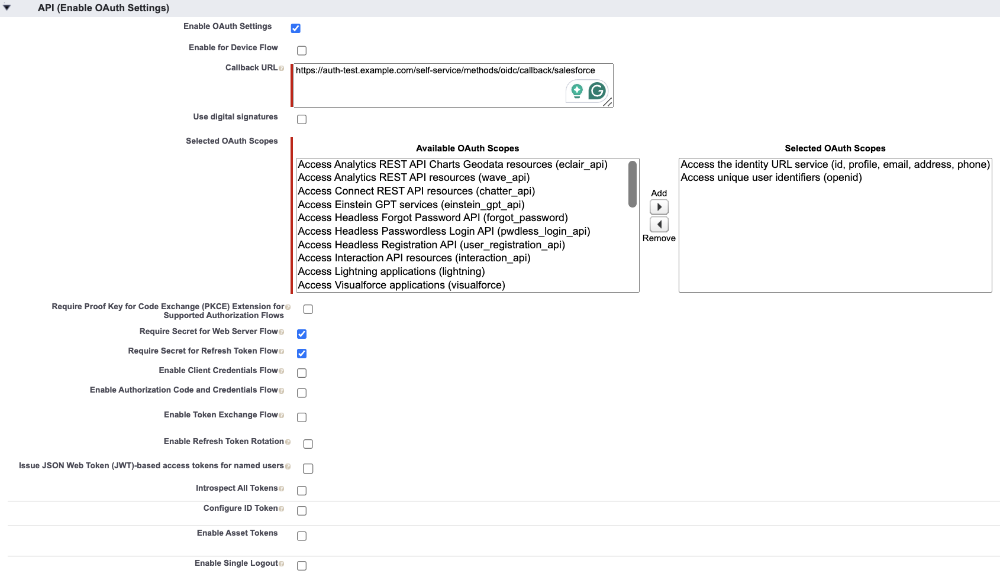
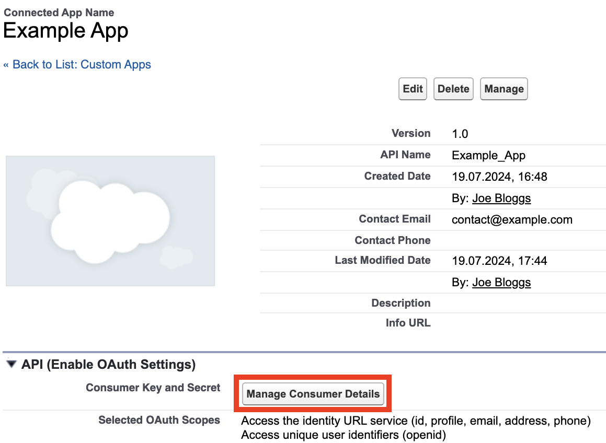

# Salesforce

```mdx-code-block
import JsonnetWarning from "../../_common/jsonnetwarning.mdx"
import Tabs from '@theme/Tabs';
import TabItem from '@theme/TabItem';

<Tabs>
<TabItem value="console" label="Ory Console" default>
```

Follow these steps to add Salesforce as a social sign-in provider to your project using the Ory Console:

1. Go to <ConsoleLink route="project.socialSignIn" />.
2. Click the switch next to the Salesforce logo to start the configuration.
3. Copy the Redirect URI and save it for later use.
4. [Create an Salesforce Connected App](https://help.salesforce.com/s/articleView?id=sf.service_provider_define_oid.htm&type=5),
   noting the following points:
   - Enable OAuth Settings
   - Paste the saved Redirect URI from Ory into the **Callback URL** field in the **OAuth Settings** of the connected app.
5. In the **Selected OAuth Scopes** field, make sure `openid`, `profile`, and `email` are selected.
6. Ensure the `Require Proof Key for Code Exchange (PKCE)` checkbox is disabled, as Ory Kratos does not support PKCE.
7. Ensure the `Require Secret for Web Server Flow` checkbox is enabled.
   
8. Create the app.
9. Go to the **OAuth Settings** of your newly created connected app, click on **Manage Consumer Details** and copy the following
   data to the corresponding fields in the form in the Ory Console:
   - **Consumer Key** (called **Client ID** in Ory)
   - **Consumer Secret** (called **Client Secret** in Ory)

   

10. Copy the Salesforce top-level domain from the URL bar (typically `https://mySalesforceTenant.my.salesforce.com`) to the
    **Tenant URL** field of the form in the Ory Console.
11. In the **Data Mapping** field of the form in the Ory Console, add the following Jsonnet code snippet, which maps the desired
    claims to the Ory Identity schema:

```jsonnet
local claims = {
  email_verified: false,
} + std.extVar('claims');

{
  identity: {
    traits: {
      // Allowing unverified email addresses enables account
      // enumeration attacks,  if the value is used for
      // verification or as a password login identifier.
      //
      // Therefore we only return the email if it (a) exists and (b) is marked verified
      // by Salesforce.
      [if 'email' in claims && claims.email_verified then 'email' else null]: claims.email,
      username: claims.nickname,
    },
  },
}
```

```mdx-code-block
   <JsonnetWarning format="Jsonnet code snippets" use="data mapping" />
```

12. Click **Save Configuration**.

```mdx-code-block
</TabItem>
<TabItem value="cli" label="Ory CLI">
```

Follow these steps to add Salesforce as a social sign-in provider to your project using the Ory CLI:

1. [Create an Salesforce Connected App](https://help.salesforce.com/s/articleView?id=sf.service_provider_define_oid.htm&type=5),
2. In the created app, set the **Callback URL** field in the **OAuth Settings** of the connected app to:

   ```shell
   https://$PROJECT_SLUG.projects.oryapis.com/self-service/methods/oidc/callback/salesforce
   ```

3. Create a Jsonnet code snippet to map the desired claims to the Ory Identity schema.

   ```jsonnet
   local claims = {
     email_verified: false,
   } + std.extVar('claims');

   {
     identity: {
       traits: {
         // Allowing unverified email addresses enables account
         // enumeration attacks,  if the value is used for
         // verification or as a password login identifier.
         //
         // Therefore we only return the email if it (a) exists and (b) is marked verified
         // by Salesforce.
         [if 'email' in claims && claims.email_verified then 'email' else null]: claims.email,
         username: claims.nickname,
       },
     },
   }
   ```

```mdx-code-block
   <JsonnetWarning format="Jsonnet code snippets" use="data mapping" />
```

1. Encode the Jsonnet snippet with [Base64](https://www.base64encode.org/) or host it under a URL accessible to Ory Network.

   ```shell
   cat your-data-mapping.jsonnet | base64
   ```

2. Download the Ory Identities config from your project and save it to a file:

   ```shell
   ## List all available workspaces
   ory list workspaces

   ## List all available projects
   ory list projects --workspace <workspace-id>

   ## Get config
   ory get identity-config --project <project-id> --workspace <workspace-id> --format yaml > identity-config.yaml
   ```

3. Add the social sign-in provider configuration to the downloaded config. Add the Jsonnet snippet with mappings as a Base64
   string or provide an URL to the file.

   ```yaml
   selfservice:
     methods:
       oidc:
         config:
           providers:
             - client_id: .... # Replace this with the Consumer Key you can find under OAuth Settings > Manage Consumer Details after creating your app.
               client_secret: .... # Replace this with the Consumer Secret you can find under OAuth Settings > Manage Consumer Details after creating your app.
               id: salesforce # this is `<provider-id>` in the Authorization callback URL. DO NOT CHANGE IT ONCE SET!
               mapper_url: "base64://{YOUR_BASE64_ENCODED_JSONNET_HERE}"
               # Alternatively, use an URL:
               # mapper_url: https://storage.googleapis.com/abc-cde-prd/9cac9717f007808bf17f22ce7f4295c739604b183f05ac4afb4
               issuer_url: .... # Replace this with the endpoint of the Salesforce tenant. (typically `https://mySalesforceTenant.my.salesforce.com`)
               provider: salesforce
               scope:
                 - openid
                 - profile
                 - email
         enabled: true
   ```

4. Update the Ory Identities configuration using the file you worked with:

   ```shell
   ory update identity-config --project <project-id> --workspace <workspace-id> --file identity-config.yaml
   ```

```mdx-code-block
</TabItem>
</Tabs>
```

## Troubleshooting

```mdx-code-block
import SocialSigninTroubleshooting from '../_common/social-sign-in-troubleshooting.mdx'

<SocialSigninTroubleshooting />
```

### `Requested url does not match any rules`

If you see this error after clicking on "Sign in with Salesforce", make sure that the "Tenant URL"/`issuer_url` is set correctly.
