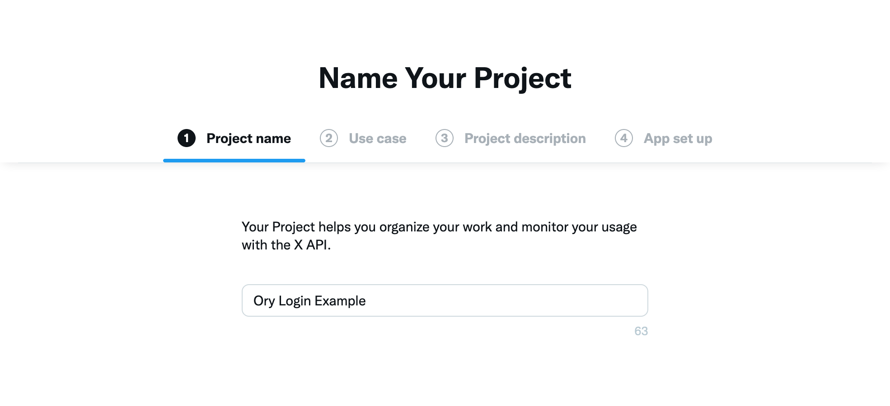
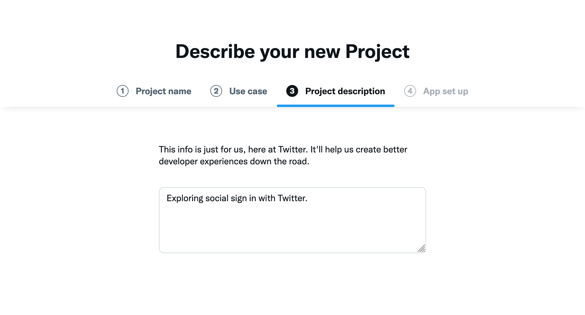
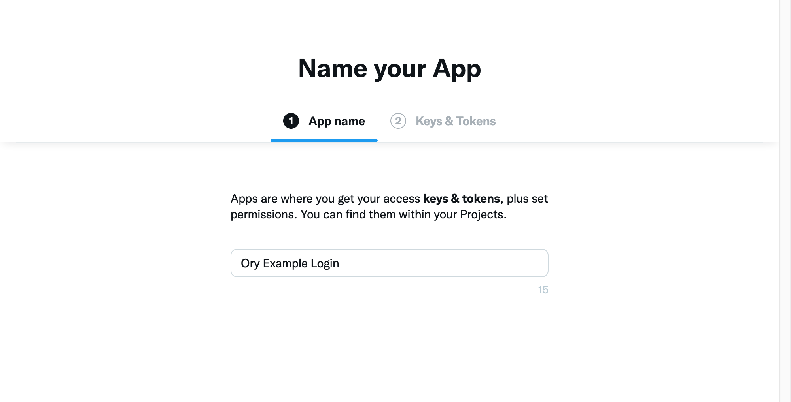
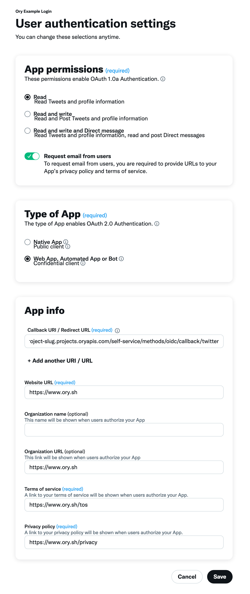

# Twitter

```mdx-code-block
import JsonnetWarning from "../../_common/jsonnetwarning.mdx"
import Tabs from '@theme/Tabs';
import TabItem from '@theme/TabItem';

<Tabs groupId="default">
<TabItem value="console" label="Ory Console" default>

Follow these steps to add Twitter as a social sign-in provider to your project using the Ory Console:

1. Sign in to Ory Console and select [**Social Sign-in**](https://console.ory.sh/projects/current/social-signin).
1. Click the switch next to the Twitter logo to start the configuration.
1. Copy the Redirect URI and save it for later use.

</TabItem>
<TabItem value="cli" label="Ory CLI">

The default redirect URI for twitter is `https://$project_slug.projects.oryapis.com/self-service/methods/oidc/callback/twitter`. Write it down for later use.

</TabItem>
</Tabs>
```

Next you will need to create a Twitter application and configure it to work with Ory. Here's how you can do that:

1. Head over to the [Twitter Developer Dashboard](https://developer.twitter.com/en/portal/dashboard). You do not need a
   subscription to Twitter's premium APIs to use the social sign-in feature and can use the free tier ("Sign up for Free
   Account").
1. Create a new Twitter v2 project: 
1. Choose a use case for your application. We use "Exploring the API" for this example:
   
1. Choose a description: 
1. If prompted, choose "Create a new app": 
1. You will now receive an API key and API Key Secret. Copy these values and save them for later use:
   
1. Go to the application settings and click on "Set up" under "User authentication settings":
   
1. Select your app permissions, set "Type of App" to "Confidential Client". If you need to read email addresses toggle "Request
   email from users" on. Provide the Redirect URI you saved earlier here:
   

Twitter is now set up! Continue with the following steps in Ory Console or Ory CLI to complete the configuration:

````mdx-code-block
<Tabs groupId="default">
<TabItem value="console" label="Ory Console" default>

1. Copy the API Key and API Key Secret from the Twitter Developer Dashboard and paste them into the corresponding fields in the Ory Console.
2. In the **Data Mapping** field of the form in the Ory Console, add the following Jsonnet code snippet,
    which maps the desired claims to the Ory Identity schema:

   ```jsonnet
   local claims = std.extVar('claims');

   {
     identity: {
       traits: {
         // Twitter does not send the email when it is not verified:
         //
         //   When set to true email will be returned in the user objects as a string. If the user does not have an email address on their account, or if the email address is not verified, null will be returned.
         //
         // There we can use the value provided by twitter without problem:
         [if 'email' in claims then 'email' else null]: claims.email,
       },
     },
   }
   ```

   ```mdx-code-block
   <JsonnetWarning format="Jsonnet code snippets" use="data mapping" />
   ```

10. Click **Save Configuration**.

</TabItem>
<TabItem value="cli" label="Ory CLI">
1. Create a Jsonnet code snippet to map the desired claims to the Ory Identity schema.

   ```jsonnet
   local claims = std.extVar('claims');
   {
     identity: {
       traits: {
         // Twitter does not send the email when it is not verified:
         //
         //   When set to true email will be returned in the user objects as a string. If the user does not have an email address on their account, or if the email address is not verified, null will be returned.
         //
         // There we can use the value provided by twitter without problem:
         [if 'email' in claims then 'email' else null]: claims.email,
       },
     },
   }
   ```

   ```mdx-code-block
   <JsonnetWarning format="Jsonnet code snippets" use="data mapping" />
   ```

4. Encode the Jsonnet snippet with [Base64](https://www.base64encode.org/) or host it under an URL accessible to Ory Network.

   ```shell
   cat your-data-mapping.jsonnet | base64
   ```

5. Download the Ory Identities config from your project and save it to a file:

   ```shell
   ## List all available projects
   ory list projects
   ## Get config
   ory get identity-config {project-id} --format yaml > identity-config-$project-id.yaml
   ```

6. Add the social sign-in provider configuration to the downloaded config. Add the Jsonnet snippet with mappings as a Base64
   string or provide an URL to the file.

   ```yaml
   selfservice:
     methods:
       oidc:
         config:
           providers:
            - id: twitter
              label: Twitter
              provider: twitter
              client_id: .... # Replace this with the API Key
              client_secret: .... # Replace this with the API Key Secret
              mapper_url: "base64://{YOUR_BASE64_ENCODED_JSONNET_HERE}"
              # Alternatively, use an URL:
              # mapper_url: https://storage.googleapis.com/abc-cde-prd/9cac9717f007808bf17f22ce7f4295c739604b183f05ac4afb4
              scope:
                - email
         enabled: true
   ```

7. Update the Ory Identities configuration using the file you worked with:

   ```shell
   ory update identity-config {project-id} --file identity-config.yaml
   ```

</TabItem>
</Tabs>
````

## Troubleshooting

```mdx-code-block
import SocialSigninTroubleshooting from '../_common/social-sign-in-troubleshooting.mdx'

<SocialSigninTroubleshooting />
```
