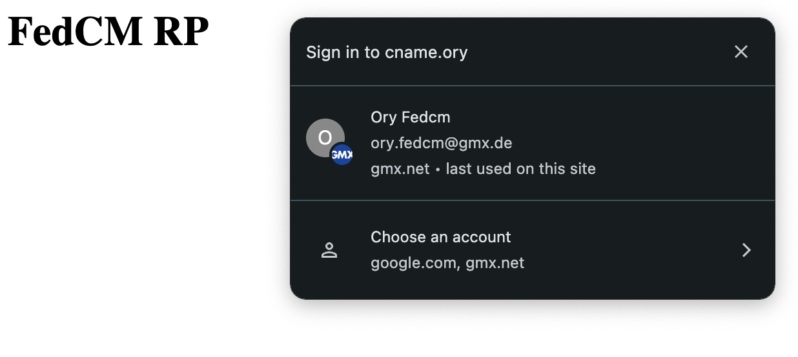

```mdx-code-block
import BrowserWindow from "@site/src/theme/BrowserWindow"
```

## Overview

Federated Credential Management (FedCM) is a [web API](https://developer.mozilla.org/en-US/docs/Web/API/FedCM_API) and
[standard](https://www.w3.org/TR/fedcm/) that allows users to sign in to websites using their federated identity providers (IdPs).
It aims to provide a more secure and privacy-preserving way for users to authenticate with third-party services.

When FedCm is set up, users will see a browser prompt asking them to use their federated identity provider to sign in to the
website:

```mdx-code-block
<BrowserWindow url="https://cname.ory">



</BrowserWindow>
```

## How It Works

1. **Fetching Parameters:** Your website requests the FedCM paramters from the Ory APIs.
1. **User Initiates Sign-In:** The user clicks a "Sign in with [IdP]" button on your website.
1. **FedCM API Call:** The user's browser uses the FedCM API to request an identity assertion from the IdP.
1. **User Consent:** The browser prompts the user to consent to sharing their identity with the relying party.
1. **Identity Assertion:** The IdP provides an identity assertion to your website.
1. **Authentication, Session issuance:** Your website submits the identity assertion to the Ory APIs to create an identity and
   session.

## Setup

### Configuration of the SSO providers

To set up FedCM, navigate to <ConsoleLink route="project.socialSignIn" /> and set up a new social sign-in provider. FedCM is
currently only supported for Google and NetID. Aside from the standard social sign-in configuration, you need to provide a
`FedCM Config URL` for the IdP. For NetID, additionally supply the `FedCM Token Exchange Origin Header`, which must be one of the
`origin_uris` of the NetID client.

### Configuration of the custom domain

In order to use FedCM with the Ory Network, it is necessary to expose the Ory Network APIs on a custom domain. To set up, navigate
to <ConsoleLink route="project.cname" /> and add a new custom domain. Make sure that you enable CORS, and that each origin you
want to use FedCM from is added to the list of allowed origins.

### Embedding the FedCM script

Next, embed the following script on each page you want to use FedCM on. In the script, replace `<YOUR CUSTOM ORY DOMAIN>` with the
custom domain you created in the previous step.

```javascript
if ("IdentityCredential" in window) {
  // Fetch the OIDC provider configuration from the Ory Network.
  // This will only include providers for which the FedCM config URL is set.
  const parameters = await (
    await fetch("https://<YOUR CUSTOM ORY DOMAIN>.projects.oryapis.com/self-service/fed-cm/parameters", {
      credentials: "include",
    })
  ).json()

  // Request an identity assertion from the user's browser.
  // Prior to the call, you can sort or filter this list if needed.
  const { token } = await navigator.credentials.get({
    identity: {
      providers: parameters.providers.map((p) => ({
        configURL: p.config_url,
        clientId: p.client_id,
        nonce: p.nonce,
      })),
    },
  })

  // Submit the identity assertion to the Ory Network.
  // This will log in or register the user and issue a session.
  await fetch("https://<YOUR CUSTOM ORY DOMAIN>/self-service/fed-cm/token", {
    credentials: "include", // necessary to send the CSRF cookie
    method: "POST",
    headers: { "Content-Type": "application/json" },
    body: JSON.stringify({
      token,
      csrf_token: parameters.csrf_token, // necessary to prevent CSRF attacks
    }),
  })
}
```

## Browser support

Since FedCM is a relatively new standard, browser support is limited to Chrome, Edge and Opera. Firefox and Safari do not yet
support FedCM.
