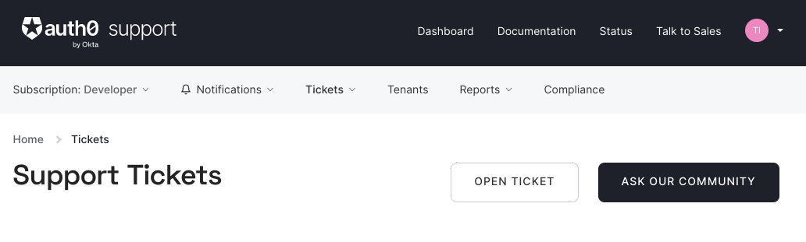

# Migrating from Auth0 to Ory

`better intro here`

While every setup has its own spin and we can't possibly account for all of them in this guide, we still try to give a good base
for usecase.

In this guide, we'll

- open a support ticket to get your hashed passwords from Auth0

- run a bulk user export to get your complete user data

- create identities in Ory Network

## Export Password Hashes

Because password hashes are considered sensitive information, Auth0 does not export them as part of the general export process.
You must file a support ticket to get the hashes and other password related information.

! **When you are exporting hashed passwords, neither you, nor Auth0 or the Ory system has access to the plain text password** !

When you have exported the hashed passwords from Auth0 and imported them into Ory Kratos, your users will be able to log in with
the same password they used previously.

**Tip:**

> If you are not able to export the hashes, due to the plan you are on or the migration timelines, one alternative is to have
> every user change their password using the forgot password flow. You can still import all the user data.

To start the process of obtaining the hashes, open a support ticket. From your dashboard, navigate to Get Support, and then open a
ticket by scrolling to the bottom of the support page.



Select the issue and details of your request. Choose `I have a question regarding my Auth0 account` and then pick the
`I would like to obtain an export of my password hashes` option.

You’ll receive an automated message after this ticket is submitted. View progress on the ticket screen.

**Important!**

> Auth0 requires you to be on a paid plan to export your password hashes. You cannot export them otherwise. Additionally, Auth0
> makes no commitments about the processing time for a password hash request. Plan accordingly.

After your request is processed, you’ll download a gzipped JSON file containing password hashes, related information and user ids.
It will look like this:

```JSON
{"_ID":{"$oid":"60425dc43519d90068f82973"},"email_verified":false,"email":"test2@example.com","passwordHash":"$2b$10$Z6hUTEEeoJXN5/AmSm/4.eZ75RYgFVriQM9LPhNEC7kbAbS/VAaJ2","password_set_date":{"$date":"2021-03-05T16:35:16.775Z"},"tenant":"dev-rwsbs6ym","connection":"Username-Password-Authentication","_tmp_is_unique":true}
{"_ID":{"$oid":"60425da93519d90068f82966"},"email_verified":false,"email":"test@example.com","passwordHash":"$2b$10$CSZ2JarG4XYbGa.JkfpqnO2wrlbfp5eb5LScHSGo9XGeZ.a.Ic54S","password_set_date":{"$date":"2021-03-05T16:34:49.502Z"},"tenant":"dev-rwsbs6ym","connection":"Username-Password-Authentication","_tmp_is_unique":true}
```

While this export contains your users email adresses and password hashes, you will still have to obtain the rest of your user
data.

## Creating a Bulk User Export

To get ahold of your user data, you'll need to create a
[bulk user export](https://auth0.com/docs/manage-users/user-migration/bulk-user-exports).

In order to do this, you'll need to get an Auth0 Management Token: On your Auth0 dashboard, navigate to **Applications > APIs**,
select **Auth0 Management API** and go to **API Explorer** tab. Here you'll find a token that you can copy and that is valid for
24 hours.

The bulk user export runs for a single connection, therefore you'll need to get the identifier for that. In this guide we'll use a
database connection; to get the ID we navigate to **Authentication > Database**, click on the connection and copy the ID.

We provide a script that does most of the legwork:

1. It accounts for all possible metrics you can export in a bulk user export.
2. The job might take a while to complete, but will pinged be and downloaded when it's ready.
3. The download is a gzipped, newline-delimited JSON, which then will be extracted and converted to a valid JSON file.

> These scripts assume that you have **jq, gzip and the Ory CLI** installed and that you use a POSIX-compliant shell like bash.

In order to use it, you'll need to export some variables:

```bash
export AUTH0_DOMAIN="{your_auth0_domain}.auth0.com"
export AUTH0_CONNECTION_ID="{your_auth0_connection_id}"
export AUTH0_TOKEN="{your_auth0_management_api_token}"
```

> Put this online, use curl and run this?

```bash
job_response=$(
    curl --request POST -s --url "https://${AUTH0_DOMAIN}/api/v2/jobs/users-exports" \
        --header "authorization: Bearer ${AUTH0_TOKEN}" \
        --header "content-type: application/json" \
        --data '{"connection_id": "'$AUTH0_CONNECTION_ID'", "format": "json", "fields": [
                {"name": "user_id"},
                {"name": "email"},
                {"name": "email_verified"},
                {"name": "username"},
                {"name": "phone_number"},
                {"name": "phone_verified"},
                {"name": "created_at"},
                {"name": "updated_at"},
                {"name": "identities[0].connection",
                "export_as": "provider" },
                {"name": "app_metadata"},
                {"name": "user_metadata"},
                {"name": "picture"},
                {"name": "name"},
                {"name": "nickname"},
                {"name": "multifactor"},
                {"name": "last_ip"},
                {"name": "last_login"},
                {"name": "logins_count"},
                {"name": "blocked"},
                {"name": "given_name"},
                {"name": "family_name"}
                ]}'
)

job_id=$(echo "$job_response" | jq -r ".id")

poll_job_status() {
    jobstatus=$(curl --request GET -s --url "https://${AUTH0_DOMAIN}/api/v2/jobs/${job_id}" --header "authorization: Bearer ${AUTH0_TOKEN}")
    state=$(echo $jobstatus | jq -r ".status")
    echo "jobstate: ${state}"

    if [[ $state == "pending" ]]; then
        echo "${jobstatus}" | jq ".time_left_seconds" | read timeleft
        if [ -z $timeleft]; then
            sleep 1
            echo "polling job state"
        else
            sleep $timeleft
            echo "time left: ${timeleft}s"
        fi
        poll_job_status

    elif [[ $state == "completed" ]]; then
        location=$(echo $jobstatus | jq -r ".location")
        curl "$location" --silent --output "AUTH0_USERDATA_nd.json.gz"
        gzip -d -c "AUTH0_USERDATA_nd.json.gz" | jq -s "." >"AUTH0_USERDATA.json"
        echo "Finished downloading Auth0 user data!"
    fi
}
poll_job_status
```

## Creating Identities

Once the download is finished and Auth0 provided you with the hashed passwords, we can create the identities
`in Ory Kratos / Ory Network?`.

We'll create the identities using an identity schema that's requires the users to login via email and password.

Since it's possible your user data contains new users who weren't registered when the hashed passwords were exported, we'll
reserve an identity for that email. If you're on a free Auth0 plan and you don't qualify for an export of your hashed passwords,
then this might be a viable option for you (`pw reset flow?`).

Now we create an Ory Project incase you don't have one yet:

`setting schema doesnt work this way and needs to be updated`

```bash
ory create project --name "Ory Docs Auth0 Migration Example"
project_id="{set to the project ID from output}"

# Use the email identity schema preset
ory patch identity-config $project_id \
  --replace '/identity/default_schema_id="preset://email"' \
  --replace '/identity/schemas=[{"id":"preset://email","url":"preset://email"}]'
```

We export the project slug and create a PAT `how?` and add paths pointing to the Auth0 exports.

```bash
export ORY_SLUG='{your_ory_slug}'
export ORY_TOKEN='{ory_token}'
export AUTH0_USERDATA="{/path/to/AUTH0_USERDATA.json}"
export AUTH0_PWEXPORT="{/path/to/hashed_passwords.json}" # comment this line to reserve not create identities
```

Now we can create the identities using this script.

```bash
create_payload() {
    unset payload

    # uses both email and pwhash. pwhash can also be 'null'-string
    if [[ -z "$email" && -z "$pwhash" ]]; then
        echo "please supply both an email and password"
        exit 1
    elif [[ -z "$pwhash" || "$pwhash" == "null" ]]; then
        payload=$(jq -n \
            --arg sid "$ORY_SCHEMA_ID" \
            --arg em "$email" \
            '{schema_id: $sid, traits: {email: $em}}')
    else
        payload=$(
            jq -n \
                --arg sid "$ORY_SCHEMA_ID" \
                --arg em "$email" \
                --arg pwhash "$pwhash" \
                '{schema_id: $sid,
                  traits:
                    {email: $em},
                     credentials:
                         {password:
                             {config:
                                 {hashed_password: $pwhash}}}}'
        )
    fi
}

create_identity() {
    if [[ -z "$payload" ]]; then
        echo "please supply a valid payload"
        exit 1
    else
        curl --request POST -sL \
            --header "Authorization: Bearer $ORY_TOKEN" \
            --header "Content-Type: application/json" \
            --data "$payload" "https://${ORY_SLUG}.projects.oryapis.com/admin/identities"
    fi
}

export ORY_SCHEMA_ID='preset://email'

if [ -z ${AUTH0_PWEXPORT+x} ]; then
    userdata=$(cat ${AUTH0_USERDATA} | jq ".")

    echo "$userdata" | jq -r '.[] | .email' | while read email; do
        create_payload
        create_identity
    done
else
    # add passwords to user data by email
    pw_hashes=$(cat "${AUTH0_PWEXPORT}" | jq -s "." | jq "map({email, passwordHash})")
    auth0_alldata=$(jq 'JOIN(INDEX(inputs[];.email);.[];.email;add)' <(cat "${AUTH0_USERDATA}") <(echo "$pw_hashes") | jq -s ".")

    echo "$auth0_alldata" | jq -r '.[] | .email, .passwordHash' | while read email && read pwhash; do
        create_payload
        create_identity $payload
    done

fi
```

Now you can either check the Identities page on Ory Network or you run

```bash
ory list projects
project_id="{project_id}" #copy the correct ID and run
ory list identities --project $project_id
```

Your users are now migrated!

`enable reset pw flow`
