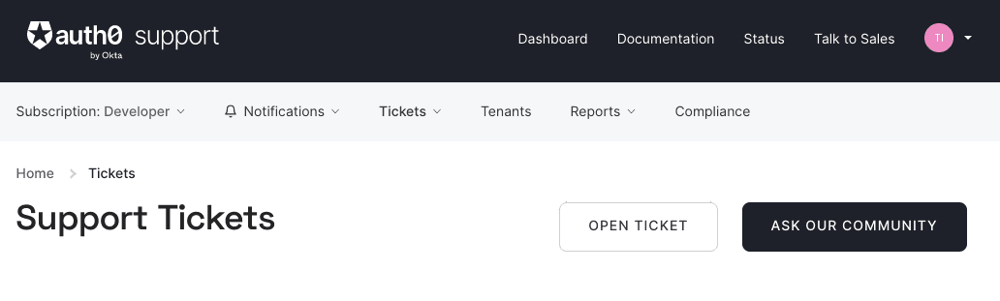

## Migrating from Auth0 to Ory

While every setup has its own spin and we can't possibly account for all of them in this guide, we still try to give a good base
for usecase.

In this guide, you'll:

1. open a support ticket to get your hashed passwords from Auth0.

2. run a bulk user export to get your complete user data.

3. create identities in Ory Network.

### Export password hashes

Because password hashes are considered sensitive information, Auth0 doesn't export them as part of the general export process. You
must file a support ticket to get the hashes and other password related information.

! **When you are exporting hashed passwords, neither you, nor Auth0 or the Ory system has access to the plain text password** !

When you have exported the hashed passwords from Auth0 and imported them into Ory Kratos, your users will be able to log in with
the same password they used previously.

**Tip:**

> If you aren't able to export the hashes, due to the plan you are on or the migration timelines, one alternative is to have every
> user change their password using the forgot password flow. You can still import all the user data.

To start the process of obtaining the hashes, open a support ticket. From your dashboard, navigate to Get Support, and then open a
ticket by scrolling to the bottom of the support page.



Select the issue and details of your request. Choose `I have a question regarding my Auth0 account` and then pick the
`I would like to obtain an export of my password hashes` option.

You’ll receive an automated message after this ticket is submitted. View progress on the ticket screen.

**Important!**

> Auth0 requires you to be on a paid plan to export your password hashes. You cannot export them otherwise. Additionally, Auth0
> makes no commitments about the processing time for a password hash request. Plan accordingly.

After your request is processed, you’ll download a gzipped JSON file containing password hashes, related information and user ids.
It will look like this:

```JSON
{"_ID":{"$oid":"60425dc43519d90068f82973"},"email_verified":false,"email":"test2@example.com","passwordHash":"$2b$10$Z6hUTEEeoJXN5/AmSm/4.eZ75RYgFVriQM9LPhNEC7kbAbS/VAaJ2","password_set_date":{"$date":"2021-03-05T16:35:16.775Z"},"tenant":"dev-rwsbs6ym","connection":"Username-Password-Authentication","_tmp_is_unique":true}
{"_ID":{"$oid":"60425da93519d90068f82966"},"email_verified":false,"email":"test@example.com","passwordHash":"$2b$10$CSZ2JarG4XYbGa.JkfpqnO2wrlbfp5eb5LScHSGo9XGeZ.a.Ic54S","password_set_date":{"$date":"2021-03-05T16:34:49.502Z"},"tenant":"dev-rwsbs6ym","connection":"Username-Password-Authentication","_tmp_is_unique":true}
```

While this export contains your users email adresses and password hashes, you will still have to obtain the rest of your user
data.

### Creating a bulk user export

To create a [bulk user export](https://auth0.com/docs/manage-users/user-migration/bulk-user-exports), you'll need a Management API
Access Token and the ID for your connection.

On your Auth0 dashboard, navigate to **Applications > APIs**, select **Auth0 Management API** and go to the **API Explorer** tab.
Here you'll see a token that you can copy and that's valid for 24 hours.

The bulk user export runs for a single connection only. In this guide it's assumed that you're using a database connection - to
get the ID you navigate to **Authentication > Database**, click on the connection and copy the ID. Every Auth0 connection has an
ID that's obtained this way.

You'll be using a script that does most of the legwork:

1. It accounts for all possible metrics you can export in a bulk user export.
2. The job might take a while to complete, but will pinged be and downloaded when it's ready.
3. The download is a gzipped, newline-delimited JSON, which then will be extracted and converted to a valid JSON file.

> These scripts assume that you have **jq, gzip and the Ory CLI** installed and that you use a POSIX-compliant shell like bash.

In order to use it, you'll need to export some variables:

```shell
export AUTH0_DOMAIN="{your_auth0_domain}.auth0.com"
export AUTH0_CONNECTION_ID="{your_auth0_connection_id}"
export AUTH0_TOKEN="{your_auth0_management_api_token}"
```

```shell
bash <(curl https://raw.githubusercontent.com/ory/docs/auth0guide/code-examples/migrate-to-ory/0-get-auth0-user-data.sh)
```

### Creating identities

Once the download is finished and Auth0 provided you with the hashed passwords, you can create the identities
`in Ory Kratos / Ory Network?`, requiring the users to login with email and password.

Since it's possible your user data contains new users who weren't registered when the hashed passwords were exported, we'll
reserve an identity for that email. If you're on a free Auth0 plan and you don't qualify for an export of your hashed passwords,
then this might be a viable option for you (`pw reset flow?`).

Now you create an Ory Project incase you don't have one yet:

`setting schema doesnt work this way and needs to be updated`

```shell
ory create project --name "Ory Docs Auth0 Migration Example"
export ORY_PROJECT_ID='{set to the project ID from output}'

# Use the email identity schema preset
ory patch identity-config $ORY_PROJECT_ID \
  --replace '/identity/default_schema_id="preset://email"' \
  --replace '/identity/schemas=[{"id":"preset://email","url":"preset://email"}]'
```

Export the paths to your hashed passwords and your Auth0 user data like this:

```shell
export AUTH0_USERDATA="{/path/to/AUTH0_USERDATA.json}"
export AUTH0_PWEXPORT="{/path/to/hashed_passwords.json}" # comment this line to reserve not create identities
```

Now you can import identities using this script.

```shell
bash <(curl https://raw.githubusercontent.com/ory/docs/auth0guide/code-examples/migrate-to-ory/1-create-ory-identities.sh)
```

You can either check the **Identities** page on Ory Network or run:

```shell
ory list identities --project $ORY_PROJECT_ID
```

Your users are now migrated!

`enable reset pw flow`
