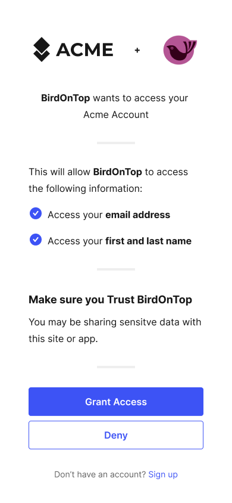

OAuth2 and OpenID Connect are powerful protocols for securing your applications and APIs. Ory OAuth2 & OpenID Connect is a highly
flexible and customizable implementation of these protocols that allows you to easily bring your own user database, login UI,
consent logic, and consent UI.

This guide will walk you through the process of customizing Ory OAuth2 & OpenID Connect to work with your user database, login UI,
and consent logic and UI. We'll cover everything you need to know, including how to redirect users to your login endpoint, how to
fetch and process login and consent requests, and how to use the SDK to accept or reject these requests.

:::note

Per default, Ory OAuth2 & OpenID Connect is integrated with Ory Identities and the Ory Account Experience. You only need to read
this document if you want to customize the user backend, login ui, or consent logic and ui.

:::

## How Ory OAuth2 & OpenID Connect works

OAuth2 and OpenID Connect require an authenticated End-User session for all OAuth2 / OpenID Connect flows except the
client_credentials flow which does not involve End-Users. Ory OAuth2 & OpenID Connect doesn't contain a database with End-Users
but instead uses HTTP Redirection to "delegate" the login flow to another app - we call this the Ory OAuth 2.0 login & consent
flow.

## Example implementation

You can find an example [Node.js implementation on Ory's GitHub](https://github.com/ory/hydra-login-consent-node) for an app that
implements both custom login and consent.

## Login

The OAuth2 2.0 / OpenID Connect Flow is initiated by pointing the End-User's browser to the `/oauth2/auth` endpoint. Depending on
which flow ("Authorize Code Flow", "Implicit Flow", ...) you want to use, some of the query parameters (for example
`/oauth2/auth?response_type=code`, `/oauth2/auth?response_type=token, ...) might change but the overall initiation works always by
sending the browser to that URL.

The next task for Ory OAuth2 & OpenID Connect is to know the user of the request. To achieve that, Ory OAuth2 & OpenID Connect
checks if a session cookie is set containing information about a previously successful login. Additionally, OpenID Connect
parameters id_token_hint, prompt, and max_age are evaluated and processed. Depending on their values and the login state, the user
might need to re-authenticate or the flow will fail.

To authenticate the user (this happens regardless of whether a session exists for the user or not), Ory OAuth2 & OpenID Connect
redirects the browser to the "Login Endpoint" established in your config:

```shell
ory patch oauth2-config
  --replace "/urls/login=\"https://login.example.org/oauth2-login\""
```

Ory OAuth2 & OpenID Connect appends a login_challenge query parameter to the URL. The value is an ID which should later be used by
the Login Endpoint to fetch important information about the request.

```
https://login.example.org/oauth2-login?login_challenge=7bb518c4
```

The way you authenticate the End-User is up to you. In most cases, you will show an HTML form similar to:

```html title="Example login form"
<form action="/login" method="post">
  <input type="hidden" name="csrf_token" value="...." />
  <!-- Use CSRF tokens in your HTML forms! -->
  <input type="email" name="login_email" placeholder="Please enter your email address to log in" />
  <input type="password" name="login_password" />
  <input type="checkbox" name="remember" value="Remember me on this device" />
  <input type="submit" value="Log in" />
</form>
```

### Login endpoint code example

The Login Endpoint (set by configuration key `/urls/login`) is an application written by you. It uses the `login_challenge` value
in the URL to complete the login flow using the Ory SDK:

```mdx-code-block
import loginVerbose from '!!raw-loader!../../../code-examples/sdk/typescript/src/oauth2/login-verbose.ts'
import CodeBlock from '@theme/CodeBlock'

<CodeBlock language="js">{loginVerbose}</CodeBlock>
```

The response contains information about the login request. The body contains a skip value. If the value is false, the user
interface must be shown. If skip is true, you shouldn't show the user interface but instead just **accept** or **reject** the
login request!

Once the End-User authenticated successfully, you either accept the login challenge, or you reject (for example the user isn't
allowed to perform OAuth2 flows) the login challenge.

## Consent

Once the login challenge is accepted, Ory OAuth2 & OpenID Connect will ask the user for consent:



The logic and UI is fully under your control, because Ory OAuth2 & OpenID Connect redirects the End-User's browser to the "Consent
Endpoint" established in your config:

```shell
ory patch oauth2-config
  --replace "/urls/consent=\"https://consent.example.org/oauth2-consent\""
```

Ory OAuth2 & OpenID Connect appends a consent_challenge query parameter to the URL. The value is an ID which should later be used
by the Consent Endpoint to fetch important information about the request.

```text
https://consent.example.org/oauth2-consent?consent_challenge=7bb518c4eec2454dbb289f5fdb4c0ee2
```

The way you collect the consent information from the End-User is up to you. In most cases, you will show an HTML form similar to:

```html
<form action="/consent" method="post">
  <input type="hidden" name="csrf_token" value="...." />
  <!-- Use CSRF tokens in your HTML forms! -->
  <input type="checkbox" name="scope" value="email" />
  <input type="checkbox" name="scope" value="profile" />
  <input type="submit" name="submit" value="accept" />
  <input type="submit" name="submit" value="reject" />
</form>
```

### Previous consent

A consent has four distinctive attributes:

1. The requested scope (`scope=email+profile+offline_access`);
2. The OAuth2 Client (`client_id=abcd`);
3. The End-User (this is the subject set in the Login Flow);
4. If a previous consent exists, the previous consent has `remember: true`, and the scope granted by the user (did the user accept
   all of `email`, `profile`, `offline_access`).

There are three possible states:

1. The user has never before authorized ("consent") the OAuth2 Client before.
2. The user has authorized ("consent") the OAuth2 Client before and chose to remember the "consent".
3. The user has authorized ("consent") the OAuth2 Client before, and chose to remember the "consent", but the OAuth2 Client now
   also wants additional permissions ("has changed the token scope" in /oauth2/auth?scope=...).

Regardless of which of these three states we're in, the End-User's browser is always redirected to the Consent Endpoint. What
changes is the skip value, as explained a bit later.

In certain scenarios (for example a special OAuth2 Client), you might not want to show the consent screen at all. In those cases,
you can choose to skip showing the UI and just accept the consent. Please keep in mind that OAuth2 is a delegation protocol and
that it makes most sense for third-party access. Not showing the consent screen will break OpenID Connect Certification.

### Consent endpoint code example

The Consent Endpoint uses the `consent_challenge` value in the URL to complete the consent using the Ory SDK:

```mdx-code-block
import consentVerbose from '!!raw-loader!../../../code-examples/sdk/typescript/src/oauth2/consent-verbose.ts'

<CodeBlock language="js">{consentVerbose}</CodeBlock>
```

The response contains information about the consent request. The body contains a `skip` value. If the value is `false`, the user
interface must be shown. If skip is `true`, you shouldn't show the user interface but instead just accept or reject the consent
request!

## Sequence diagram

```mdx-code-block
import Mermaid from "@theme/Mermaid"

<Mermaid
  chart={`sequenceDiagram
    OAuth2 Client->>Ory OAuth2 & OpenID Connect: Initiates OAuth2 Authorize Code or Implicit Flow
    Ory OAuth2 & OpenID Connect-->>Ory OAuth2 & OpenID Connect: No end user session available (not authenticated)
    Ory OAuth2 & OpenID Connect->>Login Endpoint: Redirects end user with login challenge
    Login Endpoint-->Ory OAuth2 & OpenID Connect: Fetches login info
    Login Endpoint-->>Login Endpoint: Authenticates user with credentials
    Login Endpoint-->Ory OAuth2 & OpenID Connect: Transmits login info and receives redirect url with login verifier
    Login Endpoint->>Ory OAuth2 & OpenID Connect: Redirects end user to redirect url with login verifier
    Ory OAuth2 & OpenID Connect-->>Ory OAuth2 & OpenID Connect: First time that client asks user for permissions
    Ory OAuth2 & OpenID Connect->>Consent Endpoint: Redirects end user with consent challenge
    Consent Endpoint-->Ory OAuth2 & OpenID Connect: Fetches consent info (which user, what app, what scopes)
    Consent Endpoint-->>Consent Endpoint: Asks for end user's permission to grant application access
    Consent Endpoint-->Ory OAuth2 & OpenID Connect: Transmits consent result and receives redirect url with consent verifier
    Consent Endpoint->>Ory OAuth2 & OpenID Connect: Redirects to redirect url with consent verifier
    Ory OAuth2 & OpenID Connect-->>Ory OAuth2 & OpenID Connect: Verifies grant
    Ory OAuth2 & OpenID Connect->>OAuth2 Client: Transmits authorization code/token`}
/>
```

## Conclusion

In this document, we explained how to bring your own User Database, Login UI, Consent Logic, and Consent UI to Ory OAuth2 and
OpenID Connect. We also provided a sequence diagram that describes the different API calls and HTTP Redirects when performing the
OAuth2 flow. Additionally, we covered how to handle Login and Consent Flows using the SDK.

We hope that this documentation is helpful to you in customizing Ory OAuth2 and OpenID Connect to fit your needs. If you have any
questions or issues, please don't hesitate to reach out to our support team.
