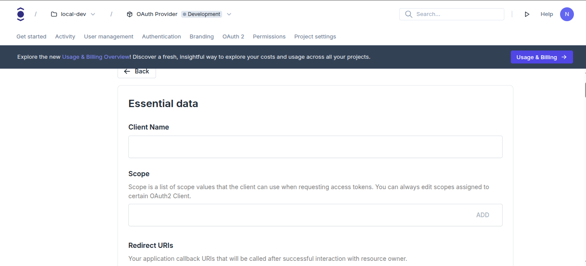

This guide shows you how to register an OAuth2 client in your Ory project.

```mdx-code-block
<Tabs
  defaultValue="console"
  values={[
    {label: 'Ory Console', value: 'console'},
    {label: 'Ory CLI', value: 'cli'},
  ]}>
<TabItem value="console">
```

```mdx-code-block
</TabItem>
<TabItem value="console">
```

```mdx-code-block

1. Log in to your [Ory Console](https://console.ory.sh/)
2. Select your workspace and project from the dropdown menus at the top
3. Click on **OAuth2** in the main navigation menu
4. In the OAuth2 page, select on the **OAuth2 Clients** tab
5. Click the **Create OAuth2 Client** button
6. In the client type selection screen, select **Custom**
   - This option gives you full control over all OAuth2 client settings
```

```mdx-code-block
import BrowserWindow from "@site/src/theme/BrowserWindow"

<BrowserWindow url="https://console.ory.sh/projects/<project-id>/oauth/create">

</BrowserWindow>
```

7. Fill in the client details:

   - **Client Name**: A name for your client
   - **Redirect URIs**: The URLs to which Ory will redirect users after authentication (e.g., http://localhost:3000/callback)
   - **Scopes**: The permissions your client will request (recommended: openid, email, and profile)
   - **Grant Types**: Select `authorization_code` and `refresh_token`
   - **Response Types**: Select Authorization code (`code`)
   - You can leave the rest of the settings as default for now.

8. Copy the **Client ID** and **Client Secret** generated for your client. You will need these values to configure your
   application.

:::note

Ensure you save before leaving the page. You can always come back to this page to view or edit your client settings.

:::

```mdx-code-block
</TabItem>
<TabItem value="cli">
```

1. Create an Ory Network project if you don't have one yet:

```shell
ory create project --name "Ory Docs OAuth2 Integration Example"
```

:::note

Copy the **Project ID** and **Project Slug** from the output. You will need these values to configure your application.

:::

2. Create these environmental variables in your shell:

```shell
export ORY_PROJECT_ID=<your-project-id>
export ORY_PROJECT_SLUG=<your-project-slug>
```

3. Create the OAuth2 client:

```shell
ory create oauth2-client --project "$ORY_PROJECT_ID" \
  --name "Ory Docs OAuth2 Integration Example Client" \
  --grant-type authorization_code,refresh_token,client_credentials \
  --response-type code \
  --scope openid --scope offline_access --scope email \
  --redirect-uri http://localhost:3000/callback
```

:::note

The command will output your Client ID and Client Secret. Make sure to save these values securely as they'll be needed in your
application configuration.

:::

```mdx-code-block
</TabItem>
</Tabs>
```
