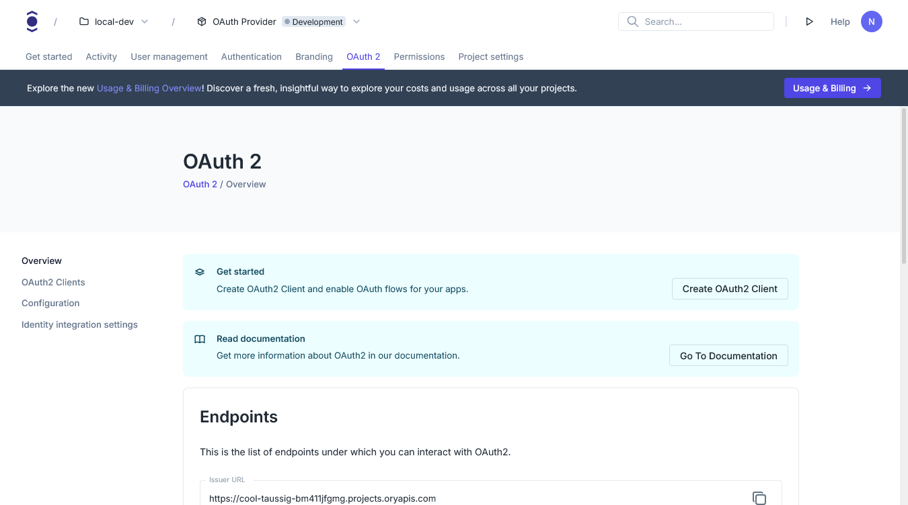

```mdx-code-block
import BrowserWindow from "@site/src/theme/BrowserWindow"
```

Ory oauth2 server is enabled by default for all Ory Network projects. You don't need to install or configure anything to start
using it.

1. Log in to your [Ory Console](https://console.ory.sh/)
2. Select your workspace and project
3. Navigate to the **oauth2** tab in the navbar

```mdx-code-block
<BrowserWindow url="https://console.ory.sh/projects/<id>/oauth/overview">

</BrowserWindow>
```
