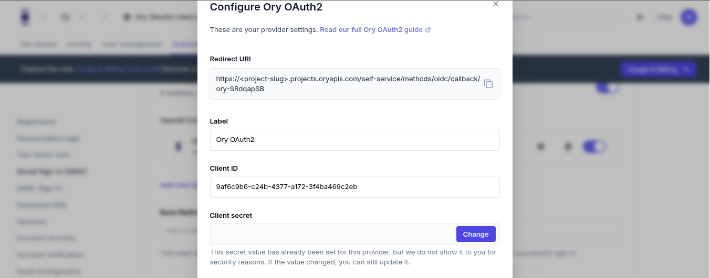
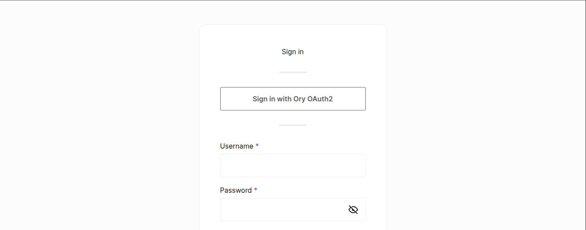

```mdx-code-block
import BrowserWindow from "@site/src/theme/BrowserWindow"
import Tabs from "@theme/Tabs"
import TabItem from "@theme/TabItem"
```

This guide shows you how to configure Ory Identities as a social sign-in provider, allowing users to authenticate using another
Ory project.

## Understanding ory-to-ory authentication

When setting up Ory OAuth2 as a social provider, you'll work with two separate Ory projects: a **provider project** that serves as
your identity source (similar to how Google works in "Login with Google"), and a **consumer project** where you add the "Sign in
with Ory OAuth2" option for your users.

```mdx-code-block
<Tabs
  defaultValue="console"
  values={[
    {label: 'Ory Console', value: 'console'},
    {label: 'Ory CLI', value: 'cli'},
  ]}>
<TabItem value="console">
```

**1. Set up ory oauth2 as a social provider**

1. Go to your Ory project in the Ory Console
2. Click on **Authentication** in the main navigation menu
3. Select **Social Sign-In (OIDC)** from the sidebar
4. Enable OpenID Connect by toggling the switch
5. Click on **Add new OpenID Connect provider**
6. Select **Ory OAuth2** from the provider list

**2. Configure the ory oauth2 provider**

Fill in the provider details using the information from your provider project (OAuth2 client setup):

1. **Redirect URI**: This is pre-filled and automatically includes a unique callback ID
2. **Label**: You can keep "Ory OAuth2" or customize it
3. **Client ID**: Enter the OAuth2 client ID from your provider project
4. **Client Secret**: Enter the OAuth2 client secret from your provider project
5. **Issuer URL**: Enter the base URL of your provider project
   ```
   https://your-provider-project-slug.projects.oryapis.com
   ```

```mdx-code-block
<BrowserWindow url="https://console.ory.sh/projects/<project-id>/social-signin">

</BrowserWindow>
```

**3. Configure redirect uri in provider project**

To avoid redirect errors, you must add the consumer project's callback URL to your provider project:

1. Go to your **provider project** in the Ory Console
2. Navigate to OAuth2 → OAuth2 Clients
3. Find and edit your OAuth2 client
4. In the Redirect URIs section, add the exact callback URL shown in your consumer project's configuration:
   ```
   https://your-consumer-project-slug.projects.oryapis.com/self-service/methods/oidc/callback/ory-XXXX
   ```
5. Save the changes

```mdx-code-block
</TabItem>
<TabItem value="cli">
```

**1. Create a provider project and oauth2 client (if needed)**

If you haven't already created a provider project and OAuth2 client:

```shell
# Create a provider project
ory create project --name "OAuth2 Provider - Example Corp"

# Save the project ID for future use
export PROVIDER_PROJECT_ID=your-provider-project-id  # replace with your project ID

# Create an OAuth2 client in the provider project
ory create oauth2-client --project "$PROVIDER_PROJECT_ID" \
  --name "OAuth2 Client for Social Sign-in" \
  --grant-type authorization_code,refresh_token \
  --response-type code \
  --scope openid,offline_access,email \
  --redirect-uri https://your-consumer-project-slug.projects.oryapis.com/self-service/methods/oidc/callback/your-provider-id
```

Save the Client ID and Client Secret from the output. You'll need these for configuring the consumer project.

**2. Download the identity configuration from your consumer project**

```shell
# List all available workspaces
ory list workspaces

# List all projects in the workspace
ory list projects --workspace <workspace-id>

# Get and save the identity configuration
ory get identity-config --project <consumer-project-id> --format yaml > identity-config.yaml
```

**3. Create a jsonnet mapping for identity claims**

Create a file named `claims-mapper.jsonnet` with the following content:

```jsonnet
local claims = {
  email_verified: false,
} + std.extVar('claims');

{
  identity: {
    traits: {
      // Only map verified email addresses to prevent enumeration attacks
      [if 'email' in claims && claims.email_verified then 'email' else null]: claims.email,
    },
  },
}
```

**4. Convert the jsonnet mapping to base64**

```shell
# On Linux/macOS
BASE64_MAPPER=$(cat claims-mapper.jsonnet | base64)

# On Windows PowerShell
$BASE64_MAPPER = [Convert]::ToBase64String([Text.Encoding]::UTF8.GetBytes((Get-Content -Raw claims-mapper.jsonnet)))
```

**5. Add the social sign-in provider to your configuration**

Edit your `identity-config.yaml` file to include the OIDC provider configuration:

```yaml
selfservice:
  methods:
    oidc:
      config:
        providers:
          - id: ory-oauth2 # A unique ID for this provider (don't change once set)
            provider: generic
            client_id: "your-client-id" # From step 1
            client_secret: "your-client-secret" # From step 1
            issuer_url: "https://your-provider-project-slug.projects.oryapis.com" # Provider project URL
            mapper_url: "base64://YOUR_BASE64_ENCODED_JSONNET" # Replace with your base64 content
            scope:
              - email
              - offline_access
              - openid
      enabled: true
```

Replace `YOUR_BASE64_ENCODED_JSONNET` with the base64 string from step 4.

**6. Update your project configuration**

```shell
ory update identity-config --project <consumer-project-id> --file identity-config.yaml
```

**7. Configure redirect uri in provider project**

Make sure the OAuth2 client in your provider project includes the correct redirect URI for your consumer project:

```shell
# Get the OAuth2 client ID
export CLIENT_ID=your-oauth2-client-id  # Replace with your client ID

# Get the current OAuth2 client configuration
ory get oauth2-client $CLIENT_ID --project $PROVIDER_PROJECT_ID > oauth2-client.json

# Update the client configuration to add the redirect URI
# Edit oauth2-client.json to add the correct redirect URI to the "redirect_uris" array
# Then update the client:
ory update oauth2-client $CLIENT_ID --project $PROVIDER_PROJECT_ID --file oauth2-client.json
```

```mdx-code-block
</TabItem>
</Tabs>
```

## What users will see

Once configured, users will see an "Ory OAuth2" option on your login screen:

```mdx-code-block
<BrowserWindow url="https://your-project-slug.projects.oryapis.com/ui/login">

</BrowserWindow>
```

When users click this button, they'll be redirected to authenticate with your provider Ory project. After successful
authentication, they'll be redirected back to your application with a valid session.
