The Setup link is used to create a shareable link that can be used to create an SSO Connection without exposing any sensitive
information. Let's go through the steps to create a new Setup link

## Create Setup link

You can create a new Setup link for SSO from the Connections page using `New Setup Link` button

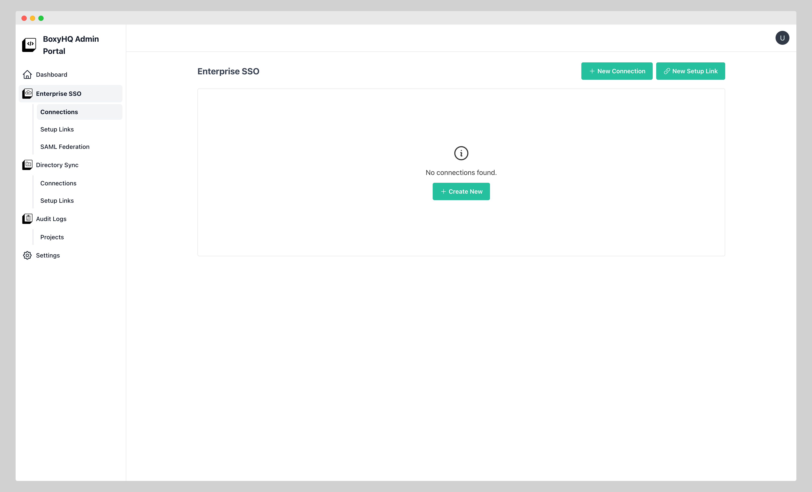

Another way is to go to the `Setup Links` section under `Enterprise SSO` menu and Click on Create New/New Setup Link button

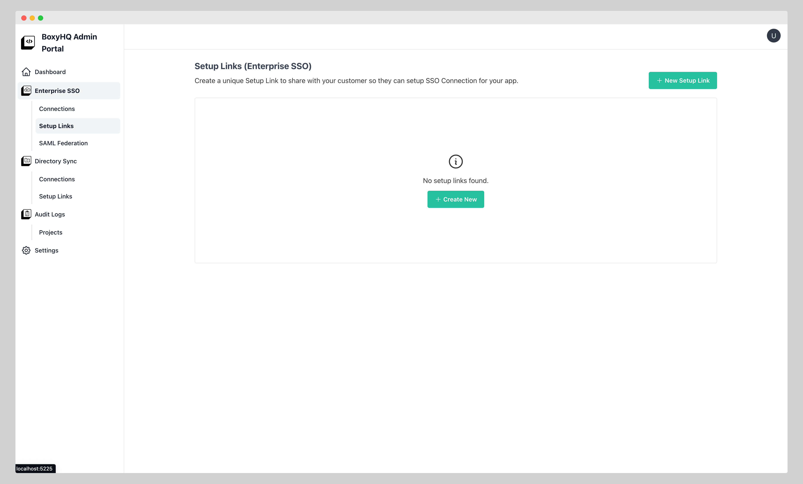

The create Setup Link for SSO page looks like below

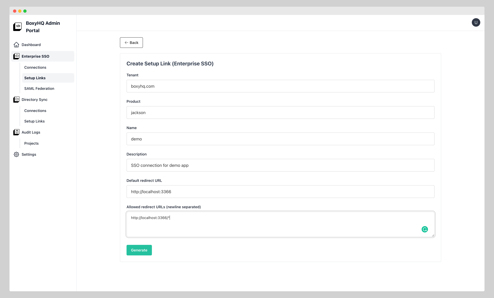

Once the link is created you can see the the link info section at the bottom

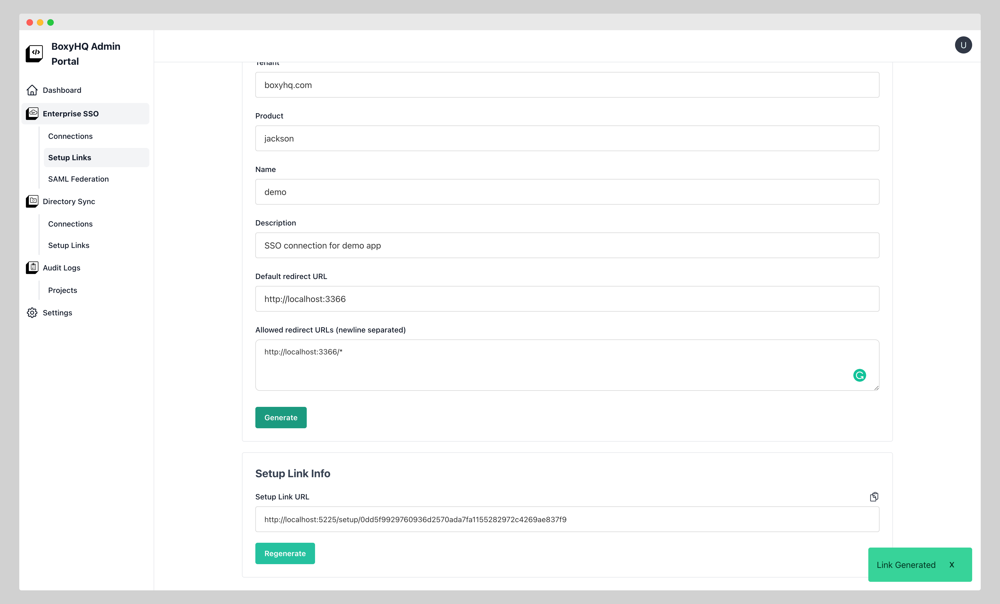

You can copy the link by clicking on the `Copy` button

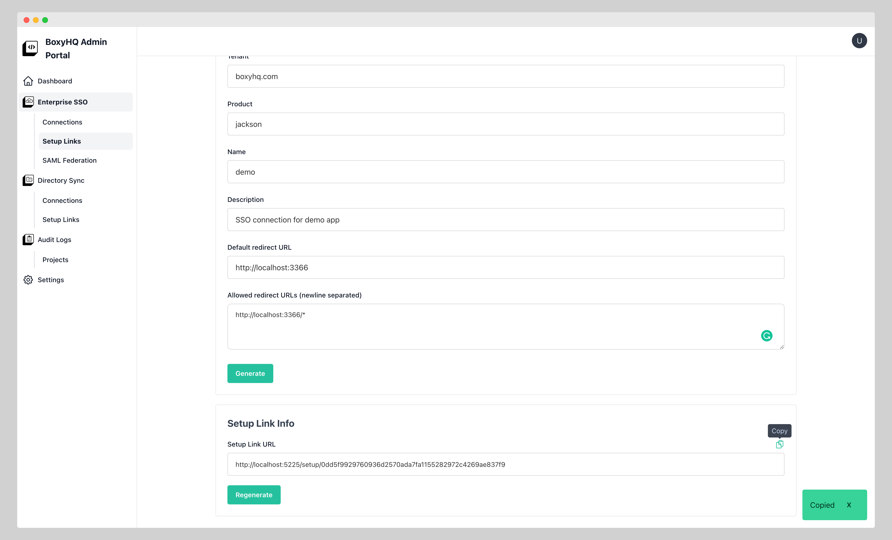

### Regenerate link

You can regenerate the link by clicking on `Regenerate` button

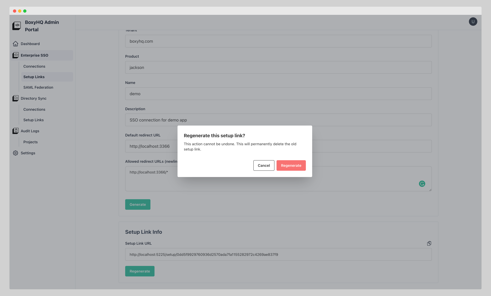

Once you confirm Regenerate action you will see the new setup link in the link info section

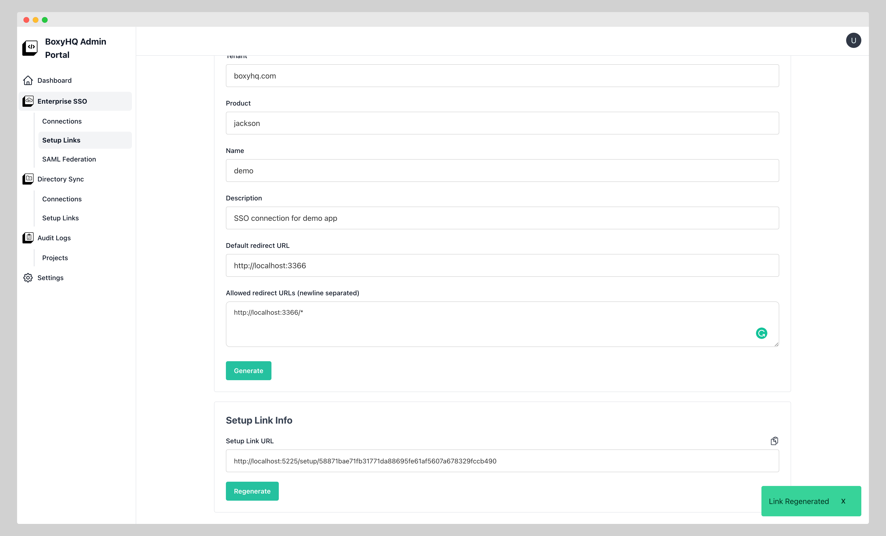

### Actions from setup link list page

#### You can perform `ACTIONS` like `Copy`, `View`, `Regenerate` & `Delete` from this page

Regenerate

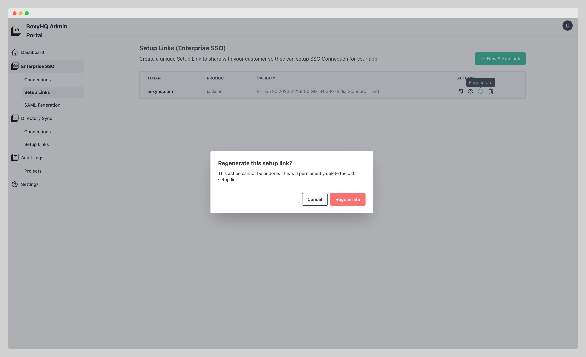

Delete

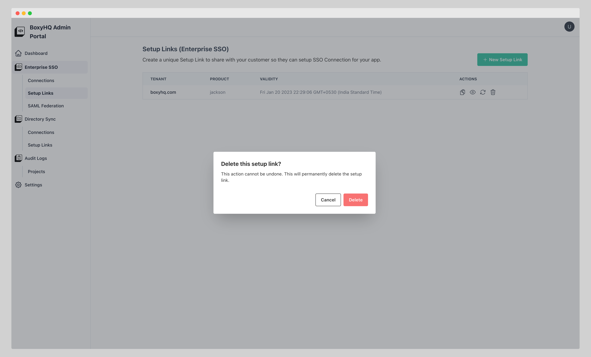

### Setup link page

When you open the setup link you will land on the SSO Connection create section as there are no connections to show.

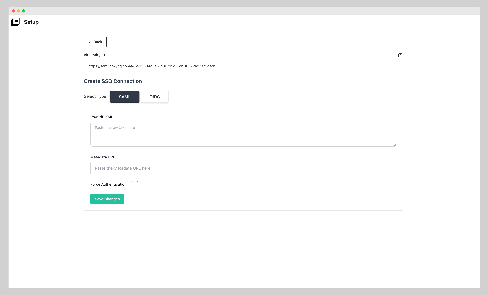

### Create SSO Connection with setup link

You can create a SSO Connection by filling the details.

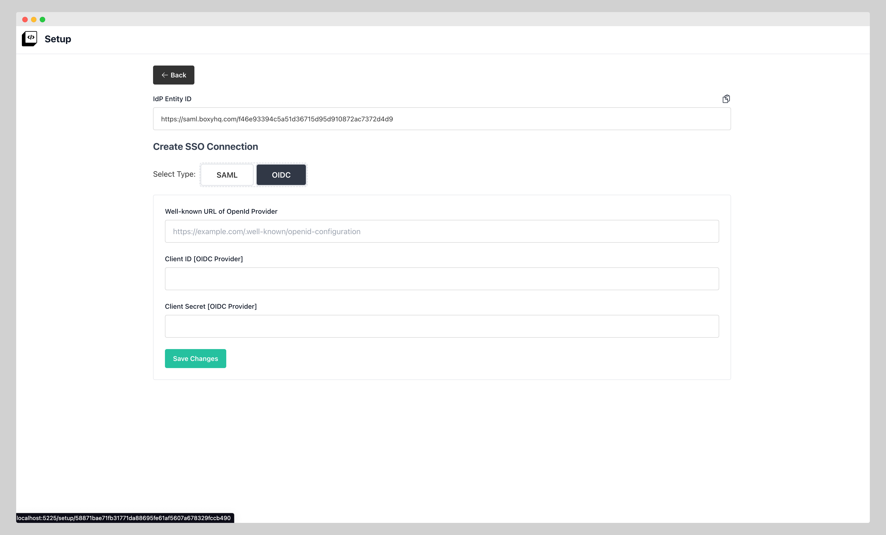

As you can see that setup link makes it super easy & safe to create SSO Connections.
