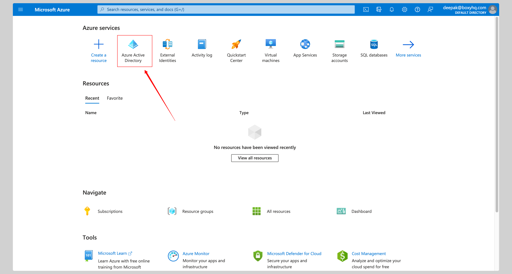
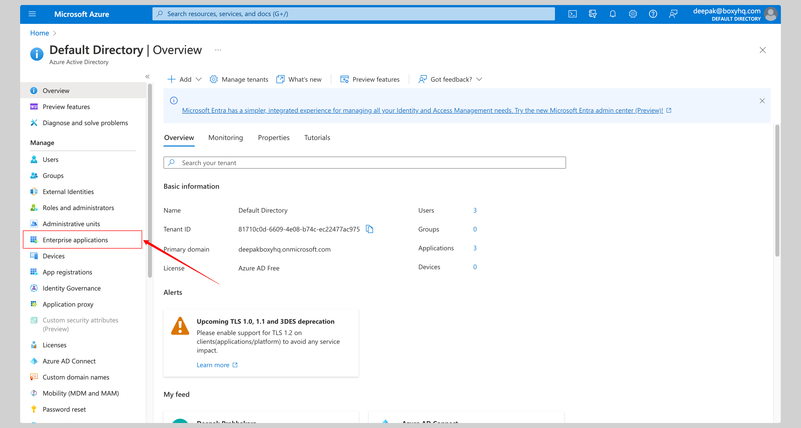
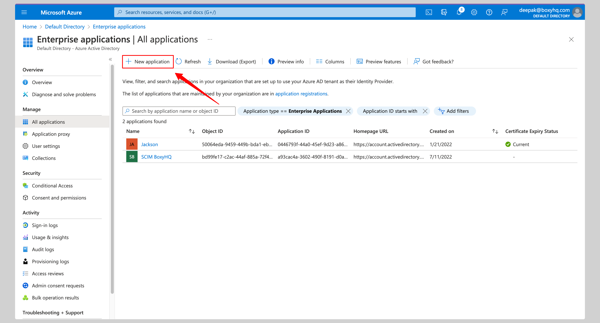
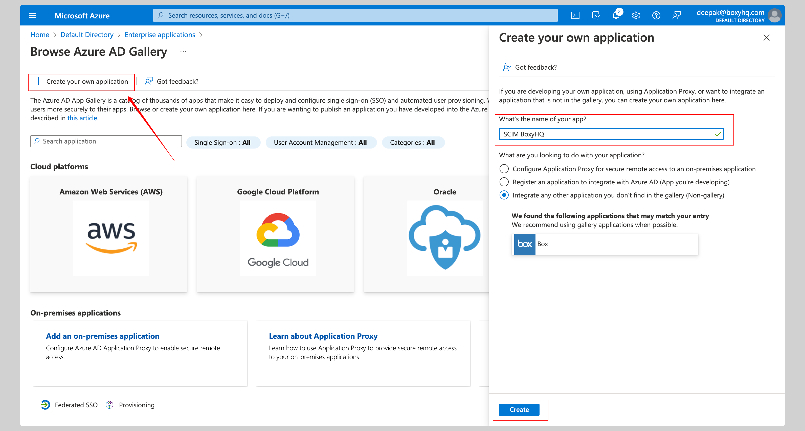
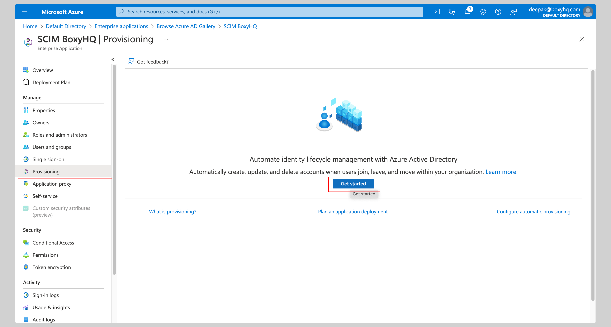
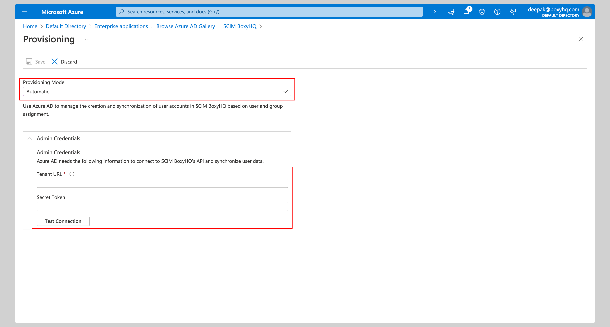
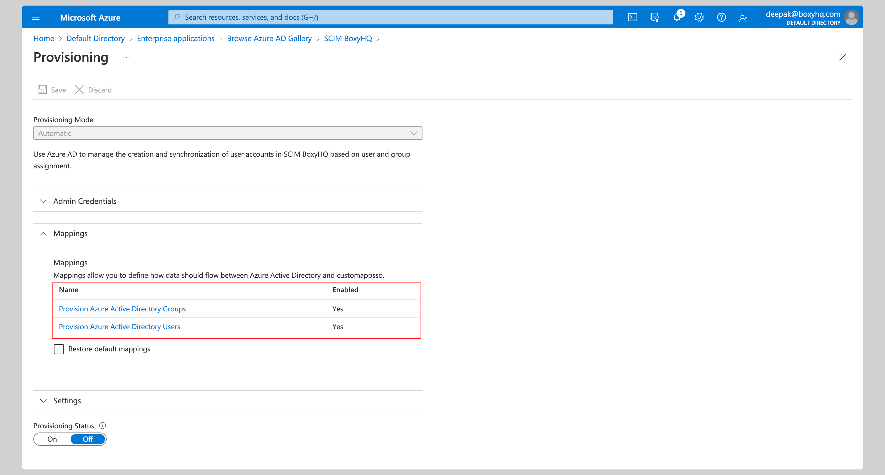
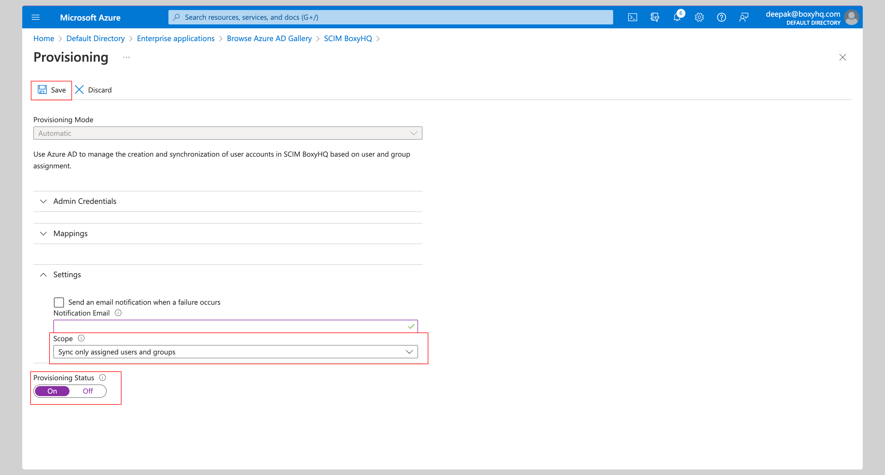
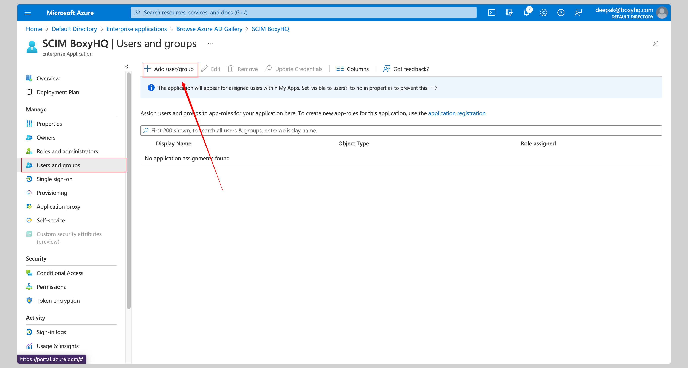
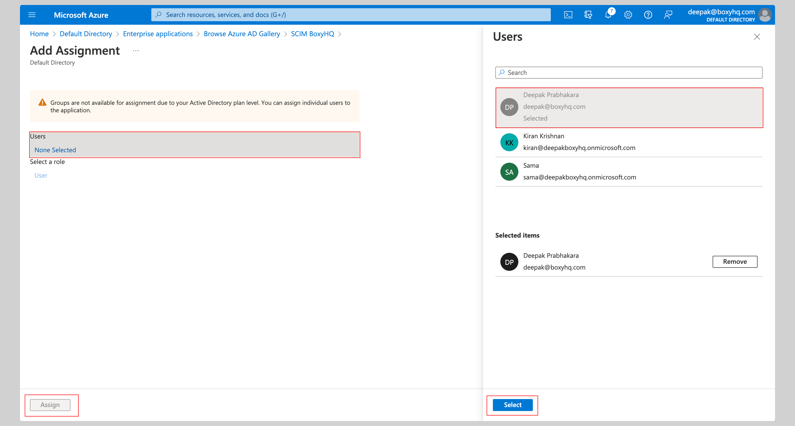

The following guide will walk you through the process of configuring Ory Polis to use the Microsoft Entra ID SCIM v2.0 directory
provider.

## Create Azure Application

Click **Azure Active Directory** from the Microsoft Azure Portal.

Click **Enterprise Applications** from the left navigation menu.

If your application is already created, choose it from the list and move to the section
[Enable SCIM Provisioning](#enable-azure-scim-provisioning)

If you haven't created your application yet, click **New application** button.

From the next screen, click **Create your own application**, give your application a **name** and click the **Create** button.

## Enable Azure SCIM Provisioning

Click **Provisioning** from the left navigation menu then click **Get started**.

Select **Automatic** from the **Provisioning Mode** dropdown and enter the following information under **Admin Credentials**
section:

- Tenant URL
- Secret Token

Next, click the **Test Connection** button to test the connection to see if the credentials are correct, then click **Save** to
save the credentials.

Expand the **Mappings** section and ensure group and user attribute mappings are enabled for your app. The default mapping should
work.

Expand the **Settings** section and make the following changes:

- Select **Sync only assigned users and groups** from the **Scope** dropdown.
- Confirm the **Provisioning Status** is set to **On**.

At this stage, you've successfully configured the Microsoft Entra ID SCIM API integration.

## Assign Users

From your application, click the **Users and groups** from the left navigation menu and click **Add user/group**.

Select **None Selected** under the **Users**.

From the right side of the screen, select the users you want to assign to the app and click the **Select** button, then click
**Assign** to those users to the app.

## FAQ

#### How frequently does Microsoft Entra ID SCIM perform sync by default?

Microsoft Entra ID automatically provisions and updates user accounts in an app based on things like user and group assignment.
The sync happens at a regularly scheduled time interval, typically every 20-40 minutes.

#### Why does the PATCH request fail in Microsoft Entra ID SCIM?

This is a known issue with Entra ID SCIM implementation. You have to add the query param `?aadOptscim062020` to the SCIM endpoint
URL to make PATCH requests work. This query param update PATCH behavior and ensure SCIM compliance.
[Read More](https://learn.microsoft.com/en-us/entra/identity/app-provisioning/application-provisioning-config-problem-scim-compatibility#flags-to-alter-the-scim-behavior)
