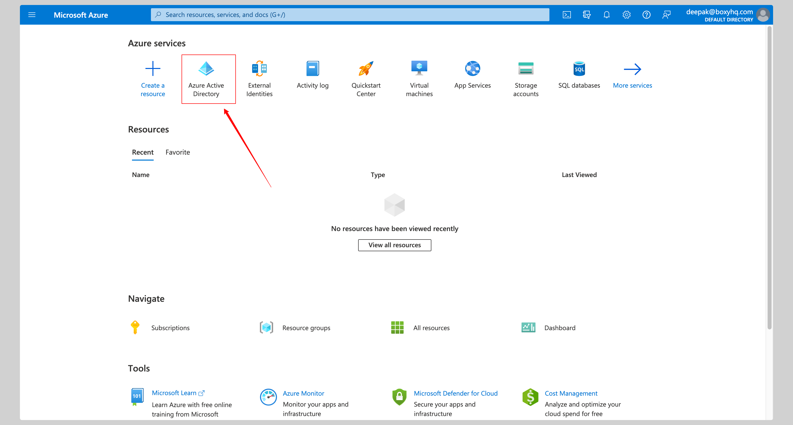
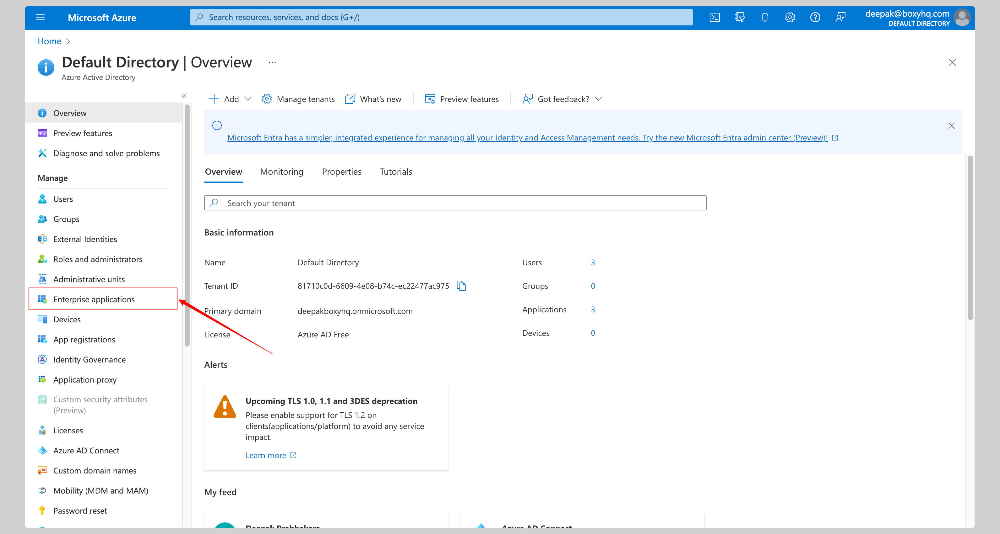
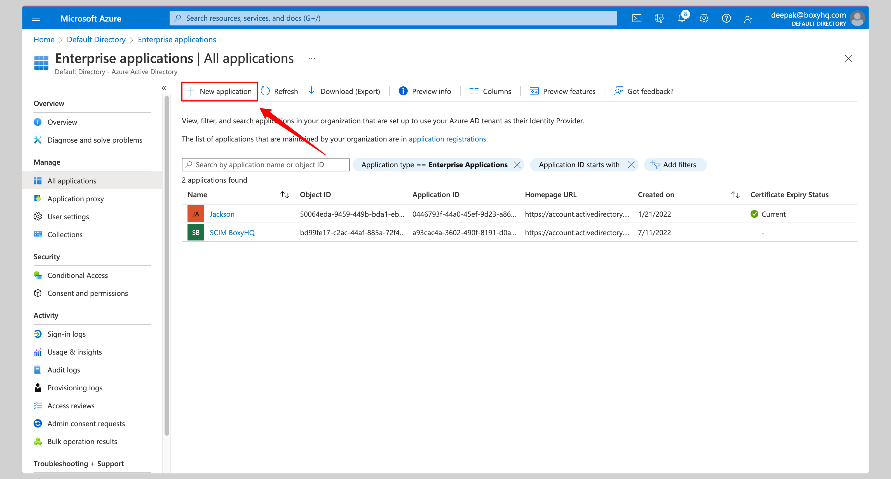
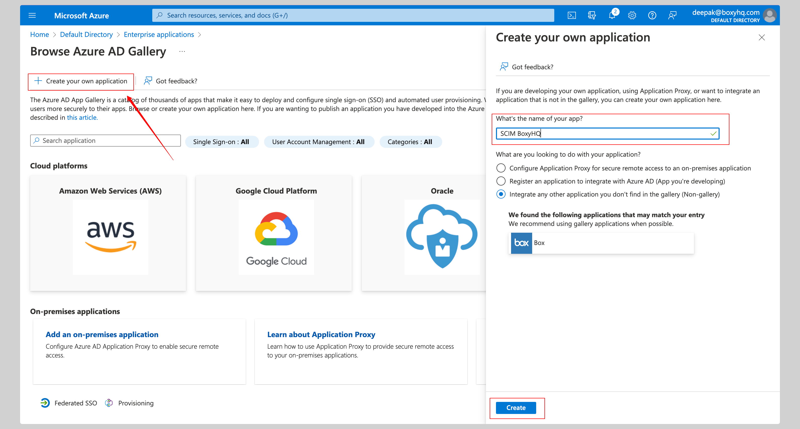
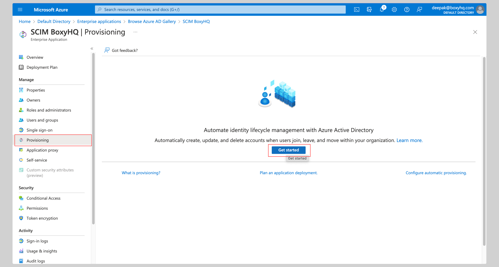
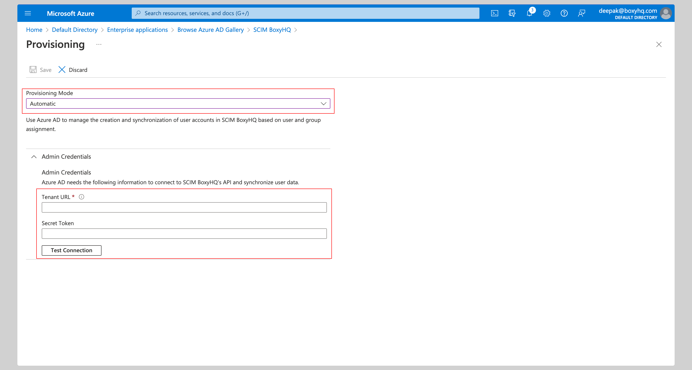
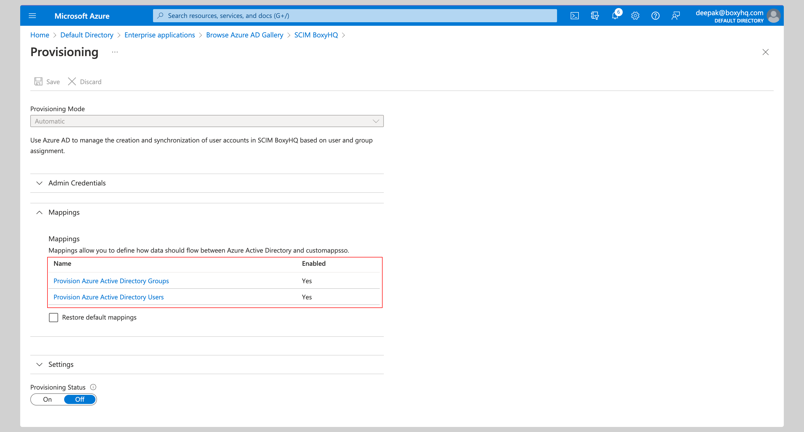
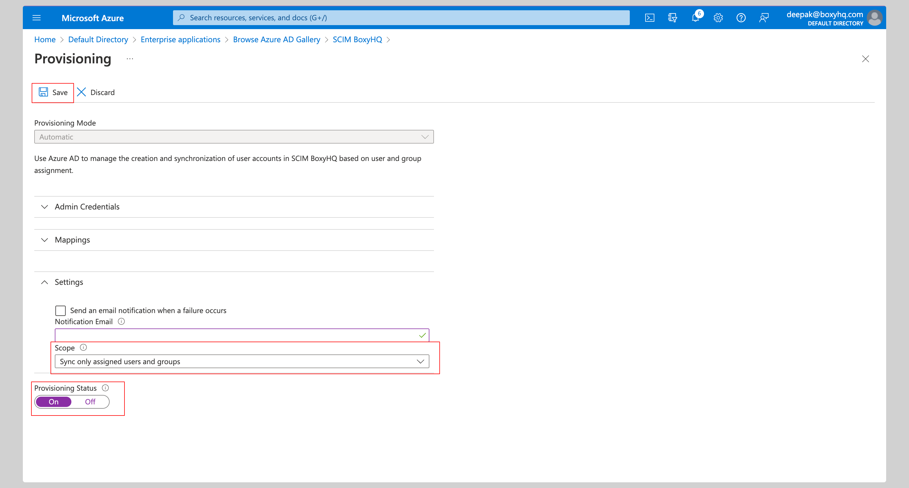
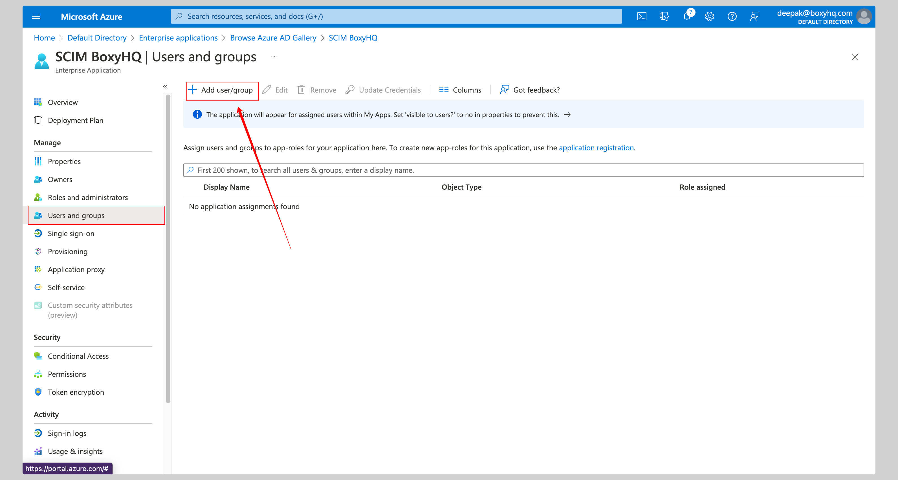
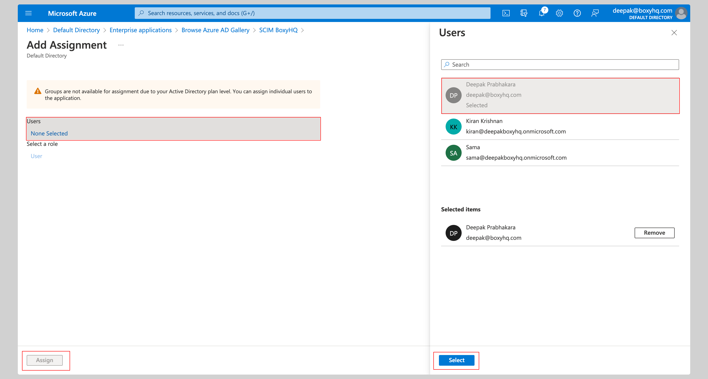

The following guide will walk you through the process of configuring Ory Polis to use the Microsoft Entra ID SCIM v2.0 directory
provider.

## Create Azure Application

Click **Azure Active Directory** from the Microsoft Azure Portal.

Click **Enterprise Applications** from the left navigation menu.

If your application is already created, choose it from the list and move to the section
[Enable SCIM Provisioning](#enable-azure-scim-provisioning)

If you haven't created your application yet, click **New application** button.

From the next screen, click **Create your own application**, give your application a **name** and click the **Create** button.

## Enable Azure SCIM Provisioning

Click **Provisioning** from the left navigation menu then click **Get started**.

Select **Automatic** from the **Provisioning Mode** dropdown and enter the following information under **Admin Credentials**
section:

- Tenant URL
- Secret Token

Next, click the **Test Connection** button to test the connection to see if the credentials are correct, then click **Save** to
save the credentials.

Expand the **Mappings** section and ensure group and user attribute mappings are enabled for your app. The default mapping should
work.

Expand the **Settings** section and make the following changes:

- Select **Sync only assigned users and groups** from the **Scope** dropdown.
- Confirm the **Provisioning Status** is set to **On**.

At this stage, you've successfully configured the Microsoft Entra ID SCIM API integration.

## Assign Users

From your application, click the **Users and groups** from the left navigation menu and click **Add user/group**.

Select **None Selected** under the **Users**.

From the right side of the screen, select the users you want to assign to the app and click the **Select** button, then click
**Assign** to those users to the app.

## FAQ

### How frequently does Microsoft Entra ID SCIM perform sync by default?

Microsoft Entra ID automatically provisions and updates user accounts in an app based on things like user and group assignment.
The sync happens at a regularly scheduled time interval, typically every 20-40 minutes.

### Why does the PATCH request fail in Microsoft Entra ID SCIM?

This is a known issue with Entra ID SCIM implementation. You have to add the query param `?aadOptscim062020` to the SCIM endpoint
URL to make PATCH requests work. This query param update PATCH behavior and ensure SCIM compliance.
[Read More](https://learn.microsoft.com/en-us/entra/identity/app-provisioning/application-provisioning-config-problem-scim-compatibility#flags-to-alter-the-scim-behavior)

### Why is a custom attribute not showing up in Ory Polis?

If you map a custom attribute and it doesn't appear in the user record in Ory Polis, the cause is almost always on the Microsoft
Entra ID side. Ory Polis stores every attribute it receives under the schema it arrives in, so a missing attribute means Entra ID
didn't send it. Check the following in Microsoft Entra ID:

- **The source attribute has a value.** Microsoft Entra ID
  [doesn't provision null values](https://learn.microsoft.com/en-us/entra/identity/app-provisioning/customize-application-attributes#what-you-should-know).
  If the mapped source resolves to empty (shown as `undefined` in the provisioning view), Entra ID sends nothing. Directory
  extension attributes (`extensionAttribute1–15`) are often empty on cloud-only users and can only be set through Microsoft Graph
  or Exchange, not the user profile page.
- **The mapping applies to updates.** Set **Apply this mapping** to **Always** so the attribute flows on both create and update.
  Entra ID only re-sends an attribute when its value changes, so change the value — or restart provisioning — to force a fresh
  sync for users that already exist.
- **Custom attributes may be sent on update, not on create.** Microsoft Entra ID can omit custom attributes from the initial
  create (`POST`) and send them in a later update (`PATCH`). Use **Provision on demand** against a user that already exists to
  trigger an update.
- **Use a custom extension schema for non-standard attributes.** The enterprise extension schema
  `urn:ietf:params:scim:schemas:extension:enterprise:2.0:User` is reserved for the RFC 7643 attributes (`employeeNumber`,
  `department`, `manager`, and so on). Define your own attributes under a custom namespace such as
  `urn:ietf:params:scim:schemas:extension:CustomExtensionName:2.0:User:CustomAttribute` through **Edit attribute list**.
  [Read More](https://learn.microsoft.com/en-us/entra/identity/app-provisioning/customize-application-attributes#editing-the-list-of-supported-attributes)

To see exactly what Microsoft Entra ID sends, open **Provision on demand** (or the **Provisioning logs**) in the Azure portal and
review the **Modified attributes** for the user.
