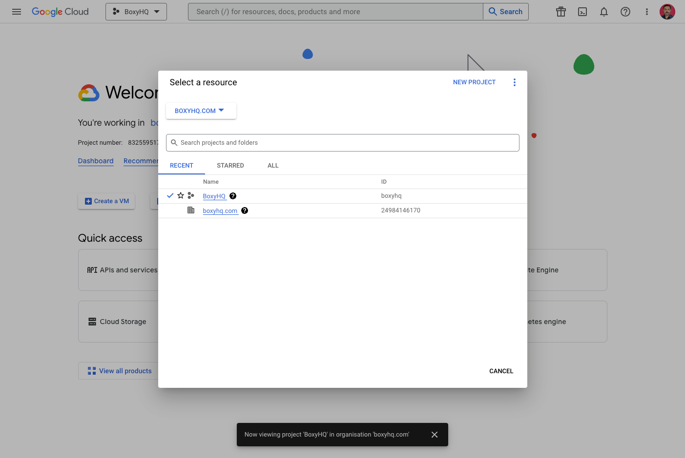
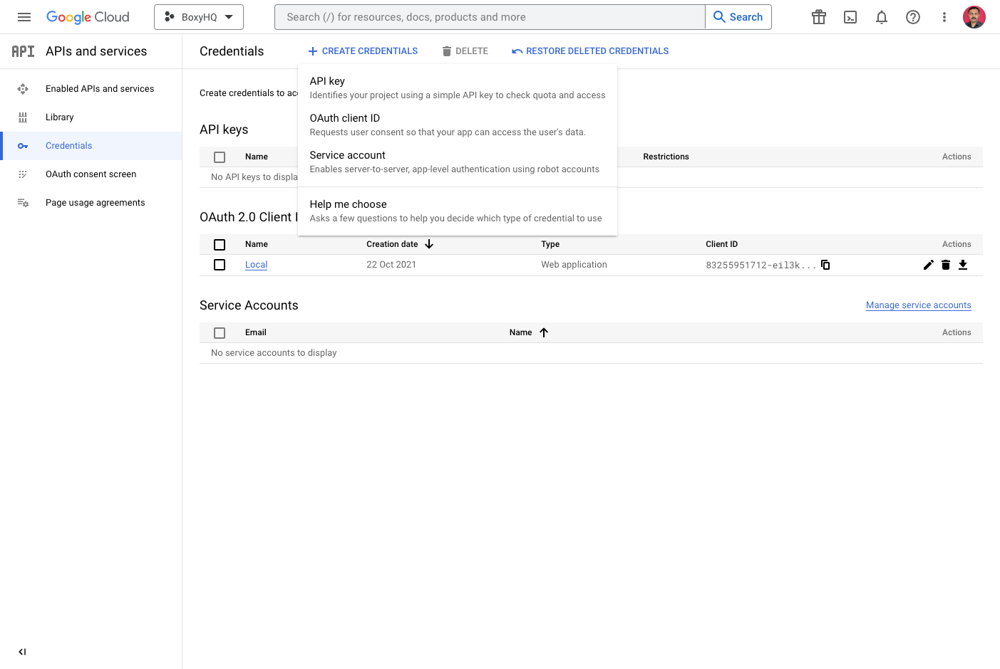
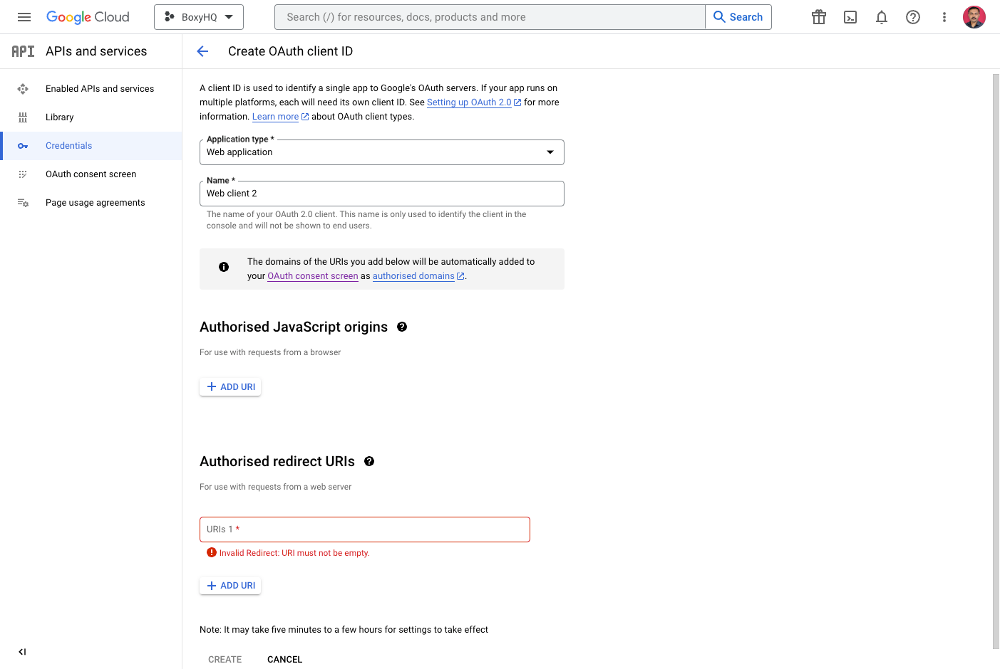
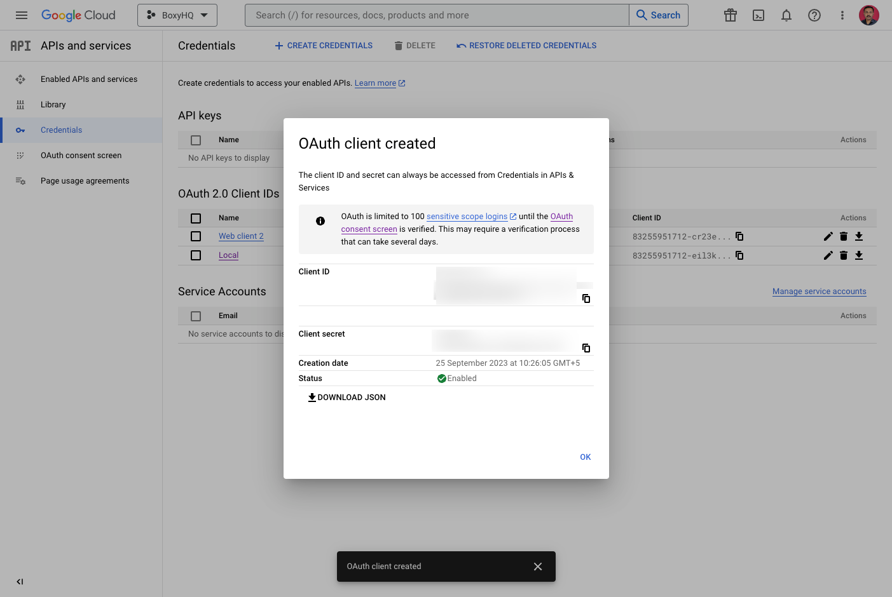
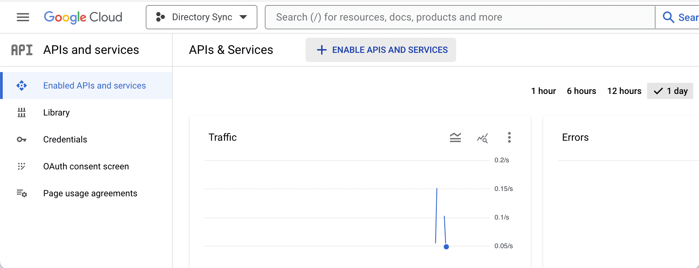
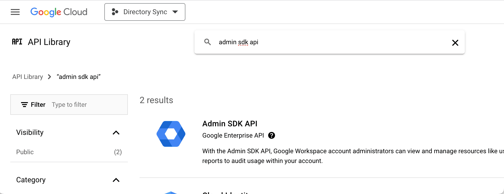
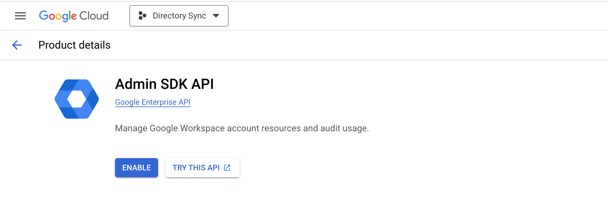

Google Workspace SCIM support is pretty minimal, so we directly tap into their APIs to give you the full benefit of SCIM-like
functionality.

To enable this you have to authenticate against Google so that we get access to the Admin SDK API. When you create a new Directory
Sync connection the Google authentication URL is displayed, this can be sent to your customer so they can authenticate against
their Google tenant. It doesn't require any of the traditional SCIM setup.

If you are self-hosting the following guide will walk you through the process of configuring Ory Polis to use Google Workspace as
a directory sync provider.

Ory Polis requires a Google OAuth App to be configured to access the Admin SDK API. You can use your existing OAuth App or create
a new one.

## Create OAuth App

Navigate to the [Google Cloud Console](https://console.cloud.google.com/) and select your project from the list.



Select **APIs & Services** from the left menu and then select **Credentials**.

Select **OAuth client ID** from the **CREATE CREDENTIALS** dropdown.



Give your credentials a name and select **Web application** as the **Application type**.

Add the following **Authorized redirect URIs** and then click **Create**.

`https://<your-domain>/api/scim/oauth/callback`



:::info

Note that the above callback URL works if you're using Ory Polis as a service.

If using Ory Polis as an NPM package, the Authorized redirect URIs will be a URL on your application that you'll need to
configure. See [Google Directory Sync API](../api-reference.mdx#google-directory-sync) for more information.

:::

Copy the **Client ID** and **Client secret** and save them for later.



:::info

Please don't forget to configure the `OAuth consent screen` and publish it so your customers can access it.

:::

See the [Environment Variables](/docs/Ory Polis/deploy/env-variables#directory-sync) section to learn how to configure Ory Polis
with these values.

Once Ory Polis is configured, you can authenticate the tenants with Google OAuth and sync their Workspace directory.

## Enable Admin SDK API

We need access to the Admin SDK API. To enable this follow these instructions:-

Head over to the `Enabled APIs and services` section in the console.



Search for `admin sdk api`.



Select the `Admin SDK API` and click on the `ENABLE` button.



## Schedule Sync

Ory Polis can be configured to sync your Google Workspace directory on a schedule (e.g. every 2 hours).

Ory Polis service exposes the below API URL that can be called to trigger a sync. You can use a cron job to invoke this URL on a
schedule.

Depending on the number of Google directories you have, the sync can take a few minutes to complete.

```bash
curl -X POST \
  -H "Authorization: Api-Key YOUR_API_KEY" \
  http://localhost:5225/api/v1/dsync/cron/sync-google
```

Alternatively you can set the `DSYNC_GOOGLE_CRON_INTERVAL` env var to enable the cron in the Ory Polis service.

Learn more about [Google Directory Sync API](../api-reference.mdx#4-sync-directory).

## FAQ

#### Does Google Workspace sync in real time?

No, Google Workspace sync is not real-time. Ory Polis syncs the Google Workspace directory on a schedule (e.g. every 2 hours). In
a self-hosted deployment, you can configure a cron job to sync the directory on a schedule of your choice.

#### Can I sync specific groups from Google Workspace?

Not possible at the moment. Ory Polis syncs all the groups from Google Workspace. You have to filter the groups from your
application's side.
