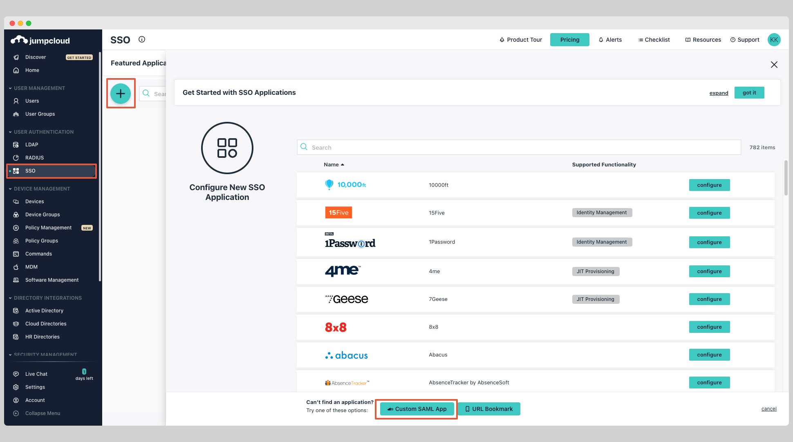
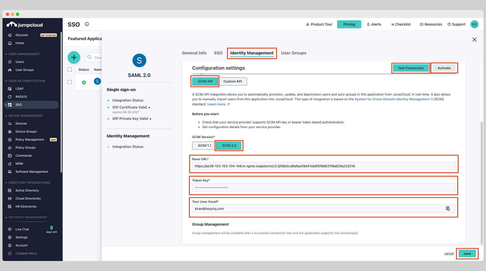
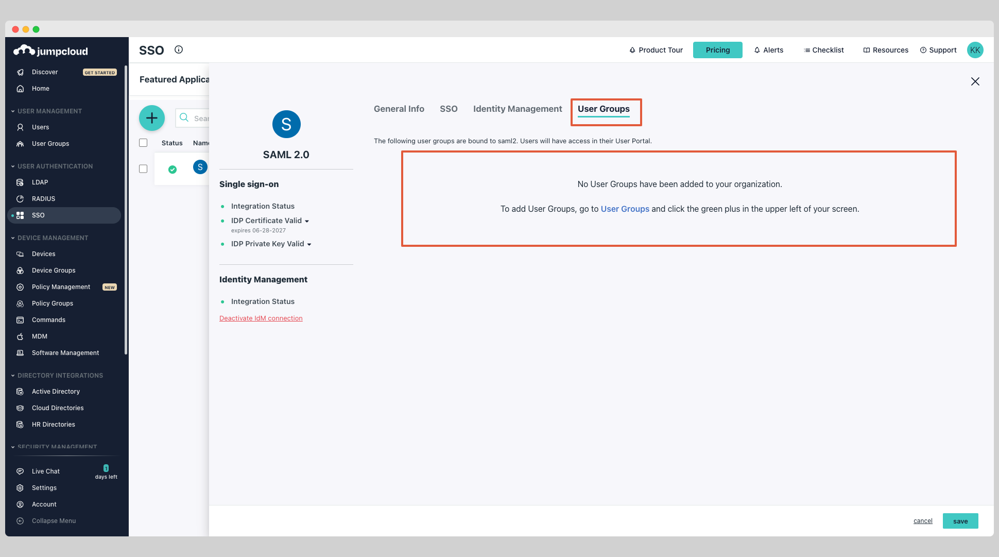
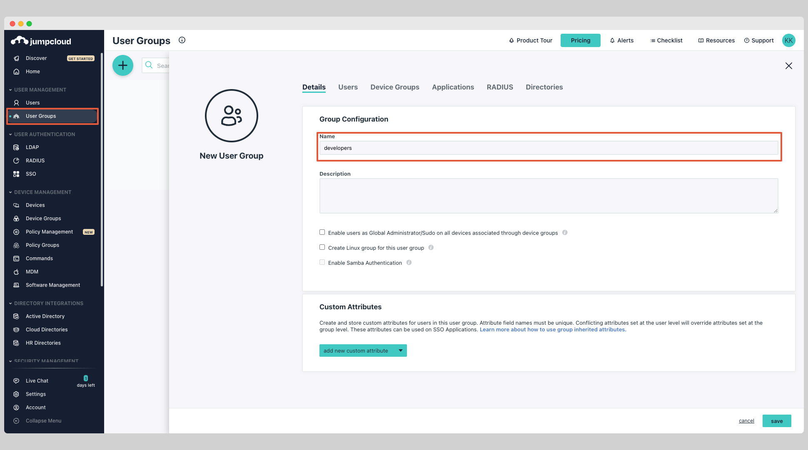
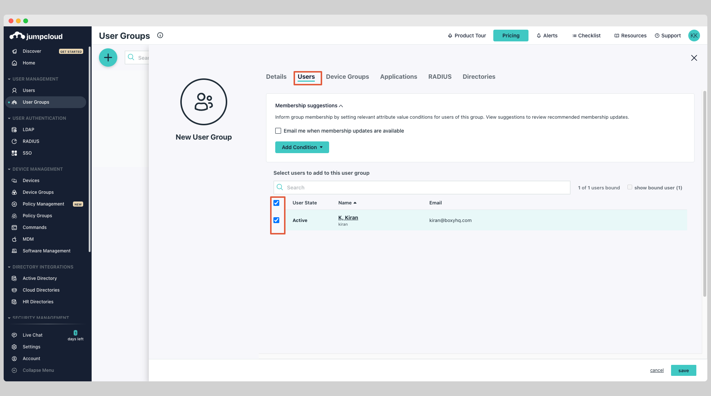
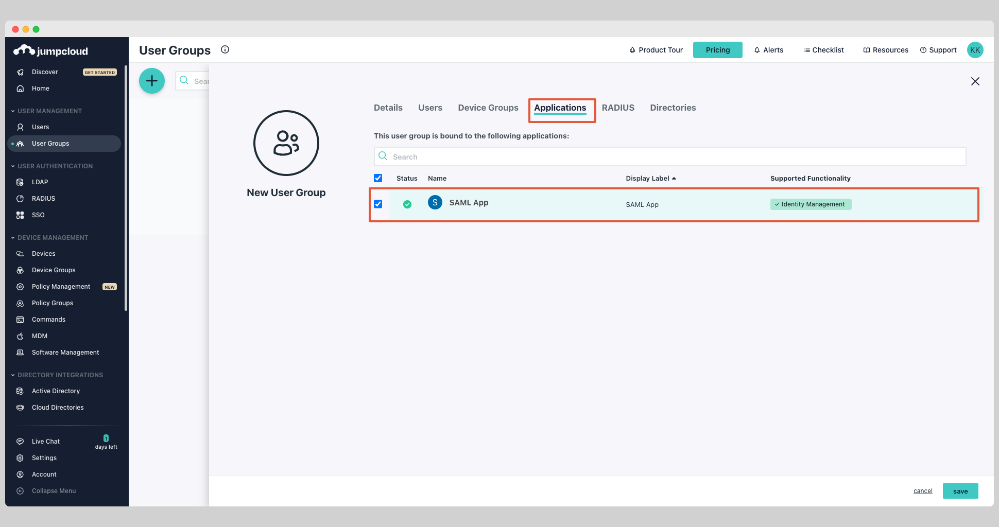

The following guide will walk you through the process of configuring Ory Polis to use the JumpCloud SCIM v2.0 directory provider.

## Create JumpCloud SAML Application

JumpCloud only support configuring SCIM provisioning in an existing SAML application.

Choose an existing SAML application or create a new one. Click **SSO** from the left navigation menu and select your custom SAML
application.

Click the tab **Identity Management** within your SAML application.

Under the **SCIM Version**, choose **SCIM 2.0** and enter the following information:

- Base URL
- Token Key
- Test User Email

Click **Test Connection** to test the connection to see if the credentials are correct then click **Activate**.

Next click **Save** to save the settings.

At this stage, you've successfully configured the JumpCloud SCIM app.

## Assign Users & Push Groups

Click the tab **User Groups** within your SAML application.

You can see the all the groups that are available, select the groups you want to sync and click **Save**.

If no existing groups are available, click **User Groups** from the left navigation menu and click plus icon to create a new
group.

Give the group a name.

Select the **Users** tab and choose the users you want to assign to the group.

Next select the **Applications** tab and choose the app you want to assign the group to.

At this stage, you've successfully assigned users and pushed the groups.
