The following guide will walk you through the process of configuring Ory Polis to use the Okta as a directory sync provider.

## Create Okta Application

Click **Applications** from the left navigation menu and click **Browse App Catalog** button.

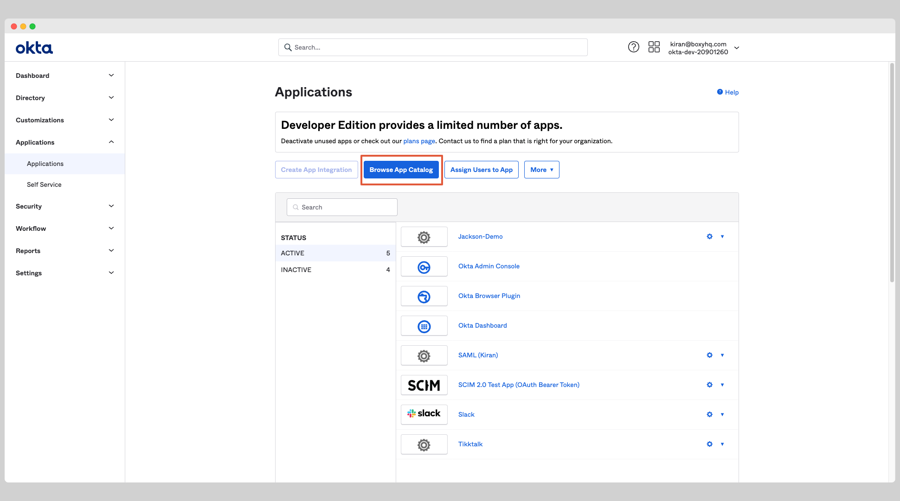

Search for **SCIM 2.0 Test App (Oauth Bearer Token)** from the search box and choose the app called **SCIM 2.0 Test App (Oauth
Bearer Token)**.

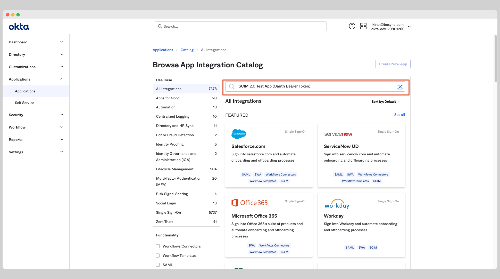

From the app page, click the **Add Integration** button.

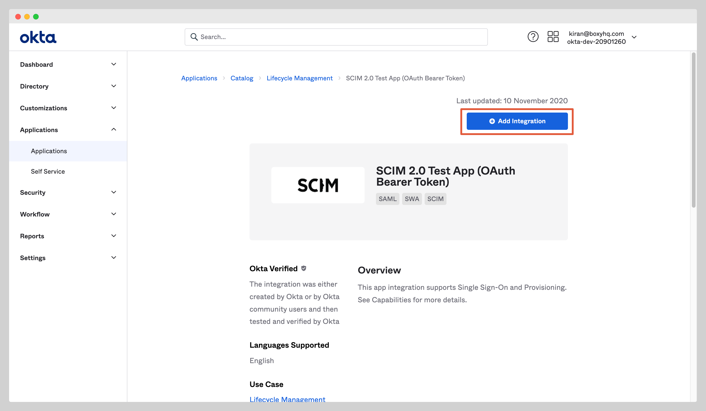

Give the app a name and click the **Next** button. Click **Done** to finish the creation of the app.

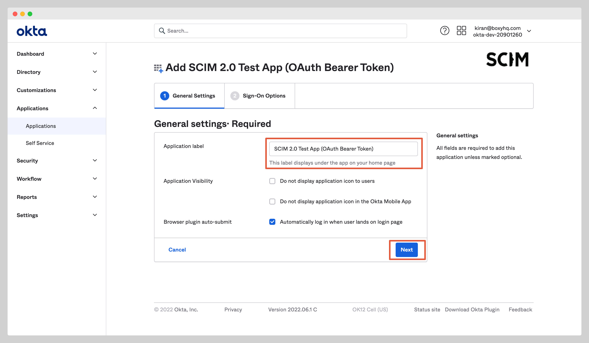

## Enable Okta SCIM Provisioning

In your application, click the **Provisioning** tab and click **Configure API Integration**.

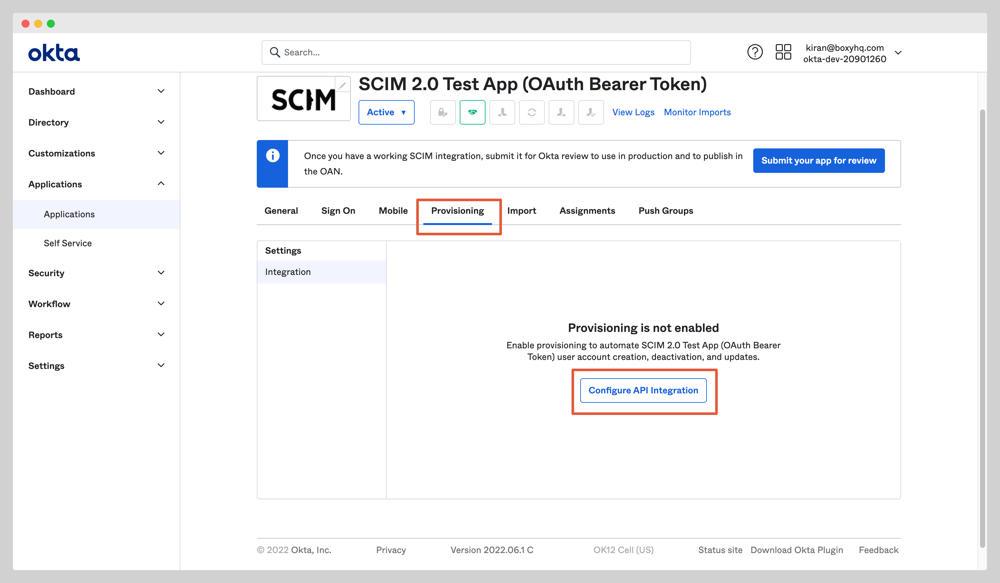

Check the **Enable API Integration** checkbox and enter the following information:

- SCIM 2.0 Base URL
- OAuth Bearer Token

You'll receive these information from Ory Polis when you create the directory sync connection either via the API or the Admin
Portal.

Click **Test API Credentials** to test the connection to see if the credentials are correct then click the **Save** to save the
credentials.

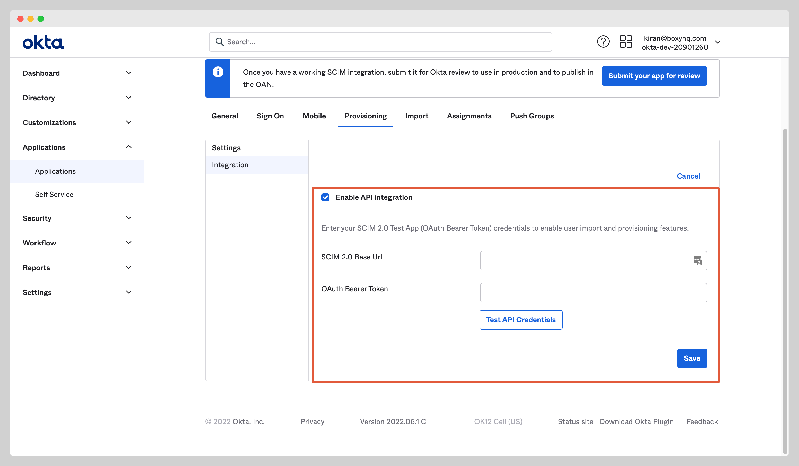

You'll see a new setting page, click **To App** and enable the following settings:

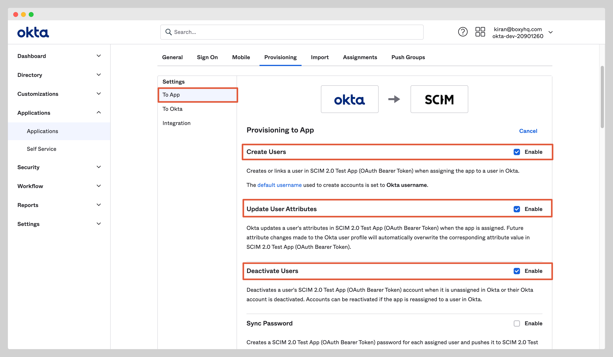

At this stage, you've successfully configured the Okta SCIM API integration.

## Assign Users

In your application, click the **Assignments** tab and select **Assign to People** from the dropdown **Assign**.

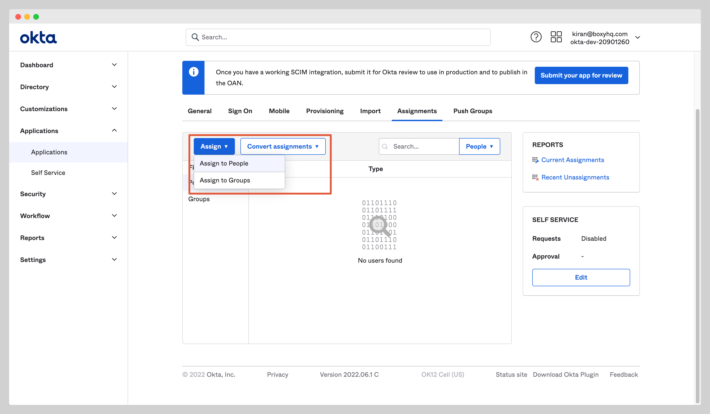

Select users you want to assign to the app and click the **Assign** button.

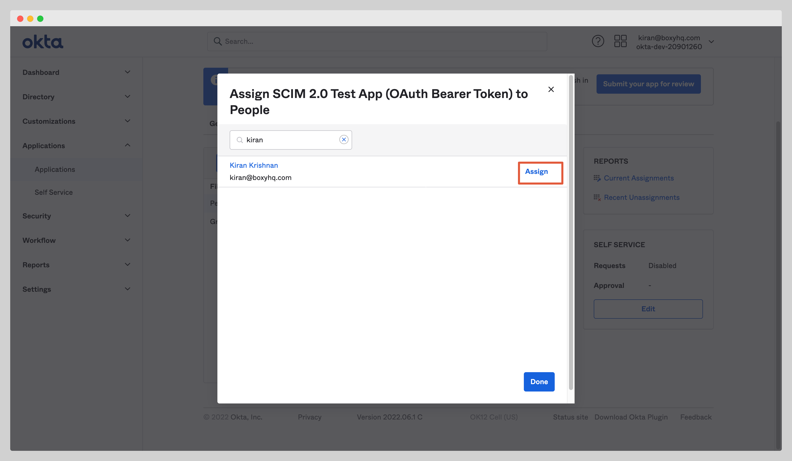

After you click the **Assign** button, you'll see a new popup window with various fields. Confirm the field values and click the
**Save and Go Back** button.

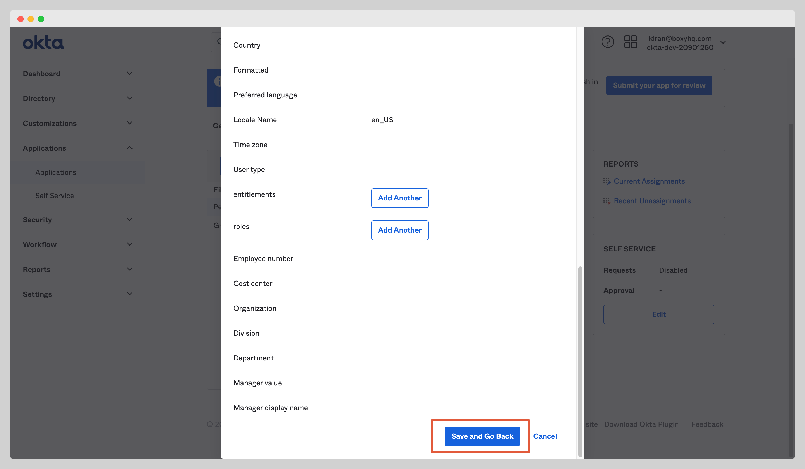

## Push Groups

Navigate to the tab **Push Groups** and select **Find group by name** from the dropdown **Push Groups**.

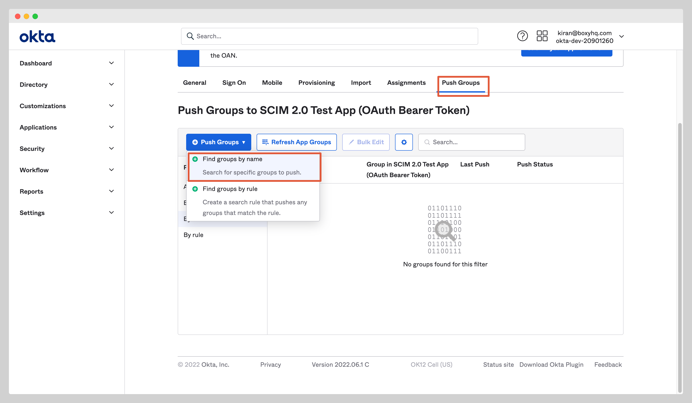

Find the group you want to assign to the app and click the **Save** button.

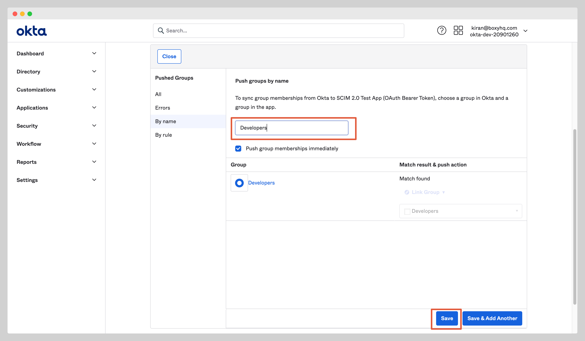

## FAQ

#### Why don't I see a DELETE event for a user that was removed in Okta?

Instead of executing a DELETE operation, Okta sends a request to the SCIM application to set the `active` attribute to `false`.
Consequently, you will observe a `user.updated` event with the `active` attribute changed to `false` for users removed from the
Okta application.

#### Why is there no event for a user that was deactivated in Okta?

Okta does not dispatch a specific deprovisioning event for users that are suspended. This omission of a deactivation event is a
known issue with Okta.
