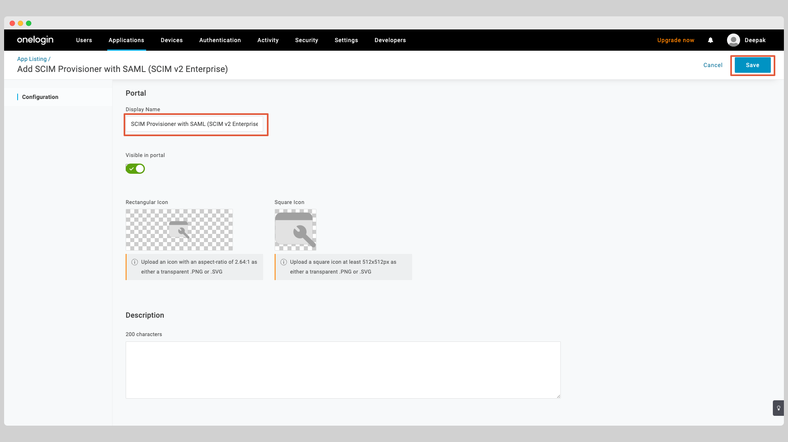
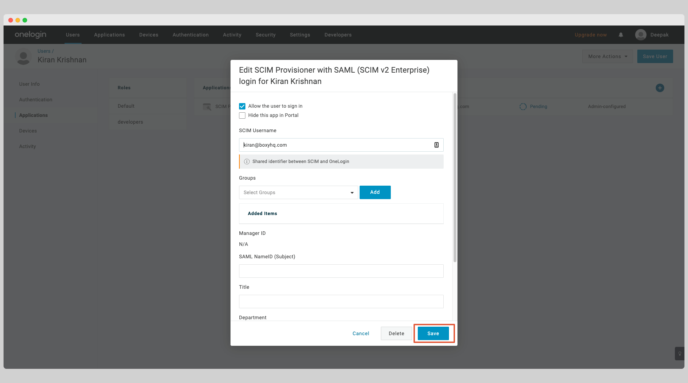

The following guide will walk you through the process of configuring Ory Polis to use the OneLogin SCIM v2.0 directory provider.

## Create OneLogin Application

Click **Applications** from the top navigation menu and click **Add App** button.

Search for **SCIM** from the search box and choose the app called **SCIM Provisioner with SAML (SCIM V2 Enterprise)** from the
list of apps.

Give the app a name and click the **Save** button.

At this stage, you've successfully created the OneLogin SCIM app.

## Enable OneLogin SCIM Provisioning

In your application, click the **Configuration** tab on the left.

Enter the following information:

- SCIM Base URL
- SCIM Bearer Token

You'll receive these information from Ory Polis when you create the directory sync connection either via the API or the Admin
Portal.

Click the button **Enable** to test the connection to see if the credentials are correct and click the button to **Save** to save
the credentials.

Next click the **Provisioning** tab and check the **Enable provisioning** checkbox. Click the **Save** button to save the changes.

Next click the **Parameters** tab and select the row **Groups** from the table.

In the popup window, check the box **Include in User Provisioning** and click the **Save** button.

## Assign Users

In order to assign users to your app, select **Users** from the top navigation menu and choose the user you want to assign to the
app.

From the user page, click the **Application** tab on the left and click the plus sign.

A popup window will show you the list of apps that you can assign the user to. Select the app you created earlier and click the
**Continue** button.

Click **Save** on the next modal window to confirm the assignment.

Depending on your configuration, You may have to approve the assignment.

If you see a text **Pending** in the table, click that text. That'll bring up a modal window, click the button **Approve** to
approve the assignment.

At this point, the user will be assigned to the app.

## Push Groups

In order to push groups to your app, you've to create a new **Role** in your app.

In the top navigation, select **Users** and then **Roles** from the dropdown.

Click **New Role** to create a new role.

Enter a name for the role, select the app you created earlier and click the **Save** button.

Click the **Users** tab for the role and search for the user you want to assign the role to.

Click the button **Add To Role** to assign the user to the role and click the **Save** button.

Click **Save** in the next modal to confirm the assignment.

Go back to your app and click the **Rule** tab on the left and click the **Add Rule** button.

Give the rule a name. Under the **Actions**, select the **Set Groups in your-app-name** from the dropdown, then select for each
**role** with values that matches **your-app-name**. Click the **Save** button.

Click the **Users** tab on the left, you may see **Pending** provisions in the table. Click that text to approve the assignment.

Click **Approve** in the next modal to confirm the assignment.

## FAQ

### Why don't I see any event when a group is removed in OneLogin?

It is a known issue with OneLogin SCIM. OneLogin does not dispatch a specific deprovisioning event for groups that are deleted, so
you won't see any event such as `group.deleted` or `group.user_removed` when a group is removed. It is recommended to remove the
users from the group before deleting the group itself from the SCIM application.
